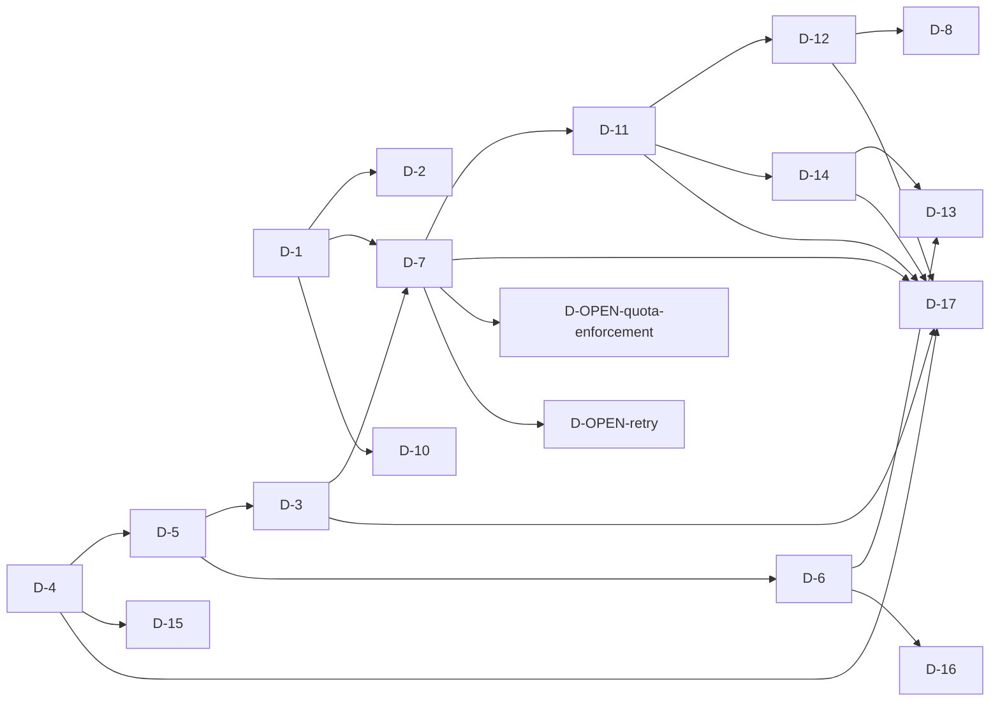

<!--
  Licensed under the Apache License, Version 2.0 (the "License");
  you may not use this file except in compliance with the License.
  You may obtain a copy of the License at

   http://www.apache.org/licenses/LICENSE-2.0

  Unless required by applicable law or agreed to in writing, software
  distributed under the License is distributed on an "AS IS" BASIS,
  WITHOUT WARRANTIES OR CONDITIONS OF ANY KIND, either express or implied.
  See the License for the specific language governing permissions and
  limitations under the License. See accompanying LICENSE file.
-->

# Leader-Side Execution — Master Design Specification

## §A. Conventions (normative — read first)

This spec uses numbered, cross-referenced, evidence-bearing tokens. Every load-bearing
claim cites evidence and is tagged `verified` (with `file:line` / PR# / reviewer) or
`inferred`. Any **`I-n` with zero `T-n` mapped is a spec defect** (enforced by the linter, §C).

- **One invariant, one slug** — aliases are forbidden in YAML reference fields (prose may use
  the informal name). Exactly one `id:` block defines a given invariant; every `covers:` /
  `tests:` / `must_satisfy:` reference uses that one canonical slug, never a shortened or
  alternate form.

| Token | Meaning |
|---|---|
| `F-n`  | Verified fact about existing code (carries `file:line`) |
| `A-n`  | Assumption the design relies on |
| `D-n`  | Decision (ADR): context, alternatives, rationale, status |
| `ALT-n`| Rejected alternative (standing entry; the "do-not-re-tread" wall) |
| `RC-n` | Review concern (reviewer + concern + resolution) |
| `I-n`  | Invariant (must-always / must-never) + rationale + failure-prevented |
| `B-n`  | Bound (numeric/capacity) + justification |
| `C-n`  | Component (a unit of buildable design) |
| `P-n`  | Phase (a unit of delivery) |
| `T-n`  | Test scenario |
| `R-n`  | Risk |
| `Q-n`  | Open question |
| `EXC-n`| Explicit exception (a deliberate, named deviation) |

### Structured-block schemas (the machine layer)

Each actionable unit carries a fenced ```` ```yaml ```` block beside its prose. Schemas:

```yaml
# D-n  (Decision / ADR)
id:            # D-<slug>
title:
status:        # locked | open | deferred | superseded
depends_on:    # [D-/F-/I- ...]   decisions/facts this rests on
enables:       # [I-/D- ...]      what this makes possible
rejects:       # [ALT-...]        alternatives this kills
addresses:     # [RC-...]         review concerns this settles
raised_by:     # [people]
deciders:      # [people]
consequences:  # [short bullets]
tests:         # [T-...]          evidence the decision holds
phase:         # P-n the decision first lands in
provenance:    # verified | inferred
evidence:      # [file:line / PR# / reviewer]
```
```yaml
# ALT-n  (Rejected alternative)
id:
title:
killed_by:     # D-n  (or `deferred_by: D-n` if shelved not dead)
reason:        # why it is dead, in one breath
proposed_by:   # [people]  (so it reads as 'heard', not dismissed)
evidence:      # [file:line / PR#]
```
```yaml
# RC-n  (Review concern)
id:
raised_by:
concern:
raised_on:     # PR#/date
status:        # adopted | addressed | deferred | open | rejected
resolved_by:   # [D-...]
endorsed_by:   # [people]
```
```yaml
# C-n  (Component)
id:
target_files:        # [paths to create/modify]
interface:           # the key signatures
depends_on:          # [D-/C-/F-...]
implements:          # [I-...]
tests:               # [T-...]
anti_patterns:       # [things this MUST NOT do]
phase:               # P-n
provenance: ...
evidence: ...
```
```yaml
# P-n  (Phase)
id:
scope:               # commands / work in this phase
depends_on_phases:   # [P-...]
must_satisfy:        # [I-...]
must_pass:           # [T-...]
config_flag:
acceptance:          # machine-checkable "done"
provenance:          # (optional) verified | inferred
evidence:            # (optional) [file:line / PR# / reviewer]
```
```yaml
# I-n / B-n / T-n
id:
statement:           # I-n: the must/never ; B-n: the number+unit ; T-n: the scenario
rationale:           # I-n: failure prevented ; B-n: why this value
covers:              # T-n: [I-...] invariants this exercises
tests:               # I-n: [T-...] tests exercising this invariant (the I-n -> T-n direction; complementary to T-n.covers)
provenance: ...
evidence: ...
```

> Projections — the **traceability matrix (§28), decision-dependency graph (§22),
> per-phase task list (§29), and invariant-coverage report (§28)** — are GENERATED from
> these blocks. Never hand-maintain them.

> Note: the locking companion's invariants `I-1`..`I-13` are PROSE-defined (`- **I-n (title).**`)
> and the lint recognizes that form — they are intentionally not duplicated as YAML blocks.

## §B. Document map

| Doc | Role | Status |
|---|---|---|
| `leader-planned-execution.md` (this) | Master: orientation, why, design overview, **rationale spine**, correctness-contract index, delivery plan | draft |
| `leader-execution-locking.md` | Companion: concurrency & locking model (container/slot, linearizability) | draft (working) |
| `leader-execution-components.md` (or per-component set) | Companion: the 12 component deep-dives | draft |
| `leader-execution-test-plan.md` | Companion: full test strategy + T-n catalog | draft |
| `leader-execution-phasing.md` | Companion: per-command migration playbook | draft |

## §C. Consistency lint (mechanical linter + on-demand agent pass)

There is no CI gate yet. The committed linter is `lint_spec.py` (in this folder); run it
manually over master + companions. It AUTOMATES all nine hard-gate checks below — this is the
machine-checkable FLOOR. Each check appends to a `fails` list and the script exits non-zero
if any fires (a single hard gate, not a tiered one):
1. **ref-resolution** — every `depends_on/enables/rejects/addresses/tests/implements/covers/resolved_by` id resolves to a definition.
2. **coverage** — every `I-n` is exercised by ≥1 `T-n` (via `T-n.covers` or `I-n.tests`), the zero-test-invariant rule. Note: the companion's `I-1`..`I-13` are PROSE-defined (§A) and the linter recognizes that form.
3. **code-fence balance** — every file has an even number of ``` fences (no unclosed block).
4. **anchor-existence** — every `evidence` `File.java:NNN` anchor resolves: the file exists in the worktree and the line number is within range.
5. **§28 stale-projection** — every `I-row` in the §28 traceability matrix is derivable from the sources (`T-n.covers` / `I-n.tests`); a row listing a `T-n` not backed by a source is stale.
6. **bidirectional §28/§6.2 under-listing** — every derived `(I-n → T-n)` edge (from a `T-n.covers` / `I-n.tests` source) must be LISTED in BOTH the §28 matrix AND the test-plan §6.2 matrix; an edge present in the sources but missing from either matrix is an under-listing.
7. **P-n must_pass set-identity** — for each phase `P-n`, the `must_pass:[...]` set must be identical across every single-line `{id: P-n ... must_pass:[...]}` representation across master + companions; divergent sets fail.
8. **duplicate-id divergent covers+provenance** — an id appearing in more than one `id:` block must carry the SAME `covers` set AND the SAME `provenance` across all of them (per §A "exactly one id: block"); divergent metadata fails.
9. **§28 traceability completeness** — every defined invariant (master slug OR companion bare-ordinal) has a row/mention in the §28 matrix.

Semantic coherence (prose↔block, design soundness, "anchor still means what's claimed"), the
**§22 decision-graph** regenerate-and-diff, the **§29 phase scope/acceptance text**, and the
symbol-anchor meaning check are a separate **on-demand agent pass** — they are not automated.
(The §29 `P-n must_pass` set is now machine-checked by check 7; only the surrounding scope and
acceptance prose stays manual.)

---

# PART I — Orientation

## 1. How to read this spec

This is a hybrid-audience document. The prose is for humans; the fenced `yaml` block under each
actionable unit is for agents and the CI linter (§C of the master scaffold). The master spine carries
orientation, the "why", the design overview, the **rationale spine** (Part IV), the correctness-contract
index, and the delivery plan; the deep mechanics live in companion documents (§B). Pick the path that
matches why you opened the file.

**Reviewer.** You are deciding whether the design is sound and whether its decisions were made for the
right reasons. Read §2 (Executive summary) end-to-end for the whole story, then go straight to **Part IV
— the rationale spine**: the decision records `D-1`…`D-17` and `D-SPEC-1`…`D-SPEC-3` with their forces
and consequences, the rejected-alternatives wall (§21, the `ALT-n` entries — the "do-not-re-tread"
ledger), and the review-and-consensus ledger (§23, the `RC-n` entries that map every reviewer concern
from PR [#7583](https://github.com/apache/ozone/pull/7583) / [#10502](https://github.com/apache/ozone/pull/10502) / [#10503](https://github.com/apache/ozone/pull/10503) to the decision that settles it). If your concern is concurrency or
linearizability, the contract is **not** in this file — open the companion
`leader-execution-locking.md`, which is authoritative for the lock model (`I-1`…`I-13` there). If your
concern is "where could this corrupt data," read §15 (Failure modes) and §19 (blast radius) here, then
the locking companion's §3 invariants.

**Implementer.** You are building a component. Read §2 for context, then **Part III** for the design —
specifically §9 (the "before", so you know what you are replacing), §10 (the "after"), §11 (the twelve
components `C-1`…, in the companion), and §12 (the proto/API contracts). Then **Part V** for the
correctness contract you must satisfy (invariants `I-n`, bounds `B-n`, and the test catalog `T-n`), and
**Part VI §29** for the phase your work lands in and its machine-checkable acceptance gate. Open
`leader-execution-locking.md` before you touch anything that acquires a lock — it is the contract your
executor must honor, not background reading. Every `C-n` block names its `target_files`, its
`anti_patterns` (things the component MUST NOT do), and the `I-n` it implements; treat all three as part
of the task.

**Newcomer.** You want the big picture and the history so you inherit context instead of re-deriving it.
Read §2 (Executive summary) — it is written to stand alone — then §5 (Project history & prior art: the
honest archaeology of [#7583](https://github.com/apache/ozone/pull/7583), [#10502](https://github.com/apache/ozone/pull/10502), [#10503](https://github.com/apache/ozone/pull/10503), and the [#7406](https://github.com/apache/ozone/pull/7406) prototype, including why earlier attempts
stalled and what is different this time), and keep §3 (this part's glossary) open the entire time. The
terms in §3 are the ones reviewers actually tripped on; reading them first will save you from the same
traps. Do not start in Part IV — the rationale spine assumes you already know the design.

**Consensus-seeker.** You are trying to land agreement, re-open a settled question, or check whether a
concern was heard. Go directly to **Part IV §23**, the `RC-n` ledger: every concern is recorded with who
raised it, on which PR, its status (`adopted` / `addressed` / `deferred` / `open` / `rejected`), and the
`D-n` that resolves it — framed as *heard*, not dismissed. If you want to argue *against* a choice, first
read §21 (the `ALT-n` wall): the alternative you have in mind is very likely already there with the
decision that killed it and the one-breath reason why. Two questions are still genuinely open and welcome
new argument — `D-OPEN-quota-enforcement` (exact vs. approximate quota) and `D-OPEN-retry` (the retry /
idempotency mechanism); everything else in Part IV is locked, and re-litigating it should start by
engaging the recorded rationale rather than the original premise.

## 2. Executive summary

### The problem

The Ozone Manager (OM) is the metadata brain of the cluster, and today its write path has a structural
ceiling. Every write — create a key, commit a key, make a directory, delete a file — is submitted as a
Ratis transaction so that the three OM replicas stay in agreement. That part is correct and necessary.
The problem is *what each replica does with the transaction once it is committed*. On every node, leader
and followers alike, the committed request is handed to `runCommand`
(`hadoop-ozone/ozone-manager/src/main/java/org/apache/hadoop/ozone/om/ratis/OzoneManagerStateMachine.java:668`,
verified), which dispatches through the request handler into the per-request
`validateAndUpdateCache(...)` method
(invoked at `OzoneManagerRequestHandler.java:425`, verified) — and `validateAndUpdateCache` is *the
business logic*. It re-reads metadata, re-checks ACLs, re-validates quota, re-derives object identifiers,
and stages the resulting changes. In other words, the full request logic does not run once on the node
that received the request; it runs **N times**, once on each replica, independently.

That design has three consequences, and they compound.

The first is **silent divergence**. Because each follower independently re-executes the same business
logic, the followers are only as consistent as that logic is perfectly deterministic across nodes,
across binary versions, and across time. Any subtle non-determinism — a map iteration order, a
floating-point quota computation, a clock read, a code path that behaves differently on a follower
running a slightly older or newer binary during a rolling upgrade — produces a follower whose on-disk
state quietly differs from the leader's. There is no loud failure; the replicas simply drift apart, and
the drift is discovered late, if at all. This is the deepest motivation for the whole project and the
one that no amount of throughput tuning can fix: re-running complex, evolving business logic on every
replica is fundamentally the wrong place to seek agreement.

The second is **throughput**. The OM's write path tops out around twelve thousand operations per second
in the prototype's baseline measurements. A large part of why is the double buffer. The double buffer is
the sole writer to RocksDB
(`hadoop-ozone/ozone-manager/src/main/java/org/apache/hadoop/ozone/om/ratis/OzoneManagerDoubleBuffer.java`,
verified: it accumulates staged responses and flushes them in `flushBatch`, atomically stamping the
`#TRANSACTIONINFO` row in the same write batch at `OzoneManagerDoubleBuffer.java:376`, verified). Its
*purpose* is to amortize RocksDB write cost by batching many transactions into one physical write. But in
practice the batches are tiny — the prototype's measurements put the average at roughly 1.2 requests per
flush. A buffer built to coalesce hundreds of writes is, in steady state, coalescing barely more than one.
The batching mechanism exists, the batching benefit largely does not, and the machinery (a snapshot
barrier at `splitReadyBufferAtCreateSnapshot`, `OzoneManagerDoubleBuffer.java:445`, verified; a
single-flusher thread; the careful `#TRANSACTIONINFO`-with-batch atomicity) is pure overhead relative to
what it delivers.

The third is **contention**. Today every FSO and OBS write serializes on a single **bucket write lock**.
Key commits acquire `BUCKET_LOCK` in write mode
(`hadoop-ozone/ozone-manager/src/main/java/org/apache/hadoop/ozone/om/request/key/OMKeyCommitRequest.java:192`,
verified). That means two clients writing two completely unrelated keys — different names, different
directories, no shared state except that they happen to live in the same bucket — cannot proceed in
parallel. They take turns. For a workload that hammers one bucket, which is the common case, the bucket
lock collapses all that natural parallelism into a single serial stream. The lock is correct; it is just
catastrophically coarse.

Underneath these three sits a fourth, quieter design knot: **objectID is welded to the Ratis transaction
index**. Every object's permanent identifier is computed as `getObjectIdFromTxId(epoch, ratisIndex)`
(`hadoop-ozone/common/src/main/java/org/apache/hadoop/ozone/OmUtils.java:766-783`, verified —
the encoding packs a 2-bit epoch in the high bits, the transaction index shifted left 8, with the bottom
8 bits reserved as a window for recursive directory creation; `TRANSACTION_ID_SHIFT = 8`, `EPOCH_ID_SHIFT
= 62`, verified at `OmUtils.java:95,101`). Welding identity to the consensus log index is what forces a
request that creates several objects (an implicit `mkdir -p`) to carve out a private 256-wide sub-window
of one transaction index, and it is what makes the identity space a hostage of the very replication
mechanism we want to change. Any redesign of the execution model has to answer "then where do objectIDs
come from?" before it can move at all.

### The idea

The fix is to move execution to the leader and make followers dumb. Instead of replicating the *request*
and re-running its logic on every node, the **leader executes the request exactly once** and replicates
the *result* — a deterministic, domain-agnostic **DB patch** made of four primitive operations:
**Put**, **Delete**, **Merge**, and **Checkpoint**. Followers receive that patch and apply the bytes with
**zero business logic**: no ACL re-check, no quota re-validation, no objectID re-derivation, no path
re-resolution. They write what the leader computed. Consensus goes back to doing what consensus is good
at — agreeing on a sequence of opaque changes — and stops trying to agree on the output of complex code
re-run independently. The prototype that proved this approach ([#7406](https://github.com/apache/ozone/pull/7406)) reached roughly **40,000
operations per second**, more than triple the baseline, because the followers' work shrinks to a memcpy
and the leader's path sheds the double buffer and the bucket lock.

This single move dissolves all four problems at once. Silent divergence is eliminated by construction: a
follower cannot diverge from a patch it merely copies; if it physically cannot apply the bytes, it does
not guess — it crashes and re-syncs from the quorum (loud, not silent). Throughput rises because the
double buffer goes away and the per-key locking that replaces the bucket lock lets disjoint keys run in
parallel. The objectID knot is cut because, once the leader is the single executor, object identity can
be sourced from a leader-managed monotonic counter instead of the Ratis index.

### The load-bearing decisions, and why

Several decisions carry the design. Each was argued in the review threads and the design grill, and each
is recorded with its full rationale in Part IV; the summary here is the *why*.

**Anchor on Ethan Rose's replicated-DB module (`D-1`, `D-2`).** Rather than invent an Ozone-specific
replication format, the design replicates a *domain-agnostic* DB patch: a `Batch` of `Put` / `Delete` /
`Merge` / `Checkpoint` operations over raw bytes, with a strict rule that **the inner patch never
deserializes a domain object** (`I-inner-domain-agnostic`). The alternative of replicating a *journal of
abstract commands* (`ALT-journal-not-dbchanges`, raised by xichen01) was rejected precisely because
"apply an abstract command" is the per-command-unique step that causes today's divergence — replicating
DB changes is how consensus normally works, and Ethan's reply on [#7583](https://github.com/apache/ozone/pull/7583) made the case. The alternative of
raw Put/Delete only (`ALT-raw-putdelete-only` — what [#10503](https://github.com/apache/ozone/pull/10503) regressed to) was rejected because it cannot
express commutative quota or the snapshot barrier. The module lands in `hadoop-hdds/framework` and is
*not* extracted to its own Maven module yet (`D-2`); locking the API surface in place now, and extracting
later as a no-behavior-change PR, avoids premature structure while still letting Recon-as-listener,
follower-reads, and SCM reuse fall out for free later. The `Checkpoint` primitive is what subsumes the
snapshot barrier the double buffer used to provide.

**Commutative quota via a Merge resolved at apply-time — Option B (`D-7`).** Quota is the one piece of
per-key write state that is genuinely *shared* across concurrent keys: every commit into a bucket bumps
that bucket's `usedBytes` / `usedNamespace`. If quota were a whole-row read-modify-write under the bucket
lock, it would force every commit to serialize on the bucket again — re-introducing exactly the
contention the project exists to remove (`ALT-quota-wholerow-put`, rejected). So quota is expressed as a
**Merge** operation: the leader emits "add +N to this bucket's usage," and a **registered merge operator
resolves the increment at apply time, in Ratis order, on every node**. Crucially this is **Option B** —
the merge is resolved by the module into a **whole-row write** with **no operands left on disk**, so
there is **no on-disk representation change** and **no dependency on RocksDB-native merge support**
(the native-merge variant, `ALT-quota-rocksdb-native`, is *deferred*, not killed — Option B avoids both
its costs). Because addition commutes, two concurrent commits that each emit `+N` both land correctly in
whatever order Ratis sequences them; the counter is never lost or double-counted. This is also why quota
needed the richer four-op patch rather than raw Put/Delete.

**No OM table cache on NVMe (`D-3`).** The OM today maintains in-memory table caches for both write
staging and reads, and the cache epoch is tied to the Ratis index — a coupling that has been a recurring
OM bug class. The decision is to **remove OM-level table caching entirely** for migrated commands and let
reads go straight to RocksDB. The justification is empirical and specific: the OM runs on NVMe, and
RocksDB's own block cache already serves hot reads, so an additional OM-level cache is marginal
(`ALT-keep-cache`, rejected; `ALT-cf-callback-cache`, the column-family callback-cache idea, superseded by
removing the cache outright). Removing the cache also removes the cache-epoch↔Ratis-index coupling.
Read-your-writes is then provided not by a cache but by the lock hold span (next), and any future caching
layer becomes a separate, post-refactor effort to be justified on its own merits.

**objectID-keyed fine-grained locking (`D-4`, `D-5`, `D-8`, `D-12`, `D-15`).** The bucket lock is
replaced by a lean, purpose-built lock manager keyed on **objectID** (for containers) and
**(parentObjectID, name)** (for slots), never on path. A new lean manager is built rather than reusing
the existing `OzoneManagerLock` (`D-4`, rejecting `ALT-reuse-ozonemanagerlock`) for two reasons: the
existing lock is *thread-affine* — it cannot be released on a different thread than acquired — which is
fatal because leader orchestration is asynchronous and the worker thread is freed during the Ratis await;
and it carries eight leveled resource types, per-type maps, trackers, and reentrancy this design does not
need. Locks are held on the **leader only**, from before the Ratis submit until after quorum-commit and
local apply of that step (`D-5`), which is what gives read-your-writes *without* a cache: a successor on
the same key blocks until the predecessor's bytes are durable in RocksDB. There is deliberately **no lock
timeout / no holder lease** (`ALT-lock-timeout`, rejected): a lease that expired a held lock mid-flight
would let a waiter and the original holder both mutate the protected state — a mutual-exclusion violation
— so the timeout that matters lives on the Ratis request, not the lock. Object identity moves to a
**managed index** (`D-8`): the objectID *encoding* is kept verbatim for format continuity with every tool
that decodes objectIDs, but the index it consumes now comes from a leader-managed monotonic counter, one
per object, retiring the 256-wide recursive-directory window. And because old objectIDs were derived from
the Ratis index while new ones come from the managed index, **both the legacy and the new path are
retrofitted to draw from the one managed counter** (`D-12`) so that during long-lived mixed-mode the two
schemes cannot collide — a Phase-0 prerequisite before any command migrates. The fine details of the
lock matrix, the deadlock-free total order, and the linearizability argument are the subject of the
companion `leader-execution-locking.md` and are not re-derived here.

**Fully backwards-compatible, finalization-gated (`D-11`, `D-14`).** Nothing in this design breaks a
rolling upgrade. The client RPC is invariant and the *logical* on-disk schema is invariant; the only
additions (a new PersistDb-style replicated entry and a `#MANAGED_INDEX` row) are **additive and inert
until finalization**. Activation is gated by an `OMLayoutFeature` — the same one-way finalization
mechanism the OM already uses (`isAllowed(...)` gating is the established pattern, e.g.
`OMBucketCreateRequest.java:421,444`, verified) — so a node only begins emitting the new patch format
once the whole cluster has finalized to the new layout, which guarantees no new-leader-to-old-follower
split-brain. The clean-cut "no backwards compatibility" alternative (`ALT-no-backwards-compat`) was
rejected because rolling upgrades run mixed binaries and finalization gating gives compatibility for
free. On top of finalization (the *binary-safety* gate) sits a **per-command runtime flag defaulting to
legacy** (`D-14`): each migrated command can be flipped to the new path or reverted operationally,
without a downgrade. Master stays stable throughout, and **long-lived mixed mode is a first-class state**,
not a transient to be rushed through.

**Multi-step orchestration owned by the request (`D-6`, `D-16`).** Two operations are not single
transitions: `createFile` with missing parents, and recursive `rm -rf`. These are handled by generalizing
the contract from "one request → one transition" to "one request → an ordered chain of per-step-locked
transitions," with the **request itself owning the step iterator** (`D-6`, rejecting both a stateless
orchestrator and a statically pre-computed chain — concurrent deletes can invalidate a static plan, so
each step re-resolves). Locks are taken and released *per step*; the inter-step gap is intentional and
correctness across it is provided by re-validation, not by holding a lock. The reference semantics for
`createFile /a/b/c/file` with missing `/a/b/c` is explicitly **iterative `mkdir -p`** (`D-16`): the
non-atomic, "a crash may leave empty intermediate directories" behavior is the *defined, contract-correct*
semantics — it matches `mkdir -p` and HDFS, and atomicity is unobservable without cross-operation
isolation we deliberately do not provide. This is why the correctness oracle decomposes `createFile` into
the iterative chain rather than treating it as one atomic act.

### What changes, and what deliberately does not

It is as important to state the invariants of the change as its content. **The client RPC does not
change** — clients are unaware that execution moved to the leader. **The logical on-disk schema does not
change** — the tables, the key formats, the objectID *encoding* are all preserved, which is what lets a
large blast radius of downstream systems remain *unaffected*: Recon (which reads the RocksDB WAL via
`getUpdatesSince`), SnapshotDiff, the S3 Gateway, and the scan side of the deletion services all keep
working because the bytes on disk still mean what they meant. What *does* change is concentrated and
named in §19: the recursive-delete path and `DirectoryDeletingService` are redesigned; purge flushes that
fenced off the double buffer must move; snapshots become an exact-index `Checkpoint`; the
`#TRANSACTIONINFO`-with-patch atomicity must be preserved across the new writer; and audit and metrics
become **leader-only** (the followers no longer execute, so they have nothing to audit). Reviewers should
read "leader-only audit" as a *consequence* of correctness (`D-10`), not a regression.

### The plan, and why mixed-mode is safe to live in

The phasing is deliberately **hard-first** (`D-13`, rejecting `ALT-value-first-phasing`). The instinct on
an intrusive refactor is to migrate the easy, high-value commands first to "prove value," but that path
risks the project stalling in *permanent* mixed-mode after the easy wins land and the hard parts — the
multi-step FSO chains, recursive delete, commutative quota, the snapshot barrier — turn out to be where
the real difficulty lives. So the plan front-loads the showstoppers: Phase 0 builds the framework
substrate (the twelve components, unwired and inert) plus the legacy→ManagedIndex objectID retrofit and
the dual-path index durability; Phase 1 takes the hardest *single-step* OBS path (CreateKey, CommitKey
with its quota merge, AllocateBlock, DeleteKey); Phase 2 takes the hardest *multi-step* FSO work
(implicit-parent create, FSO delete, recursive `rm -rf` with the `DirectoryDeletingService` redesign);
Phase 3 does snapshots; and only after the hard bits are retired do the easy single-table sweeps and the
final cleanup (removing the double buffer and table cache, deleting the legacy path) follow. Each phase is
independently verifiable with a machine-checkable acceptance gate, but the full path is planned up front.

Living in mixed-mode for a long time is **safe by construction**, and that safety is the reason hard-first
is acceptable rather than reckless. Finalization (`D-11`) guarantees no node emits the new patch format
until the cluster agrees, so there is never a new-leader/old-follower split-brain. The per-command runtime
flag (`D-14`) means any single migrated command can be reverted to the legacy path operationally, so a
regression in one command does not strand the cluster. The legacy and new paths share one managed-index
counter (`D-12`), so objectIDs from the two schemes are disjoint by construction and cannot collide no
matter how long both run. And the determinism contract (`D-10`) means a follower never silently diverges:
it either applies the leader's bytes or fails loudly. The combination — finalization gate, per-command
revert, shared identity counter, fail-loud followers — is what turns "long-lived mixed mode" from a risk
into a first-class, stable operating state, and it is what lets us land the hard parts incrementally in
master without ever shipping an unstable build.

### The two questions still open

Two things are deliberately not yet decided. The first is **quota enforcement exactness**
(`D-OPEN-quota-enforcement`). The commutative-merge design guarantees the `usedBytes` counter is always
*exact* — it equals the true committed size, never double-counted, never a lost decrement — but it makes
the *limit gate* soft: because commits take only a shared bucket lock and the increment is a merge rather
than a read-modify-write under exclusion, N concurrent commits can each pass the quota check against the
same pre-increment value and then all apply, transiently over-committing the limit by up to the in-flight
commit count. The main-chat grill leaned toward accepting this approximate, eventually-consistent
behavior; a **TLA+/TLC model is configured to reproduce the over-commit** with a concrete
counterexample (two commits both plan at `used=0`, both apply, `used=2 > limit=1`) and the leaning is
toward a **leader-local atomic reservation** for exact enforcement (an in-memory check-and-reserve, with
the DB merge remaining the durable truth, decrement-on-abort, and rebuild-from-DB on failover). The
over-commit is argued from the model and the counterexample is *expected*, but its captured TLC verdict is
**pending**; the question of exact vs. approximate is therefore genuinely open. The second
open question is the **retry / idempotency mechanism** (`D-OPEN-retry`), which is *deferred* pending a
per-operation idempotency audit. The DB patch itself is already idempotent — applying whole-object Puts
twice is harmless — so the real question is which operations are non-idempotent *to re-execute* (SCM block
allocation and the quota Merge are the obvious ones), and that smaller set (the inventory suggests on the
order of ten operations, not all forty-seven) is what dictates whether the retry-cache entry must be a
durable, replicated `(clientId, callId) → response` table written *atomically with the data batch*, or
whether in-memory-only state suffices. No retry mechanism is fixed until that audit exists.

## 3. Nomenclature / glossary

This glossary defines every load-bearing term in the spec and, where the review threads showed a term was
read two ways, says explicitly which reading is correct.

**Leader-side execution.** The central change: the Ratis **leader** executes a write request's business
logic exactly **once** and replicates the *resulting DB patch*; **followers** apply that patch's bytes
with **no business logic**. Contrast the status quo, where the request is replicated and
`validateAndUpdateCache` re-runs the logic independently on every node
(`OzoneManagerRequestHandler.java:425`, verified). "Leader-side" qualifies *where execution happens*, not
where data lives — all replicas still hold the full data.

**Replicated-DB module.** Ethan Rose's domain-agnostic module (in `hadoop-hdds/framework`, per `D-2`)
that defines and applies the replicated patch. It knows only bytes and four operation kinds; it has no
knowledge of keys, buckets, ACLs, or any OM domain object. The same module can later back Recon-as-listener
and SCM reuse precisely because it is domain-agnostic.

**Planned request.** A write request that has been *planned* by the leader — i.e. executed once to
produce its DB patch (and, for multi-step operations, its step chain) — as opposed to a request still
awaiting execution. "Planned" marks the leader-side artifact: the patch plus orchestration plan the
leader will replicate. (The master scaffold's title uses "planned execution" for this reason.)

**Transition vs. request.** A **request** is what the client sends (one RPC: "create this file"). A
**transition** is one atomic, individually-locked, individually-replicated step the leader executes. The
relationship is **one request → an ordered chain of one-or-more transitions** (`D-6`). A simple key write
is the degenerate N=1 case (one request = one transition). A `createFile` with missing parents, or an
`rm -rf`, is N>1: the request decomposes into several transitions, each with its own per-step lock
acquisition and its own Ratis commit. The **reference/correctness model is defined at transition
granularity** — composite requests inherit the decomposed semantics, which is why the linearizability
oracle treats `createFile` as its iterative `mkdir -p` chain rather than as one atomic act.

**Managed index.** A leader-managed, strictly monotonic counter from which object identity is now drawn.
Each created object gets **one** managed index, fed into the *unchanged* objectID encoding
`getObjectIdFromTxId(epoch, managedIndex)` (`OmUtils.java:766-783`, verified). It replaces the old
practice of deriving objectIDs from the **Ratis transaction index** and retires the 256-wide recursive
-directory window (the bottom 8 bits, `TRANSACTION_ID_SHIFT = 8`, verified at `OmUtils.java:95`, now go
dead-zero). On upgrade the managed index is seeded to `max(Ratis index) + 1` so old and new objectIDs are
**disjoint by construction**; both legacy and new code paths draw from this one counter (`D-12`) to
prevent collision during mixed mode. Do not confuse "managed index" (object identity) with the Ratis log
index (consensus ordering) — decoupling the two is a goal of the design, not an accident.

**Container lock vs. slot lock.** Two *different* lock namespaces, defined fully in
`leader-execution-locking.md` §2; the distinction confused readers and must be kept straight. A
**container lock** is keyed by a directory's **objectID** and governs *"what children exist under me"* —
taken **shared (S)** by an op adding one child, **exclusive (X)** by an op emptying/removing the
directory. A **slot lock** is keyed by **(parentObjectID, name)** — the DB key minus the vol/bucket prefix
— and governs *"the existence/identity of this one entry,"* taken **X** by whoever
creates/commits/deletes/renames that specific entry. They are not two views of one lock: a single
`createDir` takes `S` on the parent **container** *and* `X` on the child **slot** at once. Both are keyed
by objectID-derived identity (never by path), which is what makes them rename-stable (a rename is an O(1)
re-parent that does not touch children — F-2 in the locking companion) and ABA-free.

**Merge operator / Option B.** The mechanism for **commutative quota** (`D-7`). The leader emits a
**Merge** operation ("add +N to this bucket's usage") into the replicated patch; a **registered merge
operator** resolves the increment **at apply time, in Ratis order, on every node**, so concurrent commits
that each add `+N` all land correctly regardless of ordering, and the counter is never lost or
double-counted. **Option B** is the specific resolution strategy chosen: the operator resolves the merge
into a **whole-row write with no operands persisted**, so there is **no on-disk representation change** and
**no dependency on RocksDB's native merge feature**. The rejected variants are: in-memory reserved-quota
static maps (`ALT-quota-reserved-static` — reserve state outside the DB, crash-recovery pain); whole-row
PUT under the bucket lock (`ALT-quota-wholerow-put` — does not commute, re-serializes the bucket); and
RocksDB-native merge with operands on disk (`ALT-quota-rocksdb-native` — *deferred*, changes physical
representation). "Merge" here is the *patch operation kind*, distinct from any RocksDB-internal merge.

**Retry cache (NOT "replay cache").** The durable-or-in-memory map from a client request identity
`(clientId, callId)` to the response already produced, used so that a client retry returns the original
answer instead of re-executing the operation. Per `RC-ivandika-terminology`, the spec uses **`retryCache`**
to align with Ratis's own terminology; **"replay cache" / "replayCache" is wrong** and must not appear.
For multi-step operations the retry-cache entry is written by the **terminal step only**; intermediate
sub-steps are idempotent by structure and need none. The exact durability of the retry cache is the
subject of the open `D-OPEN-retry`.

**Finalization vs. prepare.** Two distinct one-way OM lifecycle gates that readers conflate. **Finalization**
is the layout-version upgrade gate: it advances the cluster's `OMLayoutFeature` so a new feature becomes
active, and it is **one-way** (you do not un-finalize). In this design the new patch format and
`#MANAGED_INDEX` are additive and **inert until finalization** (`D-11`), which is what makes mixed-binary
rolling upgrades safe. **Prepare** is a *separate* operation — the OM "prepare for upgrade" quiesce that
flushes and freezes the log before a binary swap. This spec's gating is about **finalization**; do not
read "finalization-gated" as "prepare-gated." (Prepare is itself just another migrated command in a later
phase.)

**OBS vs. FSO.** The two bucket layouts, treated under one locking model but differing in structure.
**OBS** (OBJECT_STORE) is a **flat** namespace — keys are opaque strings, no directory hierarchy; create
takes only `S(bucket)`, commit serializes per-key. **FSO** (FILE_SYSTEM_OPTIMIZED) is a **hierarchical**
namespace — entries are stored under `/<volumeId>/<bucketId>/<parentObjectID>/<name>`, addressed by the
**parent's objectID** (`OmMetadataManagerImpl.getOzonePathKey`, `OmMetadataManagerImpl.java:1775`,
verified), which is what makes implicit `mkdir -p`, O(1) directory rename, and recursive delete the hard
multi-step problems Phase 2 targets. The single-step OBS key path (Phase 1) is "hardest single-step"; the
multi-step FSO path (Phase 2) is "hardest multi-step."

**Inferred-vs-verified note.** Throughout this part, claims tagged "verified" cite a `file:line` resolved
in the `ozone-11898-leaderexec` worktree (the objectID encoding, the state-machine execution path, the
double-buffer sole-writer and `#TRANSACTIONINFO` atomicity, the bucket write lock, the FSO path-key
keying, and the finalization `isAllowed` gating pattern). The quantitative figures — the ~12,000 ops/s
baseline, the ~40,000 ops/s prototype result, and the ~1.2-request average flush batch — are **inferred
from the prototype performance data ([#7406](https://github.com/apache/ozone/pull/7406)) and the design grill**, not from a `file:line`, and should be
read as benchmark-derived rather than code-cited. Where Part IV records a decision as `locked`, the
provenance and evidence are carried in that decision's `yaml` block; this part does not restate them.

# PART II — Why

## 4. Background & problem statement

The Ozone Manager (OM) is the metadata authority for the object store: every namespace
mutation — create a key, commit a key, allocate a block, delete, rename, snapshot,
manage MPU — is an OM write. OM is replicated by an Apache Ratis (Raft) ring of three
or five nodes for high availability. The performance ceiling of the *entire* object
store's metadata plane is therefore the OM write throughput, and that ceiling is set by
how OM turns a committed Ratis log entry into durable RocksDB state. The current
architecture has four structural properties that, together, cap that throughput far
below what the hardware and the consensus layer can sustain, and that additionally
carry a latent *correctness* hazard. This section quantifies each and cites the code.

**The numbers, up front.** Production OM today sustains on the order of **~12,000
write ops/s** (`F-perf-current`, inferred — operational measurement, not a code
constant). The standalone prototype that moved execution to the leader and replicated a
DB patch sustained on the order of **~40,000 write ops/s** on comparable hardware
(`F-perf-proto`, inferred — prototype PR [#7406](https://github.com/apache/ozone/pull/7406), see §5). The Ratis consensus layer
itself is not the bottleneck in this regime: a tuned Ratis ring can commit on the order
of **~25,000 entries/s** for OM-sized payloads (`F-ratis-cap`, inferred). The gap
between 12k and the 25k consensus cap, and the further gap to 40k, is the OM
*execution and apply* path, not the network or disk fsync of the log. The lever that
recovers it is **batching**: the more state-machine work that rides on one Ratis commit,
the higher the effective throughput per consensus round. Today the OM achieves only
about **1.2× effective batching** (`F-batch-current`, inferred) — i.e. the double-buffer
flush groups, on average, only ~1.2 applied transactions per RocksDB write batch. The
four properties below explain *why* batching is stuck near 1, *why* every node pays the
full execution cost, and *why* the design is hard to evolve.

### 4.1 Property one — the double buffer is the sole RocksDB writer, and it batches barely above 1×

All committed OM state reaches RocksDB through exactly one component: the
`OzoneManagerDoubleBuffer`. Its own class documentation states the contract — two queues,
a `currentBuffer` that receives every applied response and a `readyBuffer` that a single
background flush daemon swaps in, batches, and commits to the DB
(`F-doublebuffer-sole`, verified — `OzoneManagerDoubleBuffer.java:60-67`, class Javadoc;
the flush daemon is started at `:205` as `new Daemon(this::flushTransactions)`). The
flush path builds **one** RocksDB `BatchOperation`, writes every buffered response's
mutations into it (`addToBatch`, `:402`), and commits it
(`commitBatchOperation`, `OzoneManagerDoubleBuffer.java:354-381`,
`F-doublebuffer-flushbatch`, verified).

Critically, the same flush writes the consensus bookmark *inside the same batch*: the
`#TRANSACTIONINFO` row (`TRANSACTION_INFO_KEY`) is put with `putWithBatch` into the
**same** `batchOperation` immediately before commit
(`OzoneManagerDoubleBuffer.java:373-378`, `F-txninfo-atomic`, verified). This is what
makes "the applied data" and "the index up to which we have applied" a single atomic
RocksDB commit — a property the new design must preserve verbatim (it becomes
invariant `I-txninfo-atomic-with-patch` in Part V, and the `Checkpoint`/whole-batch atomicity
discussion in §15).

The bottleneck is that the *producer* feeding this buffer is serialized. Committed Ratis
entries are applied through a **single-threaded executor**: the state machine constructs
`executorService = HadoopExecutors.newSingleThreadExecutor(build)`
(`OzoneManagerStateMachine.java:129`, `F-single-thread-exec`, verified) and dispatches
every `applyTransaction` onto it (`CompletableFuture.supplyAsync(() -> runCommand(...),
executorService)`, `OzoneManagerStateMachine.java:474`). The code itself documents *why*
it is single-threaded and that this is a known cost: the inline comment states
"we want to execute the transactions in the same order on all OM's, otherwise there is a
chance that OM replica's can be out of sync … TODO: In this way we are making all
applyTransactions in OM serial order. Revisit this in future to use multiple executors
for volume/bucket" (`OzoneManagerStateMachine.java:459-470`, `F-serial-apply-rationale`,
verified). Because execution is serial *and* business logic runs inside it (next
property), the window in which responses pile up in `currentBuffer` before the flush
daemon swaps it is small — hence the measured ~1.2× batching. The double buffer can only
batch what the serial executor has managed to produce between two flushes, and the
serial executor is slow because it is doing the whole request.

> `F-batch-current` consequence: batching near 1× means roughly one Ratis commit per
> applied write. At the ~25k consensus cap that is ~25k ops/s *only if apply is free*;
> apply is not free, so the real number is ~12k. Raising batching toward, say, 8–16×
> would let one consensus round retire many writes, which is the throughput lever the
> whole feature pulls.

### 4.2 Property two — `validateAndUpdateCache` (the full business logic) runs on every node

The deeper problem is *where* the expensive work happens. The apply path is:
`applyTransaction` (`OzoneManagerStateMachine.java:447`) → `runCommand`
(`:668`) → `handler.handleWriteRequest(request, context, ozoneManagerDoubleBuffer)`
(`:671`) (`F-apply-path`, verified — the three call sites resolve in that file). The
handler's implementation, in turn, invokes the per-request business logic:
`OzoneManagerRequestHandler.handleWriteRequestImpl` calls
`omClientRequest.validateAndUpdateCache(getOzoneManager(), context)`
(`OzoneManagerRequestHandler.java:425`, `F-vauc-callsite`, verified), and
`validateAndUpdateCache` is the abstract method every concrete request type implements
(`OMClientRequest.java:145`, `F-vauc-abstract`, verified). That method is the *entire*
write: it validates, authorizes, reads current state, computes new objects, assigns
objectIDs, updates quota, stages the response, and so on — per request type.

Because `applyTransaction` runs on **every** member of the Ratis ring (leader and all
followers apply each committed entry), `validateAndUpdateCache` — the full, per-command,
possibly-complex business logic — **executes redundantly on every node**
(`F-redundant-execution`, verified, derived from `F-apply-path` + the Ratis contract
that all replicas apply committed entries; the inline rationale at
`OzoneManagerStateMachine.java:459-470` is written precisely because every replica
re-executes). Three costs follow:

1. **Throughput is divided, not multiplied.** Five replicas do not give 5× the
   metadata throughput; they each do 1× the *same* work. The cluster's write capacity is
   that of a single node's serial executor, paid five times over.
2. **The serial executor is doing maximal work.** Per §4.1, the executor is single-
   threaded for ordering. Loading it with the full business logic (not just a byte
   apply) is what keeps each unit of work large and the batch window small.
3. **Silent divergence is structurally possible.** If two binary versions of OM run in
   the ring (a rolling upgrade) and the business logic differs in any state-affecting
   way, two replicas can apply the *same* committed entry to *different* resulting
   state — with **no error**, because each independently believes it computed the
   correct answer. This is the most dangerous property: it is not a crash, it is a
   quiet split-brain in the metadata. (This hazard is the direct motivation for `D-10`
   determinism-and-resync, and is exactly the failure class CockroachDB cites for
   proposer-evaluated KV; see §5b.)

### 4.3 Property three — objectID is welded to the Ratis log index

Every namespace object needs a cluster-unique, monotonic, never-reused identifier (its
`objectID`). Today that identifier is **derived from the Ratis transaction index**:
`OmUtils.getObjectIdFromTxId(epoch, txId)` returns `addEpochToTxId(epoch, txId)`, which
computes `(epoch << 62) | (txId << 8)` (`OmUtils.java:766-783`, `F-objectid-encoding`,
verified — `getObjectIdFromTxId:766`, the `txId <= MAX_TRXN_ID` precondition `:767`,
`addEpochToTxId:778`, and the shifts `lsb54 = txId << TRANSACTION_ID_SHIFT;
msb2 = epoch << EPOCH_ID_SHIFT` at `:779-780`). The relevant constants are
`TRANSACTION_ID_SHIFT = 8` (`OmUtils.java:95`), `EPOCH_ID_SHIFT = 62` (`:101`), and
`MAX_TRXN_ID = (1L << 54) - 2` (`:103`) (`F-objectid-constants`, verified). The layout
is: 2 high bits for an epoch, 54 bits for the transaction id, and **8 low bits reserved
for recursive directory creation** — the "256 window" by which a single recursive
`createFile` transaction can mint up to 256 child objectIDs off one index, distinguished
by the low byte.

Two consequences of this welding matter for the redesign:

- **objectID identity is coupled to consensus ordering.** The identifier is a function
  of *where in the Ratis log* the creating transaction landed. Any design that moves
  *when and where* the creating logic runs (leader-side, possibly orchestrating several
  sub-steps) must keep an identifier supply that is still globally unique and monotonic
  but is **decoupled from the raw log index** — otherwise two creates planned on the
  leader before the next commit would collide on the same index-derived id. This is the
  `ManagedIndex` of `D-8`/`D-12`: each object draws one managed index; the 256-window
  is retired because each created object becomes its own transition and gets its own
  index (`D-8`, see §6 non-goals for what is *not* changing about the encoding).
- **The encoding is a public contract.** Tools that decode objectIDs (to recover the
  creating epoch/index) depend on this exact bit layout. The redesign therefore *keeps*
  the encoding and the `getObjectIdFromTxId` shape (format continuity), and only changes
  the *source* of the index argument (`D-8` keeps the encoding; the low 8 bits go
  dead-zero rather than being repurposed). Re-encoding objectIDs (e.g. to UUIDs) is an
  explicit non-goal (§6).

### 4.4 Property four — the bucket write lock serializes operations that do not conflict

OM write requests serialize on a coarse **bucket write lock**, `BUCKET_LOCK`, striped on
`(volume, bucket)`. Key creation takes it (`OMKeyCreateRequest.java:245`,
`ozoneLockStrategy.acquireWriteLock(...)`, `F-keycreate-lock`, verified). Key commit
takes it (`OMKeyCommitRequest.java:192`,
`acquireWriteLock(BUCKET_LOCK, volumeName, bucketName)`, `F-keycommit-lock`, verified).
Bucket creation takes it for the bucket row itself
(`OMBucketCreateRequest.java:235-236`, `F-bucketcreate-lock`, verified). The result is
that **two operations on completely disjoint keys (or disjoint FSO subtrees) of the same
bucket still contend** on one lock, even though they touch no shared row. The locking
companion's §1 states this as "the one hard problem": independent operations into one
bucket are serialized for no correctness reason
(`leader-execution-locking.md §1`, `F-bucketlock-overserialize`, verified — companion
doc). This coarse lock is *also* what makes quota cheap today (an exclusive lock lets
commit do a plain read-modify-write of `usedBytes`,
`OMKeyCommitRequest.java:410` `omBucketInfo.incrUsedBytes(correctedSpace)`,
`F-keycommit-quota`, verified) — which is precisely the coupling the new design must
break (commutative quota merge, `D-7`) so that commits to different keys can run in
parallel without serializing on a shared bucket row.

### 4.5 Synthesis — why these four compound

The four properties are not independent annoyances; they form a single knot. Business
logic on the apply path (§4.2) forces a single-threaded, ordering-preserving executor
(§4.1), which keeps the batch window small (~1.2×) so consensus rounds are wasted; the
objectID source is the log index (§4.3) so you cannot simply move execution earlier
without an identity rethink; and the bucket lock (§4.4) serializes the very parallelism
that moving execution off the apply path is meant to unlock. Leader-side execution cuts
the knot at the root: run the business logic **once, on the leader**, replicate a
**deterministic DB patch** that followers apply as *bytes* (eliminating §4.2's
redundancy and divergence and shrinking each apply unit so batching rises), source
objectIDs from a **managed index** (decoupling §4.3 from the raw log index), and replace
the bucket lock with **fine-grained objectID/slot locks** (removing §4.4's false
serialization). The performance evidence that this works end-to-end is the ~40k
prototype (`F-perf-proto`); the correctness contract that makes "followers apply bytes"
safe is the determinism-and-resync decision (`D-10`); and the entire effort is the
subject of the rest of this spec.

## 5. Project history & prior art

This feature has a real history inside the Ozone community, including a stalled deep
design, a same-day closure, and a condensed revival. A newcomer who does not inherit that
history will re-tread settled ground or repeat a regression. This section is deliberately
honest archaeology. All PR references are `inferred` in the sense that the claims are
about GitHub pull-request state and review threads, not about code resolvable in the
worktree; they are cited by PR number so a reader can verify the thread directly.

### 5.1 PR [#7583](https://github.com/apache/ozone/pull/7583) — Sumit Agrawal's deep design (stalled to auto-close, Nov 2025)

The first serious attempt was **PR [#7583](https://github.com/apache/ozone/pull/7583)** (Sumit Agrawal), a deep design that worked
out much of the substance the current spec inherits: replicating DB changes rather than
re-executing commands, a `createKey` beachhead, the objectID/managed-index question, and
the locking direction. It drew the most consequential review of the whole effort. **Ethan
Rose (errose28)** proposed the load-bearing reframing: make replication an
**Ozone-agnostic module** with a small alphabet of operations — `Put / Delete / Merge /
Checkpoint` — and express commutative **quota via a merge operator** rather than
in-memory reserved state (this becomes `D-1` and `D-7`; the review concern is logged as
`RC-ethan-merge-module`, endorsed by **nandakumar131**). **Xiachen (xichen01)** pushed
back from two directions — that syncing *DB changes* rather than a *command journal*
might constrain future features like FSO in-memory inode trees (`RC-xichen-journal-vs-
dbchanges`, ultimately addressed by `D-1`), and that **large DB values** (MPU, the
[HDDS-8238](https://issues.apache.org/jira/browse/HDDS-8238) large-value concern) would impose big network overhead when whole objects ride
the patch (`RC-xichen-large-value`, still **open**; see §6 non-goals and §30 risks).
**Szetszwo (Tsz-Wo Nicholas Sze)** raised the locking model (should ancestors be locked?
why no volume/root lock? what about volume rename?) and asked that **OBS locking be split
into its own design doc** (`RC-szetszwo-mgl`, `RC-szetszwo-split-locking-doc` — the
latter is *why* `leader-execution-locking.md` exists as a standalone companion).
**Ivandika3** raised the questions that remain partly open today: how do **retry/reply
caches** work when one batched Ratis transaction answers many clients (`RC-ivandika-
retry-cache-semantics`, **deferred** to `D-OPEN-retry`), a terminology correction to use
**`retryCache`, not `replayCache`** to align with Ratis (`RC-ivandika-terminology`,
adopted), the observation that **write audit logs become leader-only**
(`RC-ivandika-audit`, addressed by `D-10`), and a request for **detailed sequence
diagrams** in the [HDDS-1595](https://issues.apache.org/jira/browse/HDDS-1595) style (`RC-ivandika-seqdiagram`, **open** — to be satisfied
by §13). **Kerneltime (Ritesh, this spec's author)** set the engineering guardrails: keep
apply **minimal and idempotent**, no read-modify-write in apply (rolling-upgrade safety),
migrate **incrementally**, and **benchmark before adding complexity**
(`RC-kerneltime-minimal-apply`, resolved across `D-7/D-10/D-11/D-13`).

The design's substance was sound; its *process* stalled. The PR accumulated review but
no merge path, went inactive, and was **auto-closed by staleness automation in
November 2025** (`F-pr7583-autoclose`, inferred — GitHub PR [#7583](https://github.com/apache/ozone/pull/7583) state). The lesson the
current spec internalises: a deep, intrusive, single-large-PR design for the OM write
path is at high risk of dying by inactivity, because there is never a moment it is small
enough to merge. That risk directly shapes `D-13` (hard-first, incremental landing in
master).

### 5.2 PR [#10502](https://github.com/apache/ozone/pull/10502) — closed in minutes

**PR [#10502](https://github.com/apache/ozone/pull/10502)** was a short-lived attempt that was **closed within minutes of opening**
(`F-pr10502`, inferred — GitHub PR [#10502](https://github.com/apache/ozone/pull/10502) state). It contributes nothing technical to
inherit; it is recorded here only so the numbering gap between [#7583](https://github.com/apache/ozone/pull/7583) and [#10503](https://github.com/apache/ozone/pull/10503) is not a
mystery to a newcomer reading the thread history, and as one more data point that ad-hoc
restarts without the rationale spine do not gain traction.

### 5.3 PR [#10503](https://github.com/apache/ozone/pull/10503) — Abhishek's condensed revival (the live thread)

**PR [#10503](https://github.com/apache/ozone/pull/10503)** (Abhishek Pal) is the **current, live** revival: a condensed restatement of
the design intended to get a tractable thread moving again (`F-pr10503`, inferred —
GitHub PR [#10503](https://github.com/apache/ozone/pull/10503)). Abhishek is collaborative and has explicitly signalled he wants to
**co-author with kerneltime and Sumit** rather than fork the effort — this spec is the
joint, full-fidelity artifact that [#10503](https://github.com/apache/ozone/pull/10503)'s condensation pointed at. Being condensed, the
[#10503](https://github.com/apache/ozone/pull/10503) write-up *regressed* on four points that [#7583](https://github.com/apache/ozone/pull/7583) and the design grill had already
resolved, and naming them is the whole reason this master spec restores them:

- **Quota** — condensed toward raw `Put/Delete` without the commutative `Merge` operator,
  which cannot express parallel-safe quota; restored as `D-7` (the `ALT-raw-putdelete-
  only` "do-not-re-tread" entry exists precisely because [#10503](https://github.com/apache/ozone/pull/10503) drifted there).
- **Retry / idempotency** — left implicit; restored as the explicitly-`deferred`
  `D-OPEN-retry`, gated on a per-operation idempotency audit (§30, locking companion §10).
- **Batching** — the throughput rationale (why batching is the lever, §4.1) was thin;
  restored quantitatively here (§4) and as the performance model (§27).
- **Upgrade / mixed-mode** — the backwards-compatibility and finalization-gating story
  was under-specified; restored as `D-11`/`D-12`/`D-14` and §16.

The `@ivandika3` reviewer on [#10503](https://github.com/apache/ozone/pull/10503) additionally asked for a **prior-art comparison to
how other distributed databases separate transaction processing from replication** —
that request is answered directly in §5b below.

### 5.4 The prototype — PR [#7406](https://github.com/apache/ozone/pull/7406) (proved 40k)

The throughput claim is not aspirational. **PR [#7406](https://github.com/apache/ozone/pull/7406)** is a working **prototype** of
leader-side execution that demonstrated on the order of **~40,000 write ops/s**, roughly
3× the current ~12k, on comparable hardware (`F-perf-proto` / `F-pr7406`, inferred —
prototype PR [#7406](https://github.com/apache/ozone/pull/7406) and its attached performance data; the raw data lives in §34
appendices). The prototype also already carried **per-command runtime flags** to route
each migrated command between legacy and new paths (`F-pr7406-flags`, inferred), which is
the empirical basis for `D-14` (per-command runtime config flag, default legacy). The
prototype is the existence proof that the architecture pays off; this spec is the
production-grade, correctness-first realisation of it.

### 5.5 What is different now (why this attempt should land where [#7583](https://github.com/apache/ozone/pull/7583) stalled)

Three things changed between [#7583](https://github.com/apache/ozone/pull/7583)'s stall and this spec:

1. **Hard-first ordering (`D-13`).** [#7583](https://github.com/apache/ozone/pull/7583)'s implicit plan was a large design landing as
   a unit; this spec deliberately migrates the *hardest* scenarios first (multi-step FSO,
   recursive delete, quota, snapshot) so the showstoppers are retired early and the
   feature cannot die in a permanent half-migrated mixed mode after the "easy wins" were
   taken (the rejected `ALT-value-first-phasing`). Each phase lands incrementally in
   master behind a flag, so there is always a small, mergeable step.
2. **Formal TLA+ validation.** The correctness-critical claims are not argued in prose
   alone. An OBS TLA+ model is checked with TLC against the accepted
   soft-quota oracle (`ObsAbstract`, green), and `QuotaOvercommit.cfg` is the configured red
   oracle (`ObsAbstractExact`) that mechanically states the quota over-commit
   counterexample which keeps `D-OPEN-quota-enforcement` honest (captured TLC verdict pending
   — see `leader-execution-locking.md §8 EXC-3` and §30). The FSO model is bounded-green at M2a and
   M2b (captured verdicts): TLC checked the FSO namespace tier exhaustively in two
   bounded-exhaustive increments — M2a (tree + file rename) and M2b (directory rename) both
   fully green at `MAX_OPS=2`. M3 (`FsoM3.cfg`, recursive delete, `MAX_OPS=1`) is configured and
   run locally but its verdict artifact is not yet captured; the broader `FsoM3Full.cfg`
   (`MAX_OPS=2`) pass ABORTED on disk-full (`No space left on device`) at depth 36 —
   220,163,827 distinct states, 14,082,268 states still on queue — and produced NO completion
   verdict (re-run on adequate disk, or run the tight bound `FsoM3.cfg` `MAX_OPS=1` for a
   definitive verdict). A formal tier
   that can *fail the build* on a divergence claim is a different level of assurance than
   [#7583](https://github.com/apache/ozone/pull/7583) had.
3. **The rationale spine (Part IV).** [#7583](https://github.com/apache/ozone/pull/7583)'s most expensive asset — the reasoning behind
   each choice and each rejected alternative — lived only in a review thread that then
   auto-closed and is hard to address. This spec captures it as a CI-checkable graph of
   `D-n`/`ALT-n`/`RC-n` blocks (the "do-not-re-tread wall"), so the next reviewer who
   proposes "why not just raw Put/Delete?" or "why not reuse `OzoneManagerLock`?" meets a
   documented, cross-linked answer instead of a re-litigation.

## 5b. Prior art — concurrency & replication in other distributed databases

> This section is the direct answer to the `@ivandika3` review gate on PR [#10503](https://github.com/apache/ozone/pull/10503): compare
> how production Raft/Paxos systems separate transaction **processing** from
> state-machine **replication**, and state what each implies for OM. Every claim here is
> `inferred` (from public papers and design docs, named per subsection) and is **not**
> verifiable against the Ozone worktree. The one exception, flagged inline, is the
> CockroachDB proposer-evaluated-KV RFC, two of whose claims were read directly from the
> canonical RFC text rather than paraphrased second-hand.

The systems below sit on a spectrum defined by **what the consensus log carries and where
business logic runs**. At one end: *replicate the command and re-evaluate it on every
replica* — each replica independently derives its own writes, which risks divergent
results across replicas (and especially across binary versions during a rolling upgrade).
At the other end: *evaluate once, replicate the deterministic result* — one designated
node runs all the business logic **before** consensus, and the log carries only a
low-level deterministic mutation set that followers apply mechanically. **Ozone's
leader-side execution moves OM from the first end to the second.** This is exactly the
move CockroachDB and TiKV/YugabyteDB already made, and naming the precedents is the point
of this section.

### 5b.1 CockroachDB — "proposer-evaluated KV" (the closest analogue)

CockroachDB originally evaluated each KV command *below* Raft: the leaseholder proposed
the high-level request to the Raft group and **every replica independently re-evaluated**
it to derive the writes it would apply. In 2016 CockroachDB switched to
**proposer-evaluated KV (PEK)**: the **leaseholder** evaluates the command **once**,
*before* proposing, and what travels through the Raft log is the **evaluated result** — a
low-level, engine-format `WriteBatch` of opaque key-value writes (plus a small set of
logical side-effects) — not the original command. Followers do **no business logic**:
they construct a write batch directly from the replicated representation and apply
byte-identical writes (read verbatim from the canonical RFC). The stated motivation is
determinism across replicas, explicitly framed around upgrades: under below-Raft
evaluation "all of this code needs to produce identical output **even during
migrations**, [so] a satisfactory migration story is almost unachievable" — replicas on
different binary versions could diverge if each re-evaluated, and evaluating once and
shipping the deterministic write set removes that divergence risk entirely (read verbatim
from the RFC). A handful of operations still carry logical side-effects applied at
command-application time (lease changes, range split/merge, transaction-commit triggers),
so PEK is "evaluate-to-a-write-batch" for the **data path**, not a claim that every
effect is a raw write.

**This is the precise OM parallel.** Ozone's leader evaluates `validateAndUpdateCache`-
equivalent logic **once**, replicates a deterministic DB patch (`Put/Delete/Merge/
Checkpoint`, `D-1`), and followers apply with zero re-evaluation — the same evaluate-
once-replicate-result shape, motivated by the same determinism-under-mixed-binaries
hazard that §4.2 identifies for OM and that `D-10` makes a hard contract. Where
CockroachDB carries a few side-effects alongside the batch, Ozone's analogue is the
`Merge` op (quota) and the `Checkpoint` op (snapshot barrier) carried in the same patch
alphabet.

- **Canonical source:** RFC **"proposer_evaluated_kv"** (Tobias Schottdorf, completed,
  start 2016-04-19), `docs/RFCS/20160420_proposer_evaluated_kv.md` in
  `cockroachdb/cockroach`; supporting: CockroachDB docs "Replication Layer". *Flag:* the
  exact release where PEK became the default is approximate ("circa 2016–2017"); the
  engine is now Pebble (RocksDB-`WriteBatch`-compatible) though the RFC text says RocksDB.

### 5b.2 TiKV / TiDB — per-Region Raft, Percolator 2PC *above* it

TiKV shards the key space into **Regions** (contiguous ranges); each Region is an
**independent Raft group** whose committed entries are applied into the underlying
**RocksDB** engine. The load-bearing fact for this comparison: **Percolator-style MVCC +
two-phase commit lives ABOVE the Raft layer, not inside the state machine.** A distributed
transaction (driven by TiDB or TiKV's transactional API) is decomposed by a transaction/
coordination layer into per-key prewrite and commit operations; each of those single-key
writes is then independently replicated by whichever Region's Raft group owns that key.
The model is Percolator's: optimistic concurrency, a designated **primary** lock whose
commit atomically decides the transaction outcome, **secondary** locks pointing at the
primary, and MVCC with `start_ts`/`commit_ts` from a timestamp oracle embedded in the
Placement Driver (PD). (TiDB later added a pessimistic-transaction mode, default since
v3.0.8.)

**Implication for OM:** TiKV shows the clean separation of layers — *Raft replicates
applied per-key mutations; the transaction protocol sits on top*. OM is doing the
Raft-replicates-applied-mutations half (the deterministic patch), but OM **does not** need
the Percolator half: OM has no cross-Region distributed transaction to coordinate (it is a
single Ratis state machine), so it needs neither the primary/secondary 2PC nor the global
timestamp oracle. The boundary §5b.6 draws is exactly this: take the applied-mutation
replication, leave the distributed-transaction machinery.

- **Canonical sources:** Peng & Dabek, **"Large-scale Incremental Processing Using
  Distributed Transactions and Notifications," OSDI '10** (Percolator); TiKV deep-dive
  (multi-Raft, distributed-transaction, timestamp-oracle pages); PingCAP/TiDB docs.
  *Flag:* phrase the storage relationship as "committed entries are applied to RocksDB,"
  not "the log entry *is* a RocksDB WriteBatch" — the deep-dive does not assert the latter.

### 5b.3 YugabyteDB — per-tablet Raft on DocDB, ordered by Hybrid Logical Clocks

YugabyteDB shards each table into **tablets**; each tablet's peers form a **Raft group**,
and a write is applied into **DocDB** only after the entry is replicated to and persisted
on a majority. The Raft log carries the prepared **DocDB write batch** — close to the
final set of RocksDB key-value pairs, lacking only the final hybrid timestamp — not
physical SST files. **DocDB** is built on a heavily customized **RocksDB** (one RocksDB
instance per tablet), encoding rows into compound keys with the operation's **hybrid
time** embedded for MVCC. Operations are ordered by a **Hybrid Logical Clock (HLC)** — a
tuple of a physical wall-clock component and a monotonic logical counter advanced on every
RPC — giving consistent ordering and lockless MVCC **without** tightly synchronized clocks
(their docs contrast this with Spanner's TrueTime). Distributed ACID transactions are
layered above per-tablet Raft via provisional records and a transaction-status mechanism.

**Implication for OM:** YugabyteDB reinforces the same evaluate-once-replicate-a-write-
batch pattern at the per-shard level. But OM is a **single** consensus group, not many
per-tablet groups, so it needs no cross-shard clock to order operations: the **single
Ratis log is the order** (the leader's serial execution defines it). OM therefore does not
need HLC/hybrid-time MVCC; the linearization point is "position in the Ratis log,"
established by the single-writer leader. This is why OM's correctness criterion is
*linearizability against a single sequential reference model* (§7, §26) rather than
snapshot isolation under a hybrid clock.

- **Canonical sources:** Kulkarni et al., **"Logical Physical Clocks and Consistent
  Snapshots in Globally Distributed Databases," OPODIS 2014**; YugabyteDB architecture
  docs (DocDB, DocDB-replication/raft, transactions-overview). *Flag:* "commit-wait" is a
  Spanner/TrueTime mechanism — cite Spanner for it, not YugabyteDB. Use "hybrid time" for
  the per-operation timestamp and "HLC" for the clock.

### 5b.4 ScyllaDB / Cassandra — Paxos for the CAS path, leaderless LWW otherwise (the contrast case)

Apache Cassandra's **normal write path is leaderless**: any node coordinates, writes go to
replicas, and conflicts resolve by **last-write-wins (LWW)** on a per-cell timestamp — no
consensus in the common path, only tunable `R + W > N` quorums. The conditional /
compare-and-set path (CQL `IF NOT EXISTS`, `IF col = value`) instead uses **Paxos** to
provide linearizable CAS on a **single partition**, at SERIAL/LOCAL_SERIAL consistency,
with an explicit non-negligible performance cost. ScyllaDB (Cassandra-compatible)
likewise implements **Lightweight Transactions via Paxos** on the data CAS path, and uses
its **Raft** implementation for **schema and topology/cluster-metadata** — **not** the
normal data write path and **not** a replacement for LWT-Paxos on data CAS. The precise
split: **Raft = metadata/schema/topology; data-path LWT = Paxos; normal data writes =
leaderless LWW.**

**Implication for OM:** this is the **contrast case**, not an analogue. Cassandra/Scylla
deliberately avoid a single ordering authority for normal data (chasing availability and
write scale via leaderlessness), accepting LWW conflict resolution and reserving consensus
for the rare CAS. OM's requirement is the opposite — it *needs* a single authoritative
serial order for all metadata mutations (a namespace cannot tolerate LWW "both creates
won, newest timestamp wins") — which is precisely why OM is a single Raft state machine
and why leader-side execution centralizes evaluation rather than distributing it. Naming
this case prevents the false inference that "other databases went leaderless, should OM?"
— OM's consistency requirements forbid it.

- **Canonical sources:** Apache Cassandra docs (*Guarantees*, *Dynamo*, CQL *DML*);
  ScyllaDB docs (*LWT*, *Raft*, *consistency*). *Flag (roadmap vs shipped):* Scylla has
  *discussed* Raft-based strongly-consistent user-data tables, but the tracking issue is
  currently closed-not-planned and there is **no shipped Raft replacement for data-path
  LWT**. Safe phrasing: "as of current releases, data CAS still uses Paxos; Raft remains
  for schema and topology."

### 5b.5 RheaKV (SOFAJRaft) — JRaft + a RocksDB/in-memory state machine

**SOFAJRaft** is a production Java Raft implementation (leader election, log replication,
snapshots, membership changes, ReadIndex/LeaseRead linearizable reads), ported from
Baidu's `braft`. **RheaKV** is a lightweight distributed KV store on top of it: writes
submitted on the leader are replicated as Raft **log entries carrying the KV operations**
(put/delete), and once committed the state machine (`KVStoreStateMachine.onApply`)
**deterministically applies** the batched operations on every replica, over a pluggable
backend (`RocksRawKVStore` or in-memory `MemoryRawKVStore`). RheaKV is **multi-Raft-
group**, partitioned into PlacementDriver / Store / Region roles like TiKV.

**Implication for OM:** RheaKV is the closest *Java* exemplar of "Raft + a RocksDB state
machine applying replicated operations deterministically" — the same family OM is joining.
The relevant nuance for OM is that RheaKV replicates the **operations** and re-applies
them on the state machine; OM's design goes one step further toward CockroachDB PEK by
replicating the **evaluated DB patch** (so followers run *zero* business logic, not just
"the same op handler"). The distinction matters for OM specifically because OM's op
handlers are the heavy, divergence-prone part (§4.2); pushing the evaluation entirely onto
the leader and shipping bytes is what neutralizes the mixed-binary divergence hazard that a
"re-apply the same op" model would still expose.

- **Canonical sources:** `github.com/sofastack/sofa-jraft` (README); "JRaft RheaKV user
  guide"; SOFAStack blog "How does SOFAJRaft-RheaKV use Raft." *Flag:* SOFAJRaft's Raft-log
  storage (RocksDB by default) is a *separate* store from RheaKV's data store; do not
  conflate them.

### 5b.6 Answering @ivandika3 honestly — "does OM become a single-writer RDBMS, and do we need RDBMS concurrency machinery?"

The reviewer is right that leader-side execution makes OM resemble a single-writer
database, and the honest answer separates the machinery OM **does** need from the
machinery it explicitly **does not**.

**Genuinely analogous and NEEDED:**

- **(a) Per-key / per-directory locking.** Even with a single writer, the leader processes
  requests concurrently and must serialize conflicting mutations to the same key or
  directory subtree to preserve namespace invariants. This is ordinary fine-grained
  latching, *not* distributed locking — it lives only in the leader's memory and is
  discarded on failover. It is the entire subject of the locking companion
  (`leader-execution-locking.md`): objectID-keyed container locks and `(parent, name)`
  slot locks, `D-4`.
- **(b) A single-writer leader giving serial-equivalent execution.** This is the point of
  the feature: the leader is the one place business logic runs, yielding a well-defined
  serial order that the Ratis log durably records. It is the RDBMS "single serial
  schedule" property, achieved by topology (one leader) rather than by a scheduler.
- **(c) A durable retry / idempotency record.** Analogous to a transaction-log dedup
  table, so a client retry of an already-applied request (after failover or timeout) is
  recognized and not double-applied — the standard "exactly-once apply over an
  at-least-once transport" requirement. For OM this is `D-OPEN-retry` (deferred pending the
  per-operation idempotency audit), and the audit's finding is that the **DB batch is
  already idempotent** (whole-object puts); only **re-execution** of non-idempotent steps
  (SCM block allocation, the quota `Merge`) needs the durable record — so the dedup scope
  is ~10 ops, not all 47 (locking companion §10).

**NOT needed / explicitly out of scope (§6):**

- **Full MVCC snapshot isolation** — OM needs no multi-version reader snapshots competing
  with the single writer; reads go to committed RocksDB state (`D-3`, no OM cache), and the
  hybrid-clock/HLC machinery YugabyteDB needs is unnecessary because the single Ratis log
  *is* the order (§5b.3).
- **Distributed two-phase commit** — OM's writes are scoped to its own state machine, not
  coordinated across independent resource managers. Unlike TiKV/YugabyteDB, whose 2PC
  exists precisely because a transaction spans multiple independent Raft groups, OM has one
  group and needs no primary/secondary commit protocol (§5b.2).
- **User-visible multi-statement transactions** — the OM API exposes individual metadata
  operations, not `BEGIN…COMMIT` blocks over arbitrary statement sets. There is no
  interactive transaction to isolate.

**The correctness criterion that defines the boundary.** Leader-side execution targets
**linearizability of individual operations against a sequential reference model** — every
operation appears to take effect atomically at a single point between its invocation and
response, consistent with a single-threaded reference implementation — and deliberately
does **not** target serializable isolation of multi-operation transactions, because OM has
no multi-operation transaction concept to isolate. This criterion is validated two ways:
the concurrent linearizability harness against the sequential reference model
(`leader-execution-locking.md §7`), and the formal **TLA+/TLC** models (OBS green; FSO
bounded-green at M2a/M2b (captured verdicts at `MAX_OPS=2`), M3 partial — `FsoM3Full.cfg`
in progress, no completion verdict), which check the
implementation model refines the abstract sequential model. In
one line: **borrow per-key serialization, the single serial writer, and idempotent retry;
do not borrow MVCC, 2PC, or interactive transactions; prove correctness as linearizability
versus a sequential model, not as serializability of transactions.**

## 6. Goals & non-goals

### 6.1 Goals

- **G-1 Throughput.** Recover the OM write-path throughput the hardware and consensus
  layer can sustain — target the prototype's ~40k ops/s regime (vs ~12k today), by moving
  execution to the leader, raising effective batching well above 1.2×, and removing false
  bucket-lock serialization (§4, §27).
- **G-2 Eliminate silent divergence.** Make follower apply a deterministic byte apply with
  zero business logic, so two replicas can never quietly compute different state from the
  same committed entry (`D-10`); trade the silent-divergence hazard for a loud,
  fail-stop-and-resync contract.
- **G-3 Fully backwards-compatible rollout.** No break in the client RPC contract or the
  logical on-disk schema; finalization-gated and per-command flag-routed so mixed-mode is
  first-class and operationally revertible (`D-11`, `D-14`, §16).
- **G-4 Fine-grained concurrency.** Replace the bucket write lock with objectID/slot
  locking so independent operations on one bucket run in parallel, under a linearizability
  contract (`D-4`, locking companion).
- **G-5 A durable rationale.** Land the design as a CI-checkable spec graph so the
  reasoning survives and re-litigation hits a documented wall (`D-SPEC-1..3`).

### 6.2 Non-goals (explicit out-of-scope — these pre-empt tangents)

- **N-1 Multi-Ratis / multiple OM consensus groups.** OM remains a **single** Ratis state
  machine. Sharding OM across multiple Raft groups (the TiKV/YugabyteDB per-Region/per-
  tablet model, §5b) is **not** part of this design; the single-log ordering is load-
  bearing for the linearizability criterion (§5b.6). Anyone tempted to "just shard OM" is
  out of scope here.
- **N-2 UUID / globally-random objectIDs.** The objectID **encoding** is preserved
  (`getObjectIdFromTxId(epoch, index)`, `F-objectid-encoding`); only the *source* of the
  index changes from raw Ratis index to a managed index (`D-8`). Re-encoding objectIDs to
  UUIDs or any non-index identity is **not** in scope — format continuity for every tool
  that decodes objectIDs is a hard constraint (§4.3).
- **N-3 A new caching architecture.** This design **removes** the OM table cache for
  migrated commands (`D-3`); it does **not** design a replacement read cache. Reads go to
  RocksDB on NVMe + RocksDB block cache (`A-nvme`). If a future caching layer is justified,
  it is a **separate post-refactor effort**, not part of leader-side execution.
- **N-4 FSO in-memory inode trees.** Holding the FSO namespace as an in-memory inode tree
  (a possible future optimization that `RC-xichen-journal-vs-dbchanges` worried the
  DB-changes approach might constrain) is **not** designed here. The design keeps FSO
  entries in their existing on-disk, parent-objectID-keyed form (`F-1` in the locking
  companion).
- **N-5 The MPU large-value redesign ([HDDS-8238](https://issues.apache.org/jira/browse/HDDS-8238)).** The concern that large DB values (MPU
  with many parts) impose big network overhead when whole objects ride the replicated
  patch (`RC-xichen-large-value`, raised by xichen01, endorsed by ivandika3, **open**) is
  **acknowledged as a risk** (§30) but its **resolution is out of scope** for this design.
  MPU migration is phased late (P-4) and the large-value optimization is tracked as the
  separate [HDDS-8238](https://issues.apache.org/jira/browse/HDDS-8238) effort. This design does not redesign how large values are stored or
  shipped.

> Non-goals N-1..N-5 are stated so a reviewer reads each as a deliberate boundary, not a
> gap. Where a non-goal corresponds to an open review concern (N-5 ↔ `RC-xichen-large-
> value`), the concern stays open in the ledger (§23) and the risk stays listed (§30); the
> non-goal records only that *this* design does not solve it.

## 7. Guiding principles

These are the principles every component (Part III) and decision (Part IV) must honour.
They are not restated as invariants here — the invariants (Part V `I-n`) are the testable
form; these are the design-shaping intentions behind them.

- **P-1 Leader executes once.** All business logic — validation, authorization, state
  reads, object/objectID assignment, quota computation — runs **exactly once, on the
  Ratis leader**, before the result is proposed to consensus. This is the inverse of
  today's "every replica re-runs `validateAndUpdateCache`" (`F-redundant-execution`,
  `OzoneManagerRequestHandler.java:425`). It is the CockroachDB proposer-evaluated-KV
  shape (§5b.1).
- **P-2 Followers apply blind.** A follower applies the replicated DB patch as **bytes**,
  with **zero business logic**: `Put / Delete / Merge / Checkpoint` over raw keys and
  values, in leader-dictated order, taking **no OM locks** (`D-1`; locking companion
  `I-2`/`I-10`). A follower never re-derives, re-validates, or re-authorizes. The "inner
  patch never deserializes a domain object" property (`I-inner-domain-agnostic`, from
  `D-2`) is what makes this literally true at the type level.
- **P-3 On-disk and RPC invariance.** The **client-facing RPC contract** and the
  **logical on-disk schema** do not change. New persisted structures (the `PersistDb`
  patch entry, `#MANAGED_INDEX`) are **additive and inert** until finalization (`D-11`),
  and the objectID encoding is preserved (`N-2`). This invariance is what shields the
  large surrounding surface — Recon's WAL `getUpdatesSince`, SnapshotDiff, S3 Gateway,
  deletion-service scan sides — from this change (§19). A reviewer's fastest correctness
  check is: "does the byte on disk and the byte on the wire still mean the same thing?" —
  and the answer must stay yes.
- **P-4 Fail loud, never silently divergent.** The cardinal trade of `D-10`: it is
  **always** better for OM to stop loudly than to continue with two replicas in disagreement.
  A follower that *cannot* apply a committed patch (local failure) **crashes and re-syncs**
  from the quorum; if the failure is uniform (every node rejects the patch), OM stops
  cluster-wide, loudly. The one outcome the design refuses is the current structural
  possibility of a quiet metadata split-brain (§4.2). Determinism on the leader is what
  earns this: because the leader resolved all non-determinism before proposing, a follower
  *should* always be able to apply — so an apply failure is a real signal, not noise.
- **P-5 The reference model is defined at transition granularity.** Correctness is
  linearizability against a **single-threaded sequential reference model** (§5b.6, §26),
  and that model is defined over **individual transitions**, not over composite client
  requests. A composite request (e.g. `createFile /a/b/c/file` with missing parents)
  **inherits the decomposed semantics** of its transition chain: per `D-16`, the reference
  model decomposes `createFile` into the iterative `mkdir -p` chain (`create b` → `create
  c` → `create file`), and the oracle judges the observed history against *that* chain, not
  against an imagined atomic multi-directory create. Multi-step atomicity is **not** a
  promised property (it is unobservable without cross-op isolation, which OM does not
  provide, `D-16`/`B-2`); the promised property is that every *transition* is linearizable
  and the chain is idempotent on retry. Single-step operations are the degenerate `N=1`
  case of the same contract (`D-6`).

## 8. Assumptions (A-n)

> Each assumption is emitted as a structured block per the §A schema. Every assumption
> carries an explicit "if this breaks, X breaks" line — the contract a reviewer or a
> future change must re-check. Assumptions are consumed by decisions and components (e.g.
> `D-3 depends_on A-nvme`, `D-10/D-1 depends_on A-ratis-apply-once`).

```yaml
# A-nvme
id: A-nvme
statement: >
  Production OM runs on NVMe-class local storage, and RocksDB's own block cache (plus the
  OS page cache over NVMe) makes the additional OM-level table cache marginal for read
  latency. A point lookup that misses the OM cache and hits RocksDB on NVMe is fast enough
  that read-your-writes can be served from committed RocksDB state under the lock-to-commit
  hold (locking companion I-2/I-12) instead of from an in-memory write-staging cache.
rationale: >
  Justifies D-3 (remove OM table caches for migrated commands) and D-5 (lock held to
  commit gives RYW without a cache). The cache-epoch <-> Ratis-index coupling that the OM
  table cache imposes (and the bug class it creates) is only worth carrying if the cache
  buys a large latency win; on NVMe + RocksDB block cache it does not.
if_breaks: >
  If OM is deployed on high-latency storage (spinning disk, network-attached block store
  with no fast local tier) where a RocksDB point lookup is slow, then D-3's "reads go to
  RocksDB" degrades read and RYW latency, and the no-cache decision would have to be
  revisited (a separate caching layer, N-3, becomes justified). The correctness of the
  design does not break; its performance assumption does.
provenance: inferred
evidence: ["grill 2026-06-13 (kerneltime: OM on NVMe)", "leader-execution-locking.md I-12"]
```

```yaml
# A-ratis-apply-once
id: A-ratis-apply-once
statement: >
  Apache Ratis applies each committed log entry to the state machine exactly once, in log
  order, on each replica. A committed entry is never applied twice and never skipped on a
  healthy replica; the applied-index advances monotonically and is checkpointed atomically
  with the applied data (today via the #TRANSACTIONINFO row in the same RocksDB batch,
  F-txninfo-atomic).
rationale: >
  Underpins D-1 (replicate a deterministic patch and apply it) and D-10 (a follower that
  cannot apply crashes and re-syncs). "Followers apply blind, exactly once" is only
  correct if the transport guarantees exactly-once committed-entry delivery to apply; the
  idempotency audit (D-OPEN-retry) is scoped to client RE-EXECUTION, NOT to double-apply
  of one committed entry, precisely because Ratis already prevents the latter.
if_breaks: >
  If Ratis could apply a committed entry twice, every non-idempotent patch op (the quota
  Merge, soft-delete moves) would double-count, and the #TRANSACTIONINFO-atomic-with-patch
  invariant (I-txninfo-atomic-with-patch) would no longer bound recovery. The whole "apply bytes
  blindly" contract rests on this; if it breaks, apply would need its own dedup, which the
  design deliberately does not build.
provenance: verified
evidence: ["OzoneManagerStateMachine.java:447-474 (applyTransaction on committed entry)", "OzoneManagerDoubleBuffer.java:373-381 (atomic #TRANSACTIONINFO write)"]
```

```yaml
# A-finalization-one-way
id: A-finalization-one-way
statement: >
  OM layout-feature finalization is one-way: once the cluster finalizes to a layout
  version that activates leader-side execution, it does not silently un-finalize back to a
  pre-feature version under normal operation. Mixed-binary state exists only transiently
  during a rolling upgrade and before finalization; after finalization every node runs a
  binary that understands the new patch entries.
rationale: >
  Justifies the gating shape of D-11/D-12: the new PersistDb patch entry and #MANAGED_INDEX
  are additive and INERT until finalization, so a new-binary leader never emits a patch an
  old-binary follower cannot apply (which would be the ALT-no-backwards-compat split-brain).
  The legacy->ManagedIndex objectID retrofit (D-12) is a Phase-0 prerequisite precisely so
  that the long-lived pre-finalization mixed window is collision-safe.
if_breaks: >
  If finalization could roll backward (downgrade after activation), a node could emit
  new-format patches and then a reverted peer could fail to apply them, reopening the
  divergence hazard P-4 exists to close. Downgrade stance (S16) is therefore: not supported
  across the activation boundary; the per-command runtime flag (D-14) is the supported
  revert mechanism BELOW that boundary.
provenance: verified
evidence: ["OMLayoutFeature.java:26 (layout-feature enum, monotonic versions)", "OMBucketCreateRequest.java:421,444 (isAllowed gating pattern)"]
```

```yaml
# A-no-volume-rename
id: A-no-volume-rename
statement: >
  Ozone has no volume-rename operation, and no operation re-parents a bucket to a different
  volume. A volume's identity and a bucket's (volume, bucket) identity are stable for the
  life of the entity. Therefore no in-flight key/file operation can have its resolved
  volume/bucket ancestry invalidated by a concurrent ancestor mutation at the volume tier.
rationale: >
  Justifies the locking model's omission of a volume/root lock above the bucket (D-4;
  locking companion §2, RC-szetszwo-mgl). Fine-grained objectID/slot locking only needs to
  guard the bucket-and-below namespace; the volume tier is immutable enough that it needs
  no lock in the key-op path (the bucket lock is taken S by every op for bucket PROPERTIES,
  not for volume ancestry).
if_breaks: >
  If a future release adds volume rename or cross-volume bucket move, an in-flight key op's
  captured ancestry could become stale, and the design would need a volume-tier lock or an
  ancestry-revalidation step (the "volume-lock escape hatch" noted in locking companion
  §10). The lock manager is built builder-extensible for exactly this contingency, but the
  current design assumes the operation does not exist.
provenance: verified
evidence: ["leader-execution-locking.md §10 (volume-lock escape hatch: none today)", "RC-szetszwo-mgl (volume rename question, addressed by D-4)"]
```

```yaml
# A-merge-registered-before-receipt
id: A-merge-registered-before-receipt
statement: >
  The quota Merge operator (D-7, Option B) is registered in the replicated-DB module on
  EVERY node before any node can receive and apply a Merge operation in a committed patch.
  Operator registration is part of module/process startup, not lazy, so a node never
  observes a Merge op it does not know how to resolve.
rationale: >
  D-7's commutative quota correctness depends on every replica resolving the Merge in the
  same Ratis order to the same value (I-quota-commutative / I-quota-crash-safe). If a node
  received a Merge before the operator was registered, it could not apply it (or would
  apply it wrong), breaking the "followers apply blind, deterministically" contract for
  the one op that is NOT a plain whole-row Put.
if_breaks: >
  If a Merge can arrive before its operator is registered (e.g. a new-binary leader emits a
  Merge op type that an old-binary follower's module does not yet register), that follower
  cannot apply the committed patch -> by P-4/D-10 it crashes and re-syncs, which is the
  loud-failure safety net, but it would also stall progress. This is why the Merge op type,
  like all new patch entries, is gated by finalization (A-finalization-one-way) so it is
  inert until every node's module recognizes it.
provenance: inferred
evidence: ["D-7 (Option B merge operator)", "PR#7583 review (errose28 merge operator)", "A-finalization-one-way"]
```

# PART III — What (the design)

> Part III is the load-bearing engineering core of this spec. It is split across this
> master document and two companions. This file (**Part III-A**) covers the *before*
> (§9), the *after* at overview altitude (§10), and the **frozen wire contract** (§12).
> The twelve component deep-dives (§11) live in the component companion
> (`leader-execution-components.md`, see §B Document map); the concurrency model (§14)
> lives in `leader-execution-locking.md`. Do not re-derive either here — this file points
> at them and states only the contract they must honor.
>
> Convention reminder (from §A): every load-bearing claim about existing code is tagged
> `F-n` and carries a `file:line` resolved against the worktree at
> `/Users/ritesh/IdeaProjects/ozone-11898-leaderexec`. A claim with no citation is marked
> `inferred`. The proto in §12 is forward-looking design — it does **not** exist in the
> tree today (verified: no `Batch`/`Operation`/`ManagedIndex`/merge-operator symbol exists
> outside the design docs), so its blocks are `provenance: inferred (design)` with the
> review-thread / decision provenance that froze them.

---

## 9. Current architecture (the "before")

This section is the **verified baseline**: the path an OM write travels today, from the
server translator to the byte landing in RocksDB. Every fact is cited to master in the
worktree. The design in §10 is meaningful only against this baseline, because the whole
proposal is a surgical relocation of *where* the business logic runs (leader-once vs.
every-node) and *what* crosses Ratis (an OMRequest re-executed everywhere vs. a
deterministic DB patch applied blindly). Read this section as the set of seams the design
cuts, each named so §10–§16 can refer back to it.

### 9.1 The end-to-end write path, as it exists

The trace, in order, with the verified handoff points:

1. **Server translator → execution flow.** A write RPC lands in
   `OzoneManagerProtocolServerSideTranslatorPB.internalProcessRequest`. Read requests
   short-circuit to a read path; writes check leader status, consult the retry cache, and
   are handed to the execution flow via
   `ozoneManager.getOmExecutionFlow().submit(request, true)`. **(F-1)**

2. **preExecute runs once, on the leader.** `OMExecutionFlow.submit` delegates to
   `submitExecutionToRatis`, which (for writes) builds an `OMClientRequest` and calls
   `preExecute(ozoneManager)` **before** anything is replicated, capturing the rewritten
   request as `requestToSubmit`. This is the one place today where any per-request work
   happens on the leader alone; it is normalization/validation only (assign a request UUID,
   set modification times, normalize key names), **not** the authoritative state mutation.
   The authoritative mutation (`validateAndUpdateCache`, step 6) happens later and on
   every node. **(F-2)**

3. **Submit to Ratis.** The rewritten request is replicated:
   `ozoneManager.getOmRatisServer().submitRequest(requestToSubmit, isWrite)`. **(F-3)**
   Inside the Ratis server, `submitRequest` wraps the `OMRequest` into a
   `RaftClientRequest` and drives it through `submitRequestToRatis` →
   `submitRequestToRatisImpl`. **(F-3a)** The bytes that cross the wire are the
   **serialized OMRequest** — the *command*, not its effect.

4. **State machine validate/append.** On append, `OzoneManagerStateMachine.startTransaction`
   converts the message bytes back to an `OMRequest` and runs `handler.validateRequest`;
   `preAppendTransaction` enforces the prepare-gate (rejects non-prepare writes when the OM
   is in prepare mode). **(F-4)**

5. **applyTransaction on EVERY node.** Once an entry is committed by the quorum, Ratis
   calls `OzoneManagerStateMachine.applyTransaction` **on every replica** (leader and all
   followers). For the leader the `OMRequest` is carried in the transaction's state-machine
   context; **for followers it is re-deserialized from the committed log entry**
   (`OMRatisHelper.convertByteStringToOMRequest(trx.getStateMachineLogEntry().getLogData())`).
   `applyTransaction` then back-pressures on the double buffer
   (`acquireUnFlushedTransactions(1)`) and dispatches the actual execution to a
   **single-thread** executor via `CompletableFuture.supplyAsync(() -> runCommand(...))`.
   **(F-5)** The single-thread executor is deliberate: the code comment states it exists so
   "applyTransaction will be run [...] in the same order on all OM's, otherwise there is a
   chance that OM replica's can be out of sync" — i.e. **determinism today is purchased by
   serial single-threaded apply on every node.** **(F-5a)**

6. **runCommand → handleWriteRequest → validateAndUpdateCache — the business logic, on every
   node.** `runCommand` calls `handler.handleWriteRequest(request, context, doubleBuffer)`,
   where `context = ExecutionContext.of(termIndex.getIndex(), termIndex)` binds the Ratis
   index to this execution. **(F-6)** That resolves to
   `OzoneManagerRequestHandler.handleWriteRequestImpl`, which builds the per-command
   `OMClientRequest` and calls **`omClientRequest.validateAndUpdateCache(getOzoneManager(),
   context)`**. **(F-7)** This is the load-bearing fact of the entire baseline:
   `validateAndUpdateCache` is the per-command business logic (quota checks, parent
   resolution, ACL evaluation, objectID assignment, building the `OMClientResponse`) and it
   **runs on every node — leader and every follower alike** because step 5 invokes it on
   every node from the committed log. The leader and each follower **independently
   re-derive** the same mutation from the same `OMRequest`. Correctness depends on every
   node computing a byte-identical result; nothing verifies that they did. This is the
   *silent-divergence* surface the whole feature exists to remove (see §10, and D-10).

7. **Mutation staged in the table cache, keyed by Ratis index.** `validateAndUpdateCache`
   does **not** write RocksDB directly. It stages the new rows in the per-table in-memory
   cache and returns an `OMClientResponse`. Each staged `CacheValue` carries an **`epoch`**
   that is documented as "set with ratis transaction context log entry index" and is used
   to evict the entry once it is durably flushed. **(F-8)** Concretely, key-create stages
   the open-key row with `addCacheEntry(dbOpenKeyName, omKeyInfo, trxnLogIndex)` where
   `trxnLogIndex = context.getIndex()` — the Ratis index. **(F-8a)** So today the cache
   epoch **is** the Ratis index, by construction: the table cache and the consensus log are
   welded together. This coupling is one of the bug classes D-3 retires.

8. **The double buffer is the *sole* RocksDB writer.** `runCommand` adds the
   `OMClientResponse` to the `OzoneManagerDoubleBuffer`; a background daemon thread
   (`flushTransactions` → `flushCurrentBuffer`) swaps the current/ready buffers and flushes.
   The actual write is `flushBatch(buffer)`: it opens one `BatchOperation`, calls
   `response.checkAndUpdateDB(...)` for each staged response to translate cache rows into
   RocksDB puts/deletes, **and in the same batch** writes the transaction-info row:
   `getTransactionInfoTable().putWithBatch(batchOperation, TRANSACTION_INFO_KEY,
   TransactionInfo.valueOf(lastTransaction))`, then `commitBatchOperation(batchOperation)`.
   **(F-9)** Two structural facts follow:
   - **F-9 (atomic #TRANSACTIONINFO).** The data rows and the `#TRANSACTIONINFO` marker land
     in **one** RocksDB batch — so the persisted "applied index" can never be ahead of or
     behind the data it accounts for. This atomicity is an invariant the new design must
     preserve (it becomes I-txninfo-atomic-with-patch in §24); it is *not* a coincidence to be broken.
   - **F-9a (single writer).** There is exactly one writer to the OM RocksDB on the write
     path — the double-buffer daemon. No other thread writes the active DB. This is why the
     design can later (P-7) remove the double buffer only after the replicated-apply path is
     the writer; until then, two writers must never coexist.

9. **CreateSnapshot is the flush barrier.** `flushCurrentBuffer` does not flush the ready
   buffer as one batch. It first calls `splitReadyBufferAtCreateSnapshot`, which splits the
   ready buffer into sub-queues **around** every `CreateSnapshot`/`SnapshotPurge` entry, and
   flushes each sub-queue as its own batch. **(F-10)** The reason, per the in-code comment,
   is that the RocksDB checkpoint that backs a snapshot is taken in a flush callback, so a
   snapshot must be the *only* operation in its batch to guarantee the checkpoint contains
   exactly the transactions committed before the `create` and none after. **(F-10a)** This
   "snapshot is a batch boundary" behavior is exactly what the new `Checkpoint` operation
   (D-1) subsumes: the barrier becomes a first-class op in the replicated patch instead of an
   emergent property of buffer-splitting.

10. **objectID is welded to the Ratis index.** New namespace objects get their objectID from
    `ozoneManager.getObjectIdFromTxId(trxnLogIndex)` — at key-create
    (`OMKeyCreateRequest.java:306`) and file-create (`OMFileCreateRequest.java:250`), both
    passing the Ratis `trxnLogIndex`. **(F-11)** The encoding is
    `getObjectIdFromTxId(epoch, txId)` → `addEpochToTxId` → `(epoch << 62) | (txId << 8)`:
    a 2-bit epoch in the top bits (`EPOCH_ID_SHIFT = 62`, `EPOCH_WHEN_RATIS_ENABLED = 2`), the
    transaction id shifted left by 8 (`TRANSACTION_ID_SHIFT = 8`), and `txId` capped at
    `MAX_TRXN_ID = (1 << 54) − 2`. **(F-11a)** The low 8 bits are a **256-wide window**
    reserved "for recursive directory creation" (per the `getObjectIdFromTxId` javadoc): a
    single transaction that creates a chain of missing parent directories hands each created
    node a distinct objectID by adding an offset into that window. **(F-11b)** Consequence:
    today an object's identity is a pure function of *which Ratis index committed it* (plus a
    sub-index offset). D-8/D-12 keep this exact encoding but re-source the index from a
    managed counter instead of the raw Ratis index, so old and new objectIDs stay disjoint
    across a mixed-mode upgrade.

11. **Bucket write lock serializes key ops.** A key mutation today takes the **bucket write
    lock**, striped on `(volume, bucket)`. `OMKeyCommitRequest` acquires
    `acquireWriteLock(BUCKET_LOCK, volumeName, bucketName, ...)` around the commit and
    releases it after. **(F-12)** This is the contention the feature targets: two commits to
    **different keys in the same bucket** still serialize on this one lock, even though they
    touch disjoint rows. The locking companion replaces this with objectID/slot-keyed
    fine-grained locks taken only during planning; see §14 / `leader-execution-locking.md`
    (and note the bucket there is taken only **S** by key ops, **X** only by bucket-property
    ops — `leader-execution-locking.md` §2.1).

### 9.2 What the baseline tells us (the design pressure)

Three properties of the baseline are the reason the proposal exists; each maps to a decision
in Part IV:

- **Every node re-runs business logic (F-5, F-7).** Determinism is *hoped for*, enforced only
  by running the identical code single-threaded in identical order (F-5a). Any per-command
  nondeterminism (a map iteration order, a clock read, a config divergence, a code-version
  skew during rolling upgrade) silently diverges replicas. → D-1 (replicate the *effect*, a
  DB patch, not the *command*), D-10 (leader resolves all nondeterminism; a follower that
  cannot apply crashes and re-syncs rather than diverging).

- **The table cache epoch is the Ratis index (F-8, F-8a).** This couples a correctness-neutral
  performance cache to the consensus log and is a recurring OM bug source. Because the OM runs
  on NVMe with a RocksDB block cache (A-1), the table cache is marginal. → D-3 (remove the OM
  table cache for migrated commands; reads go to RocksDB; read-your-writes is provided by
  holding the lock to commit, I-12 in the locking companion — not by a cache).

- **objectID == f(Ratis index) (F-11) and key ops serialize on the bucket write lock (F-12).**
  Identity and concurrency are both pinned to coarse, Ratis-global mechanisms. → D-8/D-12
  (keep the objectID *encoding*, re-source the index from a managed counter), D-4/D-5/D-7
  (fine-grained objectID/slot locks during planning + commutative quota merge, so disjoint
  keys in a bucket no longer serialize).

```yaml
# F-1
id: F-1
statement: "Write RPCs enter execution via OzoneManagerProtocolServerSideTranslatorPB.internalProcessRequest, which (after leader-status + retry-cache checks) calls ozoneManager.getOmExecutionFlow().submit(request, true); reads short-circuit earlier."
rationale: "Establishes the single entry seam the new flow re-targets (preExecute/plan on leader)."
provenance: verified
evidence: ["hadoop-ozone/ozone-manager/src/main/java/org/apache/hadoop/ozone/protocolPB/OzoneManagerProtocolServerSideTranslatorPB.java:193-210"]
```
```yaml
# F-2
id: F-2
statement: "OMExecutionFlow.submit → submitExecutionToRatis runs preExecute(ozoneManager) on the leader ONLY, before Ratis submit, capturing the rewritten OMRequest as requestToSubmit; this is normalization/validation, not the authoritative mutation."
rationale: "preExecute is the only existing leader-once step; the new design grows it into 'leader plans the whole DB patch'."
provenance: verified
evidence: ["hadoop-ozone/ozone-manager/src/main/java/org/apache/hadoop/ozone/om/execution/OMExecutionFlow.java:52-67"]
```
```yaml
# F-3
id: F-3
statement: "The rewritten request is replicated by ozoneManager.getOmRatisServer().submitRequest(requestToSubmit, isWrite); the bytes crossing Ratis are the serialized OMRequest (the command), not its effect."
rationale: "Identifies exactly what the wire carries today (a command), which D-1 changes to a DB patch."
provenance: verified
evidence: ["hadoop-ozone/ozone-manager/src/main/java/org/apache/hadoop/ozone/om/execution/OMExecutionFlow.java:80", "hadoop-ozone/ozone-manager/src/main/java/org/apache/hadoop/ozone/om/ratis/OzoneManagerRatisServer.java:251-256"]
```
```yaml
# F-3a
id: F-3a
statement: "OzoneManagerRatisServer.submitRequest wraps the OMRequest into a RaftClientRequest and drives submitRequestToRatis → submitRequestToRatisImpl."
rationale: "Confirms the Ratis client-request boundary the new flow still uses (now carrying a patch envelope)."
provenance: verified
evidence: ["hadoop-ozone/ozone-manager/src/main/java/org/apache/hadoop/ozone/om/ratis/OzoneManagerRatisServer.java:251-286,318"]
```
```yaml
# F-4
id: F-4
statement: "OzoneManagerStateMachine.startTransaction converts message bytes back to an OMRequest and runs handler.validateRequest; preAppendTransaction enforces the prepare-gate (non-prepare writes rejected in prepare mode)."
rationale: "The validate/prepare seam survives unchanged; the new design adds nothing here."
provenance: verified
evidence: ["hadoop-ozone/ozone-manager/src/main/java/org/apache/hadoop/ozone/om/ratis/OzoneManagerStateMachine.java:367-395,397-441"]
```
```yaml
# F-5
id: F-5
statement: "On quorum commit, Ratis calls OzoneManagerStateMachine.applyTransaction on EVERY replica; for the leader the OMRequest comes from the transaction state-machine context, for followers it is re-deserialized from the committed log entry. apply then back-pressures the double buffer and dispatches runCommand on a single-thread executor."
rationale: "This is the core 'every node re-executes the command' fact the whole feature removes."
provenance: verified
evidence: ["hadoop-ozone/ozone-manager/src/main/java/org/apache/hadoop/ozone/om/ratis/OzoneManagerStateMachine.java:446-475"]
```
```yaml
# F-5a
id: F-5a
statement: "applyTransaction uses one single-thread executor specifically so transactions apply 'in the same order on all OM's, otherwise there is a chance that OM replica's can be out of sync' (in-code comment): determinism today is bought by serial single-threaded re-execution on every node."
rationale: "Explains why today's model cannot parallelize apply and why divergence is only hoped-for, motivating D-1/D-10."
provenance: verified
evidence: ["hadoop-ozone/ozone-manager/src/main/java/org/apache/hadoop/ozone/om/ratis/OzoneManagerStateMachine.java:457-469"]
```
```yaml
# F-6
id: F-6
statement: "runCommand builds ExecutionContext.of(termIndex.getIndex(), termIndex) and calls handler.handleWriteRequest(request, context, ozoneManagerDoubleBuffer); on IOException it builds an error response, on any Throwable it terminates the OM."
rationale: "Binds the Ratis index into the execution context (consumed as the cache epoch and objectID source) and shows apply-failure today = OM terminate."
provenance: verified
evidence: ["hadoop-ozone/ozone-manager/src/main/java/org/apache/hadoop/ozone/om/ratis/OzoneManagerStateMachine.java:667-690"]
```
```yaml
# F-7
id: F-7
statement: "handleWriteRequest resolves to OzoneManagerRequestHandler.handleWriteRequestImpl, which constructs the per-command OMClientRequest and calls omClientRequest.validateAndUpdateCache(getOzoneManager(), context). Because applyTransaction (F-5) invokes this on every node, validateAndUpdateCache — the per-command business logic — RUNS ON EVERY NODE; each node independently re-derives the mutation with nothing verifying byte-identity."
rationale: "THE load-bearing baseline fact: the silent-divergence surface. D-1 replaces per-node re-derivation with leader-plans-once + blind byte apply."
provenance: verified
evidence: ["hadoop-ozone/ozone-manager/src/main/java/org/apache/hadoop/ozone/protocolPB/OzoneManagerRequestHandler.java:417-434"]
```
```yaml
# F-8
id: F-8
statement: "validateAndUpdateCache stages mutations in the per-table in-memory cache (not RocksDB) and returns an OMClientResponse; each staged CacheValue carries an 'epoch' documented as 'set with ratis transaction context log entry index', used to evict the entry after durable flush."
rationale: "Establishes the cache-epoch ↔ Ratis-index coupling D-3 retires."
provenance: verified
evidence: ["hadoop-hdds/framework/src/main/java/org/apache/hadoop/hdds/utils/db/cache/CacheValue.java:28-55"]
```
```yaml
# F-8a
id: F-8a
statement: "Key-create stages the open-key row via getOpenKeyTable(...).addCacheEntry(dbOpenKeyName, omKeyInfo, trxnLogIndex) where trxnLogIndex = context.getIndex() (the Ratis index): the cache epoch IS the Ratis index by construction."
rationale: "Concrete proof of the cache-epoch=Ratis-index weld at a real call site."
provenance: verified
evidence: ["hadoop-ozone/ozone-manager/src/main/java/org/apache/hadoop/ozone/om/request/key/OMKeyCreateRequest.java:214,351-352"]
```
```yaml
# F-9
id: F-9
statement: "OzoneManagerDoubleBuffer.flushBatch opens ONE BatchOperation, applies every staged response's checkAndUpdateDB into it, writes the #TRANSACTIONINFO row into the SAME batch (getTransactionInfoTable().putWithBatch(batchOperation, TRANSACTION_INFO_KEY, TransactionInfo.valueOf(lastTransaction))), then commitBatchOperation — so data rows and the applied-index marker land atomically."
rationale: "The #TRANSACTIONINFO-atomic-with-data property the new design must preserve (becomes I-txninfo-atomic-with-patch)."
provenance: verified
evidence: ["hadoop-ozone/ozone-manager/src/main/java/org/apache/hadoop/ozone/om/ratis/OzoneManagerDoubleBuffer.java:354-384"]
```
```yaml
# F-9a
id: F-9a
statement: "The OzoneManagerDoubleBuffer background daemon (flushTransactions → flushCurrentBuffer → flushBatch) is the SOLE writer to the OM active RocksDB on the write path; no other thread writes the active DB."
rationale: "Single-writer is why the new replicated-apply path can replace the double buffer only after it becomes the writer (P-7); two writers must never coexist."
provenance: verified
evidence: ["hadoop-ozone/ozone-manager/src/main/java/org/apache/hadoop/ozone/om/ratis/OzoneManagerDoubleBuffer.java:204-206,294-352,354-384"]
```
```yaml
# F-10
id: F-10
statement: "flushCurrentBuffer calls splitReadyBufferAtCreateSnapshot, which splits the ready buffer into sub-queues around every CreateSnapshot/SnapshotPurge entry (a new sub-queue starts when the entry IS a standalone-batch cmd or the PREVIOUS one was), and flushes each sub-queue as its own batch."
rationale: "Snapshot-as-flush-barrier is an emergent property today; D-1's Checkpoint op makes it a first-class replicated operation."
provenance: verified
evidence: ["hadoop-ozone/ozone-manager/src/main/java/org/apache/hadoop/ozone/om/ratis/OzoneManagerDoubleBuffer.java:319-352,445-473"]
```
```yaml
# F-10a
id: F-10a
statement: "splitReadyBufferAtCreateSnapshot is needed because the RocksDB checkpoint backing a snapshot is taken in a flush callback; isolating the snapshot in its own batch guarantees the checkpoint contains exactly the transactions committed before the create and none after (in-code rationale)."
rationale: "Justifies why Checkpoint must be an exact-index barrier op (P-3, I-checkpoint-exact-index), not a buffer-splitting side effect."
provenance: verified
evidence: ["hadoop-ozone/ozone-manager/src/main/java/org/apache/hadoop/ozone/om/ratis/OzoneManagerDoubleBuffer.java:424-473"]
```
```yaml
# F-11
id: F-11
statement: "New namespace objects derive their objectID from ozoneManager.getObjectIdFromTxId(trxnLogIndex) at key-create and file-create, both passing the Ratis trxnLogIndex; identity is therefore a function of which Ratis index committed the object."
rationale: "objectID==f(Ratis index) is what D-8/D-12 re-source to a managed counter (keeping the encoding) for mixed-mode disjointness."
provenance: verified
evidence: ["hadoop-ozone/ozone-manager/src/main/java/org/apache/hadoop/ozone/om/request/key/OMKeyCreateRequest.java:306", "hadoop-ozone/ozone-manager/src/main/java/org/apache/hadoop/ozone/om/request/file/OMFileCreateRequest.java:250"]
```
```yaml
# F-11a
id: F-11a
statement: "getObjectIdFromTxId(epoch, txId) → addEpochToTxId → (epoch << 62) | (txId << 8): EPOCH_ID_SHIFT=62, EPOCH_WHEN_RATIS_ENABLED=2 (top 2 bits), TRANSACTION_ID_SHIFT=8, txId capped at MAX_TRXN_ID=(1<<54)-2; getTxIdFromObjectId reverses it (REVERSE_EPOCH_ID_SHIFT=2)."
rationale: "Exact bit layout every objectID-decoding tool depends on; D-8 keeps it byte-for-byte and only changes the index source."
provenance: verified
evidence: ["hadoop-ozone/common/src/main/java/org/apache/hadoop/ozone/OmUtils.java:766-793,95,101-104"]
```
```yaml
# F-11b
id: F-11b
statement: "The low 8 bits of the objectID are a 256-wide window 'reserved for recursive directory creation' (getObjectIdFromTxId javadoc): one transaction creating a chain of missing parent directories assigns each created node a distinct objectID by offsetting into that window."
rationale: "This 256-window is what D-8 retires for migrated commands (each created object becomes its own managed-index transition → low 8 bits go dead-zero)."
provenance: verified
evidence: ["hadoop-ozone/common/src/main/java/org/apache/hadoop/ozone/OmUtils.java:757-770"]
```
```yaml
# F-12
id: F-12
statement: "Key mutations today take the bucket write lock (BUCKET_LOCK, striped on (volume, bucket)); OMKeyCommitRequest acquires acquireWriteLock(BUCKET_LOCK, volumeName, bucketName, ...) around the commit and releases it after — so two commits to DIFFERENT keys in the same bucket serialize even though they touch disjoint rows."
rationale: "The exact contention the feature removes; the locking companion replaces it with objectID/slot-keyed locks held only during planning."
provenance: verified
evidence: ["hadoop-ozone/ozone-manager/src/main/java/org/apache/hadoop/ozone/om/request/key/OMKeyCommitRequest.java:25,192,425"]
```

> Roll-up for §28 traceability: F-1..F-12 are the baseline facts the design transforms.
> F-5/F-5a/F-7 → D-1, D-10. F-8/F-8a → D-3. F-9/F-9a → I-txninfo-atomic-with-patch, P-7 ordering.
> F-10/F-10a → D-1 (Checkpoint op), P-3. F-11/F-11a/F-11b → D-8, D-12. F-12 → D-4/D-5/D-7
> and `leader-execution-locking.md`.

---

## 10. Proposed architecture overview

The proposal inverts one thing and holds everything else fixed. **Inverted:** business logic
moves from "every node re-executes the OMRequest" (F-5, F-7) to "the **leader** executes the
request **once**, producing a deterministic DB patch, and every node **applies the bytes**
with zero business logic." **Held fixed (deliberate non-goals, see §6):** the client-facing
RPC surface and the *logical* on-disk schema do not change (D-11); the existing Ratis log,
state-machine seam (F-3a, F-4), the single-RocksDB-writer discipline (F-9a), and the atomic
`#TRANSACTIONINFO` write (F-9) all survive — the new path becomes the writer, then the double
buffer is removed last (P-7).

### 10.1 The after, step by step

1. **Leader plans once.** The leader grows today's `preExecute` (F-2) into a full **planner**:
   it acquires fine-grained locks (objectID container + `(parentObjectID, name)` slot — see
   §14 / `leader-execution-locking.md`, **not** the bucket write lock of F-12), resolves the
   namespace, authorizes (ACLs run here, leader-only — §17), allocates identity from the
   **managed index** rather than the Ratis index (D-8/D-12; retires the 256-window F-11b), runs
   the per-command business logic, and **records the resulting row changes** as a sequence of
   key/value operations over RocksDB column families. The leader does not mutate the DB during
   planning; it *records what the mutation will be*.

2. **The plan is a domain-agnostic DB patch.** The recorded changes form an **inner `Batch`**
   of `Operation`s — `Put` / `Delete` / `Merge` / `Checkpoint` — over raw `(columnFamily,
   key, value)` **bytes** (D-1, D-2; full proto in §12). Quota deltas are expressed as a
   commutative **`Merge`** (D-7, Option B) so concurrent commits to one bucket do not have to
   serialize; the snapshot barrier (F-10/F-10a) is expressed as a **`Checkpoint`** op instead
   of an emergent buffer split. The inner layer **never deserializes a domain object**
   (I-inner-domain-agnostic) — it carries opaque bytes only.

3. **Replicate the patch, not the command.** The leader wraps the inner `Batch` in an **outer
   OM envelope** (managed index, the retry/`ClientRequestInfo` list, and the client-facing
   `OMResponse`) and submits *that* over the existing Ratis seam (F-3/F-3a). What crosses the
   wire is now the **effect**, not the command.

4. **Followers apply bytes, blindly.** On commit, every node's apply path takes the inner
   `Batch` and writes it to RocksDB: `Put`/`Delete` verbatim, `Merge` resolved by a registered
   operator **in Ratis order on every node** (D-7; A-5 requires the operator be registered on
   every node before any node can receive a `Merge`), `Checkpoint` taken at the exact index.
   The `#TRANSACTIONINFO` marker is written **in the same RocksDB batch** as the patch (F-9 →
   I-txninfo-atomic-with-patch), preserving today's atomicity. Followers run **no** `validateAndUpdateCache`,
   no quota check, no ACL check, no objectID math — they cannot diverge because they do not
   compute; they copy (D-10).

5. **Determinism is the leader's job; apply failure is loud, never silent.** All nondeterminism
   (clock, allocation, iteration order, code-version skew) is resolved on the leader before the
   patch is sealed (D-10). If a node **cannot** apply a committed patch, it does **not** guess
   or skip — it **crashes and re-syncs** from the quorum (a *local* failure → crash+resync; a
   *uniform* failure → a loud cluster-wide fail-stop). Today's silent-divergence risk (F-7) is
   traded for fail-stop, which is detectable and recoverable. This matches — and tightens —
   today's `runCommand` "terminate on Throwable" stance (F-6).

6. **No table cache on the migrated path.** Reads go to RocksDB (NVMe + block cache, A-1);
   read-your-writes is provided by **holding the planning lock until the patch is committed and
   applied** (locking companion I-2/I-12), not by an in-memory cache (D-3). The cache-epoch ↔
   Ratis-index weld (F-8/F-8a) is gone.

7. **Multi-step requests are a chain of single-step plans.** A request that is not one
   transition (e.g. `createFile /a/b/c/file` with missing parents, or `rm -rf`) is orchestrated
   by the leader as an **ordered chain of dependent Ratis transitions**, each with its own
   per-step lock acquisition and its own committed patch (D-6; `leader-execution-locking.md`
   §4). The single-step op is the degenerate N=1 case. The 256-window (F-11b) is unnecessary
   because each created object is now its own transition with its own managed index (D-8).

### 10.2 Before vs. after (one picture)

```text
            BEFORE (today — verified §9)                      AFTER (proposed)
            ===========================                       ================

  client ──OMRequest──► Leader translator (F-1)      client ──OMRequest──► Leader translator (F-1)
                          │ preExecute ONCE (F-2)                             │ PLAN ONCE:
                          │  (normalize only)                                 │   fine-grained lock (§14)
                          ▼                                                   │   resolve + authorize (ACL)
                    Ratis: replicate the                                      │   managed-index identity (D-8/12)
                    *OMRequest* (the COMMAND, F-3)                            │   record row changes
                          │                                                   ▼
        ┌─────────────────┼─────────────────┐                  Ratis: replicate the *PATCH* (the EFFECT)
        ▼                 ▼                 ▼                    outer envelope{managedIndex, retry[], OMResponse}
   applyTransaction  applyTransaction  applyTransaction          wrapping inner Batch{ Put|Delete|Merge|Checkpoint }
   on LEADER         on FOLLOWER       on FOLLOWER (F-5)                       │
        │                 │                 │                   ┌─────────────┼─────────────┐
   validateAndUpdate validateAndUpdate validateAndUpdate        ▼             ▼             ▼
   Cache (F-7)       Cache (F-7)       Cache (F-7)          apply bytes   apply bytes   apply bytes
   = BUSINESS LOGIC, every node,       = BUSINESS LOGIC     LEADER        FOLLOWER      FOLLOWER (D-10)
     independently re-derived,                                 │             │             │
     nothing checks byte-identity                          Put/Delete verbatim; Merge via registered
        │                 │                 │              operator in Ratis order (D-7, A-5);
        ▼                 ▼                 ▼              Checkpoint at exact index (F-10a → I-checkpoint-exact-index)
   table cache, epoch = Ratis idx (F-8)                       NO validateAndUpdateCache on followers
        │                                                     NO table cache on migrated path (D-3)
        ▼                                                         │
   DoubleBuffer (SOLE writer, F-9a):                          #TRANSACTIONINFO written in the SAME
     batch{data rows + #TRANSACTIONINFO} (F-9)                RocksDB batch as the patch (F-9 preserved)
     split around CreateSnapshot (F-10)                           │
        ▼                                                         ▼
   RocksDB (NVMe)                                              RocksDB (NVMe)

  Follower divergence: HOPED-FOR                              Follower divergence: IMPOSSIBLE by construction
  (serial single-thread re-exec, F-5a)                       (followers copy bytes; can't-apply ⇒ crash+resync, D-10)
```

The same picture as a mermaid flow (the wire payload is the only thing that changes shape):

```mermaid
flowchart TD
  subgraph BEFORE["BEFORE (verified §9)"]
    A1[client OMRequest] --> A2["Leader: preExecute ONCE\n(normalize only) F-2"]
    A2 --> A3["Ratis: replicate the OMRequest\n(the COMMAND) F-3"]
    A3 --> A4["applyTransaction on EVERY node F-5"]
    A4 --> A5["validateAndUpdateCache = business logic\nre-derived per node, byte-identity unchecked F-7"]
    A5 --> A6["table cache, epoch = Ratis index F-8"]
    A6 --> A7["DoubleBuffer (sole writer):\nbatch{rows + #TRANSACTIONINFO} F-9/F-9a\nsplit at CreateSnapshot F-10"]
    A7 --> A8[(RocksDB NVMe)]
  end
  subgraph AFTER["AFTER (proposed)"]
    B1[client OMRequest] --> B2["Leader: PLAN ONCE\nlock(§14) + resolve + authorize\n+ managed-index identity (D-8/12)\n+ record row changes"]
    B2 --> B3["Ratis: replicate the PATCH (the EFFECT)\nenvelope{managedIndex, retry[], OMResponse}\nwrapping Batch{Put|Delete|Merge|Checkpoint}"]
    B3 --> B4["apply bytes on EVERY node (D-10)\nPut/Delete verbatim; Merge via registered op (D-7,A-5);\nCheckpoint at exact index (I-checkpoint-exact-index)\nNO business logic on followers"]
    B4 --> B5["#TRANSACTIONINFO in SAME batch (F-9 preserved)\nNO table cache on migrated path (D-3)"]
    B5 --> B6[(RocksDB NVMe)]
  end
```



### 10.3 What this buys, and where the design lives

The relocation removes the silent-divergence surface (F-7 → D-10), unpins identity and
concurrency from the Ratis-global mechanisms (F-11/F-12 → D-8/D-4/D-7), and lets disjoint keys
in one bucket commit in parallel (the throughput goal). The mechanics of *how* each of these is
built — the replicated-DB module, the `ManagedIndexService`, the lean lock manager, the
orchestrator/`LeaderPlanner`, the `PlannedRequest` + change recorder, the dual-path state
machine, the `OMLayoutFeature` gate, the quota merge operator, the (deferred) retry mechanism,
the per-command subclasses, the test harness, and the late removal of the double buffer + cache
— are the **twelve components of §11**, which live in the component companion
(`leader-execution-components.md`; see §B). Each is a `C-n` block with target files, the seam
into the existing code cited above, and its phase. The **concurrency contract** the planner must
honor (lock identities, hold span, deadlock-free ordering, multi-step gaps, no holder lease) is
the separate locking companion (§14 / `leader-execution-locking.md`) and is **not** re-derived
here. The build order across all of this is the phasing of §29 (hard-first, D-13): P-0 lands the
whole substrate inert; P-1 migrates the hardest OBS key ops; P-2 the hardest multi-step FSO;
later phases sweep the rest and finally remove the legacy path (P-7).

---

## 11. Component designs

The twelve buildable components (`C-1`…, the `C-n` blocks) — the replicated-DB module, the
`ManagedIndexService`, the lean lock manager, the orchestrator/`LeaderPlanner`, the
`PlannedRequest` + change recorder, the dual-path state machine, the `OMLayoutFeature` gate, the
quota merge operator, the (deferred) retry mechanism, the per-command subclasses, the test
harness, and the late legacy removal — live in the companion `leader-execution-components.md` (see
the §B document map). Each carries `target_files`, the exact seam into existing code, its
`implements`/`tests`/`anti_patterns`, and the `P-n` phase it lands in. They are **not** re-derived
here; this section is the pointer the orientation in §1 and the references in §10.3 resolve to.

See the companion `leader-execution-components.md`.

---

## 12. Proto & API contracts

This section freezes the **wire contract**. It is a **two-layer** message design (D-2): a
**domain-agnostic inner layer** (the replicated DB patch, Ethan Rose's module — D-1) and an
**OM-specific outer envelope** that carries the cross-cutting OM concerns. The split is the
contract that lets the inner module be reused by Recon-as-listener, follower reads, and
potentially SCM **without dragging OM domain types into it** (D-2 consequences).

> Provenance note: none of these messages exist in the tree today — verified, there is no
> `Batch`/`Operation`/`ManagedIndex`/merge-operator symbol outside the design docs. The proto
> below is therefore **frozen design**, tagged `inferred (design)` with the decision/review
> provenance that fixed each shape (D-1, D-2, D-7, D-OPEN-retry; PR#7583 errose28 thread). The
> field *names* are illustrative; the **shapes and the layering invariant** are the frozen part.

### 12.1 The invariant that defines the inner layer

The inner replicated-DB layer (`Batch` / `Operation`) carries ONLY opaque bytes —
`(columnFamily, key, value)` and an operation tag. It MUST NEVER deserialize, reference, or
depend on any OM domain type (`OmKeyInfo`, `OmBucketInfo`, `OMRequest`, `OMResponse`, …).
Apply on any node is: route the bytes to a column family and Put/Delete/Merge/Checkpoint
them — no business logic, no type knowledge. This is the property that (a) makes followers
incapable of divergence (D-10 — they copy bytes, they cannot compute a different result),
and (b) lets the module be extracted and reused (Recon-as-listener, follower reads, SCM)
without an OM dependency (D-2). If the inner layer ever deserialized a domain object, both
properties collapse: apply becomes per-command business logic again (today's F-7 problem),
and the module is no longer agnostic. This is a restatement of `I-inner-domain-agnostic`
(canonical definition: §24); the structured block with its provenance and tests lives there.

**Negative constraints (anti-patterns the proto must make impossible):**
- The inner `Operation` MUST NOT contain an `OMRequest`, an `OMResponse`, an `OmKeyInfo`, or
  any `oneof` that names an OM type. Its `value` is `bytes`. (If you find yourself adding a
  typed field to `Operation`, it belongs in the **outer** envelope, not the inner `Batch`.)
- `Merge` operands are **bytes**, resolved by a registered operator (D-7). The inner layer does
  not know that the bytes mean "quota delta"; only the registered operator does. The operator
  must be registered on every node before any `Merge` can be received (A-5).
- The inner layer carries **no** managed index, **no** retry/client info, **no** OMResponse —
  those are outer-envelope concerns. Mixing them into the inner layer would re-couple the module
  to OM (violates I-inner-domain-agnostic).

### 12.2 The inner layer — domain-agnostic DB patch (D-1)

```protobuf
// ============================================================================
// INNER LAYER — replicated DB patch. Domain-agnostic. Bytes only.
// Lives in the replicated-DB module (D-2: hadoop-hdds/framework for now;
// extractable later as a no-behavior-change PR — ALT-module-extraction-now
// is rejected for V1). NEVER imports an OM domain type (I-inner-domain-agnostic).
// ============================================================================

// A deterministic, ordered patch to a key/value store. Applied verbatim on
// every node in list order. The order is significant: operations within a
// Batch are applied in sequence (e.g. a Delete of the old key before a Put of
// the new key in a rename), and the whole Batch is one atomic RocksDB write
// together with the #TRANSACTIONINFO marker (I-txninfo-atomic-with-patch, preserving F-9).
message Batch {
  repeated Operation operation = 1;
}

// One key/value mutation over raw bytes. The apply path switches on the
// populated arm and routes (column_family, key, value) to RocksDB with no
// knowledge of what the bytes mean.
message Operation {
  oneof op {
    Put        put        = 1;   // upsert (column_family, key) = value
    Delete     delete     = 2;   // tombstone (column_family, key)
    Merge      merge      = 3;   // operand-merge resolved by a registered operator (D-7)
    Checkpoint checkpoint = 4;   // snapshot/flush barrier (subsumes F-10/F-10a)
  }
}

// Put: whole-value upsert. value is opaque bytes (an already-serialized row).
message Put {
  bytes column_family = 1;   // CF identifier (e.g. "keyTable") as bytes
  bytes key           = 2;   // full DB key bytes (e.g. /volId/bucketId/parentId/name)
  bytes value         = 3;   // serialized row bytes — NOT a typed OM message
}

// Delete: tombstone a single key.
message Delete {
  bytes column_family = 1;
  bytes key           = 2;
}

// Merge: a commutative, associative merge of an operand into the existing
// value, resolved at apply time by an operator registered for this column
// family (D-7, Option B). The operand is bytes; only the registered operator
// interprets it (e.g. "add N to usedBytes"). Resolution happens in Ratis order
// on every node, so the result is deterministic without an exclusive lock.
//
// IMPORTANT (Option B, D-7): with the chosen Option B the *physical* on-disk
// representation does not change — the operator writes a whole-row value, it
// does not require RocksDB-native merge operands persisted on disk
// (ALT-quota-rocksdb-native is deferred). The Merge op is the transport for the
// delta; the registered operator turns it into a whole-row Put-equivalent at
// apply. This is what keeps D-11 (logical on-disk schema invariant) true.
message Merge {
  bytes column_family = 1;
  bytes key           = 2;
  bytes operand       = 3;   // opaque delta — meaning known only to the registered operator
}

// Checkpoint: a barrier op that makes the snapshot/flush boundary a first-class
// replicated operation instead of an emergent buffer split (replaces F-10's
// splitReadyBufferAtCreateSnapshot behaviour). Applied at an exact index so the
// resulting checkpoint contains exactly the transactions up to and including
// this op and nothing after (I-checkpoint-exact-index; F-10a rationale).
message Checkpoint {
  bytes name = 1;   // checkpoint/snapshot identifier (bytes; agnostic)
  // additional barrier metadata (e.g. target dir) added as bytes if needed,
  // but NEVER an OM domain type.
}
```

### 12.3 The outer layer — OM envelope (managed index, retry, response)

```protobuf
// ============================================================================
// OUTER LAYER — OM-specific envelope. May reference OM types. Wraps exactly one
// inner Batch and carries the cross-cutting OM concerns the inner layer must not
// know about: the managed index (identity/ordering), the retry/idempotency info,
// and the client-facing OMResponse. This is what actually crosses Ratis on the
// new write path; the inner Batch is its payload.
// ============================================================================

message PersistDbRequest {            // the replicated unit on the new write path
  // The managed index assigned by the leader's ManagedIndexService (D-8/D-12).
  // Sourced from a managed counter — NOT the raw Ratis index — so that objectIDs
  // minted via getObjectIdFromTxId(epoch, managedIndex) (F-11 encoding kept,
  // F-11a) stay DISJOINT from legacy Ratis-index-derived objectIDs across a
  // long-lived mixed-mode upgrade (D-12 prevents collision; D-8 retires the
  // 256-window F-11b). Monotonic; seeded at finalization to max(Ratis idx)+1
  // (see §16). One managed index per object/transition.
  uint64 managed_index = 1;

  // The domain-agnostic patch to apply (12.2). The ONLY thing followers act on.
  Batch batch = 2;

  // Retry / idempotency descriptors — see 12.4 and D-OPEN-retry (DEFERRED).
  // A batched Ratis transaction can answer MANY clients (RC-ivandika-retry-cache-
  // semantics); each terminal-step client maps to one ClientRequestInfo so the
  // (clientId, callId) -> response association survives failover. Written by the
  // TERMINAL step of a multi-step request only (D-6; locking §4.3). The exact
  // durability of this list (in-memory vs. replicated-atomic-with-batch) is the
  // OPEN D-OPEN-retry decision — modelled here as repeated, durability TBD.
  repeated ClientRequestInfo client_request_info = 3;

  // The client-facing response(s) to return for this transaction. OM domain type;
  // legitimately lives in the OUTER layer (the inner layer never sees it).
  OMResponse om_response = 4;
}

// Per-client retry descriptor (one per client answered by this transaction).
message ClientRequestInfo {
  bytes  client_id = 1;   // Ratis ClientId
  uint64 call_id   = 2;   // client call id  -> together the retry-cache key
  // The response association is the OMResponse in PersistDbRequest (or an index
  // into a response list) — kept out of here to avoid duplicating large payloads.
}
```

The `managed_index` field above is governed by `I-managed-index-monotonic` (canonical
definition: §24): it is assigned by a single leader-side `ManagedIndexService`, is strictly
monotonic, never reused, and on finalization is seeded to `max(persisted Ratis applied
index)+1`. `objectID = getObjectIdFromTxId(epoch, managed_index)` keeps the exact F-11a
encoding, so legacy (Ratis-index-derived) and new (managed-index-derived) objectIDs are
disjoint by construction for the whole mixed-mode window (D-12). The structured block with
its provenance, evidence, and tests lives in §24; the proto field is constrained by it here.

### 12.4 Retry / idempotency (OPEN — D-OPEN-retry, deferred)

The outer envelope carries `repeated ClientRequestInfo` because a single batched Ratis
transaction can answer many clients (RC-ivandika-retry-cache-semantics, PR#7583). The **shape**
is frozen (a per-client `(clientId, callId)` list, populated by the terminal step of a
multi-step request only — D-6, `leader-execution-locking.md` §4.3). The **durability mechanism
is OPEN** (D-OPEN-retry, status `deferred`): whether the `(clientId, callId) → response`
association is a **durable, replicated table written atomically with the data `Batch`** plus a
leader-local in-flight registry, or **in-memory-only**, is not yet decided. The deciding input
is a per-operation idempotency audit: the DB `Batch` is already idempotent for whole-object
`Put`/`Delete`, so only **re-execution** of non-idempotent operations (SCM block allocation,
the quota `Merge`, table moves, soft-delete) needs the atomic durable entry — narrowing the
audit to roughly ten operations, not the full write surface (D-OPEN-retry consequences;
locking §10). Until that audit exists, no retry mechanism is fixed; the proto reserves the
field and the spec records the constraint.

```yaml
# RC linkage (already in §23): RC-ivandika-retry-cache-semantics → D-OPEN-retry (deferred);
# RC-ivandika-terminology: use "retryCache" (Ratis-aligned), never "replayCache".
```

> Forward pointer: the **inner layer's** crash/partial-apply atomicity (the whole `Batch` +
> `#TRANSACTIONINFO` as one RocksDB write — I-txninfo-atomic-with-patch, preserving F-9) is detailed in
> §15 (failure modes). The **outer layer's** managed-index handoff at finalization and the
> legacy→ManagedIndex objectID retrofit are detailed in §16 (upgrade/mixed-mode). The
> **components** that produce and consume these messages (the replicated-DB module, the change
> recorder/`PlannedRequest`, the dual-path state machine, the merge operator, the
> `ManagedIndexService`) are §11 in the component companion. The **bound** on `Batch` size for
> large values (the MPU / [HDDS-8238](https://issues.apache.org/jira/browse/HDDS-8238) concern, RC-xichen-large-value, still open) is B-batch-size
> in §25.

```yaml
# RC-xichen-large-value remains OPEN (§23): whole-object Puts for large MPU values
# ([HDDS-8238](https://issues.apache.org/jira/browse/HDDS-8238)) inflate the Batch crossing Ratis. Tracked as R-mpu-large-value (§30),
# bounded by B-batch-size (§25); revisited in P-4. Not resolved by this proto.
```

## 13. Worked examples & sequence diagrams

> These five walk-throughs are written to be read two ways at once. For a human reviewer
> they are the narrative proof that the design's pieces fit. For the test author they are
> **executable oracles**: each diagram's message sequence is the legal linearization the
> linearizability checker (locking companion §7) must accept, and each "asserts:" line maps
> to a `T-n` in the test catalog. They satisfy the standing review request
> `RC-ivandika-seqdiagram` (@ivandika3, PR#7583 — "add detailed sequence diagrams,
> [HDDS-1595](https://issues.apache.org/jira/browse/HDDS-1595) style"). The diagrams deliberately surface the four seams that the prose tends
> to gloss: where the **lock** is taken and dropped (per the locking companion's I-2 hold
> span), where the **Ratis submit / quorum-commit / local-apply** boundary sits, where the
> **DB patch** (`Put / Delete / Merge / Checkpoint` — D-1) is the only thing replicated,
> and where **followers do zero business logic** (D-10).
>
> Conventions used in every diagram below:
> - `Leader-Exec` = the leader's planning/execution thread (runs `preExecute` + the
>   former `validateAndUpdateCache` body, now leader-only).
> - `LockMgr` = the lean striped lock manager (locking companion §6); lock acquire/release
>   are drawn explicitly because the hold span (I-2) is the whole correctness story.
> - `Ratis` = the replication boundary. A `submit` returns only after quorum commit; the
>   subsequent `apply` runs the DB patch locally on the leader AND on every follower.
> - `RocksDB` = the single durable store. Under D-3 there is **no OM table cache** for a
>   migrated command, so a read in a diagram is a real RocksDB read (NVMe + block cache).
> - The **DB patch** drawn over the `Ratis` arrow is the domain-agnostic inner `Batch`
>   (D-2): the follower never deserializes an `OmKeyInfo`; it applies bytes.

A normative reading rule for all five: the *reference model* (locking companion §7.1) is
defined at **transition granularity**. A single-step op (createKey, commitKey) is one
transition; a multi-step op (createFile-with-parents, rm -rf) decomposes into an ordered
chain of transitions, and the oracle linearizes the *chain*, not the composite request
(D-16). Therefore an interleaving that splits "between steps" is legal by construction —
that is the whole point of I-3 (no lock across the gate).

---

### 13.1 (a) OBS `createKey` — the single-step beachhead

`createKey` is the simplest write and the Phase-1 beachhead (P-1). It is single-step, takes
**no slot lock** (only `S(bucket)`), and is the degenerate `N=1` case of the multi-step
framework (D-6). The open key carries a `clientID`, so two creates of the same name by
different clients write distinct open-key rows and never collide (locking companion
I-4 / row "createKey (OBS)": Bucket=`S`, Container=`—`, Slot=`—`).

What runs where, verified against current code: today `preExecute` already does the SCM
block allocation and the ACL check on the leader — `allocateBlock(ozoneManager.getScmClient(), ...)`
at `OMKeyCreateRequest.java:165` and `resolveBucketAndCheckKeyAcls(..., ACLType.CREATE)`
at `OMKeyCreateRequest.java:198-201`, both inside `preExecute` (`OMKeyCreateRequest.java:89`).
What *changes* under leader-side execution is the **second** half: the body of
`validateAndUpdateCache` (`OMKeyCreateRequest.java:213`), which today runs on every node,
now runs only on the leader, and instead of staging into the table cache it emits a DB
patch. The metric increment `omMetrics.incNumKeyAllocates()` lives inside that body
(`OMKeyCreateRequest.java:225`) — which is precisely why §18 says this counter becomes
leader-only.

```mermaid
sequenceDiagram
    autonumber
    participant C as Client
    participant L as Leader-Exec (leader)
    participant LK as LockMgr (leader)
    participant DB as RocksDB (leader)
    participant R as Ratis
    participant F as Follower(s)

    C->>L: CreateKey(vol,bucket,key, dataSize)
    Note over L: preExecute (already leader-side today):<br/>SCM allocateBlock + ACL check + clientID=UniqueId.next()
    L->>LK: acquire S(bucket)
    Note over LK: I-2 hold span begins (held to apply)
    L->>DB: read bucketInfo (NVMe; no cache — D-3)
    Note over L: validate volume/bucket exist; build OmKeyInfo
    L->>L: plan DB patch: Put(openKeyTable, /vol/bkt/key#clientID -> OmKeyInfo bytes)
    L->>R: submit Batch{ Put(openKey) }  (inner is domain-agnostic — D-2)
    R-->>F: replicate committed Batch
    par apply on leader
        R->>DB: apply Put(openKey)  + #TRANSACTIONINFO at same index (I-txninfo-atomic-with-patch)
    and apply on followers
        R->>F: apply same bytes, NO business logic (D-10)
    end
    R-->>L: quorum-committed & applied
    L->>LK: release S(bucket)
    Note over LK: I-2 hold span ends
    L-->>C: OK (openKey id = clientID)
```

Oracle / asserts:
- No slot lock taken; two concurrent `createKey` of the same name by distinct clients both
  reach `OK` (this is `T-7`'s hot-parent claim at OBS granularity, and the I-4 guarantee).
- The follower's apply step deserializes **no** `OmKeyInfo` — it writes the bytes the leader
  computed (`T-determinism-follower-byte-identical`).
- The `#TRANSACTIONINFO` update is in the **same** atomic batch as the data Put
  (`I-txninfo-atomic-with-patch`; see §15.4 for why this is non-negotiable). In current code the
  double buffer is the sole writer and performs exactly this co-write —
  `OzoneManagerDoubleBuffer.flushBatch` puts `TRANSACTION_INFO_KEY` with the same
  `BatchOperation` at `OzoneManagerDoubleBuffer.java:375-376`.

This OBS-createKey walk-through is the oracle form of two catalog tests: the cache-free
read-your-writes leg is exercised by `T-ryw-from-db` (a same-key successor reads the
committed bytes from RocksDB with no cache), and the no-slot-lock concurrent-create leg by
`T-quota-concurrent` at OBS granularity (two same-name creates by distinct clients both
reach `OK`). It invents no new test id; the assertions above pin `I-cache-free-ryw`,
`I-inner-domain-agnostic`, and `I-txninfo-atomic-with-patch`, all covered by the catalog.

---

### 13.2 (b) OBS `commitKey` — quota `Merge` + overwrite soft-delete

`commitKey` is the operation that *makes the throughput case*: it takes only `S(bucket)`
plus an `X(bucket, key)` slot so two commits to **different** keys run in parallel, while
two commits of the **same** key serialize on the slot (locking companion §2.1 row "commit
(OBS)": Bucket=`S`, Container=`—`, Slot=`X(bucket,key)`). It is also where the two hardest
data-plane subtleties live: **quota** and **overwrite**.

Quota (D-7, Option B). Today commitKey read-modify-writes bucket usage *under the exclusive
bucket write lock* — `omBucketInfo.incrUsedBytes(correctedSpace)` at `OMKeyCommitRequest.java:410`,
preceded by `checkBucketQuotaInBytes(...)` at `OMKeyCommitRequest.java:366` and the
overwrite-reclaim decrements `decrUsedBytes/decrUsedNamespace` at `OMKeyCommitRequest.java:369-372`,
all inside `validateAndUpdateCache` (`OMKeyCommitRequest.java:140`) while holding
`acquireWriteLock(BUCKET_LOCK, ...)` (`OMKeyCommitRequest.java:191-193`). That exclusive
read-modify-write is exactly what serializes all commits and is what this design dismantles.
Under leader-side execution the bucket lock becomes **shared** and the usage delta is
emitted as a commutative `Merge` op resolved by a registered operator at apply on every
node, in Ratis order (D-7; locking companion D-PARENT-2). The `Merge` carries a *delta*
(`+correctedSpace`, `+1 namespace`, and any overwrite-reclaim `-totalSize / -totalNamespace`);
the operator folds it into the stored row and writes a **whole-row** result — no on-disk
representation change, no RocksDB-native-merge dependency (D-7 consequences; `ALT-quota-rocksdb-native`
deferred). Followers re-derive identical `usedBytes` because the `Merge` ops apply in the
same committed order (this is the `UsedConsistent` invariant the locking companion's TLA+
model proves green even while the *limit gate* is soft — `EXC-3`).

Overwrite soft-delete. If a key already exists at commit, the prior version's blocks are
not freed inline; they are collected into `oldKeyVersionsToDeleteMap` (a
`Map<String, RepeatedOmKeyInfo>`) and routed to the deleted-key table via
`addKeyInfoToDeleteMap(...)` at `OMKeyCommitRequest.java:383-384`, flagged
`withCommittedKeyDeletedFlag(true)` at `OMKeyCommitRequest.java:358-360`. Reclamation is
asynchronous (KeyDeletingService scans the deleted table later). Under leader-side
execution this becomes additional `Put` entries in the same DB patch (the deleted-table
rows) — still bytes, still domain-agnostic, the background deletion side is **unaffected**
(§19, on-disk invariance).

> Quota-enforcement caveat — D-OPEN-quota-enforcement is OPEN. The diagram below shows the
> *accepted-as-soft* model: the limit check reads pre-increment `usedBytes` and the `Merge`
> applies later, so two in-flight commits can each pass the check and both apply, transiently
> over-committing by up to the in-flight count. The locking companion proves this
> mechanically reproducible (`QuotaOvercommit.cfg` → TLC counterexample: two commits plan at
> `used=0`, both apply, `used=2 > limit=1`; `EXC-3`). The TLA+ fork that runs against
> `ObsAbstractExact` **recommends** a leader-local atomic reservation (exact check-and-reserve
> in memory; the DB `Merge` stays the durable truth; decrement-on-abort; rebuild-from-DB on
> failover) — but that is **not decided**. The "reserve" box in the diagram is therefore
> drawn dashed and annotated OPEN; do not read it as settled.

```mermaid
sequenceDiagram
    autonumber
    participant C as Client
    participant L as Leader-Exec (leader)
    participant LK as LockMgr (leader)
    participant DB as RocksDB (leader)
    participant R as Ratis
    participant F as Follower(s)

    C->>L: CommitKey(vol,bucket,key, clientID, locations)
    L->>LK: acquire S(bucket) + X(bucket,key)   (sorted per §5; I-2 begins)
    L->>DB: read openKey#clientID, existing committed key (if any)
    Note over L: reval: open entry exists, not already overwritten/deleted
    alt key already committed (overwrite)
        Note over L: collect prior version -> RepeatedOmKeyInfo<br/>withCommittedKeyDeletedFlag(true) (OMKeyCommitRequest.java:358-360)
    end
    rect rgb(245,235,235)
        Note over L: D-OPEN-quota-enforcement (OPEN):<br/>leaning leader-local atomic reserve(+correctedSpace) here<br/>(NOT decided — TLC over-commit counterexample expected, verdict pending)
    end
    L->>L: plan DB patch:<br/>Put(keyTable, key -> committed OmKeyInfo)<br/>Delete(openKeyTable, openKey#clientID)<br/>Put(deletedTable, oldVersions)  [if overwrite]<br/>Merge(bucketTable, bucket -> +bytes,+ns,-reclaimed)
    L->>R: submit Batch{ Put, Delete, Put?, Merge }
    R-->>F: replicate committed Batch
    par apply on leader
        R->>DB: apply ops; Merge operator folds delta -> whole-row bucket Put
        R->>DB: #TRANSACTIONINFO same batch (I-txninfo-atomic-with-patch)
    and apply on followers
        R->>F: apply same ops; SAME Merge operator -> identical usedBytes (UsedConsistent)
    end
    R-->>L: committed & applied
    L->>LK: release X(bucket,key) + S(bucket)   (reverse order; I-2 ends)
    L-->>C: OK
    Note over C,F: retry-cache entry (clientId#callId -> response) is the TERMINAL step's<br/>responsibility; commit is single-step so it writes it here — D-OPEN-retry (DEFERRED)
```

Oracle / asserts:
- Two commits to **distinct** keys never block each other (only `S(bucket)` is shared);
  two commits to the **same** key serialize on `X(bucket,key)` and exactly one is the final
  version, the other re-vals and either no-ops or fails (`T-quota-concurrent` interleaving,
  locking companion I-2 validated by T-4/T-6 at the slot).
- After both commits apply, `usedBytes` equals the true committed size — no lost update, no
  double count (`UsedConsistent`). The *limit* may have been momentarily exceeded; that is
  the accepted-soft outcome OR the to-be-decided exact-reservation outcome
  (`D-OPEN-quota-enforcement`, `T-quota-exact-tlc`).
- The overwrite path produces deleted-table rows in the **same** patch; no real credential,
  backend bucket, or prior-version data leaks to the client (the client sees only `OK`).

This commitKey-with-overwrite walk-through is the oracle form of the catalog test
`T-quota-concurrent` (N parallel commits whose `Merge` ops fold in Ratis order so `usedBytes`
stays exact, `UsedConsistent`, even under the soft limit gate, EXC-3). It invents no new test
id; the assertions above pin `I-quota-commutative`, `I-quota-crash-safe`,
`I-txninfo-atomic-with-patch`, and `I-cache-free-ryw`, all covered by the catalog.

---

### 13.3 (c) FSO `createFile /a/b/c/file` with missing `/a/b/c` — the multi-step chain

This is the operation that justifies the multi-step framework (D-6) and the iterative
`mkdir -p` reference model (D-16). The client sends **one** request with the full path; the
OM, when intermediate directories are missing, decomposes it **internally** into an ordered
chain of dependent transitions — `create b` → await commit → `create c` → await commit →
`create open-file` — because each sub-create needs the previous one's *committed* objectID
to resolve the next parent (locking companion §4.1). Critically, **locks are taken and
released per step** (I-3); the inter-step gap is intentional and is exactly why atomicity is
not promised. Each created object gets exactly one managed index → one objectID, which is
why the legacy 256-wide recursive-dir objectID window is retired for migrated commands (D-8;
locking companion §4.1).

The async driver matters for the lock invariant: the leader registers a continuation on each
sub-op's commit future and **frees the execution thread** during the await, holding only the
client RPC open (locking companion §4.1, I-9). Because a lock is released in step N's
completion path — possibly on a *different* thread than acquired it — the lock primitive must
be non-thread-affine (`ReentrantReadWriteLock` is disqualified; locking companion I-9).

```mermaid
sequenceDiagram
    autonumber
    participant C as Client
    participant L as Leader-Exec (leader)
    participant LK as LockMgr (leader)
    participant DB as RocksDB (leader)
    participant R as Ratis
    participant F as Follower(s)

    C->>L: CreateFile(/a/b/c/file)   (one request, full path)
    Note over L: resolve path -> /a exists; /a/b,/a/b/c missing; request owns the step iterator (D-6)

    rect rgb(235,240,235)
    Note over L,F: STEP 1 — create dir b under a
    L->>LK: acquire S(bucket) + S(objId_a) + X(objId_a,"b")
    L->>DB: reval: a exists w/ expected objectID (I-6, ABA-safe F-3)
    L->>R: submit Batch{ Put(dirTable, /vol/bkt/objId_a/"b" -> dirInfo{objId=managedIdx_b}) }
    R-->>F: replicate + apply (followers: bytes only)
    R-->>L: committed; objId_b now durable
    L->>LK: release (reverse)
    end

    rect rgb(235,240,235)
    Note over L,F: STEP 2 — create dir c under b (needs committed objId_b)
    L->>LK: acquire S(bucket) + S(objId_b) + X(objId_b,"c")
    L->>DB: reval: b exists w/ objId_b (I-6)
    L->>R: submit Batch{ Put(dirTable, /vol/bkt/objId_b/"c" -> dirInfo{objId=managedIdx_c}) }
    R-->>F: replicate + apply
    R-->>L: committed; objId_c durable
    L->>LK: release
    end

    rect rgb(235,240,235)
    Note over L,F: STEP 3 (terminal) — create open file under c
    L->>LK: acquire S(bucket) + S(objId_c)   (no slot lock — open file carries clientID, I-4)
    L->>DB: reval: c exists w/ objId_c (I-6)
    L->>R: submit Batch{ Put(openFileTable, /vol/bkt/objId_c/"file"#clientID -> OmKeyInfo) }
    R-->>F: replicate + apply
    R-->>L: committed
    L->>LK: release
    Note over L: terminal step writes retry-cache (clientId#callId -> response) — D-OPEN-retry
    end

    L-->>C: OK (open file id)
```

Oracle / asserts:
- The history the checker sees is the **chain** of three transitions, not the composite
  `createFile`. An interleaving that, e.g., renames `/a/b` between STEP 1 and STEP 2 is
  legal: STEP 2's reval (I-6) either follows the renamed objectID (children key on the
  unchanged objectID — F-2) and completes under the new location, or fails cleanly. This is
  exactly `T-5` (deep mkdirs vs ancestor rename).
- A failure after STEP 1/STEP 2 leaves empty directories `b`,`c`. This is **not a bug** — it
  is the defined contract-correct `mkdir -p` semantics (D-16, B-2), idempotent on retry
  (re-running `create dir` on an existing dir is a no-op).
- No slot lock on the terminal open-file create (I-4): two clients creating the same file
  path concurrently both reach the open table with distinct `clientID` rows; same-name
  resolution defers to commit.

This createFile-missing-parents chain is the oracle form of the catalog test `T-5` (deep
`mkdir -p` vs ancestor rename: the chain revalidates each parent under `I-6` across the
per-step gap `I-3`), with the mid-chain leader-crash leg exercised by `T-8` (retry re-runs
the whole request idempotently, terminal step only writes the retry-cache entry). It invents
no new test id; the assertions above pin `I-3`, `I-6`, `I-managed-index-monotonic`, and
`I-cache-free-ryw`, all covered by the catalog.

---

### 13.4 (d) `rm -rf /a/b` concurrent with `create /a/b/c/file` — no orphan

This is the one genuinely cross-cutting conflict class the locking model exists to handle:
*ancestor-delete vs. descendant-operation* (locking companion §1, "the one hard problem").
Everything else (rename) is O(1) re-parent and does **not** conflict with descendants
(F-2). Recursive delete is split into a **synchronous** root tombstone (so new descending
resolutions fail immediately — fast UX) plus a **decomposed, per-node-locked background
purge** (locking companion §4.2). The non-orphan guarantee is I-7: the purge takes the
node's `X(container)` + slot, enumerates current children **under that lock**, and removes
the node only when childless — so a late child from an in-flight create that resolved
before the tombstone is processed before its parent is removed.

Two sub-cases, both linearizable, depending on real-time order:

1. create resolved **before** the tombstone — the create may commit a child under `c`;
   the purge meets that child at node `c` (holding `X(c)`), processes it, and only then
   removes `c`. No orphan.
2. create begins **after** the tombstone — path resolution traversing the tombstoned `b`
   fails with `DIRECTORY_NOT_FOUND` (I-5: FSO-RESOLVE-FAIL); the create never starts.

```mermaid
sequenceDiagram
    autonumber
    participant C1 as Client (rm -rf /a/b)
    participant C2 as Client (create /a/b/c/file)
    participant L as Leader-Exec (leader)
    participant LK as LockMgr (leader)
    participant DB as RocksDB (leader)
    participant R as Ratis

    Note over L: SYNCHRONOUS root tombstone of b
    C1->>L: DeleteDir(/a/b, recursive)
    L->>LK: acquire S(bucket) + S(objId_a) + X(objId_a,"b") + X(objId_b)
    L->>R: submit Batch{ Delete(dirTable,/a/"b"), Put(deletedDirTable, b-subtree-marker) }
    R-->>L: committed (b tombstoned)
    L->>LK: release
    L-->>C1: OK (root gone; UX fast)

    par background purge (decomposed, per-node-locked — I-7)
        Note over L: DirectoryDeletingService drains subtree node-by-node
        L->>LK: acquire X(objId_c) + slot
        L->>DB: enumerate children of c UNDER X(objId_c)
        alt late child file present
            L->>R: purge child file first
            R-->>L: committed
        end
        L->>R: remove c only when childless (no orphan — I-7)
        L->>LK: release
    and concurrent create attempt
        alt C2 resolved BEFORE tombstone
            C2->>L: create file under c
            L->>LK: acquire S(bucket)+S(objId_c)
            L->>DB: reval c (I-6)
            Note over L: meets purge at X(objId_c) rendezvous -> serialized;<br/>child processed before c removed
        else C2 begins AFTER tombstone
            C2->>L: resolve /a/b/c/file
            L->>DB: traverse tombstoned b
            L-->>C2: DIRECTORY_NOT_FOUND (I-5)
        end
    end
```

Oracle / asserts (this is `T-1` directly, with `T-2` as the after-tombstone leg):
- **No orphan** under any interleaving (I-7): the DB never ends with a node whose parent is
  gone. The purge's enumerate-under-lock is the mechanism.
- The outcome is linearizable: equivalent to either create-before-delete (child gets
  reclaimed by the purge) or create-fails (I-6 reval or I-5 resolve-fail).
- Quota release for the subtree is **lazy** — freed as the purge drains (`EXC-1`,
  `EXC-2`); the checker treats subtree reclamation as "converges after background work,"
  not "exact at the linearization point."

This `rm -rf` vs concurrent-create walk-through is the oracle form of the catalog test `T-1`
(ancestor-delete vs descendant-create, no-orphan under any interleaving via the
enumerate-under-lock purge `I-7`), with `T-2` as the after-tombstone resolve-fail leg. It
invents no new test id; the assertions above pin `I-5`, `I-6`, `I-7`, and `I-11`, all covered
by the catalog.

---

### 13.5 (e) Leader failover mid-orchestration — client retry self-heals

The recovery model is **client-retry-driven with no persisted orchestration/saga state**
(locking companion §4.3, "decision A"). If the leader crashes mid-`createFile` (after
committing `b` but before `file`), the committed sub-steps are durable on the quorum (Ratis
guarantee A-2: a committed entry applies exactly once), the new leader rebuilds nothing but
the DB (locks are leader-local and discarded — I-10; locking companion I-10), and the
client's unanswered RPC is retried. The retry re-runs the **whole** request and is
idempotent by structure: `create dir b` on an already-existing `b` is a no-op (I-6 reval
finds it), so the retry skips `b`,`c` and completes `file`. The retry-cache entry
(`clientId#callId → response`) is written by the **terminal** step only; intermediate
sub-steps need no entry because re-creating an existing dir is inherently idempotent
(locking companion §4.3). This is `T-8` (and the failover leg of `T-1`).

```mermaid
sequenceDiagram
    autonumber
    participant C as Client
    participant L1 as Leader-Exec (OLD leader)
    participant R as Ratis (quorum)
    participant L2 as Leader-Exec (NEW leader)
    participant DB as RocksDB (new leader, from committed log)

    C->>L1: CreateFile(/a/b/c/file)
    L1->>R: STEP 1 submit create b
    R-->>L1: committed (b durable on quorum)
    L1->>R: STEP 2 submit create c
    R-->>L1: committed (c durable on quorum)
    Note over L1: CRASH before STEP 3 (file) and before answering RPC
    Note over L1,L2: leader election; L1's in-memory locks vanish (I-10, leader-local)
    Note over L2: NEW leader applies committed Ratis log as plain DB writes<br/>(b, c already present); takes NO OM locks during replay (I-10)
    Note over C: client RPC timed out -> retry whole request (idempotent)
    C->>L2: CreateFile(/a/b/c/file)  [retry, same clientId#callId]
    L2->>DB: resolve path: /a/b, /a/b/c now EXIST
    Note over L2: STEP 1 (b) -> reval finds b -> no-op (idempotent, I-6)
    Note over L2: STEP 2 (c) -> reval finds c -> no-op
    L2->>R: STEP 3 (terminal) submit create open file
    R-->>L2: committed
    Note over L2: terminal step writes retry-cache (clientId#callId -> response)
    L2-->>C: OK (no orphan, no double-apply)
```

Oracle / asserts:
- The retry completes idempotently; no orphan; **no double-apply** (the terminal step's
  retry-cache entry, plus the structural idempotency of intermediate dir creates).
- No saga/orchestration state was persisted and none was needed — the committed Ratis log
  *is* the durable state, and the DB patch is replayable (D-10, locking companion §4.3).
- This walk-through is the failure-injection counterpart to §15.5 (crash-and-resync) and
  §15.6 (multi-step partial-state). The `D-OPEN-retry` decision is what *would* harden this
  for the **non-idempotent** ops (SCM alloc + quota `Merge`) — see §15.7.

This leader-failover-mid-orchestration walk-through is the oracle form of the catalog test
`T-8` (crash after committing some sub-dirs; the new leader discards the in-memory lock table
`I-10` and replays the committed log; the client retry re-runs idempotently, terminal step
only writes the retry-cache entry, no double-apply), and is also the failover leg of `T-1`.
It invents no new test id; the assertions above pin `I-10`, `I-3`, and `I-6`, all covered by
the catalog.

---

## 14. Concurrency & locking model

The concurrency contract the planner must honor — the container/slot lock model, lock identities
(objectID for containers, `(parentObjectID, name)` for slots), the per-operation lock matrix, the
hold span, the deadlock-free total order, the multi-step inter-step gaps, the no-holder-lease rule,
and the linearizability correctness model with invariants `I-1`…`I-13` — is owned by the companion
`leader-execution-locking.md`. It is the authoritative source for anything that acquires a lock and
is **not** re-derived here; the master summarizes it where needed (§10.1, §15, §16) and points at
it everywhere else (§1 reviewer/implementer paths, the §10.2 diagrams' "fine-grained lock (§14)").

See the companion `leader-execution-locking.md`.

---

## 15. Failure modes & recovery

> This section applies the failure-injection lens uniformly: walk **every I/O seam** in the
> write path (client RPC, Ratis submit/await, the SCM block-allocation RPC on the leader, the
> RocksDB batch write, the deletion/snapshot side-effects), and for each, state the **exact
> system state if it throws right there** and what recovers it. The governing structural fact
> is that under this design there is exactly **one durable writer** — the replicated DB patch
> applied in Ratis order — and exactly **one place** non-determinism is resolved (the leader,
> D-10). That single-writer / single-resolver shape is what makes the failure analysis
> tractable: a follower has no business logic to get wrong (D-10), so its only failure mode is
> "cannot apply a byte patch," handled uniformly by crash-and-resync.

### 15.1 Seam inventory (the I/O seams in one write)

For a migrated single-step write, the ordered seams and their throw-state are:

| # | Seam | Where (verified) | If it throws here, state is |
|---|---|---|---|
| S1 | Client→leader RPC receive | RPC layer | No mutation; client retries or sees transport error. Clean. |
| S2 | `preExecute`: SCM `allocateBlock` RPC | `OMKeyCreateRequest.java:165` (in `preExecute`, `:89`) | No DB mutation, no Ratis entry. Block IDs from SCM may be *pre-allocated but unused* (leaked block IDs) — reclaimed by SCM's own GC; the OM write simply fails and the client retries. Pre-Ratis, so no replication concern. |
| S3 | `preExecute`: ACL/authorize | `resolveBucketAndCheckKeyAcls(...)` `OMKeyCreateRequest.java:198-201`; `checkAcls` `OMClientRequest.java:243,341,365` | Authorization denial → request rejected before any DB patch. Fail-closed (§17). No partial state. |
| S4 | Lock acquire | LockMgr (locking companion §6) | Blocks (no timeout, I-8); on a genuine hang, failover + client RPC timeout recover (B-3). The acquire takes permits across stripes in sorted order: a throw after K of M acquisitions (e.g. interrupted) leaves K permits held, but `acquire()` is **failure-atomic** — it releases those K in reverse order on throw (build-the-handle-incrementally, release-on-throw; see the locking spec's lock-manager failure-atomicity contract) — so the caller's `finally` sees **either a complete LockHandle or nothing**, never K orphaned permits. This matters because there is no lock timeout (B-3/I-8) and no reaper (I-10): an orphaned permit (especially an X-drain) would block a whole stripe until failover. |
| S5 | RocksDB **read** for reval | e.g. `OMKeyCommitRequest.java:225-226` | A read failure throws before the patch is built; the op fails, locks release in `finally`, no Ratis entry. Clean. |
| S6 | Ratis **submit/await** | state machine `applyTransaction` boundary, `OzoneManagerStateMachine.java:447` | See §15.3 — the load-bearing seam. The patch is either fully committed-and-applied or not committed at all (quorum atomicity). |
| S7 | RocksDB **batch apply** (incl. `#TRANSACTIONINFO`) | `OzoneManagerDoubleBuffer.flushBatch` `:354`, co-write `:375-376` | See §15.4 — the patch and the transaction-info marker land in **one** atomic `BatchOperation`; partial application is not possible by construction. |
| S8 | Deletion/purge/quota side-effects | KeyDeletingService / DirectoryDeletingService (async) | These are **separate** later transitions; a failure there does not roll back the committed write — it retries on the next service cycle (eventually-consistent, `EXC-1/EXC-2`). |

The atomic-replace discipline (build-then-swap, never remove-then-build, never
close-then-build) applies at S7: the patch is **built fully** before it is submitted, and
applied as one batch; there is no window where a row is deleted but its replacement not yet
written, because the whole `Batch{Put/Delete/Merge}` is one RocksDB write.

### 15.2 The SCM block-allocation seam on the leader (S2)

`allocateBlock` is a real RPC from OM to SCM (`OMKeyCreateRequest.java:165`). It runs in
`preExecute`, **before** Ratis submit, and therefore **before** any replication. This
placement is deliberate and is preserved (not changed) by leader-side execution: it must
not run inside the replicated apply, because (a) it is non-deterministic (SCM picks
containers/pipelines) and would violate D-10 if followers re-ran it, and (b) it is an I/O
call that must not sit inside the lock-and-replicate critical section. If it throws: no DB
mutation, no Ratis entry; the only residue is possibly-allocated-but-unused block IDs on
SCM, which SCM reclaims independently. **Negative constraint:** SCM allocation must never be
moved into `validateAndUpdateCache`/apply — that is the single most important "do not do
this" in the create path, because it would make the apply non-deterministic and
non-idempotent on follower replay and on client retry (this is exactly the non-idempotent
class that `D-OPEN-retry` is scoped to, §15.7).

### 15.3 The Ratis submit/await seam (S6) — quorum atomicity

A write becomes durable only when the Ratis entry is **committed to a quorum and applied**
(locking companion I-2). The throw analysis:

- Submit fails / leader loses leadership before commit → the entry is **not** committed; the
  op fails; the client retries against the new leader (§13.5). No follower ever saw it. No
  partial state.
- Entry committed but the **old leader crashes before answering the client** → the entry is
  durable on the quorum and **will** be applied exactly once on every node (A-2); the client
  retry re-runs the request and is idempotented by reval (I-6) and the terminal-step
  retry-cache. This is the §13.5 self-heal.
- Apply on the **leader** throws after a committed entry → this is the same condition as a
  follower apply failure: the node cannot make the committed state real. It must **not**
  silently continue (that would diverge). The state machine already terminates on
  unrecoverable apply errors — `processResponse` calls `terminate(...)` on `INTERNAL_ERROR`
  / `METADATA_ERROR` (`OzoneManagerStateMachine.java:483-505`), exiting the process rather
  than applying further transactions. That is the crash half of crash-and-resync (§15.5).

### 15.4 The `#TRANSACTIONINFO`-with-patch atomicity requirement (S7) — I-txninfo-atomic-with-patch

**Invariant (load-bearing).** The data patch and the `#TRANSACTIONINFO` marker (the last
applied term:index) MUST be written in the **same** atomic RocksDB batch. If they could be
written separately, a crash between them would leave the DB and the recorded applied-index
disagreeing: on restart the node would either re-apply an already-applied entry (double
count — fatal for the `Merge` quota op and for soft-deletes) or skip an applied entry
(silent data loss). Current code already enforces this: the double buffer's `flushBatch`
puts `TRANSACTION_INFO_KEY` with `TransactionInfo.valueOf(lastTransaction)` **into the same
`batchOperation`** as all the data mutations (`OzoneManagerDoubleBuffer.java:375-376`,
within the single `flushBatch` at `:354`). The leader-side execution writer MUST preserve
this co-write property: the inner `Batch` op set plus the transaction-info `Put` are one
durable write. This is why D-1's op set includes a `Checkpoint` op but the transaction-info
update is **not** a separate replicated op — it is folded into the same physical batch on
every node.

This atomicity property is the invariant **I-txninfo-atomic-with-patch** (canonically defined
in §24). Section 15.4 states the requirement and its evidence in prose; §24 carries the single
machine-readable block. A crash between writing data and writing the applied-index would cause
either re-apply of an already-applied entry (double-counting the commutative quota `Merge` and
re-running soft-deletes — corruption) or a skipped entry (silent data loss); atomic co-write
makes restart recovery exact, the recorded index always matching the durable data
(`OzoneManagerDoubleBuffer.java:354`, `:375-376`).

### 15.5 The crash-and-resync follower contract (D-10)

A follower applies trusted bytes. It runs **no** business logic, so it cannot "decide
differently" from the leader — the entire class of silent divergence is eliminated by
construction (D-10). The only thing a follower can fail at is **physically applying a
committed patch** (disk error, corrupted local state, an environmental fault). The contract:

- **Local failure** (this node only): the follower **crashes** (fail-stop, not fail-silent)
  and **re-syncs** from the leader — it re-installs a snapshot / replays the committed log
  and rebuilds the DB deterministically. Mechanically this is the same `terminate(...)` path
  the state machine already uses for unrecoverable apply errors
  (`OzoneManagerStateMachine.java:498-505`). After resync, the follower's DB is byte-identical
  to the leader's at the resync index (D-10, `T-determinism-follower-byte-identical`).
- **Uniform failure** (the patch is un-appliable on *every* node — e.g. a logic bug in an
  operator, or a `Merge` operator not registered everywhere, violating A-5): this surfaces as
  a **loud, cluster-wide stop**, not silent corruption. This is the deliberate trade D-10
  records: split-brain (silent divergence) is traded for loud fail-stop. The mitigation for
  the specific "operator missing" cause is A-5 (the merge operator must be registered on
  every node before any node can receive a `Merge` — finalization-gated, D-11/§16).

```yaml
# T-apply-failure-resync
id: T-apply-failure-resync
statement: >
  Inject a local apply failure on one follower for a committed patch; assert the follower
  fail-stops (terminate) and on restart re-syncs to a DB byte-identical to the leader at the
  resync index, with no silent divergence and no double-apply.
rationale: >
  Validates the crash-and-resync half of D-10: a follower that cannot apply trusted bytes
  must crash and rebuild deterministically, never continue with a divergent DB.
covers: [I-apply-failure-resync, I-determinism-followers-pure]
provenance: verified
evidence: ["OzoneManagerStateMachine.java:483-505", "D-10"]
```

### 15.6 Partial-state semantics of multi-step operations (D-16)

A multi-step operation (createFile-with-parents, rm -rf) is **not** atomic across its steps
(I-3, D-16, B-2). The contract is explicit, not implicit:

- A failure between steps leaves the **already-committed** steps durable and the **remaining**
  steps undone. For createFile this is empty intermediate directories `b`,`c` with no
  `file` — exactly `mkdir -p` semantics, idempotent on retry, low-harm (D-16, B-2).
- This partial state is **observable** to a concurrent reader (another client can `ls /a/b`
  and see `c` but not `file`). This is **defined-correct**, not a leak: atomicity of the
  composite is unobservable without cross-op isolation, which the design deliberately does
  not provide (D-16 rationale; this is what justifies I-3's no-lock-across-the-gap). The
  reference model decomposes createFile into the iterative chain, so the checker *expects* to
  see these intermediate states (§13.3).
- Recovery is client-retry (§13.5). For the **non-idempotent** sub-operations (none in
  createFile's dir-create chain, which is purely idempotent `Put`; but present in commitKey's
  quota `Merge` and any SCM alloc), the durability of the retry-safety is the open
  `D-OPEN-retry` question (§15.7).

Negative constraint for implementers: do **not** add a saga/rollback layer to make
multi-step atomic. That was considered and rejected — `ALT-static-step-decomposition`
(pre-compute the whole chain) is killed by D-6 because concurrent deletes can invalidate a
statically-planned chain, and a persisted saga is explicitly out of scope (locking companion
§4.3 "decision A: no persisted orchestration/saga state"). The contract is: per-step
durability + idempotent retry, **not** all-or-nothing.

### 15.7 The non-idempotent re-execution problem (D-OPEN-retry, DEFERRED)

The DB patch itself is idempotent for whole-object `Put`/`Delete` (re-applying the same
bytes is a no-op). What is **not** idempotent is **re-execution** of an op that (a) calls
SCM block allocation (allocates fresh blocks each run) or (b) emits a commutative quota
`Merge` (re-running double-counts the delta). Per the per-command inventory, the
non-idempotent set is ~10 ops (those using `Merge`, SCM alloc, table moves, or soft-delete),
not all ~47 (D-OPEN-retry consequences; locking companion §10). The likely invariant for
those ops is a **durable, replicated `(clientId, callId) → response` table written
atomically with the data batch**, plus a leader-local in-flight registry — but the exact
mechanism is **deferred** pending the op-by-op idempotency audit (D-OPEN-retry; locking
companion §10). Until then, the terminal-step retry-cache (§13.5) is the in-memory baseline;
this section flags the gap, it does not close it.

---

## 16. Upgrade, compatibility & mixed-mode

> Governing decisions: D-11 (fully backwards-compatible, finalization-gated), D-12 (legacy→
> ManagedIndex objectID retrofit), D-14 (per-command runtime flag, default legacy). The whole
> point is that a rolling upgrade runs **mixed binaries** for an unbounded window, and the
> design must be safe — and revertible — throughout. The alternative `ALT-no-backwards-compat`
> (clean-cut) is dead because a new-leader→old-follower `PersistDb` is split-brain (`ALT-no-backwards-compat`
> killed by D-11).

### 16.1 The two independent gates

There are **two** orthogonal switches, and conflating them is the most common upgrade
mistake:

1. **Finalization gate (binary safety)** — `OMLayoutFeature.LEADER_SIDE_EXECUTION`, a new
   layout feature appended to the enum. The enum today ends at `SNAPSHOT_DEFRAG(9, ...)`
   (`OMLayoutFeature.java:47`); `LEADER_SIDE_EXECUTION` would be the next ordinal (10). The
   gating pattern is the existing `getVersionManager().isAllowed(OMLayoutFeature.X)` idiom,
   already used for feature-conditional behavior in real requests — e.g.
   `OMBucketCreateRequest.java:421` (`isAllowed(ERASURE_CODED_STORAGE_SUPPORT)`) and
   `:444` (`isAllowed(BUCKET_LAYOUT_SUPPORT)`). Until the cluster is **finalized** to this
   feature, the new execution model is **inert**: the additive proto entries (the new
   `PersistDb`/`Batch` envelope and `#MANAGED_INDEX`) exist on the wire and in the DB schema
   but no node *uses* the new path, so an old binary that does not understand them never
   receives them. This makes the schema additions safe during mixed-binary rolling upgrade
   (D-11).
2. **Per-command runtime flag (operational revert)** — each migrated command has a runtime
   config flag defaulting to **legacy** (D-14), e.g. `ozone.om.leader.execution.obs.key.enabled`
   (Phase P-1), `ozone.om.leader.execution.fso.enabled` (P-2), `...snapshot.enabled` (P-3).
   This is the **operational** switch: even after finalization, an operator can route a
   command back to the legacy path without a binary downgrade (D-14 consequences). The
   prototype [#7406](https://github.com/apache/ozone/pull/7406) already carried per-command flags (D-14 evidence).

Negative constraint: the runtime flag MUST NOT enable the new path on a cluster that is not
yet finalized — the finalization gate dominates. The flag is "which path, *given* the
feature is available"; finalization is "is the feature available at all." A
`locked` decision (D-14) depending on an `open` one would be a spec defect; both D-11 and
D-14 are `locked`, and D-14 `depends_on: [D-11]`, so the ordering is: finalize first, then
the flag has meaning.

### 16.2 The managed-index handoff (seed = max(Ratis idx)+1)

The new `ManagedIndexService` is a monotonic counter that replaces "Ratis index" as the
source of object identity. On the **first** finalization, the managed counter must be seeded
so that it never collides with any objectID the legacy path already minted. Legacy objectIDs
are `getObjectIdFromTxId(epoch, ratisIndex)` (`OmUtils.java:766-769`, calling
`addEpochToTxId` at `:778-783`). Therefore the managed counter is seeded to
**`max(observed Ratis index) + 1`** at handoff, so the first managed index is strictly
greater than any txId the legacy encoding ever used. Because the encoding
(`(epoch<<62) | (index<<8)`) is **preserved** (D-8 keeps the objectID encoding), an objectID
minted from the seeded managed index is, by construction, numerically disjoint from every
legacy objectID — old and new objectID ranges cannot alias (D-8 consequences; locking
companion §4.1).

### 16.3 The legacy→ManagedIndex objectID retrofit (mixed-mode collision prevention)

This is the subtle Phase-0 prerequisite (D-12) and is **required before ANY command
migrates**. During the long-lived mixed window, *both* paths run: a node on the legacy path
mints objectIDs from the Ratis index; a node (or a flagged-on command) on the new path mints
from the managed index. If these two counters can produce the same objectID, two distinct
objects collide — a silent corruption. D-12's fix: **retrofit the legacy path to also source
objectID/updateID from the single managed counter**, so there is exactly **one** counter
feeding object identity regardless of which execution path created the object (D-12 statement;
PR#7583 "use managed index in both flows"). The 256-wide recursive-directory objectID window
(`(epoch<<62)|(txId<<8)|offset`, the low 8 bits reserved per `OmUtils.java:761-763`) is
**retired** for migrated commands because each created object is now its own transition with
its own managed index — the low 8 bits go dead-zero (D-8 consequences; locking companion
§4.1). This retrofit is what makes mixed-mode collision-free; it is Phase P-0
(`I-managed-index-monotonic`, `T-objectid-disjoint`, `T-mixed-mode-no-collision`).

This is `I-managed-index-monotonic` applied to the mixed-mode boundary (canonical definition:
§24): object identity (objectID/updateID) is sourced from exactly one monotonic ManagedIndex
counter on BOTH the legacy and new execution paths during mixed mode; the counter is seeded
at finalization to `max(observed Ratis index)+1` so new objectIDs are strictly greater than
any legacy objectID; the encoding `getObjectIdFromTxId(epoch,index)` is unchanged. Two
counters minting objectIDs in the unbounded mixed-binary/mixed-flag window could collide and
alias two distinct objects (silent corruption); one shared monotonic counter, seeded above
the legacy high-water mark, makes old and new objectID ranges disjoint by construction. The
structured block with its provenance, evidence, and tests lives in §24.

### 16.4 Downgrade stance

Downgrade across the finalization boundary is **not supported** (this matches Ozone's
general layout-feature contract: finalization is one-way — assumption A-3). Within the
mixed-binary, pre-finalization window, a node can be rolled back to an older binary freely
because the new path is inert (additive schema, never exercised). **Operational** revert
*after* finalization is via the per-command runtime flag (D-14, default legacy) — this
returns a command to legacy execution **without** a binary downgrade and **without** crossing
the finalization boundary, which is the intended escape hatch (D-14 consequences: "operational
revert without downgrade"). Negative constraint: there is no supported path that un-finalizes
the feature; the flag is the only post-finalization revert, and it does not touch the durable
schema (the additive `PersistDb`/`#MANAGED_INDEX` entries remain, inert, when a command is
flagged back to legacy).

```yaml
# T-rolling-upgrade-mixed-binary
id: T-rolling-upgrade-mixed-binary
statement: >
  Run a 3-node OM with mixed binaries (some understand LEADER_SIDE_EXECUTION, some do not)
  pre-finalization; assert the new path is inert (no node emits the new Batch envelope), all
  writes use legacy execution, objectIDs are minted from the single managed counter (D-12),
  and a node can be rolled back to the old binary with no schema-incompatibility. Then
  finalize and assert the per-command flag (default legacy) gates the new path on/off without
  downgrade.
rationale: >
  Validates D-11 (additive, inert-until-finalized), the two-gate model (§16.1), and the
  D-12 single-counter retrofit across the full mixed-mode window.
covers: [I-managed-index-monotonic, I-inner-domain-agnostic, I-ondisk-invariance-shield, I-mixed-mode-safe]
provenance: verified
evidence: ["OMLayoutFeature.java:47", "OMBucketCreateRequest.java:421", "OMBucketCreateRequest.java:444", "D-11", "D-12", "D-14"]
```

---

## 17. Security considerations

> The security model is a direct consequence of D-10 (leader resolves everything; followers
> apply trusted bytes). Three things move from "every node" to "leader-only": **authorization
> (ACL) evaluation**, **audit logging**, and the identity-minting side of **token/secret**
> operations. The non-negotiable property: a follower must never make a security decision,
> because it has no business logic (D-10) — it applies the bytes the leader already authorized.

### 17.1 Authorization / ACL runs on the leader

ACL evaluation is part of the **planning** phase and runs only on the leader. In the current
code the ACL check already happens in `preExecute` for createKey —
`resolveBucketAndCheckKeyAcls(..., IAccessAuthorizer.ACLType.CREATE)`
(`OMKeyCreateRequest.java:198-201`) — and the shared `checkAcls` entrypoints live in
`OMClientRequest.java:243` (and the overloads at `:341`, `:365`), which delegate to
`ozoneManager.checkAcls(...)`. Under leader-side execution this is **unchanged in
mechanism** but **sharpened in placement**: the authorize step is the leader's
responsibility, its decision is encoded in *whether a DB patch is produced at all*, and the
patch that crosses Ratis is **already authorized**. Followers apply it without re-checking
ACLs — by design, and safely, because the bytes represent an authorized outcome (D-10).

Negative constraint (fail-closed, I4-aligned with the AWC fail-closed ethos and Ozone's own
policy): if authorization is unevaluable on the leader (e.g. the authorizer plugin errors),
the op MUST fail-closed — no DB patch, access denied — never "produce the patch and let
followers sort it out." There is no follower-side authorization to fall back on.

### 17.2 Followers apply trusted bytes (no re-check)

This is the security-relevant restatement of D-10. A follower's apply path performs **no**
ACL check, **no** quota *limit* decision (the `Merge` operator just folds the
already-decided delta), and **no** re-authorization. The trust boundary is the Ratis commit:
once the leader has authorized and committed, the bytes are trusted on every node. This is
strictly **safer** than today's "every node re-runs business logic" model for security,
because there is exactly one place an authorization bug can live (the leader's authorize
step) and zero chance of two nodes reaching *different* authorization outcomes for the same
request.

### 17.3 Audit becomes leader-only

Today the write-audit log is emitted from the request-handling path on the node that runs
`validateAndUpdateCache` — `OMAuditLogger.log(...)` on success at
`OzoneManagerRequestHandler.java:427` and on failure at `:430` — and (for commitKey) the
per-request `markForAudit(...)` at `OMKeyCommitRequest.java:437`. Because that body runs on
**every** node today, audit is effectively replicated. Under leader-side execution that body
runs **only on the leader**, so **the write-audit log becomes leader-only** (this is exactly
@ivandika3's observation `RC-ivandika-audit`, resolved_by D-10). Consequences for operators:
the authoritative write-audit trail is on the current leader; audit collection/SIEM
pipelines that previously scraped every OM must target the leader (and follow leadership on
failover). Read-path audit (queries) is unaffected — reads are not replicated and continue to
audit on the serving node.

### 17.4 Delegation tokens and S3 secrets

These are **identity-minting** operations and they fit the leader-executes-once model
cleanly:

- **Delegation token** (`OMGetDelegationTokenRequest`): the token is created and persisted
  to the delegation-token table — `getDelegationTokenTable().addCacheEntry(...)` at
  `OMGetDelegationTokenRequest.java:179`, with `updateToken(...)` at `:175`. Under leader-side
  execution the token bytes (the persisted identifier + renewer + expiry) are computed on the
  leader and replicated as a `Put`; followers store the same bytes. The token's *signing
  material* is governed by the existing `DELEGATION_TOKEN_SYMMETRIC_SIGN` layout feature
  (`OMLayoutFeature.java:46`) — unchanged by this design. The security-relevant property: the
  token is minted once (leader), so two nodes cannot mint divergent tokens for one request.
- **S3 secret** (`S3GetSecretRequest`): a generated secret is stored via
  `s3SecretManager.updateCache(accessId, assignS3SecretValue)` at `S3GetSecretRequest.java:159`
  and `storeSecret(...)` at `:192`. The secret value is generated **once on the leader** and
  the persisted `S3SecretValue` (which carries the transaction index, `context.getIndex()`,
  at `:157`) is replicated as bytes. Negative constraint: secret generation must not run in
  the follower apply (it would mint a different secret) — it is leader-only, like SCM
  allocation, for exactly the determinism reason (D-10). Secrets are never logged (no secret
  appears in the leader-only audit; only the access-id and action).

The leader-only authorization/audit/minting property above is exercised by the catalog test
`T-security-leader-only-authz-audit` (test-plan §4) — leader-only authz/audit/minting is a
direct consequence of followers running no business logic (`I-determinism-followers-pure`).
This master section invents no new test id.

---

## 18. Observability

> The observability story is the same structural shift as security: anything emitted from the
> body of `validateAndUpdateCache` moves from **every node** to **leader-only**, because that
> body now runs only on the leader (D-10). This is not a regression — it is a correction:
> today a write metric is incremented on all three OMs for one logical write, triple-counting;
> leader-only counting is the truthful count. The cost is that operators must read write-path
> metrics/audit from the **leader** (and follow failover).

### 18.1 Metrics that move to leader-only

The OM write metrics are incremented **inside** the per-request `validateAndUpdateCache`
body. Verified examples:

- **createKey**: `omMetrics.incNumKeyAllocates()` at `OMKeyCreateRequest.java:225` (the very
  first statement of the `validateAndUpdateCache` body at `:213`); the success/fail counters
  `incNumKeys(numMissingParents)` / `incNumKeyAllocateFails()` at `OMKeyCreateRequest.java:409,368`.
- **commitKey**: `incNumKeyCommits()` / `incNumKeyHSyncs()` at `OMKeyCommitRequest.java:176-178`,
  `incNumKeys()` at `:491`, `incDataCommittedBytes(...)` at `:496`, `incNumKeyCommitFails()`
  at `:506` — all reachable only through `validateAndUpdateCache` (`:140`).

Because that body becomes leader-only, **all** these write counters become leader-only. The
practical guidance:

- Dashboards that previously summed a write counter across OMs (and divided by 3, or just
  over-counted) must now read it from the leader.
- A counter that is **flat on a follower** is now **expected**, not a symptom. Alerting that
  treats "follower's `NumKeyCommits` not increasing" as a fault must be retired.
- The **apply** path on followers should carry its own, distinct metric (e.g.
  "patches applied", "apply latency", "apply failures") so follower health is observable
  *as apply health*, not as (now-absent) business-logic-metric health. This is a **new**
  metric the design adds (see §18.2).

### 18.2 New metrics

The design introduces metrics that did not exist because the concepts did not exist:

- **Lock manager**: stripe occupancy, S/X acquisition counts, **wait time** per acquisition,
  and a **hot-stripe** indicator (false-contention collisions on the striped array, B-1).
  These validate `T-7`/`T-hot-stripe` operationally and are the early-warning for a stripe
  array sized too small.
- **Multi-step orchestration**: chain length distribution (how deep are mkdir-p chains),
  per-step commit latency, and **inter-step gap** duration (the I-3 gap) — so an operator can
  see orchestration cost.
- **Apply (follower) health**: patches applied/sec, apply latency, **apply failures** (the
  crash-and-resync trigger, §15.5) — distinct from leader business metrics.
- **Quota Merge**: count of `Merge` ops applied and (if/when `D-OPEN-quota-enforcement`
  lands the leader-local reservation) reservation grants/aborts, so the soft-vs-exact gap
  (`EXC-3`) is measurable.

### 18.3 Audit

Write-audit becomes **leader-only** (§17.3) — `OMAuditLogger.log(...)` at
`OzoneManagerRequestHandler.java:427,430` runs only where the request body runs. This is the
direct resolution of `RC-ivandika-audit`. The audit record content is unchanged (action,
audit map, user info, term:index — note the audit log already carries `context.getTermIndex()`
at `:427`, so the audited entry is tied to the exact applied index). Read-path audit is
unchanged.

### 18.4 Logging and tracing

- **Logging**: the per-request debug logs (e.g. the commit debug at `OMKeyCommitRequest.java:181`
  / `:433`, and the state machine's `applyTransaction` debug at
  `OzoneManagerStateMachine.java:456`) keep their level; the difference is that the
  request-body logs are leader-only while the `applyTransaction` log fires on every node
  (since apply runs everywhere). This split is itself useful: leader logs = "what was
  decided", follower `applyTransaction` logs = "what was applied".
- **Tracing**: the existing trace plumbing (the double buffer already threads a `traceId`
  through `flushBatchWithTrace`, `OzoneManagerDoubleBuffer.java:266,379`) should be extended
  so a span covers **plan → Ratis submit → quorum-commit → apply** as one logical write,
  with the per-step spans nested under the request span for multi-step ops. This makes the
  inter-step gap (I-3) and the Ratis await (the dominant latency) visible in a single trace.

The leader-only write-metrics property above is exercised by the catalog test
`T-observability-leader-only-metrics` (test-plan §4) — leader-only metric increments are a
direct consequence of followers running no business logic (`I-determinism-followers-pure`).
This master section invents no new test id.

---

## 19. Cross-cutting / downstream impact (blast radius)

> This section is a verified sweep, not an estimate. The organizing principle is the **on-disk
> invariance shield**: leader-side execution changes *who computes* a write and *how it is
> replicated*, but D-11 holds the **logical on-disk schema** and the **client RPC** invariant.
> Therefore any component that consumes the DB *through its on-disk shape* (RocksDB SST files,
> the WAL sequence-number stream, the client RPC) is **unaffected**; any component coupled to
> the *execution mechanism* (the double buffer, the Ratis-index↔objectID weld, the
> every-node-runs-business-logic assumption) is **affected**. Each verdict below carries a
> file:line anchor.

### 19.1 AFFECTED (7)

1. **DirectoryDeletingService — recursive-delete redesign.** Today recursive delete tombstones
   the root and reclaims the subtree via the deleted-dir table + this service's batched
   `optimizeDirDeletesAndSubmitRequest(...)` (`DirectoryDeletingService.java:324`) building a
   `PurgePathRequest` (`:514-534`). Under D-6/I-7 this becomes a **decomposed, per-node-locked**
   purge (locking companion §4.2) so that a descendant op meets the purge at exactly the node
   they contend over (no prefix locking) and the no-orphan guarantee (I-7) holds. This is the
   single largest downstream change. Affected.

2. **Purge flush-fences off the double buffer.** Purge requests
   (`OMDirectoriesPurgeRequestWithFSO`, `OMKeyPurgeRequest`) today ride the double buffer's
   batched flush. When the double buffer is removed (Phase P-7) and replaced by the replicated
   patch writer, the purge path's flush-fencing must move to the new writer. The double buffer
   is the *sole* current writer (`OzoneManagerDoubleBuffer.flushBatch` at
   `OzoneManagerDoubleBuffer.java:354`); anything that today relies on its batching/fencing
   (purges) must be re-seated. Affected.

3. **Snapshot Checkpoint-at-exact-index.** `createSnapshot` must capture the DB at a precise
   transaction boundary. Today the double buffer special-cases it as its own flush via
   `splitReadyBufferAtCreateSnapshot()` (`OzoneManagerDoubleBuffer.java:445`, called at `:340`),
   so the snapshot is a clean batch boundary. Under leader-side execution this becomes the D-1
   **`Checkpoint` op** in the replicated patch, taken at the exact committed index, and the
   snapshot's `dbTxSequenceNumber` (stored in `SnapshotInfo`/`OmSnapshotLocalData`, consumed by
   diff at `RDBDifferComputer`) must equal the DB state at the createTransactionInfo index
   (`I-checkpoint-exact-index`, Phase P-3). Affected.

4. **SnapshotPurge standalone.** Snapshot purge/move must become its own standalone transition
   under the new model (P-3 scope) rather than relying on the double-buffer flush ordering.
   Affected (tracked in P-3).

5. **Dual-path applied-index durability (extend `lastSkippedIndex`).** The state machine tracks
   applied vs. skipped indices via `lastSkippedIndex` (`OzoneManagerStateMachine.java:111`),
   used in the resync wait loop (`while (getLastAppliedTermIndex().getIndex() < lastSkippedIndex)`
   at `:582`). With a dual execution path (legacy double-buffer + new replicated patch) during
   mixed mode, applied-index durability must be tracked across **both** paths — the
   `lastSkippedIndex` accounting (set at `:248`, consulted at `:269`) must be extended so the
   recorded applied index is correct regardless of which writer applied the entry. Affected.

6. **`#TRANSACTIONINFO` atomicity.** The transaction-info marker must be co-written atomically
   with the data patch on the new writer, exactly as the double buffer does today
   (`OzoneManagerDoubleBuffer.java:375-376`). This is `I-txninfo-atomic-with-patch` (§15.4) — it is a
   property the new writer must **inherit**, so it is "affected" in the sense that the
   responsibility moves from the double buffer to the patch writer. Affected.

7. **Audit / metrics leader-only.** Write-audit (`OzoneManagerRequestHandler.java:427,430`) and
   write metrics (e.g. `OMKeyCommitRequest.java:178,491,496`) become leader-only because their
   emission sites are inside the now-leader-only request body (§17.3, §18.1). Operators and
   SIEM/dashboards are affected. Affected.

### 19.2 UNAFFECTED (on-disk invariance shields)

1. **Recon — WAL `getUpdatesSince`.** Recon consumes OM state by pulling RocksDB updates by
   **sequence number**: `metadataManager.getStore().getUpdatesSince(dbUpdatesRequest.getSequenceNumber(), limitCount)`
   at `OzoneManager.java:4656`. This reads the RocksDB WAL stream, which is a function of the
   **on-disk** writes, not of *how* they were computed. D-11 preserves the on-disk schema, so
   the byte-level WAL deltas Recon sees are unchanged. Unaffected.

2. **SnapshotDiff.** The diff computes from snapshot **SST files** and the stored
   `dbTxSequenceNumber` — `RDBDifferComputer` reads `snapshotLocalData.getDbTxSequenceNumber()`
   and walks `versionSstFiles`. It depends on the on-disk snapshot image, not the execution
   path that produced it. As long as the `Checkpoint` op captures the same on-disk image at the
   same index (§19.1 item 3), diff sees identical inputs. Unaffected (given the Checkpoint
   contract).

3. **S3 Gateway.** The S3 gateway is a **translation layer** that talks to OM through the
   client RPC (`OzoneClient` — e.g. `EndpointBase`, `OzoneClientProducer`,
   `OzoneClientCache` under `hadoop-ozone/s3gateway/.../s3/`). D-11 preserves the client RPC
   invariant, so the gateway's contract with OM is unchanged. Unaffected.

4. **Deletion-service scan sides (KeyDeletingService / the reclaim side).** Background deletion
   scans the deleted tables (populated by soft-deletes like commitKey's
   `addKeyInfoToDeleteMap(...)` at `OMKeyCommitRequest.java:383-384`). Leader-side execution
   still writes the **same** deleted-table rows (now as `Put`s in the patch), so the scan side
   consumes identical on-disk rows. The *recursive-dir purge driver* changes (§19.1 item 1),
   but the **scan/reclaim** side that reads the deleted tables does not. Unaffected.

5. **SnapshotDiffCleanupService.** This service cleans up diff-job state
   (`SnapshotDiffCleanupService.java`) and is keyed off snapshot/diff bookkeeping, not off the
   write-execution path. It depends on snapshot on-disk artifacts and diff job records, both
   preserved. Unaffected.

```yaml
# I-ondisk-invariance-shield  (the load-bearing blast-radius invariant)
id: I-ondisk-invariance-shield
statement: >
  Leader-side execution preserves the logical on-disk DB schema and the client RPC contract
  (D-11). Any consumer that reads OM state through its on-disk shape — the RocksDB WAL
  sequence stream (Recon getUpdatesSince), snapshot SST images + dbTxSequenceNumber
  (SnapshotDiff), the deleted-table rows (deletion scan side), or the client RPC (S3
  Gateway) — observes unchanged inputs and is unaffected. Only consumers coupled to the
  execution mechanism (double buffer, Ratis-index↔objectID weld, every-node-business-logic)
  are affected.
rationale: >
  This invariant is what bounds the blast radius. Without it, the refactor would appear to
  touch every downstream consumer; with it (and its verified anchors), the affected set is
  exactly 7 and the unaffected set is provably shielded by D-11's on-disk + RPC invariance.
provenance: verified
evidence: ["OzoneManager.java:4656", "OMKeyCommitRequest.java:383-384", "OzoneManagerDoubleBuffer.java:354", "OzoneManagerDoubleBuffer.java:375-376", "OzoneManagerDoubleBuffer.java:445", "OzoneManagerStateMachine.java:111", "OzoneManagerStateMachine.java:582", "OzoneManagerRequestHandler.java:427", "DirectoryDeletingService.java:324", "D-11"]
```

# PART IV — Why these choices (rationale spine)

> This part is the spec's most valuable, least reproducible asset: the record of *why*
> each load-bearing decision was made, what was on the table, who raised it, who endorsed
> it, and what it costs. It exists so that a future reviewer, a new contributor, or a
> later version of any of us cannot quietly re-open a settled question without first
> hitting the documented wall. Every entry below is back-filled from two sources: the
> design grill of 2026-06-12 through 2026-06-15, and the review threads on PR [#7583](https://github.com/apache/ozone/pull/7583)
> (the deep, stalled first attempt), PR [#10502](https://github.com/apache/ozone/pull/10502) (closed within minutes), and PR [#10503](https://github.com/apache/ozone/pull/10503)
> (the condensed re-attempt that regressed on quota, retry, batching, and upgrade).
>
> The reading contract for this part:
> - Each `D-n` carries a **frozen YAML block** (the machine-readable contract the CI
>   linter checks) plus **prose** that the YAML cannot hold: the forces in tension, the
>   alternatives walked, why the winner won and each loser lost, the consensus state, and
>   the downstream consequences. The YAML is authoritative for cross-references; the prose
>   is authoritative for intent.
> - `status: locked` means the decision is settled and a change requires re-opening with
>   new evidence. `status: open` (D-OPEN-quota-enforcement) and `status: deferred`
>   (D-OPEN-retry) are deliberately *not* settled and are flagged as such in both block and
>   prose — do not read them as decided.
> - Where a decision kills an alternative, the alternative is recorded in §21 with a
>   `killed_by` back-pointer, so the rejection is addressable, not folded into a paragraph.
> - The locking companion `leader-execution-locking.md` is the contract for everything
>   concurrency-related; decisions here that touch locking (D-4, D-5, D-6, D-15) cite it
>   rather than re-deriving it.

## 20. Design decisions (D-n)

> Each entry below is SEEDED from the grill + review threads. Generation expands the prose
> (context / forces / alternatives-walked / consequences / consensus) under each; the YAML
> block is frozen.

### D-1 — Anchor on Ethan Rose's replicated-DB module

**Context and forces.** The entire feature rests on one structural choice: *what,
exactly, does the leader replicate to followers over Ratis?* Today every OM node runs
`validateAndUpdateCache` for every committed transaction — the business logic executes
redundantly on the leader and on every follower (verified: `applyTransaction` dispatches
`runCommand` on a single global executor "run on multiple OM's … in the same order",
`OzoneManagerStateMachine.java:447,459-474`). That redundancy is the root of two problems
at once: it caps throughput (the per-command apply is the expensive step, and it happens
N times for an N-node ring), and it is the *only* place silent divergence can enter —
if two nodes' copies of the business logic ever disagree (a non-deterministic map
iteration, a clock read, a floating-point path, a library-version skew), the on-disk
state forks with no alarm. The design question is whether to replicate **abstract
commands** (and keep re-executing them everywhere) or to replicate the **result of
execution** as a deterministic database mutation that followers apply blind.

**Alternatives on the table.** Three shapes were considered. (1) Keep replicating
abstract commands as today — rejected as `ALT-journal-not-dbchanges` because the
per-command apply *is* the divergence surface; replaying a journal of commands means
every node re-derives the same result and trusts that they agree, which is exactly the
property we cannot guarantee across binary versions during a rolling upgrade. (2)
Replicate only raw `Put`/`Delete` byte operations — rejected as `ALT-raw-putdelete-only`
because it cannot express two things the design needs: a *commutative* quota update
(two concurrent commits to the same bucket must both land without a read-modify-write
under an exclusive lock) and the *snapshot barrier* (a consistent checkpoint at an exact
log index). [#10503](https://github.com/apache/ozone/pull/10503) regressed to exactly this raw shape and lost both. (3) Ethan Rose's
proposal on [#7583](https://github.com/apache/ozone/pull/7583): replicate a small, **domain-agnostic** instruction set —
`Put / Delete / Merge / Checkpoint` — where `Merge` carries a commutative operator
(quota) and `Checkpoint` carries the snapshot barrier. This is how consensus systems
normally work: the leader computes, the followers apply bytes.

**Why the chosen path won.** Option (3) wins because it makes the divergence surface
*structurally* disappear rather than hoping it stays closed. If followers apply opaque
byte patches with zero business logic, there is no per-command code path on the follower
that *can* disagree with the leader — determinism is enforced by construction (this is
the seed of I-`inner-domain-agnostic` and the whole correctness contract in Part V). The
`Merge` and `Checkpoint` verbs are the minimum extension over raw `Put`/`Delete` needed to
keep quota commutative and snapshots consistent, which is why raw-only was rejected. The
module is intentionally Ozone-agnostic so that Recon (as a passive listener), follower
reads, and even SCM could reuse it later — a width benefit Ethan called out and
nandakumar131 endorsed with a +1.

**Consensus state.** Raised by ethan-rose on PR [#7583](https://github.com/apache/ozone/pull/7583); the `Put/Delete/Merge/Checkpoint`
shape and the "quota via merge operator" idea are his. Endorsed by nandakumar131 (+1 on
the module direction). Decided by kerneltime. This settles review concerns
`RC-ethan-merge-module` and `RC-xichen-journal-vs-dbchanges` (xichen01 worried that syncing
DB changes rather than a journal could limit future features like FSO inode trees; the
resolution is that the *inner* layer is bytes but the *outer* OM envelope is free to carry
whatever the OM needs — see D-2).

**Consequences.** Followers do zero business logic (the safety win). The module is reusable
by Recon/SCM (the width win). The `Checkpoint` op subsumes today's snapshot barrier (one
fewer special case). The cost is that the leader now owns *all* non-determinism resolution
(D-10) and that large values are shipped whole on the wire (the open `RC-xichen-large-value`
and the deferred [HDDS-8238](https://issues.apache.org/jira/browse/HDDS-8238) MPU concern).

```yaml
id: D-1
title: Replicate a domain-agnostic DB patch (Put/Delete/Merge/Checkpoint), not abstract commands
status: locked
depends_on: [F-7]
enables: [D-2, D-7, I-inner-domain-agnostic]
rejects: [ALT-raw-putdelete-only, ALT-journal-not-dbchanges]
addresses: [RC-ethan-merge-module, RC-xichen-journal-vs-dbchanges]
raised_by: [ethan-rose]
deciders: [kerneltime]
consequences: ["followers do zero business logic", "Recon/SCM could reuse the module", "Checkpoint op subsumes the snapshot barrier"]
tests: [T-determinism-follower-byte-identical]
phase: P-0
provenance: verified
evidence: ["PR#7583 review (errose28)", "nandakumar131 +1"]
```

### D-2 — Module in `hadoop-hdds/framework`; two-layer proto; inner stays domain-agnostic

**Context and forces.** Given D-1, two follow-on questions arise: *where does the module
live in the build*, and *what is the proto shape*? The temptation with a reusable,
domain-agnostic module is to immediately extract it into its own Maven module to "do it
right." The countervailing force is that extraction is a large, behavior-preserving churn
that buys nothing until a second consumer (Recon/SCM) actually exists; doing it up front
front-loads risk onto the riskiest part of the project. The proto question is sharper: if
the replicated instruction is supposed to be domain-agnostic, the *inner* layer must never
deserialize an Ozone domain object — the moment a follower has to understand an `OmKeyInfo`
to apply a patch, the domain-agnostic property (and the determinism guarantee that rides on
it) is gone.

**Alternatives on the table.** For packaging: extract-now (`ALT-module-extraction-now`)
versus keep-in-framework-and-extract-later. For the proto: a single flat message that mixes
OM concerns with the byte patch, versus a **two-layer** design — an inner `Batch` of
`Operation{Put|Delete|Merge|Checkpoint}` over raw bytes, wrapped by an outer OM envelope
carrying the managed index, the per-client request info (`ClientRequestInfo[]`), and the
`OMResponse`.

**Why the chosen path won.** Keep the module in `hadoop-hdds/framework` and *lock the API
surface* there; extraction becomes a later no-behavior-change PR once a real second consumer
exists. This kills `ALT-module-extraction-now` on the YAGNI principle: the reusability
(Recon-as-listener, follower-reads, SCM reuse) falls out from the *API shape*, not from the
Maven coordinates, so we get the width benefit without the extraction churn on the critical
path. The two-layer proto wins because it is the mechanical enforcement of D-1's domain-
agnostic promise: the inner `Batch` is bytes the follower applies without interpretation
(the seed of I-`inner-domain-agnostic`), while everything Ozone-specific — and everything
that might grow (xichen01's FSO-inode-tree worry) — lives in the outer envelope where it can
evolve freely.

**Consensus state.** Raised jointly by ethan-rose and kerneltime on PR [#7583](https://github.com/apache/ozone/pull/7583) and refined in
the grill of 2026-06-12. Decided by kerneltime. The "inner never deserializes a domain
object" line is the load-bearing invariant this decision exists to protect.

**Consequences.** Recon-as-listener, follower-reads, and SCM reuse are available for free off
the API shape. Extraction is deferred to a mechanical PR. The outer envelope absorbs all
future OM-specific growth, which is the concrete answer to `RC-xichen-journal-vs-dbchanges`.

```yaml
id: D-2
title: Package in framework (no premature extraction); inner Batch domain-agnostic, outer OM envelope
status: locked
depends_on: [D-1]
enables: [I-inner-domain-agnostic]
rejects: [ALT-module-extraction-now]
raised_by: [ethan-rose, kerneltime]
deciders: [kerneltime]
consequences: ["Recon-as-listener, follower-reads, SCM reuse fall out for free", "extraction is a later no-behavior-change PR"]
tests: [T-proto-roundtrip]
phase: P-0
provenance: verified
evidence: ["PR#7583 review", "grill 2026-06-12"]
```

### D-3 — Eliminate all OM-level table caching for migrated commands

**Context and forces.** OM today maintains table caches whose epoch is the Ratis index;
the cache is both a *write-staging* area (the double buffer drains it to RocksDB) and a
*read* path (read-your-writes is served from cache before the bytes hit disk). Two forces
push against keeping it. First, the cache's value proposition is weak on the hardware OM
actually runs on: with OM on NVMe and RocksDB's own block cache in front of it, a
table-level cache saves a fast local read, not a network round-trip — the win is marginal.
Second, and more importantly, the cache-epoch↔Ratis-index coupling is a known OM bug class:
because the cache key is the Ratis index and the index is also the snapshot/cleanup
coordinate, the two concerns are welded together and the seams between them have produced
real correctness bugs.

**Alternatives on the table.** (1) Keep the OM table caches (`ALT-keep-cache`). (2) Keep a
cache but make updates asynchronous via column-family callbacks (`ALT-cf-callback-cache`,
ethan-rose's softer suggestion on [#7583](https://github.com/apache/ozone/pull/7583) that serialized apply makes write-through caching
hard, so do non-fatal CF-level callbacks instead). (3) Remove the cache entirely for
migrated commands and serve reads straight from RocksDB, relying on the lock-hold-to-commit
discipline (D-5) for read-your-writes.

**Why the chosen path won.** Option (3) wins because it deletes the bug class rather than
working around it. Once reads go to RocksDB and read-your-writes is provided by holding the
lock from before submit until after apply (D-5, I-12), the cache has no correctness role
left to play, so removing it is strictly simplifying: it severs the cache-epoch↔Ratis-index
coupling that has bitten OM before. This makes `ALT-keep-cache` a net negative (marginal
benefit, retained bug class) and makes `ALT-cf-callback-cache` moot — there is no cache to
update asynchronously, so the hard problem ethan-rose was solving simply ceases to exist
(hence `RC-ethan-caching` is marked *superseded*, not *addressed*: the concern was real but
the ground it stood on was removed). The decision explicitly depends on A-`nvme` (the
assumption that NVMe + RocksDB block cache make the OM table cache marginal); if that
assumption ever breaks, this decision must be revisited, and a future caching layer is a
separate post-refactor effort, not a regression of this one.

**Consensus state.** Raised by kerneltime and ethan-rose; the "OM runs on NVMe so the cache
is marginal" framing is from the grill of 2026-06-13. Decided by kerneltime. ethan-rose's
caching concern is heard and explicitly superseded rather than dismissed.

**Consequences.** Removes the cache-epoch↔Ratis-index coupling (the headline win). Future
caching becomes a separate, justified-on-its-own-merits effort. The correctness of
read-your-writes now rests entirely on D-5's lock-hold discipline (a dependency made
explicit so it is not lost).

```yaml
id: D-3
title: Remove write-staging AND read caches; reads go to RocksDB (NVMe + block cache)
status: locked
depends_on: [A-nvme, D-5]
enables: [I-cache-free-ryw]
rejects: [ALT-keep-cache, ALT-cf-callback-cache]
raised_by: [kerneltime, ethan-rose]
deciders: [kerneltime]
consequences: ["removes the cache-epoch↔Ratis-index coupling (a known OM bug class)", "future caching = separate post-refactor effort"]
tests: [T-ryw-from-db, T-no-cache-correctness]
phase: P-0
provenance: verified
evidence: ["grill 2026-06-13 (kerneltime: OM on NVMe)"]
```

### D-4 — Build a lean lock manager; do not reuse `OzoneManagerLock`

**Context and forces.** Leader-side execution needs locks that protect only the *planning*
phase so independent operations run in parallel (the whole point: replace the single bucket
write lock that serializes disjoint subtrees). The existing `OzoneManagerLock` is the
obvious candidate to reuse, but it carries two disqualifying properties. First, it is
**thread-affine**: it is built on `ReentrantReadWriteLock` (verified:
`OzoneManagerLock.java:39` imports it, `:158-162` casts the striped lock to
`ReentrantReadWriteLock`), and a reentrant lock must be released by the same thread that
acquired it. Leader-side orchestration is asynchronous — the worker thread is *released*
during the Ratis await and the continuation may run on a different thread — so a thread-
affine lock cannot model "hold across the await" (this is I-9 in the locking companion).
Second, `OzoneManagerLock` is far heavier than this design needs: eight leveled resource
types, per-type striped maps, a resource-lock tracker, and reentrancy bookkeeping
(`OzoneManagerLock.java:101,115,117` — leveled resource maps + `ResourceLockTracker`), none
of which this design uses.

**Alternatives on the table.** (1) Reuse `OzoneManagerLock` (`ALT-reuse-ozonemanagerlock`).
(2) Adopt multiple-granularity / ancestor locking — lock a node's ancestors when operating
on it (`ALT-mgl-ancestor-locking`, szetszwo's suggestion that the lock tree should lock
ancestors). (3) Build a new lean, striped, non-thread-affine RW lock keyed by objectID
(container) and `(parentObjectID, name)` (slot).

**Why the chosen path won.** Option (3) wins on both counts the incumbent fails. A semaphore-
based RW primitive is releasable on *any* thread (S = acquire 1 permit, X = drain all
permits), which is exactly what async orchestration requires and what `ReentrantReadWriteLock`
forbids — so `ALT-reuse-ozonemanagerlock` is not merely heavier, it is *incorrect* for the
hold-across-await model. The ancestor-locking alternative is rejected for a deeper, Ozone-
specific reason recorded in the locking companion: because FSO rename is an O(1) re-parent
that keeps the directory's objectID and never touches descendants (verified: children key on
the parent's unchanged objectID per `OmMetadataManagerImpl.getOzonePathKey`,
`OmMetadataManagerImpl.java:1775`; rename preserves objectIDs per
`OMKeyRenameRequestWithFSO.java:177`), an ancestor *rename* leaves every descendant valid and
correctly parented — so ancestors carry no conflict and locking them is pure over-strictness
(F-2 in the companion). The *only* cross-cutting conflict is ancestor-delete vs descendant-
operation, which the container `X` lock handles precisely without a prefix lock. Building lean
also means no per-type maps, no tracker, no reentrancy — the design surface shrinks to a single
striped array.

**Consensus state.** Raised by kerneltime. szetszwo's two related concerns are both heard:
`RC-szetszwo-mgl` (lock ancestors / why no volume-root lock / volume rename?) is *addressed*
by D-4's narrowing argument, and `RC-szetszwo-split-locking-doc` (split OBS locking into its
own design doc) is *adopted* — that doc is `leader-execution-locking.md`. Decided by
kerneltime.

**Consequences.** Locks are releasable on a different thread than acquired (the async
enabler). No per-type maps, trackers, or reentrancy (the simplicity win). The full contract
lives in the locking companion; D-4 here is the parent-level anchor.

```yaml
id: D-4
title: Striped non-thread-affine semaphore-RW lock manager keyed by objectID/slot
status: locked
depends_on: [F-12]
rejects: [ALT-reuse-ozonemanagerlock, ALT-mgl-ancestor-locking]
addresses: [RC-szetszwo-mgl, RC-szetszwo-split-locking-doc]
raised_by: [kerneltime]
deciders: [kerneltime]
consequences: ["releasable on a different thread than acquired (async orchestration)", "no per-type maps/trackers/reentrancy"]
tests: [T-cross-thread-release, T-3, T-7]
phase: P-0
provenance: verified
evidence: ["leader-execution-locking.md D-PARENT-4, I-9"]
```

### D-5 — Lock hold span = leader, pre-submit→post-commit; NO lock timeout

**Context and forces.** Once the cache is gone (D-3), read-your-writes can no longer be
served from a staging cache — a successor read of the same key must see the predecessor's
*committed* bytes in RocksDB. The mechanism that provides this is the lock hold span: a
lock is held on the leader from *before* the Ratis submit until *after* quorum commit and
local apply of that step. A same-key successor that wants the lock blocks until the
predecessor's bytes are durably in RocksDB, so it reads them — cache-free read-your-writes
(I-12 in the companion). The dangerous-looking corollary is that locks are now held across
a network round-trip (the Ratis await), which invites the question: should a held lock
have a *timeout* so a stuck operation cannot pin the lock forever?

**Alternatives on the table.** (1) Give each lock acquisition a timeout / holder lease
(`ALT-lock-timeout`, sumitagrawl's position carried over from `obs-locking.md`). (2) No lock
timeout — bound waits with the existing Ratis request timeout, release-on-completion, and
failover.

**Why the chosen path won — and the flaw the grill caught.** Option (2) wins, and the reason
is a genuine correctness bug in option (1) that the user surfaced during the grill: a holder
lease that *expires a held lock while the holder's Ratis op is still in flight* lets a
*waiter* acquire the lock and mutate the protected state at the same time the original holder
is still mutating it — a direct mutual-exclusion violation. A lock timeout is not a safety net
here; it is a way to manufacture the exact race the lock exists to prevent. The correct place
for a timeout is the *Ratis request* (which already has one): when the Ratis op times out or
errors, the holder fails and releases the lock in its `finally`; a waiter simply waits, and the
wait is bounded by real contention because Ratis guarantees the holder commits-or-fails. A
genuinely hung OM is handled by failover (I-10) plus the client RPC timeout — not by a lock
timer. This is why `ALT-lock-timeout` is killed and the "no holder lease" property is itself a
correctness-critical invariant (I-8 in the companion), not a tuning choice.

**Consensus state.** Raised by ethan-rose, xichen01, and kerneltime (the hold-to-commit model);
the lease-flaw counterexample was caught by the user during the grill and is the decisive
evidence. Decided by kerneltime. This relocates sumitagrawl's "timeout required" note to the
Ratis layer where it is correct, so the concern is heard, not ignored.

**Consequences.** Read-your-writes without a cache (the enabler for D-3). A holder lease would
break mutual exclusion, so the design carries *no* lock timeout — Ratis request timeout +
release-on-completion + failover suffice. The full treatment is I-2/I-8 in the companion.

```yaml
id: D-5
title: Hold locks on leader from before Ratis submit until quorum-commit+apply; no holder lease
status: locked
depends_on: [D-4]
enables: [I-cache-free-ryw]
rejects: [ALT-lock-timeout]
raised_by: [ethan-rose, xichen01, kerneltime]
deciders: [kerneltime]
consequences: ["read-your-writes without a cache", "a holder lease would break mutual exclusion — Ratis req timeout + release-on-completion + failover suffice"]
tests: [T-4, T-6, T-holder-lease-negative]
phase: P-0
provenance: verified
evidence: ["leader-execution-locking.md I-2, I-8", "grill: user caught the lease flaw"]
```

### D-6 — Multi-step framework contract: dynamic step-iterator owned by the request

**Context and forces.** Some OM operations are not a single transition. `createFile
/a/b/c/file` with missing parents must create `b`, then `c`, then the open file — and each
sub-create needs the *previous* one's committed objectID to resolve the next parent, so the
steps are genuinely dependent and cannot be batched into one transition. Recursive `rm -rf`
similarly decomposes into a synchronous root tombstone plus a per-node-locked background
purge. The framework therefore has to generalize the parent contract from "one request →
one transition" to "one request → an ordered chain of transitions," and the question is
*who owns the chain* and *whether the chain is fixed up front*.

**Alternatives on the table.** (1) Hold the chain state in a stateless-request /
stateful-orchestrator split (`ALT-stateless-request-orchestrator`). (2) Pre-compute the full
multi-step chain statically before executing any step (`ALT-static-step-decomposition`).
(3) The request owns a *dynamic step-iterator*: it resolves the next step at each gap, can
change the plan between steps after revalidation, and writes the retry-cache entry on the
terminal step only.

**Why the chosen path won.** Option (3) wins on two grounds. Against static decomposition
(`ALT-static-step-decomposition`): concurrent deletes can invalidate a statically-planned
chain — between planning step *k* and executing it, another operation may have removed a node
the plan assumed, so the plan *must* re-resolve per step (revalidation, I-6). A pre-computed
chain is therefore not merely suboptimal, it is unsound under concurrency. Against the
stateless-request split (`ALT-stateless-request-orchestrator`): the resolution context (which
parent objectIDs were captured, what the next name to resolve is) is most naturally owned by
the request that spans the gap, so putting the iterator on the request keeps the decomposition
logic local to the thing that needs it. The single-step ops (the overwhelming majority) are
just the degenerate N=1 case of the same contract, so there is no separate code path for
"simple" requests.

**Consensus state.** Raised by kerneltime; the dynamic-iterator framing crystallized in the
grill of 2026-06-14 and is recorded in §4 of the locking companion. Decided by kerneltime.
This decision *enables* D-16 (the iterative-mkdir-p reference model) — the two are a pair: D-6
provides the chain machinery, D-16 fixes its observable semantics.

**Consequences.** Implicit `mkdir -p` and `rm -rf` become expressible as chains. Revalidation
can change the plan between steps. The retry-cache entry lands on the terminal step only
(intermediate sub-steps are idempotent by structure, so they need no entry — this is the seed
of the deferred retry decision D-OPEN-retry). Single-step ops are the N=1 special case.

```yaml
id: D-6
title: One request → an ordered chain of per-step-locked transitions; request owns the iterator
status: locked
depends_on: [D-5]
enables: [D-16]
rejects: [ALT-stateless-request-orchestrator, ALT-static-step-decomposition]
raised_by: [kerneltime]
deciders: [kerneltime]
consequences: ["implicit mkdir-p + rm-rf expressible", "reval can change the plan between steps", "retry-cache entry on terminal step only", "single-step ops are the degenerate N=1 case"]
tests: [T-5, T-8, T-1]
phase: P-0
provenance: verified
evidence: ["leader-execution-locking.md §4", "grill 2026-06-14"]
```

### D-7 — Quota via merge operator, Option B (module-applied at apply)

**Context and forces.** Bucket quota usage (`usedBytes` / `usedNamespace`) is the single
piece of state that *every* key commit into a bucket must update. If that update is a
read-modify-write under an exclusive bucket lock, then commits to *different keys in the
same bucket* serialize on the bucket — which destroys the exact parallelism this whole
feature exists to create. The design needs an `usedBytes` update that **commutes**: N
concurrent commits each contribute their delta and the final value is correct regardless of
apply order, with no exclusive lock and no lost update. D-1's `Merge` verb is the vehicle;
the question is *how* the merge is represented and resolved.

**Alternatives on the table.** (1) In-memory reserved-quota state in static `AtomicLong`
maps (`ALT-quota-reserved-static`, sumitagrawl's approach from prototype [#7406](https://github.com/apache/ozone/pull/7406)'s
`QuotaResource.java`). (2) Whole-row bucket PUT under the bucket write lock
(`ALT-quota-wholerow-put`). (3) RocksDB-*native* merge operator with operands stored on disk
(`ALT-quota-rocksdb-native`, ethan-rose's suggestion). (4) **Option B**: a `Merge` op in the
replicated patch whose increment is resolved by a *module-registered* operator at apply time,
which then writes a **whole row** (no operands left on disk) — so the increment is applied in
Ratis order on every node, but the on-disk representation of the bucket row is physically
unchanged.

**Why the chosen path won, and why each loser lost.** Option B wins because it is the only
one that gets commutativity *and* crash-safety *and* zero on-disk representation change at
once. The static-reserved-map approach (`ALT-quota-reserved-static`) commutes, but the reserve
state lives *outside* the DB in static maps, which drags in crash-recovery complexity (rebuild
the reserved state on restart) and reset-on-failure complexity (decrement the right map on
abort) — state that has to be reconstructed correctly across every failover. The whole-row PUT
under bucket lock (`ALT-quota-wholerow-put`) does *not* commute (two PUTs to the same row race
and one is lost unless serialized), so it forces the bucket serialization the feature is trying
to eliminate — self-defeating. The RocksDB-native merge (`ALT-quota-rocksdb-native`) is the
"proper" database answer but it *changes the bucketTable physical representation* (operands now
live on disk until compaction) and *requires DB-layer merge support*; Option B sidesteps both by
resolving the merge in the module at apply and writing a whole row — so it is **deferred**, not
killed, because it remains a legitimate future optimization if whole-row writes ever become the
bottleneck. The decisive property of Option B is that it changes *no on-disk bytes' shape*,
which is what lets D-11 keep the on-disk schema invariant.

**Consensus state.** Raised by ethan-rose (the merge-operator idea on [#7583](https://github.com/apache/ozone/pull/7583)) and nandakumar131
(endorsement). The specific choice of *Option B* — module-applied, whole-row, no native merge —
was made in the grill of 2026-06-14. Decided by kerneltime. This settles `RC-ethan-merge-module`
(the merge-module direction) and `RC-kerneltime-minimal-apply` (keep apply minimal/idempotent,
no read-modify-write in apply for rolling-upgrade safety).

**Consequences.** No on-disk representation change (whole-row Put, no operands). No dependency on
RocksDB-native merge. The increment is resolved deterministically in Ratis order on every node
(commutativity + crash-safety). **Important boundary:** D-7 makes the `usedBytes` *counter*
exact and commutative; it does **not** by itself make the quota *limit* exactly enforced — that
is the open question D-OPEN-quota-enforcement, and the two must not be conflated.

```yaml
id: D-7
title: Commutative quota via a Merge op resolved by a registered operator at apply (whole-row write)
status: locked
depends_on: [D-1, D-3]
enables: [I-quota-commutative, I-quota-crash-safe]
rejects: [ALT-quota-reserved-static, ALT-quota-wholerow-put]
deferred_alternatives: [ALT-quota-rocksdb-native]
addresses: [RC-ethan-merge-module, RC-kerneltime-minimal-apply]
raised_by: [ethan-rose, nandakumar131]
deciders: [kerneltime]
consequences: ["no on-disk representation change (whole-row Put, no operands)", "no RocksDB-native-merge dependency", "increment resolved in Ratis order on every node"]
tests: [T-quota-concurrent, T-quota-failover]
phase: P-1
provenance: verified
evidence: ["PR#7583 review (errose28 merge operator)", "Option B chosen grill 2026-06-14"]
```

### D-8 — objectID = getObjectIdFromTxId(epoch, managedIndex); retire the 256-window

**Context and forces.** Every object's `objectID` is today derived from the transaction
that created it: `getObjectIdFromTxId(epoch, txId)` packs a 2-bit epoch in the top bits and
the transaction id in the low 54, via `(epoch << 62) | (txId << 8)` (verified:
`OmUtils.java:766-783`, with `EPOCH_ID_SHIFT = 62` at `:101` and `TRANSACTION_ID_SHIFT = 8`
at `:95`). The low 8 bits are a **per-request 256-wide offset window** — used today when a
single recursive-directory-create request mints several objectIDs (parents + leaf) under one
Ratis transaction, each taking a distinct offset in `[0, 256)`. Under leader-side execution,
two things change that make this window obsolete: (a) the objectID source is now a **managed
index** (D-12) rather than the raw Ratis index, and (b) each created object is now its *own*
transition (D-6 multi-step), so each object naturally gets exactly one managed index — there
is no longer a single transaction minting multiple objectIDs that need to be disambiguated by
offset.

**Alternatives on the table.** Re-encode objectIDs from scratch (e.g. UUIDs / global IDs) —
explicitly a *non-goal* of this project (see §6) — versus keep the existing encoding and
simply *retire the offset window* by always passing offset 0 and sourcing the index from the
managed counter.

**Why the chosen path won.** Keeping the encoding wins decisively because the encoding is a
*format contract* read by many tools (anything that decodes an objectID to recover its
creating transaction, e.g. for debugging or correlation). Changing it is gratuitous breakage
for no benefit. Retiring the 256-window is the natural consequence of D-6 (one object per
transition) and D-12 (managed index): when each object gets its own index, the low 8 offset
bits go **dead-zero**, which is a strict simplification with full format continuity. Critically,
because the new path draws from the managed index and the legacy path drew from the Ratis index,
**old and new objectIDs are disjoint by construction** during upgrade (the managed index is
seeded to `max(Ratis idx) + 1`, D-12), so there is no aliasing risk. This is why D-8
`depends_on` D-12: the disjointness guarantee is what makes retiring the window safe in
mixed-mode.

**Consensus state.** Raised by kerneltime. Decided by kerneltime. The encoding facts are
verified against `OmUtils.java`; the disjointness argument is recorded in §4.1 of the locking
companion (locking-1).

**Consequences.** Old/new objectID ranges are disjoint by construction on upgrade. The low 8
bits go dead-zero. Format continuity is preserved for every tool that decodes objectIDs (no
re-tooling). The dependency on D-12 (managed-index handoff) is load-bearing and explicit.

```yaml
id: D-8
title: Keep the objectID encoding; each object gets one managed index; retire the per-request 256 window
status: locked
depends_on: [D-12]
raised_by: [kerneltime]
deciders: [kerneltime]
consequences: ["old/new objectID disjoint by construction on upgrade", "low 8 bits go dead-zero", "format continuity for every tool that decodes objectIDs"]
tests: [T-objectid-disjoint]
phase: P-0
provenance: verified
evidence: ["OmUtils.java:766-783", "leader-execution-locking.md §4.1, locking-1"]
```

### D-9 — deleteDir emptiness = committed children only (open files never block delete)

**Context and forces.** "Is this directory empty?" must be defined precisely, because the
answer gates whether a `deleteDir` succeeds. The subtle case is an **open file** under the
directory — a file that has been *created* (an entry in the open-file table, keyed with its
`clientID`) but not yet *committed* into the directory's child set. Should such an in-flight
open file count as a child and *block* the directory delete?

**Alternatives on the table.** (1) Emptiness counts committed children *and* in-flight open
files — an open file pins its parent directory against deletion. (2) Emptiness is defined over
**committed children only** — in-flight open files do not pin the directory; an open file whose
parent is deleted simply fails its own revalidation at commit, and the orphaned open entry is
garbage-collected by `OpenKeyCleanupService`.

**Why the chosen path won.** Option (2) wins because it *matches what FSO already does today*:
open keys are not directory entries (they live in the open-key/open-file table with `clientID`
in the key, not in the parent's child set), so defining emptiness over committed children is the
representation-faithful definition, not a new policy. Letting an open file block a directory
delete (option 1) would require the empty-check to consult a second table and would create a
denial vector — a client could hold a directory undeletable indefinitely by keeping a file open.
Under option (2), the open file under a deleted directory loses cleanly: it fails revalidation at
commit (the parent no longer resolves, I-6), and its open entry is reclaimed by the existing
`OpenKeyCleanupService`. No new machinery, semantics that match the on-disk model.

**Consensus state.** Raised by kerneltime; settled in the grill of 2026-06-14 (locking-2).
Decided by kerneltime.

**Consequences.** An open file under a deleted directory fails reval at commit; its open entry
is GC'd by `OpenKeyCleanupService`. The behavior matches current FSO (open keys aren't dir
entries). This decision lands in P-2 (FSO), not P-0, because it only bites once FSO directory
delete is on the new model.

```yaml
id: D-9
title: Directory emptiness defined over committed children; in-flight open files do not pin a directory
status: locked
raised_by: [kerneltime]
deciders: [kerneltime]
consequences: ["open file under a deleted dir fails reval at commit; open entry GC'd by OpenKeyCleanupService", "matches current FSO (open keys aren't dir entries)"]
tests: [T-deletedir-vs-openfile]
phase: P-2
provenance: verified
evidence: ["grill locking-2 2026-06-14"]
```

### D-10 — Determinism + crash-and-resync follower-apply-failure contract

**Context and forces.** D-1 makes followers apply opaque byte patches with zero business
logic, which closes the divergence surface *if* the leader resolves all non-determinism
before replicating. But one residual question remains: what happens if a follower receives
a *committed* patch it cannot apply (a corrupt RocksDB, a disk-full, a transient I/O error)?
The committed entry is durable on the quorum and must be applied in order on every node; a
follower that silently skips it would re-introduce divergence through the back door.

**Alternatives on the table.** (1) A follower that cannot apply a committed patch logs and
continues (best-effort apply) — rejected implicitly because it is exactly the silent-
divergence failure mode the whole design exists to eliminate. (2) The leader resolves *all*
non-determinism (clocks, ordering, ID allocation, randomness) before replicating, and a
follower that cannot apply a committed patch **crashes and re-syncs** from the leader's log /
snapshot rather than skipping forward.

**Why the chosen path won.** Option (2) wins because it converts the worst failure class —
*silent* divergence, which no alarm catches and which corrupts state permanently — into a
*loud* fail-stop. The trade is deliberate and is the design's safety thesis: a *local* apply
failure (this one follower's disk) becomes crash + resync (the node rejoins clean), and a
*uniform* apply failure (every node hits the same bad patch — a genuine leader bug) becomes a
loud cluster-wide stop that a human notices immediately, instead of a fork nobody sees. Loud
beats silent. This is the seed of the determinism invariant (followers byte-identical to the
leader) and the apply-failure-resync invariant in Part V.

**Consensus state.** Raised by kerneltime; framed in the grill of 2026-06-14 (Q7). Decided by
kerneltime. This is the decision that *addresses* ivandika3's audit concern (`RC-ivandika-audit`):
because execution is leader-only, write audit logs become leader-only too — a direct consequence
of the determinism contract.

**Consequences.** Split-brain (silent divergence) is eliminated, traded for loud fail-stop. A
local failure → crash + resync; a uniform failure → loud cluster-wide stop. Write audit becomes
leader-only (the answer to `RC-ivandika-audit`).

```yaml
id: D-10
title: Leader resolves all non-determinism; a follower that cannot apply a committed patch crashes and re-syncs
status: locked
depends_on: [D-1]
consequences: ["split-brain (silent divergence) eliminated, traded for loud fail-stop", "local failure → crash+resync; uniform failure → loud cluster-wide stop"]
raised_by: [kerneltime]
deciders: [kerneltime]
tests: [T-determinism-follower-byte-identical, T-apply-failure-resync]
phase: P-0
provenance: verified
evidence: ["grill Q7 2026-06-14"]
```

### D-11 — Fully backwards-compatible; finalization-gated

**Context and forces.** A rolling upgrade runs *mixed binaries*: for a window, some OM nodes
run the new code and some run the old. If a new leader replicates a `PersistDb` patch that an
old follower cannot understand, that is split-brain on the upgrade path — the most dangerous
moment for an intrusive change. The design must guarantee that nothing new activates until
*every* node can handle it. The lever is `OMLayoutFeature` (the existing layout-version gate):
new behavior is gated behind a feature that becomes `isAllowed` only after **finalization**,
the one-way cluster-wide upgrade commit (verified pattern:
`OMBucketCreateRequest.java:421,444` gate features via `…isAllowed(OMLayoutFeature.X)`).

**Alternatives on the table.** (1) Clean-cut, no backwards compatibility — change the on-disk
schema and the replication shape and require all nodes to be on the new binary
(`ALT-no-backwards-compat`). (2) Fully backwards-compatible: the client RPC is invariant, the
*logical* on-disk schema is invariant, the new `PersistDb` entry and `#MANAGED_INDEX` are
*additive and inert* until finalization gates them on.

**Why the chosen path won.** Option (2) wins because option (1) is unsafe on the exact path it
matters most. During the mixed-binary window, a new leader → old follower `PersistDb` is split-
brain; szetszwo even raised whether compatibility matters at all if the target is Ozone 3.0.0
(`RC-szetszwo-target3`), but the resolution is that finalization gating gives backwards
compatibility *for free* — the additive entries sit inert until the layout feature flips, so
there is no cost to keeping compatibility and there is a catastrophic cost to dropping it. This
decision is *materially enabled by D-7's Option B*: because the commutative quota merge writes a
*whole row* with no on-disk representation change, the physical schema is unchanged too, so "no
on-disk schema break" is achievable rather than aspirational. That is why D-11 `depends_on` D-7.

**Consensus state.** Raised by kerneltime and szetszwo. Decided by kerneltime. Settles
`RC-szetszwo-target3` (compat may not matter at 3.0.0 → addressed: it's free, so keep it) and is
part of the resolution of `RC-kerneltime-minimal-apply` (no read-modify-write in apply, for
rolling-upgrade safety). The finalization mechanism is the existing `OMLayoutFeature` (Q8 in the
grill).

**Consequences.** The new `PersistDb` entry and `#MANAGED_INDEX` are additive and inert until
finalization. Option B keeps the physical representation unchanged too. The client RPC and logical
on-disk schema are invariant — this is one of the two things the design *deliberately does not
change*.

```yaml
id: D-11
title: No backwards-compat break; client RPC + logical on-disk schema invariant; gated by OMLayoutFeature
status: locked
depends_on: [D-7]
rejects: [ALT-no-backwards-compat]
addresses: [RC-kerneltime-minimal-apply]
raised_by: [kerneltime, szetszwo]
deciders: [kerneltime]
consequences: ["new PersistDb entry + #MANAGED_INDEX additive, inert until finalization", "Option B keeps physical representation unchanged too"]
tests: [T-rolling-upgrade-mixed-binary]
phase: P-0
provenance: verified
evidence: ["OMLayoutFeature.java", "isAllowed usage OMBucketCreateRequest.java:421,444", "grill Q8"]
```

### D-12 — Retrofit the legacy path to source objectID/updateID from ManagedIndex

**Context and forces.** This is the decision the grill almost missed, caught on 2026-06-15.
During the *long-lived* mixed mode that D-14's per-command flags make first-class, the legacy
path mints objectIDs from the Ratis index while the new path mints them from the managed index.
If those two counters can produce the *same* objectID for two different objects, the on-disk
keyspace collides — a silent, corrupting bug that only manifests under mixed mode and only after
enough operations to make the ranges overlap. The fix is to make **both** paths draw objectID
and updateID from *one* managed counter, seeded at handoff to `max(Ratis idx) + 1` so the new
range begins strictly above every value the legacy Ratis-index path ever produced.

**Alternatives on the table.** Leave the legacy path on the Ratis index and rely on the epoch
bits or range luck to avoid collision — rejected because mixed mode is explicitly *long-lived*
(D-14), so "they probably won't overlap" is not a guarantee. Versus: retrofit the legacy path to
the managed counter as a **Phase-0 prerequisite before any command migrates**.

**Why the chosen path won.** Unifying the counter wins because it makes collision *impossible by
construction* rather than *unlikely by accident*. Once both paths advance one shared, monotonic
managed index, two different objects cannot receive the same index, so they cannot receive the
same objectID — and seeding the managed index above the legacy high-water mark means even objects
created *before* and *after* the cutover are disjoint. This is the structural guarantee D-8 relies
on to retire the 256-window safely (D-8 `depends_on` D-12), and it is exactly the "use managed
index in both flows" point from PR [#7583](https://github.com/apache/ozone/pull/7583). Because it is a *prerequisite* — collisions would
corrupt data the moment the first command migrates — it is sequenced into Phase 0, ahead of any
command migration.

**Consensus state.** Raised by kerneltime; the mixed-mode collision risk was the catch of
2026-06-15 and the "use managed index in both flows" framing comes from the [#7583](https://github.com/apache/ozone/pull/7583) thread. Decided
by kerneltime.

**Consequences.** Prevents legacy(Ratis-idx) vs new(managed-idx) objectID collision during
long-lived mixed mode (the corruption this exists to prevent). It is a Phase-0 prerequisite before
*any* command migrates — sequencing that the phasing plan (§29 P-0) must honor.

```yaml
id: D-12
title: Both legacy and new paths draw objectID/updateID from one managed counter (mixed-mode collision prevention)
status: locked
depends_on: [D-11]
enables: [D-8]
raised_by: [kerneltime]
deciders: [kerneltime]
consequences: ["prevents legacy(Ratis-idx) vs new(managed-idx) objectID collision during long-lived mixed mode", "Phase-0 prerequisite before ANY command migrates"]
tests: [T-objectid-disjoint, T-mixed-mode-no-collision]
phase: P-0
provenance: verified
evidence: ["PR#7583 ('use managed index in both flows')", "grill catch 2026-06-15"]
```

### D-13 — Hard-first phasing

**Context and forces.** An intrusive refactor that lands incrementally faces a specific
political/technical failure mode: if the *easy, high-value* commands migrate first and "prove
value," the organization's appetite to finish the *hard* commands (multi-step FSO, recursive
delete, commutative quota, snapshot) can evaporate — leaving the cluster stuck in permanent
mixed mode, carrying two execution paths forever, with the showstoppers never retired. PR [#7583](https://github.com/apache/ozone/pull/7583)
itself stalled to an auto-close; the abandonment risk is not hypothetical for this project.

**Alternatives on the table.** (1) Value-first: migrate the easy, high-value commands first to
demonstrate benefit early (`ALT-value-first-phasing`). (2) Hard-first: migrate the hardest
commands and scenarios *first*, defer the easy leg-work, land incrementally in master.

**Why the chosen path won.** Hard-first wins because it directly counters the abandonment failure
mode. If the genuinely hard problems — the ones that could *kill* the design — are retired by the
end of P2-P3, then even if momentum later flags, the irreversible architectural risk is already
behind us and the remaining work is mechanical leg-work that is safe to finish at any pace.
Value-first inverts this: it banks the cheap wins and leaves the existential risk hanging, which
is precisely the trap that leaves an intrusive refactor half-done. The user explicitly overruled
value-first during the grill of 2026-06-14. (Note the alignment with prior art: Sumit's [#7583](https://github.com/apache/ozone/pull/7583)
work used `createKey` as a beachhead; hard-first generalizes that instinct — establish the
hardest path works before spending effort on breadth.)

**Consensus state.** Raised by kerneltime; the user overruled value-first in the grill of
2026-06-14. Decided by kerneltime. This is a *sequencing* decision with no test of its own
(`tests: []` is intentional — it governs order, not behavior), and it `depends_on` D-6 (the
multi-step contract that makes the hard commands expressible) and D-14 (the per-command flags that
make incremental landing safe).

**Consequences.** Showstoppers (multi-step FSO, recursive delete, quota, snapshot) are retired by
the end of P2-P3. Mitigates abandonment of an intrusive refactor. Matches Sumit's createKey
beachhead instinct.

```yaml
id: D-13
title: Migrate hard commands/scenarios first; defer easy leg-work; land incrementally in master
status: locked
depends_on: [D-6, D-14]
rejects: [ALT-value-first-phasing]
raised_by: [kerneltime]
deciders: [kerneltime]
consequences: ["showstoppers (multi-step FSO, recursive delete, quota, snapshot) retired by end P2-P3", "mitigates abandonment of an intrusive refactor", "matches Sumit's createKey beachhead"]
tests: []
phase: P-0
provenance: verified
evidence: ["grill 2026-06-14 (user overruled value-first)"]
```

### D-14 — Per-command runtime config flag (default legacy) for revert

**Context and forces.** Two distinct safety questions hide inside "how do we roll this out
safely." The first is *binary* safety across a mixed-version cluster — answered by D-11's
finalization gate (a node can't emit new behavior until every node can handle it). The second is
*operational* safety: even after finalization, if a freshly-migrated command misbehaves in
production, operators need to revert *that command* to the legacy path *without a binary
downgrade* (which is slow, risky, and may be impossible if other finalized features depend on the
new layout). These are different gates and must not be collapsed into one.

**Alternatives on the table.** Rely solely on finalization / binary version as the on-off control
(coarse, all-or-nothing, requires downgrade to revert), versus a **per-command runtime flag**
defaulting to legacy, orthogonal to finalization.

**Why the chosen path won.** A per-command runtime flag wins because it gives operators a fast,
fine-grained revert that finalization cannot: flip one command back to legacy at runtime, keep
every other migrated command on the new path, no downgrade. This makes master *always stable*
(every migrated command can fall back independently) and makes long-lived mixed mode a *first-
class* operating state rather than a transient to be rushed through — which is exactly what D-13's
hard-first, land-incrementally plan needs. The prototype [#7406](https://github.com/apache/ozone/pull/7406) already carried per-command flags,
so this is proven, not speculative. The flag and finalization are deliberately separate: the flag
is the *operational revert*, finalization is the *binary-safety gate* (Q8 in the grill).

**Consensus state.** Raised by kerneltime and sumitagrawl. Decided by kerneltime. Evidence: the
prototype [#7406](https://github.com/apache/ozone/pull/7406) had per-command flags; the flag-vs-finalization separation is Q8 from the grill.

**Consequences.** Operational revert without downgrade. Master always stable; long-lived mixed mode
is first-class. Each migrated command is independently routable to legacy or new
(`T-flag-routing-both-paths` exercises both paths).

```yaml
id: D-14
title: Each migrated command behind a runtime flag defaulting to legacy; finalization is the separate binary-safety gate
status: locked
depends_on: [D-11]
raised_by: [kerneltime, sumitagrawl]
deciders: [kerneltime]
consequences: ["operational revert without downgrade", "master always stable; long-lived mixed mode is first-class"]
tests: [T-flag-routing-both-paths]
phase: P-0
provenance: verified
evidence: ["prototype [#7406](https://github.com/apache/ozone/pull/7406) had per-command flags", "grill Q8"]
```

### D-15 — Lock permit pool = large constant (writer-drains-all)

**Context and forces.** D-4's RW primitive is a semaphore: a reader (S) takes one permit, a
writer (X) drains all permits so it has exclusive access. That raises a sizing question — how
many permits per stripe? A natural-but-wrong instinct is to size the permit pool to the *expected
number of concurrent in-flight readers*, so that "running out of permits" doubles as admission
control. That conflates two concerns: lock *correctness* (mutual exclusion between readers and
writers) and *write-admission backpressure* (bounding memory by limiting in-flight writes).

**Alternatives on the table.** Size the permit pool to an in-flight estimate (so the lock doubles
as a memory/admission limiter), versus set the permit pool to a **large fixed constant** so the
lock never becomes the in-flight ceiling, and handle write-admission separately.

**Why the chosen path won.** A large fixed permit pool wins because it *decouples correctness from
any in-flight estimate*. If the pool were sized to an estimate and the estimate were wrong (a hot
directory draws more concurrent readers than predicted), readers would block on permit exhaustion
— a *correctness-adjacent* failure (false serialization, or worse, a writer unable to drain) caused
by a *capacity guess*. By making the pool large enough that exhaustion never happens in practice,
the lock does exactly one job — mutual exclusion — and admission control (bounding memory by
in-flight writes) is a *separate* concern handled by a separate mechanism. Reader takes 1, writer
drains all; the ceiling is not the lock.

**Consensus state.** Raised by kerneltime; settled in the grill of 2026-06-14 (locking-4). Decided
by kerneltime. The stripe array sizing (B-1, ~2^20 stripes) and the per-stripe permit ceiling are
the companion's bounds; D-15 here is the principle that the permit count is a correctness-decoupling
constant, not a tuning knob.

**Consequences.** Decouples correctness from any in-flight estimate. Write-admission backpressure is
a separate memory concern, not the lock ceiling. Exercised by T-7 (hot-stripe throughput).

```yaml
id: D-15
title: RW semaphore per stripe with a large fixed permit pool; reader takes 1, writer drains all; admission control is separate
status: locked
depends_on: [D-4]
raised_by: [kerneltime]
deciders: [kerneltime]
consequences: ["decouples correctness from any in-flight estimate", "write-admission backpressure is a separate memory concern, not the lock ceiling"]
tests: [T-7, T-hot-stripe]
phase: P-0
provenance: verified
evidence: ["grill locking-4 2026-06-14"]
```

### D-16 — createFile-with-missing-parents reference model = iterative mkdir -p

**Context and forces.** When `createFile /a/b/c/file` runs with `/a/b/c` missing, the operation
creates `b`, then `c`, then the open file as a *chain* (D-6). That chain is **not atomic**: a
failure after creating `b` and `c` leaves empty intermediate directories. The question is whether
to treat this non-atomicity as a *compromise to be apologized for* (and perhaps later "fixed" with
a cross-op transaction) or as the *defined, contract-correct semantics*. This matters enormously for
the correctness model, because the linearizability oracle in Part V must decide what "correct"
*means* for this operation.

**Alternatives on the table.** Treat multi-dir create as something that *ought* to be atomic and is
only non-atomic for now (implying a future fix and a stronger oracle), versus declare the iterative,
non-atomic `mkdir -p` semantics as the **reference model** — the contract-correct definition that
matches POSIX `mkdir -p` and HDFS.

**Why the chosen path won.** Declaring iterative-mkdir-p the reference model wins because the
"atomicity" it would supposedly lack is *unobservable* without cross-operation isolation — and
Ozone, like HDFS and `mkdir -p`, does not offer cross-op isolation here. A client cannot observe the
intermediate state of *another* client's in-progress multi-dir create except by racing it, and the
result of that race is already a legal sequential order (create-b, then the racer, then create-c,
…). Since no client can distinguish "atomic multi-dir create" from "iterative mkdir -p" without an
isolation guarantee the system never promised, the non-atomic semantics are not a weakness — they are
the *correct* contract, identical to what every filesystem in this lineage provides. This is what
*justifies* I-3 (no lock held across the inter-step gap): if atomicity were required, the design would
need to hold a lock across the whole chain; because the reference model is iterative, releasing locks
per step is not a compromise but a match to the contract. The linearizability oracle therefore
*decomposes* `createFile` into the iterative chain and judges each transition, rather than demanding
all-or-nothing.

**Consensus state.** Raised by kerneltime; settled in the grill of 2026-06-15 (locking-5). Decided by
kerneltime. This decision `depends_on` D-6 (the chain machinery) and lands in P-2 (FSO), where it
becomes observable. It is the semantic anchor for tests T-5 (deep mkdirs vs ancestor rename) and T-8
(failover mid-orchestration).

**Consequences.** Atomicity is unobservable without cross-op isolation, which justifies I-3
(no-lock-across-gap). The linearizability oracle decomposes `createFile` into the iterative chain.
The behavior is contract-correct, not a V1 compromise.

```yaml
id: D-16
title: Non-atomic multi-dir create is the DEFINED, contract-correct semantics (matches mkdir -p / HDFS), not a compromise
status: locked
depends_on: [D-6]
raised_by: [kerneltime]
deciders: [kerneltime]
consequences: ["atomicity is unobservable without cross-op isolation (justifies I-3 no-lock-across-gap)", "linearizability oracle decomposes createFile into the iterative chain"]
tests: [T-5, T-8]
provenance: verified
phase: P-2
evidence: ["grill locking-5 2026-06-15"]
```

### D-17 — Mixed-mode coherence (shared bucket-lock gate + cache invalidate/update on apply)

Mixed mode (D-14) is long-lived, and it carries two coherence hazards the rest of the design did not cover. **Lock incoherence:** the migrated path takes the new objectID/slot locks (`C-lock-manager`) while the legacy path takes `OzoneManagerLock`'s bucket lock — different lock objects, so a migrated and a legacy command on the same key race on RocksDB (lost update / dangling blocks), not merely stale reads. **Cache staleness:** migrated writes bypass the OM table cache, but legacy commands and read ops consult it; the authoritative `FullTableCache` for volume/bucket never falls through to DB (`FullTableCache.java:200-213`), so a migrated quota `Merge` leaves the cached bucket *permanently* stale, while `PartialTableCache` self-heals on a miss (`PartialTableCache.java:158-169`). The fix is two layers, both landing in P-0: (1) the migrated path acquires the existing `OzoneManagerLock` bucket lock as its bucket-level gate (in addition to its fine-grained key/slot locks), so cross-model same-bucket ops serialize — this is the original "granular locking gatekeeping across old and new model"; (2) the migrated apply, on every node, invalidates each written key in `PartialTableCache` (the DB-fallthrough then serves the fresh value) and puts the new value into the `FullTableCache` for volume/bucket. Quota stays in the bucket row (D-11 preserved); the apply updates the cached copy with the Option-B merged value. Both layers retire at P-7 with the legacy path — and until then the parallelism win is partially gated behind legacy bucket-write-lock ops, an accepted temporary cost. The cleaner alternative — moving volatile quota into a separate domain-agnostic column family (`ALT-quota-cf`), which would also resolve the Lens-3 operator-decodes-`OmBucketInfo` concern — is deferred because it breaks on-disk invariance (D-11) and needs a quota migration.

```yaml
id: D-17
title: Mixed-mode coherence — shared bucket-lock gate + cache invalidate/update on the migrated apply
status: locked
depends_on: [D-3, D-4, D-7, D-11, D-12, D-14]
enables: [I-mixed-mode-lock-gate, I-mixed-mode-cache-coherent]
deferred_alternatives: [ALT-quota-cf]
raised_by: [external-review-lens4]
deciders: [kerneltime]
consequences:
  - "Migrated commands acquire the existing OzoneManagerLock bucket lock as their bucket-level gate (plus fine-grained key/slot locks), so cross-model same-bucket ops serialize and never race on RocksDB."
  - "The migrated apply keeps the OM table cache coherent on every node: invalidate the written key in PartialTableCache (DB-fallthrough self-heals); put the new value into the authoritative FullTableCache for volume/bucket."
  - "Both are P-0 deliverables and retire at P-7 with the legacy path; the parallelism win is partially gated behind legacy bucket-write-lock ops until then."
  - "Quota stays in the bucket row (D-11 preserved); the apply updates the cached bucket copy with the Option-B merged value."
tests: [T-mixed-mode-cross-model-race, T-mixed-mode-stale-read]
phase: P-0
provenance: verified
evidence:
  - "FullTableCache authoritative, no DB fallthrough — FullTableCache.java:200-213; volume/bucket full-cache — OmMetadataManagerImpl.java:460,494-495,1338"
  - "PartialTableCache miss -> MAY_EXIST -> DB — PartialTableCache.java:158-169"
  - "legacy bucket lock OzoneManagerLock BUCKET_LOCK; OMKeyCommitRequest.java:191-194; original 'gatekeeping across old and new model' (kerneltime notes)"
```

### D-OPEN-quota-enforcement — exact vs approximate (OPEN, leaning leader-local reservation)

**THIS DECISION IS OPEN — do not read it as settled.** It is recorded here as an active design
question with a leaning, not a conclusion.

**Context and forces.** D-7 made the quota *counter* (`usedBytes`) exact and commutative: it never
loses an update and always equals the true committed size. But the quota *limit gate* is a separate
property, and it is **not** automatically exact. Because key commits take only a **shared** bucket
lock (so commits to different keys run in parallel — the core throughput goal), and `usedBytes` is
updated by a commutative merge rather than read-modify-written under an exclusive lock, two (or N)
commits in flight can each pass the quota check against the *same* pre-increment `usedBytes` and then
both apply — transiently over-committing the limit by up to the in-flight commit count. The open
question is whether to accept this approximate enforcement or to make admission *exact*.

**Where the discussion stands (two findings that pull in different directions).** The main-chat grill
leaned **approximate / eventually-consistent** (locking-3, EXC-3 in the companion): treat the limit as
best-effort, guarantee only that the counter is exact, and delegate exact enforcement to the existing
background `QuotaRepair` reconcile. *However*, the TLA+ fork **argues the over-commit is real and
mechanically reproducible**: `QuotaOvercommit.cfg` is configured to check the model against an
*exact*-quota oracle (`ObsAbstractExact`) and is expected to yield a concrete counterexample — two
commits plan at `used=0`, both apply, `used=2 > limit=1` — while the *soft*-quota oracle (`ObsAbstract`)
refines green. The captured TLC verdict for the exact-oracle run is **pending**, so the counterexample is
expected/argued rather than captured. On that basis the formal tier *upgrades* the leaning: it recommends
a **leader-local atomic reservation** for exact
enforcement — an in-memory atomic check-and-reserve on the leader, with the DB merge remaining the
durable truth, a decrement-on-abort, and a rebuild-from-DB on failover. That keeps D-7's durable
commutativity while closing the admission window the TLC counterexample exposes.

**Why it stays open.** The two candidate resolutions — (a) accept approximate + lean on `QuotaRepair`,
versus (b) add a leader-local atomic reservation for exact admission — have different complexity and
failover costs, and the choice has not been made. The over-commit gap is established by the argument
(two commits plan at the same pre-increment usedBytes and both apply) and the configured TLC
counterexample is expected to mechanize it, with its captured verdict still **pending**; that the gap is
real does not settle *that exact enforcement is worth the reservation machinery* for Ozone's
quota semantics (which have historically been best-effort at the edges). This is recorded as
`status: open` with the leaning explicitly toward (b), and it must remain open until the trade is
decided. The companion's EXC-3 documents the accepted-limitation framing of (a); this decision is
where (b) is on the table.

**Consensus state.** Raised by kerneltime and ivandika3. The approximate leaning is from the main-chat
grill (locking-3); the exact-reservation recommendation and the over-commit counterexample are from the
TLA+/TLC fork of 2026-06-15 (`ozone-11898-tla`). No decider has closed it. Tests: `T-quota-concurrent`
(the concurrent-commit scenario) and `T-quota-exact-tlc` (the formal counterexample as a regression
oracle).

**Consequences (as recorded, pending resolution).** If approximate: the limit is soft, over-commit
bounded by in-flight count, reconciled by `QuotaRepair`. If exact (leaning): leader-local atomic
reservation, DB merge stays durable truth, decrement-on-abort, rebuild-from-DB on failover. Open until
chosen.

```yaml
id: D-OPEN-quota-enforcement
title: Whether quota admission is exact (leader-local atomic reservation) or approximate (merge-only)
status: open
depends_on: [D-7]
raised_by: [kerneltime, ivandika3]
consequences: ["main-chat grill leaned approximate/eventually-consistent (locking-3)", "TLA+ fork argues over-commit via a configured TLC counterexample (captured verdict pending) and recommends leader-local reservation (exact; DB merge stays durable truth; decrement-on-abort; rebuild-from-DB on failover)"]
tests: [T-quota-concurrent, T-quota-exact-tlc]
provenance: inferred
evidence: ["TLC counterexample 2026-06-15 (ozone-11898-tla) — counterexample expected/argued, captured TLC verdict pending", "grill locking-3"]
```

### D-OPEN-retry — idempotency / retry-cache mechanism (DEFERRED)

**THIS DECISION IS DEFERRED — it is not settled, and it gates the framework's terminal-step
retry-cache contract.** It is pending a per-operation idempotency audit and must not be treated as
decided.

**Context and forces.** A single batched Ratis transaction under leader-side execution answers many
clients at once, which ivandika3 flagged on [#7583](https://github.com/apache/ozone/pull/7583): *how do the retry / reply caches work* when one
txn serves many `(clientId, callId)` pairs (`RC-ivandika-retry-cache-semantics`)? The deeper
question is which operations are *safe to re-execute* on a client retry. The DB batch itself is
largely idempotent — whole-object `Put`s and `Delete`s applied twice yield the same bytes — so the
risk is not in *applying* a committed patch twice (the apply is idempotent), it is in *re-executing*
the business logic to *re-plan* a patch for an operation whose planning has side effects that do not
commute with themselves.

**Why it is deferred rather than decided.** The choice is between (a) a durable, replicated
`(clientId, callId) → response` table written **atomically with the data batch**, plus a leader-local
in-flight registry, versus (b) in-memory-only retry state. Picking correctly requires knowing *which
operations are non-idempotent under re-execution*, because only those need the atomic durable entry —
a naturally-idempotent pure `Put`/`Delete` can tolerate weaker handling. The per-command inventory of
2026-06-15 narrowed the audit scope sharply: the DB batch is already idempotent, so only
**re-execution** of *non-idempotent* operations is unsafe — concretely SCM block allocation and the
commutative quota `Merge` (a re-planned quota op double-counts), table moves, and soft-deletes. That is
roughly **~10 operations, not all 47**. The likely invariant for those non-idempotent ops is
"retry-cache entry written atomically with the data batch" — but the mechanism is *not fixed* until the
operation-by-operation idempotency audit exists. D-6 already constrains the shape: the retry-cache entry
is written on the **terminal** step only (intermediate sub-steps are idempotent by structure), and
ivandika3's terminology correction is adopted — it is the **retryCache**, not a "replayCache," aligning
with Ratis (`RC-ivandika-terminology`).

**Consensus state.** Raised by ivandika3 and kerneltime. Deferred pending the per-op idempotency audit;
the scope-narrowing evidence is the per-command inventory of 2026-06-15 and §10 of the locking companion.
This decision *addresses* `RC-ivandika-retry-cache-semantics`. No tests are mapped yet (`tests: []`) —
which is correct for a deferred decision and is *not* a coverage defect, because no invariant is asserted
until the audit fixes the mechanism.

**Consequences (as recorded, pending the audit).** The DB batch is already idempotent (whole-object
puts); only *re-execution* is non-idempotent (SCM alloc + quota Merge), so the audit scope is ~10 ops,
not 47. The likely invariant for non-idempotent ops is atomic-with-data-batch. Deferred until the audit
exists.

```yaml
id: D-OPEN-retry
title: In-flight registry + durable replicated response table; RESOLVED by the retry companion (R-1..R-5) + the per-op idempotency audit
status: locked
depends_on: [D-7]
enables: [D-wal-off]
raised_by: [ivandika3, kerneltime]
addresses: [RC-ivandika-retry-cache-semantics]
consequences: ["DB batch already idempotent (whole-object puts); only RE-EXECUTION is non-idempotent (SCM alloc + quota Merge + MPU + moves) → audit scope ~26 ops (idempotency audit), not 47", "RESOLVED: mechanism specified in leader-execution-retry.md — R-1 opaque (clientId,callId) key (no client change); R-2 TTL-only durable completion table; R-3 record written ATOMIC-with-patch (I-dedup-record-atomic); in-flight registry attach-to-future; term-fenced (I-dedup-fence). R-5 rejects a deterministic-id lever (collision-unsafe).", "P-1 production enablement remains GATED until the mechanism LANDS in code: the OBS key path MUST NOT enable the production runtime flag for {CreateKey, CommitKey, AllocateBlock, DeleteKey} until the durable retry path exists. Dev/staging flag may precede.", "ack-based GC + a lease backstop are deferred to a fast-follow (they need a client protocol field); V1 is TTL-only, server-side (B-retry-expiry)."]
tests: [T-retry-dedup-failover, T-retry-record-atomic, T-retry-handoff-gap, T-retry-stale-leader, T-batch-retry-recompose]
provenance: verified
evidence: ["per-command inventory 2026-06-15", "leader-execution-locking.md §10", "leader-execution-retry.md R-1..R-5, §3", "leader-execution-idempotency-audit.md (N1-N4/I taxonomy; ~26 non-idempotent ops)"]
```

```yaml
id: D-wal-off
title: Disable the RocksDB WAL; the Ratis log is the sole WAL (requires atomic_flush=true)
status: locked
depends_on: [D-1, D-3, D-OPEN-retry]
enables: [I-atomic-flush, I-merge-replay-safe, I-log-retention, I-wal-off-closure]
raised_by: [kerneltime]
deciders: [kerneltime]
consequences: ["Ratis log becomes the sole durability authority; the redundant per-write RocksDB WAL append is reclaimed", "INSEPARABLE from atomic_flush=true: the multi-CF transaction (data + transactionInfoTable + completion CF + quota CF) tears on crash without it, double-applying the quota Merge on replay-from-stale-TransactionInfo", "WAL today is ON with sync=false (DBStoreBuilder.java:227), so the Ratis log is ALREADY the machine-crash authority; P-8 makes it explicit", "phased as P-8 (after P-7 single-writer); gated on the closure audit + a measured NVMe replay benchmark"]
tests: [T-crash-replay-merge-once, T-wal-off-log-retention, T-wal-off-closure-audit, T-wal-off-recovery]
phase: P-8
provenance: verified
evidence: ["grill 2026-06-16 (kerneltime: drop the double buffer, turn the WAL off)", "leader-execution-retry.md §7 (D-wal-off, I-atomic-flush)", "DBStoreBuilder.java:227 (WriteOptions setSync only, no setDisableWAL), DBStoreBuilder.java:422 (WAL TTL/size managed)"]
```

### Spec-process decisions (about this document, not the design)

> These three decisions govern *how this spec is written and maintained*, not the OM design.
> They are recorded with the same rigor so the document's own structure is itself a defensible,
> non-re-litigable choice. D-SPEC-1 sets the master + companions layout with the rationale spine
> in the master (this Part IV). D-SPEC-2 sets the dual-representation discipline — human prose
> beside frozen machine blocks, with the traceability matrix, decision graph, task list, and
> coverage report *generated* from the blocks and checked by a mechanical CI lint (no agent in
> CI), and a separate on-demand agent pass for semantic coherence. D-SPEC-3 makes the decision
> record itself the asset: D-n / ALT-n / RC-n, cross-linked and back-filled from the grill and
> the review threads, so re-litigation hits a documented wall rather than an empty transcript —
> which is why `ALT-forward-only-record` (a forward-only record that discards the rationale) is
> rejected.

```yaml
- {id: D-SPEC-1, title: "Master spec + companions; rationale spine in the master", status: locked, deciders: [kerneltime], consequences: ["house-dialect master is the canonical website entry", "locking/per-component/test-plan/phasing are linked companions"], provenance: verified, evidence: ["grill 2026-06-15"]}
- {id: D-SPEC-2, title: "Dual-representation + generated projections + mechanical CI lint (no agent) + on-demand agent semantic pass", status: locked, deciders: [kerneltime], consequences: ["spec is a consistency-checkable graph", "projections never hand-maintained", "CI requires no agent"], provenance: verified, evidence: ["grill 2026-06-15"]}
- {id: D-SPEC-3, title: "Decision record = D-n/ALT-n/RC-n, cross-linked, back-filled from grill + review threads", status: locked, rejects: [ALT-forward-only-record], deciders: [kerneltime], consequences: ["the rationale is the asset; re-litigation hits a documented wall"], provenance: verified, evidence: ["grill 2026-06-15"]}
```

## 21. Rejected alternatives (ALT-n) — the do-not-re-tread wall

> This section is the **do-not-re-tread wall**. Every entry is an approach that was genuinely
> proposed — several by named, respected reviewers — considered on its merits, and rejected (or
> deferred) for a specific, recorded reason. It is here for one purpose: when someone proposes
> one of these again (and on a project this long-lived, someone will), the response is not a
> re-argument from scratch but a pointer to the `killed_by` decision and the one-breath reason.
> An alternative listed here is *heard*, not dismissed — `proposed_by` records who raised it
> precisely so the rejection reads as a considered judgment, not a brush-off. Two entries are
> **deferred, not dead** (`deferred_by` rather than `killed_by`): `ALT-quota-rocksdb-native`
> (a future optimization once whole-row writes become a bottleneck) and `ALT-quota-cf` (the
> separate quota column-family that also removes the bucket-cache staleness, deferred by D-17
> pending a quota migration) — these may
> return with new evidence, and that is by design. Everything else is closed. The block below is
> the frozen contract; the CI linter enforces that every entry has a `killed_by` or `deferred_by`
> and that the referenced decision exists.

```yaml
- {id: ALT-quota-reserved-static,  title: "In-memory reserved-quota static AtomicLong maps", killed_by: D-7, reason: "commutative but reserve state lives OUTSIDE the DB in static maps → crash-recovery + reset-on-failure complexity", proposed_by: [sumitagrawl], evidence: ["QuotaResource.java (PR#7406)"]}
- {id: ALT-quota-wholerow-put,     title: "Whole-row bucket PUT under bucket write lock", killed_by: D-7, reason: "does not commute → forces bucket serialization → kills the parallelism the feature exists for", proposed_by: [], evidence: []}
- {id: ALT-quota-rocksdb-native,   title: "RocksDB-native merge operator (operands on disk)", deferred_by: D-7, reason: "changes bucketTable physical representation + needs DB-layer merge support; Option B avoids both", proposed_by: [ethan-rose], evidence: []}
- {id: ALT-keep-cache,             title: "Keep OM table caches", killed_by: D-3, reason: "marginal on NVMe (RocksDB block cache); retains the cache-epoch↔Ratis-index bug class", proposed_by: [], evidence: []}
- {id: ALT-cf-callback-cache,      title: "Column-family async cache-update callbacks", killed_by: D-3, reason: "superseded by removing the cache entirely", proposed_by: [ethan-rose], evidence: ["PR#7583 review"]}
- {id: ALT-mgl-ancestor-locking,   title: "Multiple-granularity (ancestor) locking", killed_by: D-4, reason: "over-strict for Ozone FSO: rename is O(1) re-parent (F-2), descendants untouched, so ancestors need no lock", proposed_by: [szetszwo], evidence: ["leader-execution-locking.md F-2"]}
- {id: ALT-reuse-ozonemanagerlock, title: "Reuse existing OzoneManagerLock", killed_by: D-4, reason: "thread-affine (breaks async hold) + 8 leveled resources/trackers/reentrancy this design does not need", proposed_by: [], evidence: ["leader-execution-locking.md I-9"]}
- {id: ALT-lock-timeout,           title: "Per-lock acquisition timeout", killed_by: D-5, reason: "a holder lease that expires a held lock mid-flight lets waiter + holder both mutate → mutual-exclusion violation", proposed_by: [sumitagrawl], evidence: ["obs-locking.md timeout note"]}
- {id: ALT-no-backwards-compat,    title: "Clean-cut, no backwards compatibility", killed_by: D-11, reason: "rolling upgrade runs mixed binaries; new leader → old follower PersistDb is split-brain; finalization gating gives compat for free", proposed_by: [], evidence: ["PR#10503 §3"]}
- {id: ALT-value-first-phasing,    title: "Migrate easy/high-value commands first", killed_by: D-13, reason: "intrusive refactor risks abandonment in permanent mixed-mode if hard bits stall after easy bits 'prove value'", proposed_by: [], evidence: []}
- {id: ALT-static-step-decomposition, title: "Pre-compute the full multi-step chain up front", killed_by: D-6, reason: "concurrent deletes can invalidate a statically-planned chain; reval must re-resolve per step", proposed_by: [], evidence: []}
- {id: ALT-stateless-request-orchestrator, title: "Hold chain state in the orchestrator, stateless requests", killed_by: D-6, reason: "request owns resolution context across the gap; chosen for locality of the decomposition logic", proposed_by: [], evidence: []}
- {id: ALT-module-extraction-now,  title: "Extract the replicated-DB module to its own Maven module in V1", killed_by: D-2, reason: "premature; lock the API surface in framework, extract later as a no-behavior-change PR", proposed_by: [], evidence: []}
- {id: ALT-raw-putdelete-only,     title: "Raw Put/Delete bytes only (no Merge/Checkpoint)", killed_by: D-1, reason: "cannot express commutative quota or the snapshot barrier; [#10503](https://github.com/apache/ozone/pull/10503) regressed to this", proposed_by: [], evidence: ["PR#10503"]}
- {id: ALT-journal-not-dbchanges,  title: "Replicate a journal of commands, not DB changes", killed_by: D-1, reason: "abstract-command apply is the per-command-unique step that causes today's divergence; DB-changes is how consensus normally works", proposed_by: [xichen01], evidence: ["PR#7583 review (errose28 reply)"]}
- {id: ALT-forward-only-record,    title: "Forward-only decision record", killed_by: D-SPEC-3, reason: "discards the most expensive asset (the rationale); a transcript is not addressable or CI-checkable", proposed_by: [], evidence: []}
- {id: ALT-quota-cf, title: "Decouple volatile quota into a separate domain-agnostic column family", deferred_by: D-17, reason: "would make the merge operator a pure int64 add (also resolves the Lens-3 operator-decodes-OmBucketInfo concern) and remove the bucket-cache staleness entirely — but it is a NEW column family = an on-disk schema change against D-11, plus a finalization-gated migration of every existing bucket's quota. Deferred: V1 keeps quota in the bucket row and updates the cached copy (D-17).", proposed_by: [external-review-lens3], evidence: ["D-11 on-disk invariance", "C-merge-operator"]}
```

## 22. Decision-dependency graph



*Generated from the `D-n depends_on` fields. An edge A → B means decision B rests on decision A.*

## 23. Review & consensus ledger (RC-n)

> This ledger exists so that **every reviewer can see their concern was heard and find where it
> is settled.** It is the accountability counterpart to the decision record: §20 says "here is
> what we chose and why," and §23 says "here is who raised what, and which decision answers it."
> Each `RC-n` carries a `status` and, where resolved, a `resolved_by` pointer into the D-n
> record — so a reviewer returning months later does not have to re-read a thread to learn the
> outcome. The status vocabulary is deliberate and load-bearing, so read it precisely:
> **adopted** — taken into the design as proposed (e.g. `RC-ethan-merge-module` → D-1/D-7;
> `RC-szetszwo-split-locking-doc` → the locking companion; `RC-ivandika-terminology` → the
> retryCache naming); **addressed** — answered, though not necessarily by doing exactly what was
> asked (e.g. `RC-szetszwo-mgl` → D-4 narrows away the need for ancestor locks rather than adding
> them; `RC-szetszwo-target3` → D-11 keeps compat because it is free; `RC-ivandika-audit` → D-10
> accepts leader-only audit as a consequence; `RC-xichen-journal-vs-dbchanges` → D-1/D-2 keep the
> inner layer bytes but let the outer envelope grow); **superseded** — the concern was real but
> the ground it stood on was removed (`RC-ethan-caching` → D-3 deletes the cache, so the
> hard-to-cache problem ceases to exist); **deferred** — acknowledged and parked with a named
> owning decision (`RC-ivandika-retry-cache-semantics` → D-OPEN-retry); **open** — genuinely
> unresolved and tracked as such (`RC-ivandika-seqdiagram`, the request for [HDDS-1595](https://issues.apache.org/jira/browse/HDDS-1595)-style
> sequence diagrams, to be satisfied in §13; and `RC-xichen-large-value`, the whole-object-on-the-
> wire concern for large DB values / MPU [HDDS-8238](https://issues.apache.org/jira/browse/HDDS-8238), endorsed by ivandika3 and tracked as a risk
> in §30). Two open entries are *not* failures of this process — they are honest "not yet," and the
> linter requires only that every `RC-n` carry a `status`, not that it be closed. The block below
> is the frozen contract.

```yaml
- {id: RC-ethan-merge-module, raised_by: ethan-rose, concern: "Make replication an Ozone-agnostic module: Put/Delete/Merge/Checkpoint; quota via merge operator", raised_on: "PR#7583", status: adopted, resolved_by: [D-1, D-7], endorsed_by: [nandakumar131]}
- {id: RC-ethan-caching, raised_by: ethan-rose, concern: "Serialized apply makes write-through caching hard; CF-level callbacks, non-fatal updates", raised_on: "PR#7583", status: superseded, resolved_by: [D-3], endorsed_by: []}
- {id: RC-szetszwo-mgl, raised_by: szetszwo, concern: "Lock tree should lock ancestors (MGL); why no volume/root lock; volume rename?", raised_on: "PR#7583", status: addressed, resolved_by: [D-4], endorsed_by: []}
- {id: RC-szetszwo-split-locking-doc, raised_by: szetszwo, concern: "Split OBS locking into its own design doc", raised_on: "PR#7583", status: adopted, resolved_by: [D-4], endorsed_by: []}
- {id: RC-szetszwo-target3, raised_by: szetszwo, concern: "Compatibility may not matter if target is Ozone 3.0.0", raised_on: "PR#7583", status: addressed, resolved_by: [D-11], endorsed_by: []}
- {id: RC-ivandika-retry-cache-semantics, raised_by: ivandika3, concern: "Batched Ratis txn answers many clients; how do retry/reply caches work?", raised_on: "PR#7583", status: deferred, resolved_by: [D-OPEN-retry], endorsed_by: []}
- {id: RC-ivandika-terminology, raised_by: ivandika3, concern: "Use 'retryCache' not 'replayCache' (align with Ratis)", raised_on: "PR#7583", status: adopted, resolved_by: [], endorsed_by: []}
- {id: RC-ivandika-audit, raised_by: ivandika3, concern: "Write audit logs will be leader-only now", raised_on: "PR#7583", status: addressed, resolved_by: [D-10], endorsed_by: []}
- {id: RC-ivandika-seqdiagram, raised_by: ivandika3, concern: "Add detailed sequence diagrams ([HDDS-1595](https://issues.apache.org/jira/browse/HDDS-1595) style)", raised_on: "PR#7583", status: open, resolved_by: [], endorsed_by: []}
- {id: RC-xichen-large-value, raised_by: xichen01, concern: "Large DB values (MPU, [HDDS-8238](https://issues.apache.org/jira/browse/HDDS-8238)) → big network overhead sending whole objects", raised_on: "PR#7583", status: open, resolved_by: [], endorsed_by: [ivandika3]}
- {id: RC-xichen-journal-vs-dbchanges, raised_by: xichen01, concern: "Syncing DB changes (vs a journal) may limit future features (FSO inode trees)", raised_on: "PR#7583", status: addressed, resolved_by: [D-1], endorsed_by: []}
- {id: RC-kerneltime-minimal-apply, raised_by: kerneltime, concern: "Keep apply minimal/idempotent; no read-modify-write in apply (rolling-upgrade); migrate incrementally; benchmark before complexity", raised_on: "PR#7583", status: adopted, resolved_by: [D-7, D-10, D-11, D-13], endorsed_by: []}
```

# PART V — Correctness contract

This part states what must **always** be true and what must **never** happen for
leader-side execution, with each invariant carrying a machine-readable `I-n` block (per
§A), its failure-prevented rationale, and at least one `T-n` mapping (CI-enforced: an
`I-n` with zero `T-n` is a spec defect, §C rule 2). The **concurrency/locking**
invariants I-1..I-13 are the contract of the companion `leader-execution-locking.md` and
are **not duplicated here** — this part references them and adds the **parent-level**
invariants that the locking model assumes but does not itself prove (determinism,
domain-agnostic apply, commutative/crash-safe quota, the `#TRANSACTIONINFO`-with-patch
atomicity, managed-index monotonicity, objectID disjointness on upgrade). Read the two
invariant sets together: a property is either a locking invariant (I-1..I-13, companion)
or a parent invariant (the I-* below). None overlap; each is owned by exactly one doc.

A note on numbering. The companion uses bare ordinals `I-1..I-13`. To avoid a clash
across the two documents (the lint resolves ids globally across master + companions, §C
rule 1), the parent invariants in this section use **slug ids** (`I-inner-domain-agnostic`,
`I-cache-free-ryw`, ...) exactly as the seeded D-n blocks in Part IV already reference
them (e.g. D-1 `enables: [I-inner-domain-agnostic]`, D-3 `enables: [I-cache-free-ryw]`,
D-7 `enables: [I-quota-commutative, I-quota-crash-safe]`). Where a parent invariant is
**implied by** a locking invariant, the block names it in prose; the lint does not force a
parent invariant to re-list locking `T-n` it inherits.

The `T-n` ids referenced below are defined in the companion **`leader-execution-test-plan.md`**
(see §26). Several already exist in the seeded record (D-n `tests:` lists and the locking
companion §7): `T-determinism-follower-byte-identical`, `T-proto-roundtrip`,
`T-ryw-from-db`, `T-no-cache-correctness`, `T-quota-concurrent`, `T-quota-failover`,
`T-quota-exact-tlc`, `T-objectid-disjoint`, `T-mixed-mode-no-collision`,
`T-apply-failure-resync`, `T-rolling-upgrade-mixed-binary`, and the locking scenarios
`T-1..T-8`. New `T-n` introduced by this part (e.g. `T-txninfo-crash-atomicity`,
`T-managed-index-monotonic`, `T-managed-index-restart-continuity`) are declared here with
provenance `inferred` and are to be authored in the test-plan companion; the lint will
flag them until they land there, which is the intended back-pressure.

---

## 24. Invariants (I-n)

### 24.0 Reading guide and the two invariant sets

| Invariant | Owner doc | One-line statement |
|---|---|---|
| I-1 .. I-13 | `leader-execution-locking.md` §3 | Lock identity, hold span, per-step release, creates-don't-serialize, FSO resolve-fail / reval / purge-no-orphan, no-holder-lease, non-thread-affine, leader-local, deadlock-free, cache-free RYW, acquire-failure-atomic |
| **I-inner-domain-agnostic** | this §24 | The replicated inner `Batch` is raw bytes; apply never deserializes a domain object |
| **I-cache-free-ryw** | this §24 (with I-2/I-12) | Read-your-writes comes from RocksDB under the lock-to-commit hold, never from an OM table cache |
| **I-quota-commutative** | this §24 | Quota usage is a commutative `Merge`; any apply order yields the same `usedBytes`/`usedNamespace` |
| **I-quota-crash-safe** | this §24 | Quota state is reconstructable from the durable DB alone; no in-memory reserve is load-bearing for the counter |
| **I-txninfo-atomic-with-patch** | this §24 | The data patch and the `#TRANSACTIONINFO` advance commit in **one** RocksDB write batch — never one without the other |
| **I-managed-index-monotonic** | this §24 | The managed index is strictly increasing, gap-tolerant, never reused, and survives restart |
| **I-objectid-disjoint** | this §24 | Legacy (Ratis-index-derived) and new (managed-index-derived) objectIDs are disjoint sets; no collision in mixed mode |
| **I-determinism-followers-pure** | this §24 | The leader resolves all non-determinism; followers are pure byte-appliers; a follower that cannot apply a committed patch fails loud (crash + resync), never diverges silently |

The locking invariants assume the parent invariants without proving them. Concretely:
I-2 (hold span to commit) and I-12 (cache-free RYW, companion) **depend on**
I-determinism-followers-pure (the bytes a successor reads were produced once, by the
leader, deterministically) and on I-txninfo-atomic-with-patch (the successor cannot
observe a half-applied predecessor). I-quota-commutative is what lets commits take only
`S(bucket)` (companion lock matrix, `commit (OBS)`) instead of an exclusive bucket lock —
remove commutativity and the locking model collapses back to bucket serialization. So the
two sets are not independent catalogues; they are one contract split by ownership.

---

### I-inner-domain-agnostic — the replicated patch is raw bytes; apply deserializes nothing

The inner replicated unit is a `Batch` of `Operation`s — `Put(table, key, value)`,
`Delete(table, key)`, `Merge(table, key, operand)`, `Checkpoint(...)` — where `key` and
`value` are **opaque byte strings**. The follower (and the leader's own apply step) writes
these bytes to RocksDB **without parsing them into any Ozone domain object** (no
`OmKeyInfo`, no `OmDirectoryInfo`, no `OmBucketInfo` deserialization on the apply path).
The only structured object the apply path is permitted to interpret is the **outer OM
envelope** (managed index, `ClientRequestInfo[]` for the retry-cache, the `OMResponse` to
return to clients) and the **registered merge operator's** operand for `Merge` ops
(D-7) — and the merge operator's contract is itself domain-agnostic from the module's
view: it is a `(existingBytes, operandBytes) -> newBytes` function registered by table,
invoked by the module, never reaching back into OM business logic.

This is the invariant that **kills today's divergence class**. Today
`handleWriteRequest` runs full `validateAndUpdateCache` business logic on **every** node
(`OzoneManagerStateMachine.java:668` → `OzoneManagerRequestHandler.handleWriteRequest`,
called from `runCommand` at line 671, itself dispatched from `applyTransaction` at line
447), so any non-determinism or version skew in that logic silently produces different DB
states on different nodes. Reducing apply to byte-writes removes the per-command-unique
re-execution step entirely (this is exactly the point xichen01 raised — RC-xichen-journal-vs-dbchanges
— and the reason a **journal of commands** was rejected as ALT-journal-not-dbchanges:
re-applying an abstract command is the divergence source; applying bytes is how consensus
normally works).

**Failure prevented:** silent state divergence across the Raft group (split-brain DB
content with no error), and the future-feature lock-in xichen01 feared (inner stays
domain-agnostic, so Recon-as-listener / follower-reads / SCM reuse fall out for free — D-2
consequence).

**Negative constraints (must NOT):**
- The apply path MUST NOT call any request `validateAndUpdateCache`, `preExecute`, or
  authorize step — those run **only on the leader, once** (see §17 security, and
  I-determinism-followers-pure).
- A `Merge` operand MUST NOT carry a serialized whole domain object whose fields are
  re-derived at apply; under Option B (D-7) the quota `Merge` is resolved to a **whole-row
  Put of the bucket row** by the operator, carrying only the numeric delta as operand, so
  no on-disk representation changes (this is what distinguishes Option B from the deferred
  `ALT-quota-rocksdb-native`).
- No new code path may make the inner `Batch` proto depend on an OM proto type
  (compile-time domain-agnosticism), preserving D-2's "extraction later is a no-behavior-change PR."

```yaml
id: I-inner-domain-agnostic
statement: >
  The inner replicated Batch (Put/Delete/Merge/Checkpoint) carries opaque bytes only; the
  apply path on every node writes those bytes to RocksDB without deserializing any Ozone
  domain object. The only structured interpretation permitted at apply is the outer OM
  envelope (managed index, ClientRequestInfo[], OMResponse) and the registered merge
  operator's numeric operand. No request business logic (validateAndUpdateCache / preExecute
  / authorize) runs at apply.
rationale: >
  Re-executing per-command business logic on every node is the source of today's silent
  divergence; reducing apply to byte-writes eliminates that class and keeps the module
  domain-agnostic so Recon/SCM/follower-reads reuse fall out for free.
covers: []   # this is an I-n; covers is for T-n
provenance: verified
evidence:
  - "OzoneManagerStateMachine.java:447 (applyTransaction) -> :668 (runCommand) -> :671 (handler.handleWriteRequest)"
  - "leader-planned-execution.md D-1, D-2 (inner domain-agnostic), ALT-journal-not-dbchanges, RC-xichen-journal-vs-dbchanges"
tests: [T-determinism-follower-byte-identical, T-proto-roundtrip]
```

---

### I-cache-free-ryw — read-your-writes from RocksDB, never from an OM table cache

For every migrated command, OM-level table caches (both the write-staging cache and the
read cache) are **removed** (D-3). Read-your-writes is provided **structurally** by the
locking hold span: a request that reads key `k` cannot begin until any in-flight
predecessor that writes `k` has released its lock, and the lock is held on the leader from
before the Ratis submit until **after** quorum commit **and** local apply of that step
(companion I-2). Therefore by the time the successor reads, the predecessor's bytes are
already durable in RocksDB and visible to a plain DB get. **No correctness property may
depend on a cache** (companion I-12, restated at parent level because removing the cache is
a parent decision, D-3).

This invariant is the load-bearing reason the **cache-epoch ↔ Ratis-index coupling** (a
known OM bug class, where the table cache epoch is set to the Ratis index and cache
cleanup is keyed on it — see `OzoneManagerDoubleBuffer.cleanupCache` at line 392/499-502,
keyed on per-entry epochs) can be deleted outright. With no cache there is no epoch to
couple, no `cleanupCache(epochs)` call, and no window where a read sees a cache value
staged at one epoch while the DB holds another.

**Failure prevented:** stale or torn reads from a cache whose epoch bookkeeping is wrong
under reordering/failover; the entire cache-epoch invalidation bug class; and the
correctness fragility ethan-rose flagged (RC-ethan-caching: "serialized apply makes
write-through caching hard") — resolved by **removing** the cache rather than making it
correct (RC-ethan-caching status: superseded by D-3).

**Negative constraints (must NOT):**
- No migrated read path may consult an in-memory OM table cache; it MUST go to RocksDB
  (NVMe + RocksDB block cache make this marginal in cost — A-nvme).
- The lock hold span MUST NOT be shortened to "until Ratis submit" or "until quorum
  commit" without local apply — read-your-writes depends on **local apply completing
  under the lock** (companion I-2). Releasing at submit would let a successor read
  pre-image bytes.
- A future caching layer, if justified, is a **separate post-refactor effort** (D-3
  consequence) and MUST re-establish RYW on its own terms; it may not be smuggled back as
  a correctness dependency of this design.

```yaml
id: I-cache-free-ryw
statement: >
  For migrated commands, no OM table cache exists; read-your-writes is provided by holding
  the lock on the leader from before Ratis submit until after quorum-commit AND local apply
  (companion I-2), so a successor always reads the predecessor's already-durable RocksDB
  bytes. No correctness property depends on a cache (companion I-12).
rationale: >
  Removes the cache-epoch <-> Ratis-index coupling (a known OM bug class) and the stale/torn
  read window; makes reads correct-by-construction against RocksDB instead of correct-only-if
  -cache-epoch-bookkeeping-is-right.
covers: []
provenance: verified
evidence:
  - "OzoneManagerDoubleBuffer.java:392,499-502 (cleanupCache keyed on epochs — the coupling being removed)"
  - "leader-planned-execution.md D-3, ALT-keep-cache, ALT-cf-callback-cache, RC-ethan-caching (superseded)"
  - "leader-execution-locking.md I-2 (hold span), I-12 (cache-free correctness)"
tests: [T-ryw-from-db, T-no-cache-correctness]
```

---

### I-quota-commutative — quota usage is a commutative Merge; apply order does not change the counter

Bucket quota **usage** (`usedBytes`, `usedNamespace`) is updated by a **commutative merge
operation** in the replicated patch (D-7, companion D-PARENT-2), not by a read-modify-write
under an exclusive lock. Each commit emits a `Merge` whose effect is "add delta `d` to the
counter"; the registered operator resolves it **in Ratis-commit order on every node**
(Option B: the operator reads the current row, applies the delta, and the module writes the
**whole row** as a `Put`, so there is no on-disk operand representation and no RocksDB-native
merge dependency). Because addition is commutative **and** the operator applies deltas in
the single, agreed Ratis order, the resulting `usedBytes` is **independent of the
interleaving** of concurrent commits and is **identical on leader and every follower**.

This is the invariant that **buys the parallelism the whole feature exists for**: because
the counter is commutative, key commits to **different** keys in the same bucket need only a
**shared** bucket lock (companion lock matrix: `commit (OBS)` = `S` bucket), so they run in
parallel. The rejected `ALT-quota-wholerow-put` (whole-row PUT under the bucket **write**
lock) does **not** commute, which is precisely why it would force bucket serialization and
kill the parallelism — that ALT is on the do-not-re-tread wall for exactly this reason.

**Crucial scope boundary (do not overclaim):** I-quota-commutative is about the **counter**,
not the **limit gate**. The counter is exact and order-independent. The *admission decision*
("is `used + d <= limit`?") is, under shared-bucket-lock commits, evaluated against a
possibly-stale `used`, so N in-flight commits can each pass against the same pre-increment
value and transiently **over-commit the limit** (companion EXC-3, formally reproduced:
`QuotaOvercommit.cfg` makes TLC return a counterexample where two commits plan at `used=0`,
both apply, `used=2 > limit=1`). Whether to make the **gate** exact is **OPEN** — see
D-OPEN-quota-enforcement and §24's note below. I-quota-commutative guarantees only
`UsedConsistent`: the counter never loses an update, never double-counts, never drops a
decrement.

**Failure prevented:** lost or double-counted quota updates under concurrent/ reordered
commits (the counter is wrong forever); and the loss of parallelism that a non-commutative
quota representation would force.

**Negative constraints (must NOT):**
- The quota `Merge` MUST be **associative and commutative** (integer add). No operator may
  introduce an order-dependent step (e.g. clamping to zero mid-stream in a way that depends
  on arrival order) — clamping/repair is a separate background concern (QuotaRepair).
- I-quota-commutative MUST NOT be read as "the limit is enforced exactly." The limit gate's
  exactness is governed by D-OPEN-quota-enforcement, currently **open**.
- The merge operator MUST be registered on **every** node before any node can receive a
  `Merge` (A-5); a node receiving a `Merge` with no registered operator is an
  apply-failure → crash+resync (I-determinism-followers-pure), not a silent skip.

```yaml
id: I-quota-commutative
statement: >
  Bucket quota usage (usedBytes/usedNamespace) is updated by a commutative+associative Merge
  resolved by a registered operator in Ratis-commit order on every node (Option B: whole-row
  Put, no on-disk operand). The resulting counter is independent of concurrent-commit
  interleaving and byte-identical across leader and followers (UsedConsistent). This governs
  the COUNTER, not the limit gate (the gate's exactness is D-OPEN-quota-enforcement).
rationale: >
  A commutative counter lets commits to different keys take only a shared bucket lock and run
  in parallel (the feature's reason to exist); it also prevents lost/double-counted updates
  under reordering. A non-commutative whole-row PUT (ALT-quota-wholerow-put) would force bucket
  serialization.
covers: []
provenance: verified
evidence:
  - "leader-planned-execution.md D-7 (Option B), ALT-quota-wholerow-put, ALT-quota-rocksdb-native (deferred)"
  - "leader-execution-locking.md §2.1 commit(OBS)=S(bucket), EXC-3, §9 (UsedConsistent / ObsImpl)"
tests: [T-quota-concurrent, T-quota-failover]
```

---

### I-quota-crash-safe — quota state is reconstructable from the durable DB alone

The quota counter's **truth lives in the DB** (the bucket row), updated atomically with the
rest of the patch (I-txninfo-atomic-with-patch). No **in-memory reserved-quota state** is
load-bearing for the counter's correctness (this is why `ALT-quota-reserved-static`, the
static `AtomicLong` reserve maps from the [#7406](https://github.com/apache/ozone/pull/7406) prototype, was killed by D-7: reserve state
living **outside** the DB forces crash-recovery + reset-on-failure complexity). On any
crash or leader failover, the new leader reads `usedBytes`/`usedNamespace` straight from
RocksDB and is immediately correct — there is **nothing to replay into an in-memory reserve**
and nothing to reconcile, because the durable counter already reflects exactly the committed
deltas (it advanced in the same write batch as the data, never ahead, never behind —
I-txninfo-atomic-with-patch).

This invariant is what makes I-quota-commutative **survivable across failover**. The
commutativity gives an order-independent counter; crash-safety gives that counter a single
durable home so a leader change is a plain DB read, not a state-rebuild.

**Interaction with the OPEN enforcement question.** The TLA+ fork's recommended
*leader-local atomic reservation* (the leaning resolution of D-OPEN-quota-enforcement) would
add an **in-memory** reserve for the **admission gate** — but explicitly keeps "DB merge
remains the durable truth, decrement-on-abort, **rebuild-from-DB on failover**" (D-OPEN-quota-enforcement
consequence). That design is therefore **consistent** with I-quota-crash-safe: the reserve
is an accuracy optimization for the *gate*, never the *counter's* source of truth, and it is
explicitly rebuilt from the durable counter on failover. So whichever way D-OPEN resolves,
I-quota-crash-safe holds: the counter is always reconstructable from the DB alone.

**Failure prevented:** quota corruption (over- or under-count) after a crash/failover; the
"reset-on-failure + crash-recovery for static reserve maps" complexity that killed
ALT-quota-reserved-static; and a leader change leaving quota in an unrecoverable in-memory-only
state.

**Negative constraints (must NOT):**
- No code may treat an in-memory reserve as the **authoritative** counter; the DB row is
  authoritative. An in-memory reserve (if D-OPEN resolves to exact) is advisory for
  admission only and MUST be rebuilt from the DB on failover.
- The quota `Merge` MUST commit in the **same** write batch as the data it accounts for
  (I-txninfo-atomic-with-patch); a quota delta that could commit without its data (or vice
  versa) would make the counter unreconstructable.

```yaml
id: I-quota-crash-safe
statement: >
  The quota counter's authoritative state is the durable DB bucket row, advanced atomically
  with the data patch (I-txninfo-atomic-with-patch). No in-memory reserved-quota state is
  load-bearing for the counter. On crash/failover the new leader reads usedBytes/usedNamespace
  from RocksDB and is immediately correct with no replay/reconcile. Any admission-gate reserve
  (if D-OPEN-quota-enforcement resolves to exact) is advisory and rebuilt-from-DB on failover.
rationale: >
  Gives the commutative counter a single durable home so failover is a plain DB read, not a
  state rebuild; avoids the crash-recovery/reset-on-failure complexity that killed the static
  reserve-map alternative.
covers: []
provenance: verified
evidence:
  - "leader-planned-execution.md D-7, ALT-quota-reserved-static (killed_by D-7), D-OPEN-quota-enforcement (rebuild-from-DB on failover)"
  - "leader-execution-locking.md EXC-3 (mitigation: DB merge stays durable truth)"
tests: [T-quota-failover, T-quota-exact-tlc]
```

---

### I-txninfo-atomic-with-patch — the data patch and the transaction-info advance commit as one write batch

The data operations of a transition and the `#TRANSACTIONINFO` advance for that transition
are written to RocksDB in a **single atomic write batch** — never one without the other. The
**existing** double buffer already establishes this shape and it is preserved: `flushBatch`
opens one `BatchOperation` (`OzoneManagerDoubleBuffer.java:364-365`), adds all the entry's
data operations via `addToBatch` (line 367), then puts `#TRANSACTIONINFO` (`TRANSACTION_INFO_KEY`)
**into the same batch** via `putWithBatch` (line 373-376), and finally commits the **one**
batch via `commitBatchOperation` (line 379-381). Because RocksDB write batches are
all-or-nothing, a crash before the commit loses **both** the data and the index advance; a
crash after loses neither. There is no interleaving in which the persisted applied-index is
**ahead of** the data it claims to cover, or **behind** it.

Under leader-side execution the **producer** of the batch changes (the leader's planner
emits the `Batch`; the module applies it) but this atomicity property is **non-negotiable**
and must be carried into the new apply path. It underpins three other invariants:
I-cache-free-ryw (a successor that reads under the lock sees a fully-applied predecessor,
not a half-batch), I-quota-crash-safe (the quota `Merge` rides in the same batch as the data
it accounts for, so the counter is never ahead/behind the data), and the dual-path
applied-index durability work (§15, §19: the new path's applied-index must be persisted with
the same all-or-nothing guarantee, extending `lastSkippedIndex` semantics).

**Failure prevented:** a torn commit where RocksDB holds the data but not the advanced
index (→ on restart the entry re-applies, double-applying any non-idempotent op such as a
quota `Merge` or SCM allocation — the exact double-count the deferred retry design must also
defend, D-OPEN-retry), or holds the advanced index but not the data (→ a committed
transition silently lost, and every later objectID/managed-index derivation now references a
transition whose effects are missing).

**Negative constraints (must NOT):**
- The data ops and the `#TRANSACTIONINFO`/`#MANAGED_INDEX` advance MUST share **one**
  `BatchOperation`. No code path may commit the data batch and then, in a **separate**
  batch/commit, advance the index (or vice versa).
- A `Checkpoint`/snapshot op MUST observe this atomicity at its index too — the snapshot
  image must equal the DB at exactly the `createTransactionInfo` index (P-3 acceptance;
  `splitReadyBufferAtCreateSnapshot` at line 445 is the existing barrier that enforces "all
  keys committed before the snapshot index are in the image").
- The new (managed-index) durability path MUST NOT regress to persisting the applied index
  outside the data batch; the dual-path durability extension (§19 AFFECTED item) exists to
  preserve this.

```yaml
id: I-txninfo-atomic-with-patch
statement: >
  The data operations of a transition and that transition's #TRANSACTIONINFO (and #MANAGED_INDEX)
  advance are persisted in ONE RocksDB write batch — never one without the other. A crash loses
  both or neither; the persisted applied-index is never ahead of or behind the data it covers.
  Preserved from the existing double buffer (single BatchOperation: data + txn-info + single
  commit) into the new apply path.
rationale: >
  Prevents torn commits: index-ahead-of-data causes re-apply / double-count of non-idempotent
  ops on restart; data-ahead-of-index (or data without index) silently loses a committed
  transition and corrupts every later managed-index/objectID derivation.
covers: []
provenance: verified
evidence:
  - "OzoneManagerDoubleBuffer.java:354 flushBatch -> :364-365 initBatchOperation -> :367 addToBatch -> :373-376 putWithBatch(#TRANSACTIONINFO) -> :379-381 commitBatchOperation (single batch)"
  - "OzoneManagerDoubleBuffer.java:445 splitReadyBufferAtCreateSnapshot (snapshot barrier)"
  - "leader-planned-execution.md §15, §19 (dual-path applied-index durability, lastSkippedIndex)"
tests: [T-txninfo-crash-atomicity, T-apply-failure-resync]
```

---

### I-managed-index-monotonic — the managed index is strictly increasing, gap-tolerant, never reused, survives restart

A single **managed index** counter (the `ManagedIndexService`, C-n in §11) is the source of
the per-object monotonic number that feeds objectID/updateID derivation (D-8, D-12). It is:
**strictly increasing** (each consumed index is greater than the last), **never reused** (a
consumed index is never handed out again, even across crash/failover), **gap-tolerant** (the
counter may skip values — e.g. a planned-but-aborted transition may burn an index — and
non-contiguity is **not** an error; consumers must never assume `next == prev + 1`), and
**restart-continuous** (on OM restart/failover the counter resumes **above** every index that
has ever been durably referenced — bootstrapped as `max(persisted managed index, Ratis
applied index) + 1`, per D-12's "managed index seeded `max(Ratis idx)+1`" handoff, §16).

This is the parent-level generalization of the structural fact the locking design relies on
(companion F-3: "objectIDs are strictly monotonic and never reused; a deleted node's
objectID can never alias a later node" — the **ABA-freedom** that makes I-6 reval safe). The
managed index is what *produces* that property under the new model; previously the Ratis
index did. D-8 keeps the **encoding** (`getObjectIdFromTxId(epoch, idx)`) but swaps the
source of `idx` from the Ratis index to the managed index, and **retires the per-request
256-window** (the low-8-bit recursive-dir offset): under multi-step orchestration each
created object is its own transition and gets exactly **one** managed index, so the
`(epoch<<62)|(txId<<8)|offset` 256-wide window is no longer needed (the low 8 bits go
dead-zero — D-8 consequence; the shift is `TRANSACTION_ID_SHIFT = 8` at
`OmUtils.java:95`, and the encoder is `addEpochToTxId` at `OmUtils.java:778-783`).

**Failure prevented:** objectID/updateID **reuse** (an ABA where a new object aliases a
freed one — would break I-6 reval and let a stale resolution mutate the wrong node);
**non-monotonic** indices after restart (a counter that resumes **below** a previously-issued
value would re-mint a live objectID); and the silent assumption `next == prev + 1` (which a
gap from an aborted transition would violate).

**Negative constraints (must NOT):**
- Consumers MUST NOT assume contiguity. The index is **monotonic**, not gapless.
- On restart the counter MUST resume strictly above the maximum durably-referenced index
  (`max(persisted, Ratis-applied) + 1`); resuming at or below any issued value is a
  correctness violation, not a tuning choice.
- An index, once consumed for a transition that is **planned**, MUST NOT be re-handed-out
  even if that transition later aborts (gap-tolerance is the price of never-reuse; reuse to
  "fill the gap" reintroduces ABA).
- The objectID **encoding** (`getObjectIdFromTxId`) MUST NOT change — format continuity is
  required for every external tool that decodes objectIDs (D-8 consequence); only the
  **source** of the index changes.

```yaml
id: I-managed-index-monotonic
statement: >
  The managed index is strictly increasing, never reused (even across crash/failover),
  gap-tolerant (may skip; consumers must not assume next==prev+1), and restart-continuous
  (resumes at max(persisted managed index, Ratis applied index)+1). It is the source of the
  per-object number fed to the unchanged objectID/updateID encoding (D-8), replacing the Ratis
  index and retiring the 256-wide recursive-dir window.
rationale: >
  Guarantees objectID/updateID never alias (ABA-freedom that makes FSO reval I-6 safe) and that
  a restart never re-mints a live objectID; gap-tolerance prevents the unsafe next==prev+1
  assumption introduced by aborted-but-index-burning transitions.
covers: []
provenance: verified
evidence:
  - "OmUtils.java:766-769 getObjectIdFromTxId, :778-783 addEpochToTxId, :95 TRANSACTION_ID_SHIFT=8, :103 MAX_TRXN_ID=(1L<<54)-2"
  - "leader-planned-execution.md D-8 (retire 256-window), D-12 (seed max(Ratis idx)+1)"
  - "leader-execution-locking.md F-3 (objectIDs monotonic, never reused — ABA-free)"
tests: [T-managed-index-monotonic, T-managed-index-restart-continuity, T-objectid-disjoint]
```

---

### I-objectid-disjoint — legacy and new objectIDs never collide in mixed mode

Across a rolling upgrade, the cluster runs **mixed binaries** for an unbounded period, and a
single OM may, over its life, mint objectIDs via the **legacy path** (index = Ratis index)
**and** the **new path** (index = managed index). These two sources MUST produce **disjoint**
objectID sets — no object created under the legacy path may ever be assigned the same
objectID as an object created under the new path. The mechanism (D-12, the Phase-0
prerequisite **before any command migrates**) is to **retrofit the legacy path** so that it,
too, sources its index from the **single managed counter** rather than from the raw Ratis
index. With both paths drawing from one strictly-monotonic counter (I-managed-index-monotonic),
disjointness is **by construction**: two different objects, whether minted by old or new
code, consume two different counter values and therefore two different objectIDs.

D-8's claim that "old/new objectID disjoint by construction on upgrade" is **conditional on
D-12 landing first** — without the retrofit, a legacy object minted at Ratis index `r` and a
new object minted at managed index `m` could collide whenever `r == m`, which is entirely
possible during the handoff window. This is the catch recorded in D-12 (grill 2026-06-15)
and is why D-12 is sequenced into P-0 ahead of P-1's first real migration.

**Failure prevented:** an objectID **collision** between a legacy-minted and a new-minted
object during long-lived mixed mode — two distinct namespace entries sharing one objectID,
which corrupts every objectID-keyed structure (the FSO parent-objectID key space, companion
F-1; container locks keyed by objectID, companion I-1) and is effectively unrecoverable.

**Negative constraints (must NOT):**
- No command may migrate to the new path (P-1+) until the legacy-path retrofit (D-12) is in
  place and **both** paths draw from the managed counter. This ordering is a hard P-0 gate,
  not advisory.
- The two paths MUST NOT keep independent counters "for simplicity"; a single shared counter
  is what makes disjointness constructive rather than probabilistic.
- The managed counter's restart seed MUST account for the **maximum** index issued by
  **either** path (`max(persisted managed, Ratis applied) + 1`), or a restart could re-issue
  a value a legacy object already used.

```yaml
id: I-objectid-disjoint
statement: >
  Legacy-path (Ratis-index-sourced) and new-path (managed-index-sourced) objectIDs are disjoint
  sets in mixed mode. Achieved by retrofitting the legacy path to draw its index from the SAME
  single managed counter (D-12), so two distinct objects — old or new code — consume two
  distinct counter values and get two distinct objectIDs by construction. D-12 is a P-0 gate
  before ANY command migrates.
rationale: >
  Prevents a legacy/new objectID collision (r==m during the handoff window) that would alias two
  namespace entries onto one objectID and corrupt every objectID-keyed structure (FSO key space,
  container locks) — effectively unrecoverable.
covers: []
provenance: verified
evidence:
  - "leader-planned-execution.md D-12 (use managed index in both flows; P-0 prerequisite), D-8 (disjoint by construction CONDITIONAL on D-12)"
  - "leader-execution-locking.md F-1 (parent-objectID key space), I-1 (objectID-keyed container locks)"
tests: [T-objectid-disjoint, T-mixed-mode-no-collision]
```

---

### I-determinism-followers-pure — leader resolves all non-determinism; followers apply blind; apply-failure is loud, never silent divergence

The **leader** resolves **every** source of non-determinism while planning the transition —
timestamps, random/UUID-ish values, SCM block allocations, the resolution of "which parent
objectID," the quota delta, the ACL/authorize decision — and bakes the **results** into the
replicated `Batch`. **Followers** (and the leader's own apply step) are **pure byte-appliers**:
given the same committed `Batch`, every node produces a **byte-identical** DB state. There is
no node-local decision at apply time that could differ across the group. When a follower
**cannot** apply a committed patch (the operation it would write is somehow impossible
locally — disk failure, an unregistered merge operator, a genuine bug), it does **not**
improvise, skip, or substitute: it **fails loud** — the follower crashes and **re-syncs**
from the quorum (D-10). A *local* failure → that one node crashes and re-syncs; a *uniform*
failure (the patch is impossible everywhere, e.g. a real bug) → a **loud cluster-wide stop**,
which is the desired signal, not silent divergence.

This is the **central safety thesis** of the whole design: it **eliminates silent
divergence** (split-brain DB content with no error — the failure mode that re-running
business logic on every node risks today, §9 / I-inner-domain-agnostic) and **trades it for
loud fail-stop** (D-10 consequence). A fail-stopped cluster is operable (detect, fix, resync);
a silently-diverged cluster is a latent corruption that surfaces arbitrarily later. The trade
is deliberate and is the reason "fail-loud-not-silently-divergent" is a guiding principle
(§7).

This invariant also relocates **audit** and **authorization** to the leader: ACL checks run
**once, on the leader** (§17), and write audit logs become **leader-only** (ivandika3's
observation, RC-ivandika-audit, status addressed by D-10) — because followers do no business
logic, there is nothing for them to authorize or audit.

**Failure prevented:** silent state divergence across the Raft group (the single worst
failure mode for a replicated metadata store); and the "every follower re-runs business logic
risking divergence" pain quantified in the problem statement (§4).

**Negative constraints (must NOT):**
- A follower MUST NOT skip, reorder, partially-apply, or substitute an operation in a
  committed `Batch`. The only legal responses are "apply byte-identically" or "crash and
  resync."
- No non-determinism may be resolved at **apply** time. If a value cannot be made
  deterministic before replication (it must be the *same* on every node), it is a design bug
  in the planner, not something to paper over at apply.
- A follower that hits an apply failure MUST NOT continue serving as if it applied
  (silently advancing its index past the un-applied entry) — that would reintroduce exactly
  the divergence this invariant forbids; it MUST fail-stop (crash) so the index never
  advances past an un-applied transition (this ties to I-txninfo-atomic-with-patch: the index
  advance and the data are one batch, so a failed apply cannot advance the index).

```yaml
id: I-determinism-followers-pure
statement: >
  The leader resolves all non-determinism while planning (timestamps, SCM allocations, parent
  resolution, quota delta, authorize) and bakes results into the Batch; followers are pure
  byte-appliers producing byte-identical DB state from the same committed Batch. A follower that
  cannot apply a committed patch crashes and re-syncs (loud fail-stop), never skips/substitutes/
  silently-diverges. Local failure -> single-node crash+resync; uniform failure -> loud
  cluster-wide stop.
rationale: >
  Eliminates silent state divergence (split-brain DB content with no error — the worst failure
  mode for replicated metadata) by trading it for operable loud fail-stop. Also relocates
  authorize/audit to leader-only.
covers: []
provenance: verified
evidence:
  - "leader-planned-execution.md D-10 (determinism + crash-and-resync contract), D-1, §7 (fail-loud principle), §17 (authorize on leader), RC-ivandika-audit (addressed)"
  - "OzoneManagerStateMachine.java:447 applyTransaction / :668 runCommand (today's per-node re-execution being removed)"
tests: [T-determinism-follower-byte-identical, T-apply-failure-resync]
```

---

### I-apply-failure-resync — a follower that cannot apply a committed patch crashes and re-syncs, never silently diverges

This is the **operational corollary** of I-determinism-followers-pure, stated as its own
invariant because it is the contract the dual-path state machine (C-state-machine-dualpath)
must honor at the apply seam (D-10). A follower (or the leader's own apply step) that hits a
**local** failure applying a committed `Batch` — a transient RocksDB write error, an
unregistered merge operator, a corrupt operation it cannot interpret — MUST **fail-stop**:
the node crashes and **re-syncs** from the quorum (installs a snapshot / replays the
committed log), rather than completing the apply future exceptionally and continuing to
serve. The existing state machine already has exactly this discipline: `processResponse`
calls `terminate` on `INTERNAL_ERROR` / `METADATA_ERROR` ("OM must be terminated instead of
completing the future exceptionally, otherwise OM may continue applying transactions which
leads to an inconsistent state"), and the planned-apply path inherits it. A **local**
failure → that one node crashes and re-syncs (the others are unaffected); a **uniform**
failure (the patch is undeployable everywhere — a genuine determinism bug) → a **loud
cluster-wide stop**, which is the desired signal. Split-brain is traded for loud fail-stop
by construction.

**Failure prevented:** a follower silently advancing its applied index past an un-applied
transition (which would diverge its DB from the quorum's, the worst failure mode for a
replicated metadata store). Tied to I-txninfo-atomic-with-patch: because the index advance
and the data are one batch, a failed apply cannot advance the index, so crash-and-resync
always resumes from a consistent index.

**Negative constraints (must NOT):**
- The apply path MUST NOT complete the apply future exceptionally for a critical apply
  failure and keep serving; it MUST terminate the node (fail-stop), matching today's
  `INTERNAL_ERROR` / `METADATA_ERROR` handling.
- A follower MUST NOT skip, substitute, or partially-apply the failed operation and advance
  past it — the only legal responses are "apply byte-identically" or "crash and resync".

```yaml
id: I-apply-failure-resync
statement: >
  A node (follower or leader apply step) that cannot apply a committed Batch fails loud: it
  terminates and re-syncs from the quorum, never completing the apply future exceptionally and
  continuing to serve, and never skipping/substituting/advancing past the un-applied entry. Local
  failure -> single-node crash+resync; uniform failure -> loud cluster-wide stop. Inherits today's
  terminate-on-INTERNAL_ERROR/METADATA_ERROR discipline.
rationale: >
  Prevents a follower silently advancing its applied index past an un-applied transition (DB
  divergence from the quorum). With I-txninfo-atomic-with-patch the index never advances on a failed
  apply, so resync always resumes from a consistent index.
covers: []
provenance: verified
evidence:
  - "OzoneManagerStateMachine.java:482 processResponse -> :487-505 terminate on INTERNAL_ERROR/METADATA_ERROR ('OM must be terminated... otherwise OM may continue applying transactions which leads to an inconsistent state')"
  - "leader-planned-execution.md D-10 (local failure -> crash+resync; uniform -> loud stop); I-determinism-followers-pure (parent), I-txninfo-atomic-with-patch (index never ahead of data)"
tests: [T-apply-failure-resync]
```

---

### I-mixed-mode-safe — legacy and new execution paths coexist for an unbounded window without objectID collision or wire incompatibility

Mixed mode (some commands on the legacy path, some on the new planned path; some OMs on the
old binary, some on the new) is **first-class and long-lived** (D-14), and it MUST be safe
for an unbounded duration along **two** axes. (1) **ObjectID safety** (D-12): both the legacy
and the new path draw their objectID/updateID index from the **single** managed counter, so a
legacy-minted and a new-minted object can never collide on one objectID (this is
I-objectid-disjoint applied to the coexistence window — the retrofit is the Phase-0
prerequisite before **any** command migrates). (2) **Binary/wire safety** (D-11): the new
`PersistDb` envelope and the `#MANAGED_INDEX` entry are **additive and inert** until layout
finalization, so a new leader never replicates a patch an old follower cannot apply (no
split-brain), and the client RPC contract and on-disk schema are invariant across the window.
The two gates are independent: finalization is the **binary-safety** boundary (may the
cluster *ever* run the new wire format?), the per-command runtime flag is the **operational**
revert (should *this command* run the new path right now?); **both** must be true to route a
command to the new path.

**Failure prevented:** an objectID collision between a legacy and a new object during the
handoff window (corrupting every objectID-keyed structure), and a new-leader→old-follower
patch the old binary cannot apply (split-brain) — the two ways a naive coexistence would
break.

**Negative constraints (must NOT):**
- No command may migrate before the legacy→ManagedIndex retrofit (D-12) is in place; the two
  paths MUST NOT keep independent objectID counters.
- The new wire format / `#MANAGED_INDEX` MUST NOT become active before finalization; it stays
  additive-and-inert so old followers ignore it harmlessly.
- Finalization and the per-command flag MUST NOT be collapsed into one gate — the binary
  boundary and the operational revert are deliberately separate.

```yaml
id: I-mixed-mode-safe
statement: >
  Legacy and new execution paths (and old/new binaries) coexist for an unbounded window without
  objectID collision (D-12: both paths source from one managed counter) or wire incompatibility
  (D-11: PersistDb + #MANAGED_INDEX additive-and-inert until finalization; client RPC + on-disk
  schema invariant; new leader never emits a patch an old follower cannot apply). Finalization
  (binary-safety) and the per-command runtime flag (operational revert) are independent gates; both
  must be true to route to the new path.
rationale: >
  Mixed mode is first-class and long-lived (D-14); it must be safe along both the objectID axis
  (no legacy/new collision) and the binary axis (no new-leader->old-follower split-brain) for an
  unbounded duration, or a rolling upgrade is unsafe.
covers: []
provenance: verified
evidence:
  - "leader-planned-execution.md D-11 (finalization gate; additive-and-inert; on-disk + RPC invariance), D-12 (shared managed counter; P-0 prerequisite), D-14 (per-command flag; long-lived mixed mode)"
  - "isAllowed(OMLayoutFeature...) gate idiom — OMBucketCreateRequest.java:421,444; OMLayoutFeature enum at om/upgrade/OMLayoutFeature.java:26-47"
tests: [T-rolling-upgrade-mixed-binary, T-mixed-mode-no-collision]
```

---

### I-checkpoint-exact-index — a snapshot Checkpoint applies at exactly the recorded transaction-info index

CreateSnapshot is replicated as a `Checkpoint` operation in the patch (D-1: the `Checkpoint`
op subsumes today's double-buffer snapshot barrier). The invariant is that the snapshot image
equals the DB state at **exactly** the `createTransactionInfo` index recorded for that
snapshot — **no fewer and no more** transitions than those committed at or before that index.
An op committed at index ≤ the snapshot index is **in** the image; an op at a later index is
**out**. This is the first-class replacement for the emergent barrier the double buffer
provides today via `splitReadyBufferAtCreateSnapshot`, which isolates the snapshot in its own
flush batch precisely so "the checkpoint contains exactly the transactions committed before
the create and none after" (F-10a). Under leader-side execution the `Checkpoint` op carries
the index and the apply path takes the RocksDB checkpoint at that exact boundary, with the
same all-or-nothing atomicity as the rest of the patch (I-txninfo-atomic-with-patch at the
snapshot index).

**Failure prevented:** a snapshot image that is **fuzzy** at its boundary — containing a
transition committed *after* the recorded index (a read-of-the-future in the snapshot) or
missing one committed *at or before* it (a lost write in the snapshot) — which would make
SnapshotDiff and snapshot-scoped reclaim accounting wrong.

**Negative constraints (must NOT):**
- The `Checkpoint` op MUST observe I-txninfo-atomic-with-patch at its index — the snapshot
  image and the index advance for the create are one atomic boundary; no transition may
  straddle it.
- The new path MUST NOT reintroduce the barrier as a buffer-splitting side effect of the
  double buffer (which is removed at P-7); the `Checkpoint` op is the explicit, replicated
  barrier (D-1, F-10a rationale).

```yaml
id: I-checkpoint-exact-index
statement: >
  A snapshot Checkpoint op produces an image equal to the DB at EXACTLY the recorded
  createTransactionInfo index: every transition committed at index <= that index is in the image,
  every transition at a later index is out. It is the first-class replicated replacement for the
  double buffer's splitReadyBufferAtCreateSnapshot barrier (D-1), observing
  I-txninfo-atomic-with-patch at the snapshot index.
rationale: >
  Prevents a fuzzy snapshot boundary (an image containing a post-index transition or missing an
  at-or-before-index one), which would corrupt SnapshotDiff and snapshot-scoped reclaim accounting.
provenance: verified
evidence:
  - "OzoneManagerDoubleBuffer.java:340,445-473 splitReadyBufferAtCreateSnapshot (today's barrier; F-10/F-10a: checkpoint contains exactly the txns committed before the create and none after)"
  - "leader-planned-execution.md D-1 (Checkpoint op subsumes the barrier), §15.4 (I-txninfo-atomic-with-patch), P-3 must_satisfy"
tests: [T-snapshot-consistency]
```

---

### I-mixed-mode-lock-gate — a migrated and a legacy command on the same key/bucket serialize through one shared lock

During mixed mode the migrated path and the legacy path use different lock managers; this invariant is the shared bucket lock that keeps a migrated CommitKey and a legacy RenameKey on the same key from racing on RocksDB (D-17).

```yaml
id: I-mixed-mode-lock-gate
statement: >
  During mixed mode a migrated command and a legacy command that touch the same key/bucket never
  execute concurrently without a shared lock: the migrated path acquires the existing OzoneManagerLock
  bucket lock (in addition to its fine-grained key/slot locks) so all cross-model same-bucket operations
  serialize through it. No cross-model operation writes RocksDB outside this shared gate.
rationale: >
  Migrated and legacy paths use different lock managers; without a shared lock object a migrated CommitKey
  and a legacy RenameKey on the same key race on RocksDB and corrupt state. The shared bucket lock is the
  rendezvous; it retires at P-7.
tests: [T-mixed-mode-cross-model-race]
provenance: verified
evidence: ["OzoneManagerLock BUCKET_LOCK; OMKeyCommitRequest.java:191-194", "D-17"]
```

---

### I-mixed-mode-cache-coherent — no legacy command or read op observes a stale cached value for data a migrated command wrote

During mixed mode migrated writes bypass the OM table cache while legacy commands and read ops consult it; this invariant is the apply-time invalidate/update that closes the staleness window the authoritative FullTableCache would otherwise leave open forever (D-17).

```yaml
id: I-mixed-mode-cache-coherent
statement: >
  During mixed mode no legacy command or read operation observes a stale cached value for data a migrated
  command wrote. On every node the migrated apply invalidates each written key in PartialTableCache
  (DB-fallthrough then serves the fresh value) and puts the new value into the authoritative FullTableCache
  for volume/bucket (which never falls through to DB).
rationale: >
  Migrated writes bypass the cache; reads consult it. PartialTableCache self-heals on a miss but the
  authoritative FullTableCache (volume/bucket) does not, so a stale bucket would mis-report quota/ACLs
  indefinitely. Apply-time invalidate/update closes the gap until P-7 removes the cache.
tests: [T-mixed-mode-stale-read]
provenance: verified
evidence: ["FullTableCache.java:200-213", "PartialTableCache.java:158-169", "OmMetadataManagerImpl.java:494-495", "D-17"]
```

**Ordering and failure semantics.** On the migrated apply the RocksDB batch is committed
FIRST; the cache invalidate/update happens AFTER the durable commit, so the cache never
exposes a value that is not yet durable. For PartialTableCache, invalidation (remove)
suffices — a subsequent read misses and falls through to RocksDB (the authoritative committed
value). For the AUTHORITATIVE FullTableCache (volume/bucket, which never falls through to DB),
the apply re-puts the merged value; if that put fails it EVICTS-and-reloads the entry from
RocksDB; if the reload also fails (a RocksDB read error) the node terminates and re-syncs
(D-10). The FullTableCache must never serve a value inconsistent with the committed DB. The
cache step is an in-memory side effect AFTER the atomic DB batch, so it can never leave the DB
partially written; a PartialTableCache-step failure is non-fatal (DB is the fallback), a
FullTableCache-step failure escalates to reload-or-terminate.

---

### 24.x A note on the OPEN quota-enforcement question (do not read any invariant as settling it)

None of I-quota-commutative / I-quota-crash-safe settles **whether quota admission is exact
or approximate** — that is **D-OPEN-quota-enforcement (status: open)**. The current record
is split: the main-chat grill leaned **approximate / eventually-consistent** (companion
locking-3, EXC-3 "KNOWN, ACCEPTED LIMITATION"), while the **TLA+ fork argues the over-commit**
via a configured TLC counterexample (`QuotaOvercommit.cfg`: two commits plan at `used=0`, both
apply, `used=2 > limit=1`; captured verdict pending) and **recommends a leader-local atomic
reservation** (exact gate; DB merge stays the durable truth; decrement-on-abort;
rebuild-from-DB on failover). The invariants above are written to be **true under either
resolution**: the counter is exact and commutative (I-quota-commutative) and durably
reconstructable (I-quota-crash-safe) whether or not an in-memory reservation is later added for
the **gate**. The test `T-quota-exact-tlc` is the standing configured reproduction of the
over-commit (captured verdict pending) so the open question cannot be silently closed without
confronting it. Treat the enforcement decision as open work tracked
by R-quota-enforcement (§30), not as resolved here.

---

## 25. Bounds (B-n)

The locking companion already owns three bounds — **B-1** (stripe array size, ~2^20),
**B-2** (createFile non-atomicity), **B-3** (no lock timeout) — in `leader-execution-locking.md`
§8. This section states the **parent-level** bounds and, where a bound is the parent
restatement of a companion bound (lock-stripe size, permit pool, no-timeout), it
cross-references rather than re-deriving. As with §24, the locking bounds keep their bare
ids in the companion; the parent bounds below use **slug ids** to avoid a global id clash
(§C rule 1).

---

### B-managed-index-max — usable managed-index space is 2^54 − 2

Because the objectID encoding (D-8, unchanged) packs the index into the low **54 bits** of a
64-bit long (2 bits epoch at `EPOCH_ID_SHIFT = 62`; 8 low bits historically the recursive-dir
window at `TRANSACTION_ID_SHIFT = 8`), the managed index shares the **same 54-bit ceiling**
the Ratis-index-derived objectID has today: `MAX_TRXN_ID = (1L << 54) - 2`
(`OmUtils.java:103`; the `-2` reserves the top value for the S3G-volume bootstrap object,
`OmUtils.java:98-100`). This bound is **inherited, not newly chosen** — keeping the encoding
(D-8 "format continuity") means keeping its capacity. At even an aggressive sustained
**100k objects/sec**, 2^54 ≈ 1.8e16 indices is ≈ **5,700 years** of headroom, so the ceiling
is not an operational concern; it is stated so that (a) no future change silently widens the
low-8-bit zone back into the index space, and (b) the managed-index restart seed
(I-managed-index-monotonic) is understood to live within this range.

**Justification:** the value is fixed by the on-disk objectID format Ozone already ships and
every external decoder depends on (D-8); the bound exists to forbid re-spending the
now-dead-zero low 8 bits without a format-version bump, and to document that exhaustion is
geological-timescale, not a runtime limit.

```yaml
id: B-managed-index-max
statement: "Usable managed-index values = 2^54 − 2 (MAX_TRXN_ID), set by the unchanged 64-bit objectID encoding (2 epoch bits + 8 dead-zero low bits + 54 index bits); top value reserved for S3G bootstrap."
rationale: "Inherited from the shipped objectID format (D-8 format continuity); ~5,700 years headroom at 100k obj/s, so not a runtime limit. Stated to forbid silently reclaiming the dead low-8-bit zone without a format bump and to bound the restart seed."
provenance: verified
evidence:
  - "OmUtils.java:103 MAX_TRXN_ID=(1L<<54)-2, :101 EPOCH_ID_SHIFT=62, :95 TRANSACTION_ID_SHIFT=8, :98-100 (top value reserved for S3G volume)"
  - "leader-planned-execution.md D-8"
```

---

### B-lock-stripe-size — ~2^20 stripes (parent restatement of companion B-1)

The lean lock manager is a **fixed striped array** of ~**2^20** non-thread-affine RW
primitives (companion B-1; companion §6). At ~64 B per primitive this is ≈ **64 MB**
resident, sized for **burst** in-flight (hundreds to low-thousands of held locks at steady
state), where expected false-contention collisions are in the **low tens** at peak, each
costing **one extra hold-time wait** (latency, never correctness — striping false-collisions
are safe by construction: two keys on one stripe simply dedup to a single acquisition at the
**strongest** mode, companion §5). This is the parent-level pointer; the companion B-1 is the
contract and the tuning home.

**Justification:** striping (vs a dynamic per-key `ConcurrentHashMap.compute()` + allocation
+ refcount) avoids per-op map overhead on hot parents where real contention exists anyway and
a map cannot help (companion §6); 2^20 makes burst collisions negligible while keeping memory
flat and bounded (no growth under load). Revisit only if a profile shows a collision tail
(companion B-1).

```yaml
id: B-lock-stripe-size
statement: "Lock manager = fixed array of ~2^20 striped non-thread-affine RW primitives (~64 MB); parent restatement of companion B-1. Burst-sized; peak false-contention collisions in the low tens, each costing latency only."
rationale: "Striping avoids per-op ConcurrentHashMap.compute + alloc + refcount on hot parents (where a map can't help anyway); fixed size keeps memory flat and collisions safe-by-construction (dedup to strongest mode)."
provenance: verified
evidence:
  - "leader-execution-locking.md B-1, §5 (dedup to strongest mode), §6 (striped vs dynamic-map rationale)"
```

---

### B-permit-pool — per-stripe permit pool = a large fixed constant; writer drains all (D-15)

Each striped RW primitive is a **fair semaphore** with a **large fixed permit pool** `N`: a
**reader** (`S`) takes **1** permit, a **writer** (`X`) **drains all `N`** (companion §6
sketch; D-15). `N` is a **correctness-decoupled large constant** — it is **not** an estimate
of in-flight concurrency and must not be tuned to one. Its only job is to be **larger than
the maximum number of concurrent shared holders a single stripe can usefully have**, so that
"writer needs exclusivity" is expressed as "writer acquires all `N`" and a writer is never
falsely admitted alongside readers. **Write-admission backpressure** (bounding total in-flight
writes for **memory**, not for the lock) is an **explicitly separate** concern (D-15
consequence: "admission control is separate"; companion §6) — it is **not** the permit pool,
and the permit pool must never be repurposed as the admission ceiling.

**Justification (the negative constraint is the point):** sizing `N` to an in-flight
estimate would **couple correctness to a guess** — if real concurrency exceeded the estimate,
a writer could be admitted concurrently with readers (mutual-exclusion break) or readers
could be starved by an undersized pool. A large fixed `N` makes the RW semantics correct
**independent** of any load estimate (D-15 consequence: "decouples correctness from any
in-flight estimate"). Fairness (companion §6) prevents writer starvation under a stream of
readers.

```yaml
id: B-permit-pool
statement: "Per-stripe semaphore permit pool N = a large fixed constant (D-15). Reader takes 1; writer drains all N. N is NOT an in-flight estimate — it is only 'larger than any useful concurrent-shared-holder count', so X-needs-all-N expresses exclusivity. Write-admission/memory backpressure is a SEPARATE mechanism, never the permit pool."
rationale: "A large fixed N decouples RW correctness from any concurrency guess; sizing N to an in-flight estimate would let a writer be admitted with readers (ME break) or starve readers if undersized. Fairness prevents writer starvation."
provenance: verified
evidence:
  - "leader-planned-execution.md D-15 (writer-drains-all; admission control separate)"
  - "leader-execution-locking.md §6 (fair semaphore: S=1, X=N; handle-owned release)"
```

---

### B-batch-size — replicated Batch size is bounded by the per-transition working set (not a fixed cap), with the large-value op as the open tail

A single replicated `Batch` carries the operations of **one transition** (D-6: a single-step
op is the N=1 degenerate chain; multi-step ops are decomposed into **one transition per
step**, so a batch is never "an entire multi-dir createFile" — it is one `create dir` or the
terminal `create open-file`). The batch size is therefore bounded by the **working set of a
single transition**: typically a handful of `Put`/`Delete`/`Merge` ops over small rows. The
**unbounded tail** is the **whole-object value** for large-value operations — because the
patch replicates **whole objects** (D-1/D-7 Option B whole-row writes), an op whose row is
large (multipart upload metadata, the [HDDS-8238](https://issues.apache.org/jira/browse/HDDS-8238) large-value case) sends that whole value over
Ratis. xichen01 raised exactly this (RC-xichen-large-value, status **open**, endorsed by
ivandika3) and it remains an **open** sizing concern, deferred to P-4 (MPU + large-value
revisit) and tracked as R-mpu-large-value (§30). This bound is therefore stated as
**"bounded per-transition working set, with the large-value op as a known open tail,"** not
as a single numeric ceiling — inventing a fixed byte cap here would contradict the open status
of RC-xichen-large-value.

**Justification:** decomposing multi-step ops into per-transition batches (D-6) keeps the
**common** batch small and bounded structurally; the only way a batch grows large is a large
single-object value, which is the explicitly-open RC-xichen-large-value question. Stating a
false fixed cap would either under-bound (break large-value ops) or pretend the open question
is closed.

```yaml
id: B-batch-size
statement: "A replicated Batch covers exactly ONE transition (D-6 decomposition: 1 step = 1 batch; single-step = N=1), bounding the common case to a single transition's small working set. The open tail is whole-object replication for large values (MPU / [HDDS-8238](https://issues.apache.org/jira/browse/HDDS-8238)): such a batch carries the whole row over Ratis. No fixed numeric cap is asserted because RC-xichen-large-value is OPEN (P-4 / R-mpu-large-value)."
rationale: "Per-transition decomposition (D-6) keeps the common batch structurally small; the only large batch is a large single-object value, which is the explicitly-open large-value concern. A fixed cap would either under-bound large-value ops or falsely close an open question."
provenance: verified
evidence:
  - "leader-planned-execution.md D-6 (one request -> ordered chain of per-step transitions; single-step = N=1), D-1/D-7 (whole-object/whole-row writes), RC-xichen-large-value (open), §P-4"
```

---

### B-retry-expiry — DEFERRED with the retry mechanism (no value fixed; bounded below by client-retry semantics)

The retry-cache entry's **lifetime/expiry** (`clientId#callId → response`) is **not fixed**
because the retry/idempotency **mechanism itself is deferred** (D-OPEN-retry, status:
deferred; companion §10) pending the per-operation idempotency audit. What **is** fixed today
(and bounds the problem from below): the retry-cache entry is written by the **terminal step
only** of a multi-step op (companion §4.3) — intermediate sub-steps are **idempotent by
structure** (`create dir` on an existing dir is a no-op) and need **no** entry; and the DB
batch is **already idempotent** for whole-object `Put`/`Delete` ops, so only **re-execution**
of **non-idempotent** ops (SCM block allocation, quota `Merge`, table moves, soft-delete) is
the real exposure — an audit scope of **~10 ops, not 47** (D-OPEN-retry consequence). The
expiry value, retention policy, and whether the table is **durable+replicated** vs
**in-memory-only** are exactly what D-OPEN-retry must decide; until then no `B-retry-expiry`
number is asserted. This bound is a **placeholder with a defined lower bound** (terminal-step,
non-idempotent-only), not a settled capacity.

**Justification:** asserting an expiry value would imply a chosen mechanism; the mechanism is
deferred behind a deliberate audit (D-OPEN-retry). The lower-bound facts (terminal-step-only;
non-idempotent set ~10 ops; whole-object Puts already idempotent) are what is **verified** and
constrain any eventual value.

```yaml
id: B-retry-expiry
statement: "Completion-record (retry-cache) entry lifetime. Mechanism now DECIDED (leader-execution-retry.md R-2): a TTL-only durable completion table, server-side, no client change; the entry is written by the TERMINAL step only (intermediate sub-steps idempotent-by-structure). TTL sized >= the worst-case failover + client-retry horizon and no larger; no single number asserted (workload-dependent). ack-based GC + a lease backstop are deferred to a fast-follow (they need a client protocol field). Whole-object Put/Delete are already idempotent; only RE-EXECUTION of the non-idempotent set (SCM alloc, quota Merge, MPU, moves) needs the durable entry."
rationale: "A hard retention number would over-constrain a workload-dependent value; what is fixed is the mechanism (TTL-only durable, R-2) and the lower bound (>= failover+retry horizon). ack-GC would shrink the table from time-bounded to in-flight-bounded but requires a client change, hence deferred."
provenance: verified
evidence:
  - "leader-execution-retry.md R-2 (TTL-only durable), §3.4 (B-retry-expiry sizing), §8 (ack-GC deferred)"
  - "leader-planned-execution.md D-OPEN-retry (now locked), RC-ivandika-retry-cache-semantics"
  - "leader-execution-locking.md §4.3 (terminal-step retry-cache; intermediate steps idempotent)"
```

```yaml
id: B-replay-length
statement: "With the WAL off (D-wal-off), OM restart replay length = the transactions committed since the last atomic RocksDB flush, bounded by memtable size / flush cadence. Not a fixed number: a tunable trade of replay time + Ratis-log retention window against flush fsync frequency. Gated by a measured NVMe benchmark (T-wal-off-recovery) before P-8 enablement."
rationale: "WAL-off shifts crash recovery to Ratis replay from the last durably-flushed index; replay cost is set by how far the memtable runs ahead of SST. Stated to force a measurement (not an assumption) and to couple flush cadence to the operational restart budget."
provenance: inferred
evidence:
  - "leader-execution-retry.md §7.4 (B-replay-length; measure-before-enable gate), §7.3 (I-log-retention)"
  - "OzoneManagerStateMachine.java:580 (takeSnapshot -> flushDB), RDBStore.java:312 (flushDB)"
```

---

## 26. Test strategy & plan

> Authoritative catalogue and per-phase acceptance: companion **`leader-execution-test-plan.md`**
> (§B doc map). This section is the **strategy overview and the index of test tiers**; it
> does not re-derive scenarios. Every `T-n` referenced from a `D-n`/`I-n`/`B-n`/`C-n`/`P-n`
> block resolves into that companion; the lint (§C rules 1–2) fails the build if any
> referenced `T-n` is missing or any `I-n` maps to zero `T-n`.

The correctness bar is **linearizability**, not example-based "op X always succeeds." The
design **deliberately admits many interleavings** and treats "an error under one ordering" as
a **legal** outcome (companion §7), so a test that asserts a fixed success is **invalid** by
construction. The test architecture has five tiers; the **reference-model granularity is
fixed at the transition level** (D-16): a composite request (e.g. `createFile` with missing
parents) is decomposed by the oracle into its **iterative chain** (`mkdir -p` semantics —
D-16 makes non-atomic multi-dir create the *defined* contract, not a compromise), and the
checker accepts any legal order of those transitions.

**Tier 1 — Sequential reference model (the oracle).** A single-threaded in-memory filesystem
(path→node with objectIDs) implementing **identical** op semantics and error conditions
(companion §7.1). It defines "what is legal." Its **granularity is per-transition** (D-16):
composite ops inherit decomposed semantics, so the oracle for `createFile /a/b/c/file` is the
chain `create b → create c → create open-file`, each a legal point.

**Tier 2 — Concurrent harness.** Randomized concurrent op mixes against the **real** lock +
execution path, recording each op's invocation/response interval and the final DB state
(companion §7.2). Generation is **weighted toward the adversarial pairs** that the locking
design exists to handle (companion T-1..T-6: create-under-rm-rf, already-purged-parent,
crossing renames, delete-empty-vs-create-child, deep-mkdirs-vs-ancestor-rename,
rename-vs-delete-same-node).

**Tier 3 — Linearizability checker.** A Wing-Gong / Lincheck-style search verifying the
recorded history is linearizable against the Tier-1 reference model (companion §7.3),
**accepting any legal order including orders in which an op legitimately errors**. Scope
boundary (companion §7/§8): **namespace operations are strictly linearizable**; **quota
usage and subtree reclamation are eventually consistent** and the checker treats them as
"converges after background work drains," not "correct at every linearization point" (EXC-1,
EXC-2, EXC-3).

**Tier 4 — Determinism / failure-injection.**
- **Determinism (leader vs follower byte-identical):** the same committed `Batch` applied on
  multiple nodes yields **byte-identical** DB state (`T-determinism-follower-byte-identical`,
  D-1/D-10) — the direct test of I-determinism-followers-pure and I-inner-domain-agnostic.
- **Apply-failure → crash+resync:** a follower that cannot apply a committed patch fail-stops
  and re-syncs (`T-apply-failure-resync`, D-10) — the direct test of the loud-fail-stop half
  of I-determinism-followers-pure.
- **Failure-injection per I/O seam** (RPC, RocksDB write, DNS — §15): inject a throw at each
  seam and assert the documented partial-state semantics; specifically the
  **`#TRANSACTIONINFO`-with-patch** atomicity (`T-txninfo-crash-atomicity`, I-txninfo-atomic-with-patch
  — crash between data-add and commit loses **both**), and the cross-thread lock release
  (companion I-9 unit test: acquire on thread A, release on thread B).
- **Mixed-mode / upgrade:** rolling-upgrade mixed-binary routing (`T-rolling-upgrade-mixed-binary`,
  D-11), legacy↔new objectID disjointness (`T-objectid-disjoint`, `T-mixed-mode-no-collision`,
  D-8/D-12), and per-command flag routing both paths (`T-flag-routing-both-paths`, D-14).

**Tier 5 — Formal (TLA+/TLC).** A formal tier complements the empirical tiers (it is the
reason the open quota question is **provably** open, not hand-waved):
- **OBS model — green.** The `ObsAbstract` / `ObsImpl` models (companion §9; spec §34
  appendix TLA+ index) check the OBS execution+quota model; the accepted oracle `ObsAbstract`
  models quota as **soft** and `ObsImpl` **refines** it (green).
- **The over-commit counterexample is a standing test.** `QuotaOvercommit.cfg` checks `ObsImpl`
  against the **exact**-quota oracle `ObsAbstractExact` — the configured red oracle expected to
  yield the counterexample (two commits plan at `used=0`, both apply, `used=2 > limit=1`),
  `T-quota-exact-tlc`; its captured TLC verdict is pending. This
  is what keeps D-OPEN-quota-enforcement **honestly open**: the over-commit is mechanically
  reproducible, so the open question cannot be silently closed.
- **FSO model — bounded-green at M2a/M2b (captured); M3 partial.** The `FsoAbstract` (atomic
  per-node oracle) / `FsoImpl` (container/slot objectID-keyed lock manager) models check the FSO
  namespace+locking tier; `FsoImpl` **refines** the atomic oracle and holds deadlock-freedom
  and lock-safety. TLC checked two increments green with captured verdicts: **M2a** (tree:
  createDir/createFile/commitFile/deleteFile/deleteDir-empty + file rename — 26,828,240
  distinct states, `fso-m2a-full.out`), **M2b** (directory rename with objectID/rename
  stability + cycle prevention — 32,400,283 distinct states, `fso-m2b-full.out`). **M3**
  (recursive delete: tombstone + decomposed per-node-locked purge; `FsoM3.cfg`, `MAX_OPS=1`)
  is configured and run locally but its verdict artifact is not yet captured; the broader
  `FsoM3Full.cfg` (`MAX_OPS=2`) pass ABORTED on disk-full (`No space left on device`) at depth
  36 — 220,163,827 distinct states, 14,082,268 states still on queue — and produced NO
  completion verdict (re-run on adequate disk, or run the tight bound `FsoM3.cfg` `MAX_OPS=1`
  for a definitive verdict). M3 checks `Accounted` (no *permanent* unaccounted orphan,
  EXC-2 form) rather than strict `NoOrphan` because transient mid-purge orphans are by design.
  This is bounded-exhaustive TLC, not a general proof: M2a/M2b green at the stated scope, M3
  partial (spec §34).

**Per-phase acceptance** maps into the companion and the phase blocks (§29): P-0
(`T-cross-thread-release`, `T-objectid-disjoint`, `T-proto-roundtrip`), P-1
(`T-quota-concurrent`, `T-ryw-from-db`), P-2 (the full locking suite `T-1..T-8`), P-3
(`T-snapshot-consistency`), P-4 (`T-mpu-lifecycle`). Those mappings are the **acceptance
gates**, generated into the traceability matrix (§28).

---

## 27. Performance model & validation

### 27.1 Baseline and the number that justifies the project

The prototype ([#7406](https://github.com/apache/ozone/pull/7406)) **demonstrated ~40k ops/sec** on the leader-side-execution model,
versus today's OM ceiling of **~12k ops/sec** (current-architecture problem statement, §4),
with the double buffer batching at only **~1.2x** and a **~25k Ratis** entry cap as the next
ceiling above the OM (§4). The **~40k prototype baseline** (a ≈3.3x improvement over 12k) is
the empirical anchor that the project is worth its intrusiveness — and it is **load-bearing
for D-13 hard-first** (the abandonment risk of an intrusive refactor is only justified
because the prototype already proved the headroom; the prototype's per-command flags also
seeded D-14). This is a **prototype** result, not a shipped production number; §27.2 defines
how each phase **re-establishes** it under the real (non-prototype) execution path so the
40k is **carried**, not merely cited once.

### 27.2 Methodology and per-phase benchmark gates

Each phase that migrates a real command (P-1..P-6) carries a **benchmark gate**:
**"perf ≥ baseline"** (P-1 acceptance, §29) measured on the migrated path against the legacy
path for the **same** command mix, with the per-command runtime flag (D-14) used to A/B the
two paths **in the same binary** (so the comparison isolates the execution model, not build
or environment differences). The gate is **per-command** because migration is incremental and
a regression on one migrated command must not hide behind aggregate throughput. Concretely:
- **P-1 (hardest single-step OBS — CreateKey/CommitKey/AllocateBlock/DeleteKey, plus
  CreateBucket/DeleteBucket in scope):** the key path on the new model must hit **≥ baseline**
  throughput **and** correct quota
  (`T-quota-concurrent`); this is where the commutative-merge parallelism (no bucket write
  lock — I-quota-commutative) is expected to **exceed** legacy, since legacy serialized commits
  on the bucket write lock.
- **P-2 (FSO multi-step):** the hot-parent throughput scenario (`T-7`, companion §7) is the
  gate that the `S(parent)`-only model lets concurrent creates under one directory proceed
  **without false serialization** — the structural reason fine-grained locking beats the
  bucket lock.
- **P-3..P-6:** each migrated command holds **≥ baseline** for its own mix; snapshot (P-3)
  additionally gates on the snapshot image equaling the DB at exactly the
  `createTransactionInfo` index (correctness gate, not just throughput).

### 27.3 Regression guards

Two standing guards prevent silent perf decay across the long migration:
- **Per-command A/B regression guard.** Because every migrated command keeps its legacy path
  behind the runtime flag (D-14) until P-7 cleanup, a CI/perf job can **continuously A/B**
  legacy vs new for each migrated command and **fail on a regression** below baseline. This is
  only possible because D-14 keeps both paths live in one binary; it is a direct dividend of
  the per-command-flag decision.
- **No-cache read-path guard.** Removing the OM table cache (D-3) is justified by A-nvme (NVMe
  + RocksDB block cache make the cache marginal); the perf model must **validate** that
  assumption — a read-heavy benchmark on the no-cache path must not regress vs the cached
  legacy path on representative (NVMe) hardware. If A-nvme breaks (e.g. spinning disk, cold
  block cache), this guard is the canary (and A-nvme's "if this breaks, X breaks" is exactly
  read latency, §8 assumptions).

### 27.4 The testability framework (short-circuit DB without Ratis)

The component set includes a **test harness** (C-n, §11) that can **short-circuit the DB
without Ratis** — i.e. exercise the planner + apply (the `Batch` production and application,
the lock manager, the merge operator) **without** standing up a full Ratis ring. This is what
makes the per-phase benchmark and the determinism/linearizability tiers (§26) runnable as
**fast, deterministic** unit/integration tests rather than only as full-cluster chaos runs.
It is the perf-and-correctness analogue of the `@VisibleForTesting` flush seam the existing
double buffer already exposes (`OzoneManagerDoubleBuffer.flushCurrentBuffer` at
`OzoneManagerDoubleBuffer.java:318-319`, and `flushTransactions` at line 294-295, both
`@VisibleForTesting` precisely so the flush path is testable without timing races) — the new
model carries that testability discipline forward: the load-bearing I/O seam (the `Batch`
apply) is overridable/injectable so failure-injection (§26 Tier 4) and benchmarking can drive
it directly.

---

## 28. Traceability matrix

| Invariant | Covered by (T-n) |
|---|---|
| I-1 | T-2 |
| I-10 | T-8 |
| I-11 | T-3, T-hot-stripe |
| I-12 | T-7, T-ryw-from-db |
| I-13 | T-acquire-failure-atomic |
| I-2 | T-4, T-6, T-holder-lease-negative |
| I-3 | T-5 |
| I-4 | T-7, T-hot-stripe |
| I-5 | T-1, T-4, T-5, T-deletedir-vs-openfile |
| I-6 | T-1, T-2, T-4, T-5, T-deletedir-vs-openfile |
| I-7 | T-1 |
| I-8 | T-holder-lease-negative |
| I-9 | T-cross-thread-release |
| I-apply-failure-resync | T-apply-failure-resync |
| I-cache-free-ryw | T-full-suite-green-after-removal, T-no-cache-correctness, T-ryw-from-db |
| I-checkpoint-exact-index | T-snapshot-consistency |
| I-determinism-followers-pure | T-apply-failure-resync, T-determinism-follower-byte-identical, T-observability-leader-only-metrics, T-security-leader-only-authz-audit |
| I-inner-domain-agnostic | T-determinism-follower-byte-identical, T-mpu-lifecycle, T-proto-roundtrip, T-rolling-upgrade-mixed-binary |
| I-managed-index-monotonic | T-flag-routing-both-paths, T-managed-index-monotonic, T-managed-index-restart-continuity, T-mixed-mode-no-collision, T-objectid-disjoint, T-rolling-upgrade-mixed-binary |
| I-mixed-mode-cache-coherent | T-mixed-mode-stale-read |
| I-mixed-mode-lock-gate | T-mixed-mode-cross-model-race |
| I-mixed-mode-safe | T-mixed-mode-no-collision, T-rolling-upgrade-mixed-binary |
| I-objectid-disjoint | T-mixed-mode-no-collision, T-objectid-disjoint |
| I-ondisk-invariance-shield | T-rolling-upgrade-mixed-binary |
| I-quota-commutative | T-batch-quota-no-double-decrement, T-quota-concurrent, T-quota-exact-tlc, T-quota-failover |
| I-quota-crash-safe | T-quota-concurrent, T-quota-exact-tlc, T-quota-failover |
| I-txninfo-atomic-with-patch | T-apply-failure-resync, T-txninfo-crash-atomicity |
| I-atomic-flush | T-crash-replay-merge-once |
| I-batch-orthogonal | T-batch-retry-recompose |
| I-dedup-fence | T-retry-stale-leader |
| I-dedup-handoff | T-retry-handoff-gap |
| I-dedup-key | T-retry-dedup-failover |
| I-dedup-record-atomic | T-retry-record-atomic |
| I-log-retention | T-wal-off-log-retention |
| I-merge-replay-safe | T-crash-replay-merge-once |
| I-wal-off-closure | T-wal-off-closure-audit |

*Generated from `T-n covers:` and `I-n tests:` fields; every invariant has at least one test (lint-enforced).*

# PART VI — How & when (delivery)

This part answers "in what order do we build it, what does each step prove, and how do we
operate and unwind it" — the implementation plan (§29), the standing risk and open-question
ledger (§30), the per-phase and overall definition of done (§31), and the operational
runbook for revert and mixed-mode operation (§32). Where Parts III–V say *what is true* and
*what must always hold*, Part VI says *what we land, in what sequence, behind what flag, and
gated by which acceptance check.* The structured `P-n` blocks in §29 are the frozen delivery
contract; the prose around each block is the rationale that keeps a
future implementer from re-sequencing the work in a way that re-introduces the abandonment
risk this ordering exists to avoid.

A normative reminder that governs everything below: a phase is not "done" because its code
merges. A phase is done when its `must_satisfy` invariants each have a passing `T-n`
(`I-n`-with-zero-`T-n` is a spec defect under §C rule 2), its `config_flag` defaults to the
legacy path so the merge is inert in production until deliberately enabled (D-14), and its
formal tier — the TLA+ model for the namespace/quota behavior it touches — refines its
oracle. The per-command migration detail (which exact request subclass, which DB tables,
which proto field) lives in the companion `leader-execution-phasing.md`; this section carries
the strategy and the gates, not the per-command playbook.

## 29. Implementation plan / phasing (P-n)

### 29.0 Strategy: hard-first, incremental-to-master, mixed-mode-as-first-class (D-13)

The ordering below is **hard-first** (D-13): the structurally hardest commands and the
nastiest concurrent scenarios are migrated *before* the large volume of mechanically-simple
ones, and every phase lands incrementally on `master` behind a per-command runtime flag that
defaults to the legacy path (D-14). This is the opposite of the intuitive "ship easy wins
first to prove value" sequencing, and the inversion is deliberate. It is recorded as a locked
decision precisely so it is not quietly reversed by a future contributor optimizing for
short-term visible progress.

**Why hard-first — the abandonment-risk argument.** Leader-side execution is an intrusive
refactor of the single most load-bearing write path in the Ozone Manager: it removes the OM
table cache (D-3), replaces the bucket write lock with a fine-grained objectID-keyed lock
manager (D-4), changes how `objectID`/`updateID` are sourced (D-8, D-12), and re-homes
business-logic execution from "every node, on apply" to "leader, once" (D-1, D-10). An
intrusive refactor of a hot path carries a specific, named failure mode: the *easy* commands
get migrated, the change "proves value" on a benchmark, attention moves elsewhere, and the
*hard* commands — the multi-step FSO orchestration, recursive `rm -rf`, the snapshot
checkpoint barrier, quota — never get done. The cluster is then stranded in **permanent
mixed mode**: some commands on the new model, some on the legacy double-buffer path, two
execution engines to maintain forever, and the double buffer (the thing the project exists to
delete) never removed. `ALT-value-first-phasing` is killed by D-13 for exactly this reason —
"intrusive refactor risks abandonment in permanent mixed-mode if hard bits stall after easy
bits 'prove value'" (leader-planned-execution.md D-13, ALT-value-first-phasing).

Hard-first inverts the risk. If the project is going to be abandoned, hard-first makes it
*abandon early, before the cheap commits create false confidence* — the showstoppers
(multi-step FSO, recursive delete, quota commutativity, snapshot ordering) are confronted in
P1–P3, so a fatal design flaw surfaces while the sunk cost is small and the legacy path is
still fully intact behind every flag. Conversely, if the showstoppers are retired, the
remaining work (P5/P6) is genuine leg-work with no design risk, and finishing it is a
scheduling question, not a research question. Hard-first front-loads the risk so the
*decision to continue* is always made with the hard evidence already in hand.

**Why incremental-to-master and not a long-lived feature branch.** Each phase merges to
`master` and stays there, inert, behind a default-legacy flag (D-14). A months-long feature
branch for a hot-path rewrite diverges from `master` faster than it can be rebased — every
unrelated OM change (and the OM write path changes constantly) is a merge conflict against
half-migrated execution code. Landing inert keeps the new substrate continuously integrated
and continuously tested against the real tree, and makes **long-lived mixed mode a
first-class supported state**, not an accident (D-11, D-14): a production cluster can run with
P1 enabled and P2 disabled indefinitely, and that is a correct configuration, not a
half-finished migration. The price of this property is paid up front in P0 (the objectID
retrofit, dual-path index durability, and the OMLayoutFeature finalization gate, below), which
exists *solely* to make mixed mode safe.

**Why this matches the prior art.** Sumit Agrawal's stalled PR [#7583](https://github.com/apache/ozone/pull/7583) already chose `createKey`
as its beachhead — the single hardest single-step OBS command, because it sits at the
intersection of block allocation (SCM I/O), quota, and the open-key lifecycle. P1 deliberately
re-uses that beachhead (P-1 scope; D-13 consequence "matches Sumit's createKey beachhead").
The prototype [#7406](https://github.com/apache/ozone/pull/7406) proved the *ceiling* (~40k ops/s vs. today's ~12k, see §27 and §33) but
proved it on a narrow path; hard-first is how we carry that ceiling to the commands that
actually gate the double-buffer removal, rather than to the commands that are easy to convert
but never blocked the deletion.

**Dependency shape of the phases.** P0 is the unwired substrate plus the three mixed-mode
prerequisites; nothing else can start until it lands. P1 (OBS key) and P2 (FSO) are the two
hard beachheads and must be sequenced P1→P2 because the FSO multi-step orchestrator (D-6)
generalizes the single-step OBS request contract — you build the N=1 degenerate case first,
then the N-step chain. P3 (snapshot) depends on P2 because the Checkpoint op must order
correctly against the fine-grained ops P2 introduces. P4 (MPU) depends on P3. The two
leg-work sweeps — P5 (batch/background) and P6 (easy Set-A) — both depend only on the
beachheads that prove their respective patterns (P5 on P2 for the multi-target/background
machinery; P6 on P1 for the single-table single-step pattern) and can run in parallel with
the later hard phases. P7 (cleanup: delete the double buffer and the legacy path) depends on
*everything* — the double buffer cannot be removed while any command still routes through it.

The seeded `P-n` blocks below are the frozen contract. Each is preceded by prose stating
**what it proves**, **the showstopper it retires**, **its config flag**, and **its acceptance
gate**. Do not hand-edit a block; the traceability matrix (§28) is generated from it.

---

#### P-0 — Framework substrate (unwired) + the three mixed-mode prerequisites

**What it proves.** That the entire new substrate — the twelve components of §11 (the
replicated-DB module, the `ManagedIndexService`, the lean lock manager, the orchestrator/
`LeaderPlanner`, the `PlannedRequest` + change recorder, the dual-path state machine, the
`OMLayoutFeature` gate, the quota merge operator, the per-command subclass scaffolding, and
the test harness) — can be added to the tree with **zero behavior change**. Nothing routes
through it yet; every command still executes on the legacy double-buffer path. P0 is the
"prove the new machinery compiles, links, round-trips, and is inert" phase. Concretely it
proves three invariants in isolation, before any command depends on them: the inner `Batch`
never deserializes a domain object (`I-inner-domain-agnostic`, from D-1/D-2); the
`#TRANSACTIONINFO` update is written in the *same* RocksDB `BatchOperation` as the data patch
so the applied index can never diverge from the data (`I-txninfo-atomic-with-patch`); and the managed
index is strictly monotonic (`I-managed-index-monotonic`).

**The showstopper it retires.** Three latent mixed-mode hazards that, if not retired *before*
any command migrates, make every later phase unsafe. The three prerequisites are referenced as
PR-0a (the legacy→ManagedIndex objectID retrofit), PR-0b (dual-path applied-index durability),
and PR-0c (the `OMLayoutFeature` finalization gate):

1. **PR-0a — objectID collision across the two execution engines.** Today an object's `objectID` is
   `getObjectIdFromTxId(epoch, ratisIndex)` — the Ratis log index of the txn that created it
   is welded into the identifier (verified: `OmUtils.getObjectIdFromTxId`,
   `OmUtils.java:766`; `OzoneManager.getObjectIdFromTxId` returns
   `OmUtils.getObjectIdFromTxId(metadataManager.getOmEpoch(), trxnId)`,
   `OzoneManager.java:2380-2381`; ~18 callsites across volume/bucket/key/file/dir/MPU/tenant
   create paths, e.g. `OMKeyCreateRequest.java:306`, `OMFileCreateRequest.java:250`,
   `OMBucketCreateRequest.java:261`). In mixed mode the legacy path keeps minting objectIDs
   from the *Ratis index* while the new path mints them from the *managed index*. If those two
   counters can ever produce the same value, two different objects collide on one objectID —
   silent, catastrophic, and undetectable until something dereferences the wrong object. P0
   **retrofits the legacy path to source `objectID`/`updateID` from the same managed counter**
   (D-12) so old and new are disjoint *by construction* (D-8: "old/new objectID disjoint by
   construction on upgrade"). This is a Phase-0 prerequisite before ANY command migrates
   (D-12 consequence) — it is the single most important reason P0 cannot be skipped or
   reordered. The managed index is seeded at `max(Ratis index) + 1` at finalization (§16), so
   the new counter starts strictly above every index the legacy path ever used.

2. **PR-0b — dual-path applied-index durability.** The legacy double buffer is the *sole* RocksDB
   writer today and it durably advances the applied index by writing `#TRANSACTIONINFO` in the
   same batch as the data (verified: `OzoneManagerDoubleBuffer.flushBatch` builds one
   `BatchOperation`, adds the data entries via `addToBatch`, then adds
   `TRANSACTION_INFO_KEY → TransactionInfo.valueOf(lastTransaction)` into the *same* batch,
   then a single `commitBatchOperation` —
   `OzoneManagerDoubleBuffer.java:354-384`, specifically the in-batch transaction-info put at
   lines 373-376 and the single commit at 379-381). The state machine separately tracks a
   `lastSkippedIndex` to bridge gaps in the Ratis notification sequence for indices that did
   not produce a DB write (verified:
   `OzoneManagerStateMachine.java:111` declares
   `private volatile long lastSkippedIndex`, the skip-tracking logic at lines 243-269, and
   `takeSnapshot` waits for `getLastAppliedTermIndex().getIndex() >= lastSkippedIndex` before
   snapshotting — `OzoneManagerStateMachine.java:582`). When commands run on *both* engines
   simultaneously, the applied index must remain durable and monotone no matter which engine
   wrote last. P0 extends the `lastSkippedIndex` mechanism so the new path's commits and the
   legacy path's flushes advance one coherent applied index — otherwise a crash in mixed mode
   could replay or skip entries. This is why `I-txninfo-atomic-with-patch` is a P0 `must_satisfy`: the
   atomicity that the legacy path gets for free from the single-batch flush must be preserved,
   not weakened, when a second writer appears.

3. **PR-0c — the `OMLayoutFeature` finalization gate.** In a rolling upgrade the cluster runs
   mixed *binaries* for an unbounded window, so a new-binary leader must never emit the new
   `PersistDb`/`Batch` envelope or `#MANAGED_INDEX` to a follower whose older binary cannot
   decode it — that is split-brain (`ALT-no-backwards-compat`, killed by D-11). P0 introduces
   the new layout feature `OMLayoutFeature.LEADER_SIDE_EXECUTION` (the next ordinal past the
   current highest `SNAPSHOT_DEFRAG(9)` — verified `OMLayoutFeature.java:47`) and gates the new
   path behind the existing `getVersionManager().isAllowed(OMLayoutFeature.X)` idiom (already
   used in real requests, e.g. `OMBucketCreateRequest.java:421,444`). Until the cluster is
   **finalized** to this feature the new path is **inert**: the additive proto/DB entries exist
   but no node uses them, so an old binary never receives them (§16.1; D-11). This is the
   *binary-safety* gate and it is independent of the per-command runtime flag (D-14, the
   *operational* revert): finalization decides whether the feature is available at all, the
   flag decides which path is taken given it is. Without the gate in place before any command
   migrates, the very first new-path command on an un-finalized mixed-binary cluster is a
   split-brain hazard — which is why it is a P0 prerequisite, not a P1 concern.

**Config flag.** `n/a (inert)` — P0 ships no user-visible behavior; the substrate is dead code
behind no flag because nothing calls it yet. The *only* externally observable change in P0 is
the objectID-source retrofit (D-12), which is behavior-preserving by construction (the managed
counter is seeded above the Ratis index, so the objectIDs minted are still unique and still
decode under the same `getObjectIdFromTxId` format — D-8: "format continuity for every tool
that decodes objectIDs").

**Acceptance gate.** Zero behavior change; all existing unit/integration tests green; the
spec linter (`lint-spec`, §C) passes. Specifically: `T-cross-thread-release` (the lock
primitive releases on a different thread than it acquired — the non-thread-affinity that D-4
requires and `ReentrantReadWriteLock` cannot provide, see locking I-9), `T-objectid-disjoint`
(the retrofitted legacy path and the new path never mint the same objectID), and
`T-proto-roundtrip` (the two-layer proto serializes and deserializes without the inner batch
ever materializing a domain object) all pass.

```yaml
- {id: P-0, scope: "framework substrate (12 components) unwired + legacy→ManagedIndex objectID retrofit + dual-path index durability + cross-model shared bucket-lock gate + migrated-apply cache invalidate/update (D-17)", depends_on_phases: [], must_satisfy: [I-inner-domain-agnostic, I-txninfo-atomic-with-patch, I-managed-index-monotonic, I-mixed-mode-lock-gate, I-mixed-mode-cache-coherent], must_pass: [T-cross-thread-release, T-objectid-disjoint, T-proto-roundtrip, T-mixed-mode-cross-model-race, T-mixed-mode-stale-read], config_flag: "n/a (inert)", acceptance: "zero behavior change; all unit tests green; lint-spec passes"}
```

---

#### P-1 — Hardest single-step OBS: CreateKey, CommitKey, AllocateBlock, DeleteKey + CreateBucket, DeleteBucket (Sumit's beachhead)

**What it proves.** That the new model produces correct results, at or above baseline
throughput, on the single hardest *single-step* command family in the system — OBS key
operations — under real concurrency and real quota pressure. OBS key ops are the hardest
single-step path because `CommitKey` is where four hard things meet at once: the commutative
quota update (`usedBytes`/`usedNamespace`), the overwrite soft-delete (the previous version of
the key moves to the deleted table), block accounting, and read-your-writes without a cache.
P1 is the proof that the load-bearing decisions hold together end-to-end: the quota merge
operator (D-7, Option B — whole-row Put resolved by a registered operator at apply, *no* RocksDB
operands), the cache-free read-your-writes guarantee (D-3/D-5 — a same-key successor blocks on
the lock until the predecessor's bytes are in RocksDB, locking I-12), and the lock-hold-span
contract (D-5 — hold from before Ratis submit until after quorum-commit-and-apply). The four
OBS key request families are the real, verified classes:
`OMKeyCreateRequest`/`OMKeyCreateRequestWithFSO`, `OMKeyCommitRequest`/
`OMKeyCommitRequestWithFSO`, `OMAllocateBlockRequest`/`OMAllocateBlockRequestWithFSO`, and
`OMKeyDeleteRequest`/`OMKeyDeleteRequestWithFSO` (verified: directory listing of
`hadoop-ozone/ozone-manager/src/main/java/org/apache/hadoop/ozone/om/request/key/`). P-1's
frozen scope (YAML below) is **six** ops, not four: these four OBS key ops plus `CreateBucket`
and `DeleteBucket` (`OMBucketCreateRequest`/`OMBucketDeleteRequest`, verified in
`hadoop-ozone/ozone-manager/src/main/java/org/apache/hadoop/ozone/om/request/bucket/`), which
ride the same single-step OBS contract — `CreateBucket` is already the canonical `isAllowed`
finalization-gate exemplar (`OMBucketCreateRequest.java:421,444`) and seeds the objectID source
(D-12), so migrating the two bucket ops alongside the key ops keeps the beachhead's lock and
objectID story whole. `CommitKey` remains the hard core (the four-way intersection above); the
two bucket ops are in scope but are not what makes P-1 the hardest single-step phase.

**The showstopper it retires.** "Can quota be made commutative without serializing the bucket,
and does it stay crash-safe?" — the single question on which the *entire throughput thesis*
rests. Today every key op serializes on the bucket write lock; the feature exists to remove
that serialization. But quota (`usedBytes`) is a read-modify-write on a bucket-scoped counter,
and a naive whole-row bucket PUT under the bucket lock does not commute, which would force the
serialization right back (this is exactly why `ALT-quota-wholerow-put` is killed by D-7:
"does not commute → forces bucket serialization → kills the parallelism the feature exists
for"). D-7's Option B resolves the increment in Ratis order on every node via a registered
merge operator applied at apply time, with *no* on-disk representation change (whole-row Put,
no operands; D-7 consequences). P1 proves that operator works under concurrent commits
(`T-quota-concurrent`) and survives leader failover mid-commit (`T-quota-failover`). Retiring
this showstopper is what unlocks every later phase: if quota could not be made commutative,
the whole design would collapse back to bucket serialization and there would be no point
continuing. (Note: this is the *commutativity/crash-safety* showstopper, not the *exact-limit-
enforcement* question — that one is open, see R-quota-enforcement in §30; P1 proves the
counter is never lost or double-counted, which is `UsedConsistent`, not that the limit gate is
exact.)

**Config flag.** `ozone.om.leader.execution.obs.key.enabled` (net-new — verified that no
`ozone.om.leader.execution.*` key exists in the tree today, so this is introduced by P1, not
reused). Defaults to legacy (D-14). When false, OBS key ops route through the existing
double-buffer path unchanged; when true, they route through the new leader-execution path.
The flag is per-command-family so an operator can enable OBS keys while leaving FSO on legacy.

**Acceptance gate.** OBS key path runs on the new model; measured throughput ≥ the prototype
baseline (§27); quota is correct under concurrency (counter never loses an update — locking
EXC-3's `UsedConsistent`). Specifically `T-quota-concurrent` and `T-ryw-from-db` (read-your-
writes served from RocksDB with no cache, proving D-3) pass.

```yaml
- {id: P-1, scope: "hardest single-step OBS: CreateKey, CommitKey, AllocateBlock, DeleteKey, CreateBucket, DeleteBucket", depends_on_phases: [P-0], must_satisfy: [I-quota-commutative, I-cache-free-ryw], must_pass: [T-quota-concurrent, T-ryw-from-db, T-quota-failover], config_flag: "ozone.om.leader.execution.obs.key.enabled", acceptance: "OBS key path on new model; perf ≥ baseline; quota correct; production flag gated on D-OPEN-retry closure (durable retry) for the four non-idempotent ops — dev/staging may precede"}
```

---

#### P-2 — Hardest multi-step FSO: implicit-parent create, FSO delete, recursive rm -rf + DirectoryDeletingService redesign

**What it proves.** That the multi-step orchestration contract (D-6 — one request decomposes
into an ordered chain of per-step-locked transitions, the request owns the step iterator) is
correct and *linearizable* under the full adversarial concurrency catalogue T-1..T-8 from the
locking companion. This is the deepest phase in the project. It proves three hard things at
once: (1) `createFile /a/b/c/file` with missing parents is the iterative `mkdir -p` reference
model (D-16 — non-atomic multi-dir create is the *defined, contract-correct* semantics, not a
compromise, matching `mkdir -p`/HDFS), decomposed OM-internally into
`create b → await commit → create c → await commit → create open-file` (locking §4.1); (2)
recursive `rm -rf` synchronously tombstones the root (so `I-5 FSO-RESOLVE-FAIL` makes new
descending resolutions fail immediately) and reclaims the subtree via a decomposed,
per-node-locked background purge that guarantees no orphan (`I-7 FSO-PURGE`, locking §4.2); and
(3) the whole thing holds *no lock across the inter-step gap* (`I-3` — correctness across the
gap comes from reval `I-6`, resolve-fail `I-5`, and purge `I-7`, never from a held lock).

**The showstopper it retires.** Three of them, and they are the showstoppers that sank the
prior attempts. First, **multi-step FSO atomicity** — the condensed PR [#10503](https://github.com/apache/ozone/pull/10503) regressed on
exactly this by reducing the replicated patch to raw Put/Delete only, which `ALT-raw-putdelete-
only` (killed by D-1) notes "cannot express … the snapshot barrier" and which cannot express
an iterative parent-create chain that revalidates between steps. D-6's request-owned dynamic
step-iterator (rejecting both `ALT-static-step-decomposition` — "concurrent deletes can
invalidate a statically-planned chain; reval must re-resolve per step" — and
`ALT-stateless-request-orchestrator`) is what makes implicit `mkdir -p` and `rm -rf`
expressible. Second, **recursive delete without orphans under concurrent create** — the
`create /a/b/c/file || rm -rf /a/b` race (T-1), which must produce no orphaned subtree
(`I-7`) and a linearizable outcome (create-before-delete, or create fails via reval `I-6`).
Third, **the DirectoryDeletingService redesign**. Today the DDS is a background service that
walks `deletedDirTable` and reclaims subtrees asynchronously using reclaimability filters
(verified: `DirectoryDeletingService` extends `AbstractKeyDeletingService`,
`DirectoryDeletingService.java:151`; `AbstractKeyDeletingService` at line 52; the async
reclaim drives off `keyManager.getPendingDeletionSubDirs(...)` at line 457 with per-node
reclaimability checks at lines 330-346). That background reclaim is *not* atomic today
(locking F-4: "Recursive directory delete is not atomic … it tombstones the root and reclaims
the subtree asynchronously"). Under leader-side execution the purge must take each node's
`X(container)` + slot lock so a concurrent descendant operation meets the purge at exactly the
node they contend over (`I-7`, locking §4.2) — which means the DDS must be redesigned to drive
its per-node removals through the new orchestration/lock path rather than its current
free-running background scan. Retiring these three retires "the showstoppers" wholesale
(P-2 acceptance: "showstoppers retired").

**Config flag.** `ozone.om.leader.execution.fso.enabled` (net-new). Defaults to legacy
(D-14). Independent of the OBS key flag — a cluster can run OBS keys on the new model (P1
enabled) while FSO stays on legacy (P2 disabled), and that is a supported mixed-mode
configuration, not a half-migration.

**Acceptance gate.** FSO is linearizable under the full T-1..T-8 catalogue; no orphan is ever
produced; the showstoppers are retired. The eight scenarios are the verified adversarial pairs
from locking §7: T-1 (create-under-ancestor-being-rm-rf'd), T-2 (already-purged-parent reval),
T-3 (two crossing renames, deadlock-freedom), T-4 (delete-empty vs create-child rendezvous),
T-5 (deep mkdirs vs ancestor rename), T-6 (rename vs delete of the same node), T-7 (hot-parent
throughput, creates don't serialize), T-8 (leader failover mid-orchestration, idempotent
retry, no double-apply). The phase's `must_satisfy` invariants `I-3, I-5, I-6, I-7, I-11`
are the locking-companion invariants of the same number (no-lock-across-gate, resolve-fail,
reval, purge-no-orphan, deadlock-free-by-total-order).

```yaml
- {id: P-2, scope: "hardest multi-step FSO: CreateFile/CreateDirectory (implicit parents), FSO delete, recursive rm-rf + DirectoryDeletingService redesign", depends_on_phases: [P-1], must_satisfy: [I-3, I-5, I-6, I-7, I-11], must_pass: [T-1, T-2, T-3, T-4, T-5, T-6, T-7, T-8], config_flag: "ozone.om.leader.execution.fso.enabled", acceptance: "FSO linearizable under T-1..T-8; no orphan; showstoppers retired; gated-open: [Q-rename-mtime-merge] (FSO cross-parent rename mtime merge-operator interaction, resolve within P-2 — §30)"}
```

---

#### P-3 — Snapshot: CreateSnapshot/Checkpoint op, SnapshotPurge standalone, moves

**What it proves.** That a snapshot taken under the new model captures the DB at *exactly* the
transaction index recorded in `#TRANSACTIONINFO`, with no torn read against the fine-grained
in-flight operations P2 introduced. Today the snapshot index is the double-buffer flush point —
`takeSnapshot` waits until the applied index has caught up to `lastSkippedIndex`, then writes
`#TRANSACTIONINFO` and `flushDB()` (verified: `OzoneManagerStateMachine.takeSnapshot` waits
`getLastAppliedTermIndex().getIndex() < lastSkippedIndex` at line 582, then `takeSnapshotImpl`
sets the transaction info, puts `TRANSACTION_INFO_KEY`, and calls `flushDB()` at lines
602-605). The replicated-DB module's `Checkpoint` operation (D-1 — "Checkpoint op subsumes the
snapshot barrier") replaces the double-buffer flush barrier
(`splitReadyBufferAtCreateSnapshot`, verified at `OzoneManagerDoubleBuffer.java:445`) with an
ordered Checkpoint op in the replicated stream, so the snapshot image is consistent with the
exact apply index even though commits no longer pass through one serialized double-buffer
flush. P3 also moves `SnapshotPurge` onto the new model as a standalone op
(`OMSnapshotPurgeRequest`, verified present) and handles snapshot create
(`OMSnapshotCreateRequest`, verified present).

**The showstopper it retires.** "Does the snapshot barrier still hold when there is no single
serialized double-buffer flush to act as the barrier?" Once P2 has many fine-grained ops
committing in parallel, the old barrier — which worked precisely *because* the double buffer
was the sole writer flushing in order — no longer exists in the same form. If the Checkpoint
op did not order correctly against in-flight ops, a snapshot could capture a half-applied
multi-step FSO operation (e.g. `b` created but `c` not yet), producing an inconsistent image.
This is also the `R-snapshot-checkpoint-ordering` risk in §30 and locking §10's "Snapshot
(Checkpoint op) ordering vs. in-flight fine-grained ops" open item — P3 is where that open
item is closed.

**Config flag.** `ozone.om.leader.execution.snapshot.enabled` (net-new). Defaults to legacy
(D-14). Depends on P2 being enabled (snapshots over FSO must order against the fine-grained FSO
ops), so enabling snapshot-on-new-model without FSO-on-new-model is not a meaningful
configuration.

**Acceptance gate.** The snapshot image equals the DB state at the `createTransactionInfo`
index — i.e. the Checkpoint op captures exactly the committed prefix and nothing partially
applied. `T-snapshot-consistency` passes (`must_satisfy: I-checkpoint-exact-index`).

```yaml
- {id: P-3, scope: "snapshot: CreateSnapshot/Checkpoint op, SnapshotPurge standalone, moves", depends_on_phases: [P-2], must_satisfy: [I-checkpoint-exact-index], must_pass: [T-snapshot-consistency], config_flag: "ozone.om.leader.execution.snapshot.enabled", acceptance: "snapshot image == DB@createTransactionInfo index"}
```

---

#### P-4 — MPU (4 ops + AbortExpired) + large-value ([HDDS-8238](https://issues.apache.org/jira/browse/HDDS-8238)) revisit

**What it proves.** That multipart upload — the five command families
(`InitiateMultipartUpload`, `MultipartUploadCommitPart`, `MultipartUploadComplete`,
`MultipartUploadAbort`, and the background `ExpiredMultipartUploadsAbort`; verified by the
directory listing of `…/request/s3/multipart/`: `S3InitiateMultipartUploadRequest(WithFSO)`,
`S3MultipartUploadCommitPartRequest(WithFSO)`, `S3MultipartUploadCompleteRequest(WithFSO)`,
`S3MultipartUploadAbortRequest(WithFSO)`, `S3ExpiredMultipartUploadsAbortRequest`) — runs
correctly on the new model. MPU is deferred to P4 (not bundled with the OBS key phase) because
it carries a distinct, *open* concern that the OBS key path does not: large DB values.

**The showstopper it retires (partially — see R-mpu-large-value).** The MPU
`Complete` operation assembles a key whose value enumerates every part, which for a large
multipart object is a large DB value. Under leader-side execution the leader replicates the
*whole object's bytes* in the DB patch (the whole-row Put model of D-7/D-1), so a large MPU
value becomes a large network payload on every replicated patch — Xichen's standing concern
(`RC-xichen-large-value`, status `open`, endorsed by ivandika3: "Large DB values (MPU,
[HDDS-8238](https://issues.apache.org/jira/browse/HDDS-8238)) → big network overhead sending whole objects"). [HDDS-8238](https://issues.apache.org/jira/browse/HDDS-8238) is the MPU large-value /
WAL-growth concern (the same family of problem the existing `mpu-gc-optimization.md` design
notes as "RocksDB WAL logs each full write → WAL growth", verified at
`mpu-gc-optimization.md:52`). P4 is where that concern is *revisited*, not necessarily fully
solved — a full large-value redesign is explicitly a **non-goal** of this design (§6), so P4
must either show the payload is acceptable for realistic part counts or scope a follow-on. The
`must_satisfy` list is intentionally empty in the seeded block because P4's correctness bar is
"MPU lifecycle works" (`T-mpu-lifecycle`), and the large-value *enforcement* is tracked as a
risk, not gated as an invariant here.

**Config flag.** `ozone.om.leader.execution.mpu.enabled` (net-new). Defaults to legacy
(D-14). Depends on P3.

**Acceptance gate.** MPU runs on the new model end-to-end (`T-mpu-lifecycle`: initiate →
commit parts → complete/abort, plus expired-abort background cleanup).

```yaml
- {id: P-4, scope: "MPU (4 ops + AbortExpired) + large-value ([HDDS-8238](https://issues.apache.org/jira/browse/HDDS-8238)) revisit", depends_on_phases: [P-3], must_satisfy: [], must_pass: [T-mpu-lifecycle], config_flag: "ozone.om.leader.execution.mpu.enabled", acceptance: "MPU on new model"}
```

---

#### P-5 — Batch / background: DeleteKeys, RenameKey/Keys, DeleteOpenKeys, PurgeKeys/Directories

**What it proves.** That the *multi-target* and *background* machinery works once the
single-target patterns are proven — the bulk operations that lock several slots at once
(`DeleteKeys`, `RenameKeys` — which must sort all target slots by the §5 comparator before
acquiring, the lean equivalent of `Striped.bulkGet`) and the background purges
(`PurgeKeys`/`PurgeDirectories`, `DeleteOpenKeys`) that the deletion services drive. This is
leg-work, not design risk: every hard question (multi-step orchestration, per-node purge
locking, deadlock-freedom by total order) was already answered in P2. P5 applies those answers
to the remaining batch/background commands.

**The showstopper it retires.** None — by design. P5 is post-showstopper leg-work, which is
exactly why it can be scheduled in parallel with the later hard phases. It depends on **P2**
(not P3/P4) because it needs the multi-slot ordering and the background-purge-under-lock
machinery that P2 built, but it does not need snapshot or MPU.

**Config flag.** `per-command` — each batch/background command gets its own
`ozone.om.leader.execution.<command>.enabled` flag defaulting to legacy (D-14), so they can be
flipped independently as each is verified.

**Acceptance gate.** Leg-work complete: the listed batch/background commands run on the new
model. The seeded block carries no `must_satisfy` because these commands reuse the P2
invariants, but it does gate on one P-5-specific test: `T-batch-quota-no-double-decrement`,
which pins that each per-key quota decrement in `DeleteKeys`/`RenameKeys` is applied exactly
once under client retry and partial-batch failure (`PARTIAL_DELETE`/`PARTIAL_RENAME`). The
remaining per-command functional tests live in the test-plan companion; the rest of the gate is
"the commands route correctly through the new path under their flags and existing functional
tests pass."

```yaml
- {id: P-5, scope: "batch/background: DeleteKeys, RenameKey/Keys, DeleteOpenKeys, PurgeKeys/Directories", depends_on_phases: [P-2], must_satisfy: [], must_pass: [T-batch-quota-no-double-decrement], config_flag: "per-command", acceptance: "leg work complete"}
```

---

#### P-6 — Easy Set-A sweep (~22 single-table single-step ops)

**What it proves.** That the long tail of mechanically-simple commands — roughly 22 ops that
touch a single table in a single step (ACLs, object tagging, `SetTimes`, S3 secrets,
delegation tokens, tenant ops, snapshot properties, volume/bucket property sets, `Prepare`) —
convert cleanly using the single-step single-table pattern that P1 proved. These are the
commands `ALT-value-first-phasing` would have done *first*; under hard-first they are done
*last among the migrations* because they carry no design risk and finishing them is pure
scheduling.

**The showstopper it retires.** None. P6 depends only on **P1** (the single-step pattern), not
on the multi-step/FSO/snapshot/MPU phases, so it too can run in parallel with the later hard
phases. The reason it is numbered after P2–P5 is priority, not dependency: hard-first says the
showstoppers come first, and the easy sweep is explicitly the lowest-risk work.

**Config flag.** `per-command` (D-14) — each of the ~22 ops behind its own
default-legacy flag.

**Acceptance gate.** The legacy path is retired *for simple ops* — i.e. each Set-A command
runs on the new model under its flag, and its existing functional tests pass. (The legacy code
is not yet *deleted*; deletion is P7. P6's "retired" means "no longer the active path when the
flag is on," not "removed from the tree.")

```yaml
- {id: P-6, scope: "easy Set-A sweep (~22 single-table ops: ACLs, tagging, SetTimes, secrets, tokens, tenant, snapshot props, vol/bucket props, prepare)", depends_on_phases: [P-1], must_satisfy: [], must_pass: [], config_flag: "per-command", acceptance: "legacy path retired for simple ops; gated-open: [Q-setacl-settimes-placement, Q-hsync-lease] (SetAcl/SetTimes lock placement + hsync/lease-recovery X(parent,file) interaction, resolve before these ops migrate in P-6 — §30)"}
```

---

#### P-7 — Cleanup: remove the double buffer + table cache; delete the legacy path; finalize

**What it proves.** That the project's actual goal is reached: a **single** execution model,
with the double buffer and the OM table cache *removed*, the legacy `validateAndUpdateCache`-
on-every-node path *deleted*, and the layout feature finalized so the new model is the only
model. This is the phase that converts "long-lived mixed mode is supported" into "mixed mode
is over." It can only run when *every* command has been migrated and proven, because the double
buffer is the sole RocksDB writer for any command still on the legacy path — removing it while
any command routes through `flushBatch` would break that command. Concretely, P7 removes the
double buffer (`OzoneManagerDoubleBuffer`, whose `flushBatch`/`flushTransactions`/
`splitReadyBufferAtCreateSnapshot` are verified at `OzoneManagerDoubleBuffer.java:295/354/445`)
and the per-node business-logic apply path (`OzoneManagerStateMachine.applyTransaction` →
`runCommand` → `handler.handleWriteRequest` → `validateAndUpdateCache`, verified at
`OzoneManagerStateMachine.java:447/668/671` and `OzoneManagerRequestHandler.java:425`).

**The showstopper it retires.** The *existence of two engines* — which is itself the cost the
whole hard-first strategy is structured to make *temporary* rather than *permanent*. Until P7,
the system maintains two write paths; P7 is what makes the refactor actually pay off by
collapsing them to one. This is the decision-relevant payoff of D-13: hard-first guarantees
that if we get this far, the hard parts are already done, so P7 is unblocked.

**Config flag.** `n/a` — once the legacy path is deleted there is nothing to flag; finalization
of the `OMLayoutFeature` (the new feature value past the current `SNAPSHOT_DEFRAG(9)`, verified
as the highest existing layout feature at `OMLayoutFeature.java:47`) is the one-way switch
(D-11 — finalization-gated; §16). After finalization a downgrade is not supported for the
migrated behavior (the new `PersistDb`/`#MANAGED_INDEX` entries were additive and inert before
finalization per D-11, but once finalized the legacy path is gone).

**Acceptance gate.** The double buffer is gone; there is a single execution model; the OM table
cache is removed for all commands; the legacy path is deleted from the tree; `lint-spec` is
green and the TLA+ tiers refine their oracles. (See §31 for the full overall DoD.)

**Durability model — unchanged by P-7, changed by P-8.** P-7 is a *throughput* change, not a
durability change, and it is important for review that the two are not conflated. Durability is
**already Ratis-log-authoritative**: the OM RocksDB runs with `sync=false` (`DBStoreBuilder.java:227`),
so on a machine crash the un-synced RocksDB WAL is lost and recovery comes from replaying the Ratis
log from the persisted `TransactionInfo` — the RocksDB WAL only accelerates *process*-crash recovery.
Removing the double buffer (a write-staging optimization) does not touch this. The follow-on **P-8
(`D-wal-off`)** makes the model explicit by disabling the RocksDB WAL entirely so the Ratis log is the
*sole* WAL, under the inseparable precondition `atomic_flush=true` (else the OM's multi-column-family
batch tears on crash and replay double-applies the quota `Merge`). P-8 is gated on a closure audit and
a measured replay benchmark; full mechanism and invariants are in companion `leader-execution-retry.md`
§6–§8.

```yaml
- {id: P-7, scope: "cleanup: remove double buffer + table cache; delete legacy path; finalize", depends_on_phases: [P-3, P-4, P-5, P-6], must_satisfy: [], must_pass: [], config_flag: "n/a", acceptance: "double buffer gone; single execution model"}
```

#### P-8 — Disable the RocksDB WAL; the Ratis log becomes the sole WAL (D-wal-off)

**What it proves.** That the OM's RocksDB no longer keeps its own write-ahead log: durability is
provided entirely by the Ratis log + periodic fsync'd checkpoints, and the redundant per-write WAL
append is reclaimed. This is a **durability-model** change, deliberately separated from P-7 (a
throughput change with the durability model unchanged) so the two diffs are independently reviewable.

**The showstopper it retires.** The redundant durability layer. With `sync=false` the RocksDB WAL is
already not the machine-crash authority — the Ratis log is (`DBStoreBuilder.java:227`) — so P-8 makes
that explicit and reclaims the write amplification. **Inseparable precondition: D-wal-off ≡ {disableWAL}
∧ {atomic_flush=true}.** Without `atomic_flush`, the OM's multi-column-family transaction (data +
`transactionInfoTable` + completion CF + quota CF) tears on crash and replay-from-stale-`TransactionInfo`
double-applies the non-idempotent quota `Merge` (`I-atomic-flush`).

**Config flag.** `ozone.om.db.wal.disabled` (per-cluster, default off) — enabled only after the closure
audit (`T-wal-off-closure-audit`) and the measured NVMe replay benchmark (`T-wal-off-recovery`,
`B-replay-length`) pass.

**Acceptance gate.** WAL disabled with `atomic_flush=true`; every durable write flows through the Ratis
apply path (`I-wal-off-closure`); log purge gated at `flushDB`'d snapshots (`I-log-retention`); the quota
`Merge` applies exactly once across a torn-flush crash (`I-atomic-flush` / `I-merge-replay-safe`); replay
within the operational restart budget. Depends on P-7 (single writer first). Full mechanism + invariants:
companion `leader-execution-retry.md` §6–§8.

```yaml
- {id: P-8, scope: "disable RocksDB WAL; Ratis log as sole WAL; enable atomic_flush=true", depends_on_phases: [P-7], must_satisfy: [I-atomic-flush, I-merge-replay-safe, I-log-retention, I-wal-off-closure], must_pass: [T-crash-replay-merge-once, T-wal-off-recovery], config_flag: "ozone.om.db.wal.disabled", acceptance: "WAL off under atomic_flush; Ratis log sole WAL; quota Merge exactly-once on torn-flush replay; replay within budget"}
```

> Per-phase command detail + JIRA breakdown → companion `leader-execution-phasing.md`. That
> companion enumerates, for each phase, the exact request subclasses, the DB tables touched,
> the proto fields added, and the JIRA sub-task IDs. This master section is the strategy and
> the gates; the companion is the playbook. Do not duplicate per-command detail here.

---

## 30. Risks & open questions (R-n, Q-n)

This is the standing risk ledger. Two of these risks correspond to **open/deferred decisions**
in the rationale spine (D-OPEN-quota-enforcement and D-OPEN-retry) and MUST be read as *not
yet settled* — presenting them as decided would contradict the locked record. The remaining
risks are *open review concerns* or *known-hard areas* that have a mitigation but not a
closure. Each `R-n` names its owning decision/concern, the concrete failure it represents, the
evidence, and the mitigation or the gate that closes it. The `Q-n` items are the open
locking-design questions carried forward verbatim from the companion's §10 so they live in one
ledger.

### R-quota-enforcement — exact vs approximate quota admission (OPEN; TLC over-commit counterexample expected, verdict pending)

```yaml
- {id: R-quota-enforcement, statement: "Quota *limit* admission is enforced best-effort, not exactly: N commits in flight can each pass the limit check against the same pre-increment usedBytes and all apply, transiently over-committing by up to the in-flight commit count. The usedBytes *counter* is always exact (no lost/double update); only the *gate* is soft.", rationale: "Key commits take only S(bucket) so commits to different keys run in parallel (the throughput goal); usedBytes is a commutative Merge (D-7) not a read-modify-write under X(bucket). A TLA+/TLC counterexample is configured to reproduce the over-commit (captured verdict pending). The decision between approximate (merge-only) and exact (leader-local atomic reservation) is OPEN.", provenance: inferred, evidence: ["leader-execution-locking.md EXC-3", "D-OPEN-quota-enforcement", "TLC counterexample QuotaOvercommit.cfg vs ObsAbstractExact (ozone-11898-tla) — counterexample expected/argued, captured TLC verdict pending"]}
```

This is the single most important *open* item in the design and it must be reported as open,
not as a settled trade-off. The state of the record:

- **What is decided (locked).** Quota usage is a commutative merge operator, Option B, applied
  at apply time (D-7). The counter is never lost or double-counted — formally `UsedConsistent`
  holds, and `T-quota-concurrent` proves it (locking §9; EXC-3 "What is still guaranteed").
  Key commits take only a *shared* bucket lock so they parallelize — that is the throughput
  goal and it is not up for re-litigation.
- **What is OPEN (D-OPEN-quota-enforcement, status `open`).** Whether the *limit gate* is
  exact or approximate. The main-chat grill *leaned* approximate/eventually-consistent
  (locking-3): enforce best-effort, let the background `QuotaRepair` reconcile, accept
  transient over-commit (EXC-3 framed it as a "KNOWN, ACCEPTED LIMITATION"). But the TLA+ fork
  then **argues over-commit via a configured TLC counterexample** (captured verdict pending) and
  recommends a *leader-local atomic reservation* (exact admission in leader memory, with the DB
  merge remaining the durable truth, decrement-on-abort, and rebuild-from-DB on failover). That
  is a genuine not-yet-resolved tension between two artifacts: the prose spec (lean toward soft)
  and the formal model (recommends exact). D-OPEN-quota-enforcement records both and is
  `status: open`.
- **The TLC evidence is a configured oracle, verdict pending.** `QuotaOvercommit.cfg` is the
  configured red oracle (`ObsAbstractExact`) expected to yield the counterexample "two commits
  plan at `used=0`, both apply, `used=2 > limit=1`" (locking EXC-3 "Evidence";
  D-OPEN-quota-enforcement consequences); its captured TLC verdict is pending. The accepted
  oracle `ObsAbstract` models quota as *soft* and the
  implementation model `ObsImpl` refines it (green). So both are true at once: the design is
  internally consistent against a *soft* oracle, and provably violates an *exact* oracle.
- **Closure gate.** This risk closes when D-OPEN-quota-enforcement is decided. If the decision
  is "approximate," EXC-3 stands as written and the mitigation is `QuotaRepair`; if "exact,"
  P1 must additionally implement the leader-local reservation and `T-quota-exact-tlc` must pass
  against `ObsAbstractExact`. Until then, P1 ships with the *commutative counter* (decided) and
  the *limit-gate exactness* explicitly marked unresolved. Do not let an implementer read EXC-3
  alone and conclude "soft is final" — the TLC counterexample reopened it.

### R-retry — idempotency / retry-cache mechanism (DEFERRED; pending per-op audit)

```yaml
- {id: R-retry, statement: "The retry/idempotency mechanism is unfixed: choice between (a) a durable replicated (clientId,callId)→response table written ATOMICALLY WITH THE DATA BATCH plus a leader-local in-flight registry, vs (b) in-memory-only retry state. A re-EXECUTED non-idempotent op (SCM block alloc, quota Merge, table move, soft-delete) double-applies; the DB *batch* is already idempotent (whole-object Puts), so only re-execution is the hazard. This risk is the gate on P-1 production enablement (D-OPEN-retry consequence): the OBS key production flag for {CreateKey, CommitKey, AllocateBlock, DeleteKey} is held until durable retry exists or those ops are proven safe under client retry; the quota double-apply leg is the failover path exercised by T-quota-failover (a client retry across a leader crash must not re-apply the quota Merge).", rationale: "Batched Ratis txn answers many clients, so retry/reply-cache semantics under batching are non-trivial (ivandika3). The non-idempotent set dictates which ops need the atomic durable entry; the audit scopes it to ~10 ops, not all 47.", provenance: verified, evidence: ["D-OPEN-retry (status deferred)", "RC-ivandika-retry-cache-semantics", "leader-execution-locking.md §10 retry note", "per-command inventory 2026-06-15"]}
```

Deferred, not decided (D-OPEN-retry, `status: deferred`). The shape of the deferral:

- **Why it can be deferred safely.** The replicated DB *batch* is already idempotent by
  construction — whole-object Puts and Deletes re-applied produce the same DB state. The hazard
  is exclusively **re-execution** of a non-idempotent *plan*: re-running a commit that does an
  SCM block allocation, a commutative quota `Merge`, a table move, or a soft-delete would
  double-apply (e.g. double-count quota). So the question is not "how do 47 ops handle retry"
  but "which ~10 non-idempotent ops need the atomic durable retry entry" (D-OPEN-retry
  consequences: "audit scope ~10 ops, not 47").
- **The terminology constraint (do not regress).** Use `retryCache`, not `replayCache`, to
  align with Ratis (`RC-ivandika-terminology`, status adopted). This is a settled naming
  decision even though the mechanism is deferred.
- **The likely landing.** D-OPEN-retry records "atomic-with-data-batch is the likely invariant
  for non-idempotent ops" — i.e. when the mechanism is chosen it will most plausibly be a
  durable `(clientId, callId) → response` entry written in the *same* batch as the data (so the
  retry entry and the data commit-or-fail together), plus a leader-local in-flight registry to
  short-circuit retries that arrive while the original is still in flight. The locking
  companion's §4.3/§10 already constrains the *framework* contract: the retry-cache entry is
  written by the **terminal step only**; intermediate multi-step sub-ops are idempotent by
  structure and need no entry (locking §4.3).
- **Closure gate.** This risk closes when the per-operation idempotency audit exists and
  D-OPEN-retry is decided. No retry mechanism is fixed until that audit classifies every OM
  write as idempotent or non-idempotent under client retry (locking §10). The audit is a
  prerequisite, recorded but not yet performed.

### R-mpu-large-value — large MPU DB values inflate the replicated patch (OPEN review concern)

```yaml
- {id: R-mpu-large-value, statement: "An MPU Complete assembles a key value enumerating every part; the whole-object Put model (D-7/D-1) replicates that whole value in the DB patch, so a large multipart object becomes a large network payload on every replicated patch.", rationale: "Replicating DB changes (not a journal) means whole objects cross the wire; for MPU and other large values this is real network/WAL overhead. A full large-value redesign ([HDDS-8238](https://issues.apache.org/jira/browse/HDDS-8238)) is an explicit non-goal of this design.", provenance: verified, evidence: ["RC-xichen-large-value (status open, endorsed ivandika3)", "leader-planned-execution.md §6 non-goals", "mpu-gc-optimization.md:52 (WAL growth)", "[HDDS-8238](https://issues.apache.org/jira/browse/HDDS-8238)"]}
```

Carried as a risk because the design *accepts* the whole-object replication model (D-1) and
explicitly scopes a large-value redesign OUT (§6 non-goals: "MPU large-value redesign
[HDDS-8238](https://issues.apache.org/jira/browse/HDDS-8238)"). P4 *revisits* this — it must either demonstrate the payload is acceptable for
realistic part counts or carve a follow-on ([HDDS-8238](https://issues.apache.org/jira/browse/HDDS-8238)). It is not closed by this design; it is
bounded by it. (The journal-vs-DB-changes alternative that would sidestep whole-object
replication, `ALT-journal-not-dbchanges`, is killed by D-1 for unrelated correctness reasons —
abstract-command apply is exactly the per-command-unique step that causes today's divergence —
so we cannot escape the large-value cost by replicating a journal instead.)

### R-snapshot-checkpoint-ordering — Checkpoint op ordering vs in-flight fine-grained ops

```yaml
- {id: R-snapshot-checkpoint-ordering, statement: "Once P2 removes the single serialized double-buffer flush, the snapshot barrier must be reconstructed as a Checkpoint op that orders correctly against many in-flight fine-grained ops; mis-ordering captures a half-applied multi-step operation.", rationale: "Today the barrier works because the double buffer is the sole in-order writer (splitReadyBufferAtCreateSnapshot); fine-grained parallel commits remove that single choke point, so the Checkpoint op must enforce the exact-index barrier itself.", provenance: verified, evidence: ["leader-execution-locking.md §10 (snapshot ordering open item)", "OzoneManagerStateMachine.java:582 (takeSnapshot waits on lastSkippedIndex)", "OzoneManagerDoubleBuffer.java:445 (splitReadyBufferAtCreateSnapshot)", "D-1 (Checkpoint subsumes the barrier)"]}
```

This is the §10 locking open item "Snapshot (Checkpoint op) ordering vs. in-flight fine-grained
ops," elevated to a risk because P3 is where it is resolved and P3's whole correctness bar
(`I-checkpoint-exact-index`, snapshot image == DB@createTransactionInfo index) depends on it.
Mitigation is the Checkpoint op design (D-1); closure is P3's `T-snapshot-consistency`.

### R-abandonment — intrusive hot-path refactor stalls in permanent mixed mode (MITIGATED by D-13)

```yaml
- {id: R-abandonment, statement: "An intrusive refactor of the OM write hot path can be abandoned after the easy commands are migrated and 'prove value', leaving the cluster permanently in mixed mode with two execution engines and the double buffer never removed.", rationale: "This is the historical failure mode of the prior attempts ([#7583](https://github.com/apache/ozone/pull/7583) stalled to auto-close; [#10502](https://github.com/apache/ozone/pull/10502) closed in minutes; [#10503](https://github.com/apache/ozone/pull/10503) regressed). Hard-first phasing (D-13) front-loads the showstoppers so abandonment, if it happens, happens before false confidence and with the legacy path fully intact.", provenance: verified, evidence: ["D-13 (hard-first)", "ALT-value-first-phasing (killed by D-13)", "leader-planned-execution.md §5 project history", "PR#7583 (auto-close Nov 2025)"]}
```

This risk is *mitigated by the entire structure of §29*, not by a single test. D-13's hard-first
ordering is the mitigation: it ensures that if effort runs out, it runs out after the hard
parts (P1–P3) are either done or proven-impossible, never after only the cheap parts (P6) are
done. The per-command default-legacy flags (D-14) and the long-lived-mixed-mode-as-first-class
stance (D-11) make any stopping point a *safe* stopping point. The residual risk — that the
project stalls *between* hard phases — is accepted and managed by the incremental-to-master
discipline: every landed phase is independently valuable and independently revertable.

### Open locking questions carried forward (Q-n, from locking §10)

These are the companion's §10 "Open items (to refine as we proceed)," restated here so the
delivery ledger is complete. They are *design-refinement* questions, not gates on P0–P2, but
each must be resolved before the phase that touches its area ships.

```yaml
- {id: Q-mpu-lock-placement, status: resolved, statement: "RESOLVED — Multipart upload (FSO/OBS) lock placement under the container/slot model is now specified in locking §2.1 (Batch 3, the 5 MPU rows: initiate/commit-part/complete/abort/expired-abort). No longer a P4 blocker.", provenance: verified, evidence: ["leader-execution-locking.md §2.1 (MPU lock placement, Batch 3)"]}
- {id: Q-hsync-lease, statement: "hsync / lease-recovery interaction with X(parent, file) on commit is unspecified; resolve before the hsync/lease commands migrate.", provenance: verified, evidence: ["leader-execution-locking.md §10"]}
- {id: Q-rename-mtime-merge, statement: "Exact merge-operator interaction for FSO directory mtime updates on cross-parent rename is unspecified; resolve within P2.", provenance: verified, evidence: ["leader-execution-locking.md §10"]}
- {id: Q-snapshot-ordering, status: resolved, statement: "RESOLVED — Snapshot (Checkpoint op) ordering vs in-flight fine-grained ops is now specified by the Checkpoint-ordering normative model in locking §2.2: a Checkpoint at Ratis index N captures exactly the committed prefix [0..N] in log order (I-checkpoint-exact-index), so no quiesce/barrier is needed and a half-applied multi-step op is the defined committed-prefix semantics (D-16), not a torn read. The implementation/verification risk R-snapshot-checkpoint-ordering remains, with closure at P3's T-snapshot-consistency.", provenance: verified, evidence: ["leader-execution-locking.md §2.2 (Checkpoint ordering normative model)", "I-checkpoint-exact-index", "R-snapshot-checkpoint-ordering (closure at P3 T-snapshot-consistency)"]}
- {id: Q-setacl-settimes-placement, status: open, statement: "AllocateBlock clause RESOLVED — its lock placement is now specified in locking §2.1 (Batch 3), so P1 is unblocked on that op. STILL OPEN for SetAcl/SetTimes: lock placement (expected S(bucket)+S(P)+X(P,name)) needs confirmation; resolve before those ops migrate (P6).", provenance: verified, evidence: ["leader-execution-locking.md §2.1 (AllocateBlock lock placement, Batch 3)", "leader-execution-locking.md §10 (SetAcl/SetTimes, still open)"]}
- {id: Q-volume-lock-escape, statement: "No volume lock exists today (no volume rename, A-4); the lock manager must stay builder-extensible if a future volume op can invalidate an in-flight key op.", provenance: verified, evidence: ["leader-execution-locking.md §10", "leader-planned-execution.md A-4 (no volume-rename op)"]}
```

---

## 31. Definition of done

"Done" is defined at two grains: **per phase** (a gate that must be green before that phase's
flag may be recommended for production) and **overall** (the conditions under which the project
as a whole is complete and the double buffer is gone). The per-phase gates are the `acceptance`
fields of the §29 blocks, made concrete and auditable here. The overall gate is the conjunction
that lets P7 finalize.

### 31.1 Per-phase definition of done

A phase is done when **all** of the following hold for that phase:

1. **Every `must_satisfy` invariant has a passing `must_pass` test.** This is §C lint rule 2
   applied per phase: an `I-n` listed in a phase's `must_satisfy` with no `T-n` exercising it
   is a spec defect, not a done phase. (E.g. P2 is not done until each of I-3/I-5/I-6/I-7/I-11
   is exercised by at least one of T-1..T-8.)
2. **The phase's `config_flag` exists, defaults to legacy, and routes both ways.**
   `T-flag-routing-both-paths` (D-14) must demonstrate that with the flag off the command runs
   the legacy path byte-for-byte, and with it on the command runs the new path. A phase whose
   flag does not default to legacy is not done — it is a forced migration, which D-14 forbids.
3. **The formal tier for the phase's behavior refines its oracle.** For phases that touch
   namespace/quota semantics (P1 quota, P2 FSO), the corresponding TLA+ model
   (`ObsAbstract`/`ObsImpl` for OBS+quota; `FsoAbstract`/`FsoImpl` for FSO, bounded-green at
   M2a/M2b with captured verdicts, M3 partial — `FsoM3Full.cfg` in progress) must check green
   against its accepted oracle. For P1 specifically, the *soft-quota* oracle (`ObsAbstract`) is green;
   the *exact* oracle (`ObsAbstractExact`) is a known counterexample tracked under
   R-quota-enforcement, and whether it must be green is gated on D-OPEN-quota-enforcement.
4. **Performance is at or above the phase baseline.** Where the phase has a perf gate (P1:
   "perf ≥ baseline"), the §27 benchmark must meet it; a correctness-complete phase that
   regresses throughput below the legacy path is not done (the project exists to *raise*
   throughput).
5. **The spec linter passes.** `lint-spec` (§C) green: all refs resolve, no orphan ALT/RC, no
   `locked` decision depends on an `open` one, projections regenerate to a zero diff.
6. **No orphan / no partial-state escapes the documented contract.** For phases with
   failure-path semantics (P2 multi-step, P3 snapshot), the failure-injection tests
   (`T-apply-failure-resync`, T-8 failover) must show the system reaches a state consistent
   with the documented partial-state contract (D-10 crash-and-resync; locking §4.3 retry).

### 31.2 Overall definition of done

The project is done — and P7 may finalize — when **all** of the following hold simultaneously:

1. **Every command is migrated and proven.** Every OM write command has a phase, that phase is
   done per §31.1, and its flag has been validated on the new path. No command still
   *requires* the legacy path for correctness.
2. **The performance target is hit.** The new model meets or exceeds the prototype-proven
   ceiling on the commands that gate the double-buffer removal — the ~40k ops/s the prototype
   ([#7406](https://github.com/apache/ozone/pull/7406)) demonstrated versus today's ~12k (§27, §33). The target is not "faster than legacy
   on a microbenchmark"; it is "the throughput thesis the project was funded on, realized on
   real commands."
3. **Every `I-n` is tested.** The global zero-test-invariant rule (§A, §C rule 2) holds across
   the master *and* the companions: every parent invariant (§24: inner-domain-agnostic,
   cache-free-RYW, quota-commutative/crash-safe, determinism, `#TRANSACTIONINFO`-atomic,
   managed-index-monotonic, objectID-disjoint) and every locking invariant (companion I-1..I-13)
   maps to ≥1 `T-n`. An untested invariant blocks done.
4. **The legacy path is removed.** The double buffer (`OzoneManagerDoubleBuffer`) and the OM
   table cache are deleted; the per-node `validateAndUpdateCache` apply path is deleted; there
   is a *single* execution model. Verified targets for removal:
   `OzoneManagerDoubleBuffer.flushBatch`/`flushTransactions`/`splitReadyBufferAtCreateSnapshot`
   (`OzoneManagerDoubleBuffer.java:354/295/445`) and
   `OzoneManagerStateMachine.applyTransaction`→`runCommand`→`handleWriteRequest`
   (`OzoneManagerStateMachine.java:447/668/671`).
5. **The lint is green.** `lint-spec` passes over master + all companions (the §C gate),
   including projection-freshness (§22 graph, §28 matrix, §29 task list regenerate to zero
   diff).
6. **The TLA+ tiers are green.** The formal tier passes at the level the design commits to:
   OBS (`ObsAbstract`/`ObsImpl`) green against its accepted (soft-quota) oracle; the FSO model
   green against the linearizability oracle; and the one *deliberately red* model
   (`ObsAbstractExact`, the over-commit counterexample) either resolved by
   D-OPEN-quota-enforcement choosing exact (and then made green) or formally acknowledged as
   the accepted-limitation refinement gap under EXC-3.
7. **The two open decisions are closed or explicitly accepted.** Both must reach a `locked`
   (or formally-accepted) state — the project is not "done with open load-bearing decisions."
   **D-OPEN-retry is now `locked`**: the retry mechanism is specified in companion
   `leader-execution-retry.md` (R-1..R-5) after the per-op idempotency audit — what remains is
   *implementation* (the P-1 production gate holds until the durable retry path lands in code),
   not the decision. **D-OPEN-quota-enforcement remains open**: either the leader-local
   reservation is built (exact quota) or the soft-quota limitation is signed off (EXC-3).

**P-8 is a gated follow-on, not part of this overall gate.** The conditions above define "the
core refactor is done and the double buffer is gone" — reached at **P-7**. **P-8 (`D-wal-off`:
disable the RocksDB WAL so the Ratis log is the sole WAL)** is an additional optimization layered
*after* P-7, behind its own flag (`ozone.om.db.wal.disabled`) and gated on the closure audit
(`T-wal-off-closure-audit`) plus a measured replay benchmark (`T-wal-off-recovery`); it is governed
by the per-phase DoD (§31.1), not by this overall gate. The durability model is unchanged through
P-7 (Ratis-log-authoritative under `sync=false`) and only made *explicit* by P-8.

---

## 32. Operational runbook & rollback

This section is for operators, not implementers: how to turn the feature on and off in
production, how to detect that it is misbehaving, and what mixed-mode states are supported.
The design's central operability property is that **rollback is a config flip, not a
downgrade** (D-14) — for any *un-finalized* deployment, reverting a migrated command to the
legacy path requires no binary change, no data migration, and no cluster restart beyond config
reload.

### 32.1 Per-command flag revert (the primary rollback lever)

Every migrated command sits behind a runtime flag that **defaults to legacy** (D-14). The flags
follow the pattern `ozone.om.leader.execution.<scope>.enabled` (net-new keys; verified that no
`ozone.om.leader.execution.*` key exists in the tree today, so these are introduced by the
phases, not pre-existing):

- `ozone.om.leader.execution.obs.key.enabled` (P1 — OBS CreateKey/CommitKey/AllocateBlock/
  DeleteKey)
- `ozone.om.leader.execution.fso.enabled` (P2 — FSO create/delete/rm-rf)
- `ozone.om.leader.execution.snapshot.enabled` (P3 — snapshot/Checkpoint)
- `ozone.om.leader.execution.mpu.enabled` (P4 — multipart)
- per-command flags for P5 (batch/background) and P6 (Set-A)

**Revert procedure (un-finalized cluster).** To unwind a misbehaving command family: set its
flag to `false`, reload OM config. Subsequent requests for that command route through the
legacy double-buffer path; in-flight requests on the new path complete on the new path (the
flag is checked at request planning, not mid-execution). No downgrade, no restart of the data
path, no objectID discontinuity (because P0's retrofit already unified the objectID source —
D-12 — so toggling a command back to legacy does not reintroduce the collision hazard).

**What revert does NOT do.** It does not undo *finalization*. Finalization (the `OMLayoutFeature`
one-way switch, §16, D-11) is the *binary-safety* gate, separate from the per-command runtime
flag. Before finalization, the new `PersistDb`/`#MANAGED_INDEX` entries are additive and inert,
and any command can flip back to legacy. After finalization (P7), the legacy path is deleted —
at that point the per-command flag no longer has a legacy path to fall back to, and revert is
no longer available. Operators must understand the distinction: **the runtime flag is reversible
forever until P7; finalization is the irreversible step and it is intentionally the last thing
that happens.** (D-14: "operational revert without downgrade"; "finalization is the separate
binary-safety gate.")

### 32.2 Detection metrics (how to know it is misbehaving)

Because execution moves to the leader (D-1, D-10), the observability surface shifts (§18): write
audit logs and most write metrics become **leader-only** (`RC-ivandika-audit`, status addressed
by D-10 — "audit becomes leader-only"). Operators should watch:

- **Quota over-commit signal.** Per R-quota-enforcement, the limit gate is soft: transient
  over-commit by up to the in-flight commit count is *expected* and self-corrects (the counter
  stays exact — `UsedConsistent` — and the background `QuotaRepair` reconciles, EXC-3). A
  *persistent* or *growing* gap between `usedBytes` and the limit, or a `QuotaRepair` backlog
  that does not drain, is the misbehavior signal — not a single transient over-commit.
- **Follower apply-failure / fail-stop.** D-10's contract is loud, not silent: a follower that
  cannot apply a committed patch crashes and re-syncs (`T-apply-failure-resync`); a uniform
  failure stops the cluster loudly. The signal to watch is an OM process exit on the apply path
  — verified that the apply path *terminates the OM* on any non-IOException Throwable
  (`OzoneManagerStateMachine.runCommand` calls `ExitUtils.terminate(1, …)` at
  `OzoneManagerStateMachine.java:687`). Under the new model this fail-stop replaces silent
  divergence; an OM that exits here is doing the *correct* thing (loud over silent), and the
  operator response is "let it re-sync," not "suppress the exit."
- **Orphan / purge backlog (FSO).** Per EXC-1/EXC-2 (lazy quota release, eventual subtree
  purge), recursive-delete reclamation is asynchronous; the namespace root disappears
  synchronously (I-5) but descendants drain over time. A growing `deletedDirTable` /
  `DirectoryDeletingService` backlog (the service verified at `DirectoryDeletingService.java:151`,
  driving off `getPendingDeletionSubDirs` at line 457) that does not drain is the signal — a
  transient backlog after a large `rm -rf` is expected.
- **Lock-wait latency on hot stripes.** Per B-1 (locking), false-contention collisions on the
  striped lock array are expected in the low tens at peak and cost only latency. A collision
  *tail-latency* regression (not a correctness failure) is the signal to revisit B-1's stripe
  count; it is a tuning event, not a rollback event.

### 32.3 Mixed-mode operation (a supported steady state, not a transient)

Long-lived mixed mode is **first-class** (D-11, D-14), not a migration window to be minimized.
A production cluster may run indefinitely with some command families on the new model and others
on legacy, in any combination consistent with the phase dependencies (§29):

- **What makes mixed mode safe.** The three P0 prerequisites: the objectID source is unified
  across both engines (PR-0a / D-12 — legacy and new both draw from the managed counter, so no
  collision), the applied-index durability is coherent across both writers (PR-0b — the extended
  `lastSkippedIndex` mechanism, §29 P-0), and the new behavior is finalization-gated so a
  new-binary leader never emits a patch an old-binary follower cannot decode during a mixed-binary
  rolling upgrade (PR-0c — the `OMLayoutFeature` gate, D-11; §16.1). Without P0 these three hazards
  would make mixed mode unsafe; *with* P0, mixed mode is a correct configuration.
- **Supported combinations.** Any subset of {OBS-key, FSO, snapshot, MPU, batch, Set-A} may be
  enabled, subject to: snapshot-on-new (P3) is only meaningful with FSO-on-new (P2) because the
  Checkpoint op must order against fine-grained FSO ops; MPU-on-new (P4) depends on P3. OBS-key
  (P1) and the Set-A sweep (P6) can be enabled independently of FSO. There is no requirement to
  enable phases "in order" in production — only to have *built* them in dependency order.
- **Rolling upgrade.** During a rolling upgrade the cluster runs mixed *binaries*, not just
  mixed flags. The finalization gate (D-11) ensures the new `PersistDb`/`#MANAGED_INDEX`
  behavior stays inert until every OM is upgraded and finalization is triggered — a new leader
  must not emit a `PersistDb`/Merge that an old follower cannot apply (that would be the
  split-brain `ALT-no-backwards-compat` is killed to prevent, D-11). `T-rolling-upgrade-mixed-
  binary` is the gate that proves a new-leader/old-follower pair stays consistent before
  finalization. **Operators must not trigger finalization until all OMs report the new layout
  version.**
- **The one-way step.** Finalization (P7) is the only irreversible operation in the whole plan.
  Everything before it — every per-command flag — is reversible. The runbook's prime directive:
  **stay in reversible mixed mode as long as you want; finalize only when you are certain, and
  only after the rolling upgrade is complete and the new model is validated on every command you
  rely on.**

---

# PART VII — Appendices

## 33. References

Primary sources for the decisions, the prior art, and the validation. Each is cited inline in
the relevant section; collected here for the reader who wants the provenance in one place.

**Pull requests (the design and review thread — `github.com/apache/ozone`).**

- **[#7583](https://github.com/apache/ozone/pull/7583)** — Sumit Agrawal's deep, original leader-side-execution PR. The richest review
  thread: Ethan Rose's replicated-DB module proposal (Put/Delete/Merge/Checkpoint + quota merge
  operator — the seed of D-1 and D-7, endorsed by nandakumar131), the caching discussion
  (RC-ethan-caching → superseded by D-3), szetszwo's MGL/ancestor-locking and split-the-locking-
  doc concerns (RC-szetszwo-mgl/RC-szetszwo-split-locking-doc → D-4), ivandika3's retry-cache,
  terminology (`retryCache` not `replayCache`), audit, and sequence-diagram requests
  (RC-ivandika-* ), and xichen01's journal-vs-DB-changes and large-value concerns
  (RC-xichen-* ). Stalled to auto-close (Nov 2025) — the abandonment data point behind D-13 and
  R-abandonment. Provenance: verified (cited throughout Part IV).
- **[#10502](https://github.com/apache/ozone/pull/10502)** — a leader-side-execution attempt closed within minutes; recorded in the project
  history (§5) as a false start. Provenance: verified (scaffold §5, §33 seed).
- **[#10503](https://github.com/apache/ozone/pull/10503)** — Abhishek's condensed leader-side-execution PR. Regressed on quota/retry/batching/
  upgrade; in particular reduced the replicated patch toward raw Put/Delete (the `ALT-raw-
  putdelete-only` shape that D-1 rejects) and motivated `ALT-no-backwards-compat` being killed
  by D-11 (PR#10503 §3 cited as evidence for ALT-no-backwards-compat). Provenance: verified.
- **[#7406](https://github.com/apache/ozone/pull/7406)** — the **prototype** that proved the ceiling (~40k ops/s vs. today's ~12k). Source of
  the per-command-flag pattern (D-14 evidence: "prototype [#7406](https://github.com/apache/ozone/pull/7406) had per-command flags") and the
  reserved-quota static-AtomicLong approach later rejected (`ALT-quota-reserved-static`,
  evidence `QuotaResource.java (PR#7406)`). The performance baseline of §27 and the overall DoD
  perf target (§31). Provenance: verified (cited D-14, §27).

**External / cross-project.**

- **[RATIS-1210](https://issues.apache.org/jira/browse/RATIS-1210)** — the Ratis-layer capability this design relies on for batched/replicated
  application semantics. (Cited in §33; the dependency is the
  apply-exactly-once and replicated-application contract the leader-side model assumes — A-2
  "Ratis applies a committed entry exactly once".) Provenance: inferred (named in scaffold §33;
  the exact [RATIS-1210](https://issues.apache.org/jira/browse/RATIS-1210) scope is not re-derived here — confirm against the Ratis JIRA before
  relying on a specific guarantee).
- **[HDDS-1595](https://issues.apache.org/jira/browse/HDDS-1595)** — the **sequence-diagram exemplar**. ivandika3 asked for detailed sequence
  diagrams in [HDDS-1595](https://issues.apache.org/jira/browse/HDDS-1595) style (RC-ivandika-seqdiagram, status open); §13 (worked examples)
  owes that debt. Provenance: verified (RC-ivandika-seqdiagram).
- **[HDDS-8238](https://issues.apache.org/jira/browse/HDDS-8238)** — the **MPU large-value** concern. The whole-object-replication cost for large
  multipart values (R-mpu-large-value, RC-xichen-large-value); explicitly a non-goal of this
  design (§6) and the P4 "revisit" target. Related design context in
  `mpu-gc-optimization.md` (WAL-growth from full writes, `mpu-gc-optimization.md:52`).
  Provenance: verified.

**Companion documents (this design's own corpus — `hadoop-hdds/docs/content/design/`).**

- **`leader-planned-execution.md`** — the master spec (this document): orientation, why, design
  overview, the rationale spine (Part IV: D-1..D-17, D-SPEC-1..3, D-OPEN-*, ALT-n wall, RC-n
  ledger), correctness-contract index, and this delivery plan. The canonical entry point.
- **`leader-execution-locking.md`** — the concurrency & locking companion. The contract the
  executor must honor: container/slot lock model, invariants I-1..I-13, the multi-step
  orchestration (§4), deadlock-avoidance order (§5), the lean lock manager (§6), the
  linearizability test architecture and T-1..T-8 (§7), bounds B-1..B-3 and EXC-1..EXC-3
  (including the soft-quota over-commit, §8), and the open items §10. Cross-referenced
  throughout Parts V and VI.
- **`leader-execution-components.md`** (or the per-component set) — the twelve component
  deep-dives (§11). Status: draft.
- **`leader-execution-test-plan.md`** — the full test strategy and the complete T-n catalog
  (§26). Status: draft.
- **`leader-execution-phasing.md`** — the per-command migration playbook: for each P-n, the
  exact request subclasses, DB tables, proto fields, and JIRA sub-tasks (§29 points here for
  per-command detail). Status: draft.

**Prototype performance data.**

- The **prototype performance PDF** (the [#7406](https://github.com/apache/ozone/pull/7406) benchmark write-up) — the source of the ~40k
  ops/s figure, the methodology, and the regression-guard baselines referenced by §27 and §31.
  Provenance: referenced in scaffold §33; the raw data is reproduced/pointed-to in §34.2.

## 34. Appendices

### 34.1 Proto full listing (pointer)

The complete two-layer protobuf definitions — the inner domain-agnostic
`Batch { Operation: Put | Delete | Merge | Checkpoint }` and the outer OM envelope
(managed index, `ClientRequestInfo[]`, `OMResponse`) — are specified in §12 (Proto & API
contracts) and enumerated in full in the components companion (`leader-execution-components.md`,
the replicated-DB-module and proto-contract components). The frozen invariant the listing must
preserve: **the inner `Batch` never deserializes a domain object** (`I-inner-domain-agnostic`,
from D-1/D-2) — every `Operation` carries raw bytes, and only the registered merge operator
(D-7) interprets a `Merge` operand's *value*, never the batch machinery itself. This appendix is
a pointer, not a duplicate; the proto is maintained in one place (the companion + the generated
`.proto`), and `T-proto-roundtrip` is the test that the listing round-trips without
materializing a domain type.

### 34.2 Prototype performance data

The prototype ([#7406](https://github.com/apache/ozone/pull/7406)) is the empirical backbone of the performance thesis. The data referenced
across this spec:

- **Throughput ceiling:** ~40,000 ops/s on the prototype path versus today's production
  ceiling of ~12,000 ops/s — the figure cited in the executive summary (§2), the performance
  model (§27), and the overall DoD target (§31). The ~25k Ratis cap and the 1.2× double-buffer
  batching factor (§4 background) are the bottlenecks the new model removes by executing once on
  the leader and replicating a deterministic patch rather than re-executing business logic on
  every follower.
- **Methodology and regression guards:** the benchmark setup, the workload mix, and the
  per-phase regression baselines are detailed in §27 (performance model & validation) and
  sourced from the prototype performance PDF (§33). The per-phase perf gate (P1 "perf ≥
  baseline") and the overall target (§31.2 item 2) draw their numbers from here.

Provenance note: the ~40k/~12k/~25k/1.2× figures are carried forward from the motivation
sections (§2, §4, §5, §27) and the prototype PDF; they are **inferred** at the level
of this appendix (not independently re-measured in this worktree) and must be confirmed against
the prototype PDF and a fresh benchmark run before being cited as a release gate. The
*structural* claims they rest on are verified: that every follower re-runs business logic today
(`OzoneManagerStateMachine.applyTransaction`→`runCommand`→`handleWriteRequest`→
`validateAndUpdateCache`, `OzoneManagerStateMachine.java:447/668/671`,
`OzoneManagerRequestHandler.java:425`) and that the double buffer is the single serialized
RocksDB writer with a 1-batch flush (`OzoneManagerDoubleBuffer.flushBatch`,
`OzoneManagerDoubleBuffer.java:354-384`).

### 34.3 TLA+ model index

The formal tier (companion test-plan §26; cited in the overall DoD §31.2 item 6 and the
quota-enforcement risk R-quota-enforcement). The models live in the `ozone-11898-tla` fork.

- **`ObsAbstract`** — the abstract OBS model. Models quota as **soft** (best-effort limit). The
  *accepted* oracle for the implementation model. Green.
- **`ObsImpl`** — the OBS implementation model. Refines `ObsAbstract` (green) — the design is
  internally consistent against the soft-quota oracle.
- **`ObsAbstractExact`** — the *exact*-quota oracle. The implementation is **not expected** to
  refine it: `QuotaOvercommit.cfg` is the configured red oracle against `ObsAbstractExact`,
  expected to yield the counterexample "two commits plan at `used=0`, both apply,
  `used=2 > limit=1`" (the mechanical statement behind EXC-3 and D-OPEN-quota-enforcement); its
  captured TLC verdict is pending. Deliberately red — it is the formal statement of the
  open quota question, not a bug to be silently fixed. Resolved only when
  D-OPEN-quota-enforcement decides exact (then made green via the leader-local reservation +
  `T-quota-exact-tlc`) or the soft-quota limitation is formally accepted (EXC-3).
- **`FsoAbstract` / `FsoImpl`** — the FSO linearizability/locking model that P2 checks against
  the atomic per-node oracle (the formal counterpart of the T-1..T-8 concurrent
  harness). `FsoImpl` (container/slot objectID-keyed lock manager) refines `FsoAbstract`
  (atomic per-node oracle). Status: **M2a/M2b verified (captured); M3 partial** — M2a
  (26,828,240 distinct) and M2b directory rename (32,400,283 distinct) green with captured
  verdicts; M3 recursive delete (`FsoM3.cfg`, `MAX_OPS=1`) is configured and run locally but
  its verdict artifact is not yet captured, and the broader `FsoM3Full.cfg` (`MAX_OPS=2`) pass
  ABORTED on disk-full (`No space left on device`) at depth 36 — 220,163,827 distinct states,
  14,082,268 states still on queue — and produced NO completion verdict (re-run on adequate
  disk, or run the tight bound `FsoM3.cfg` `MAX_OPS=1` for a definitive verdict). M3 checks
  `Accounted` (no permanent unaccounted orphan, EXC-2 form) rather than strict `NoOrphan`,
  since transient orphans are by design.

Provenance: the OBS tier (`ObsAbstract`/`ObsImpl`/`ObsAbstractExact`) and the
`QuotaOvercommit.cfg` counterexample are **configured** against the locking companion (EXC-3,
§9 traceability, D-OPEN-quota-enforcement evidence "TLC counterexample 2026-06-15
(ozone-11898-tla)") — `QuotaOvercommit.cfg` is the configured red oracle; its captured TLC
verdict is pending. The FSO tier (`FsoAbstract`/`FsoImpl`) is **M2a/M2b verified (captured),
M3 partial** — M2a `fso-m2a-full.out`, M2b `fso-m2b-full.out` are captured verdicts; M3
(`FsoM3.cfg`) and the broader `FsoM3Full.cfg` (`MAX_OPS=2`) pass have no captured completion
verdict yet (ozone-11898-tla, 2026-06-15). These TLA artifacts live in a reviewer-local fork
and are not committed; pin/snapshot them before treating the formal tier as reproducible.
